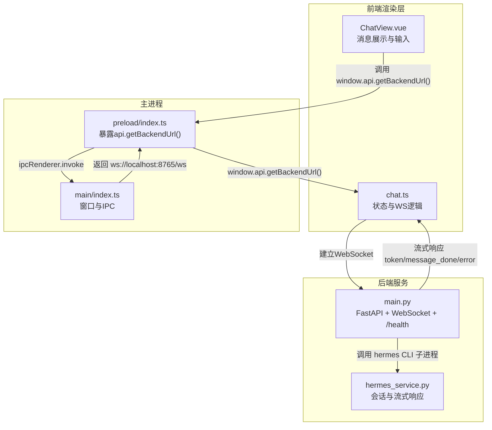
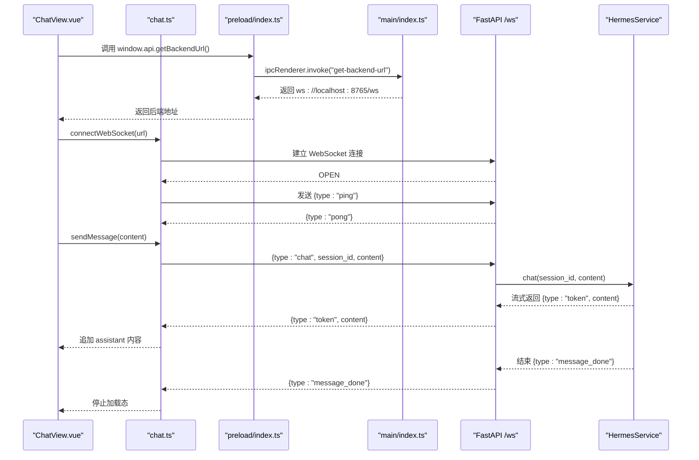
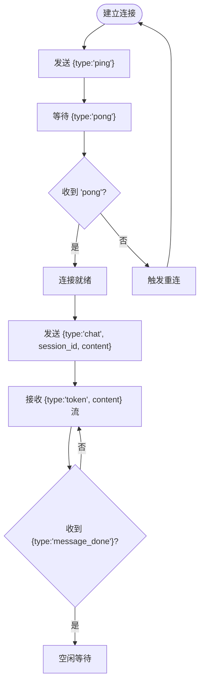
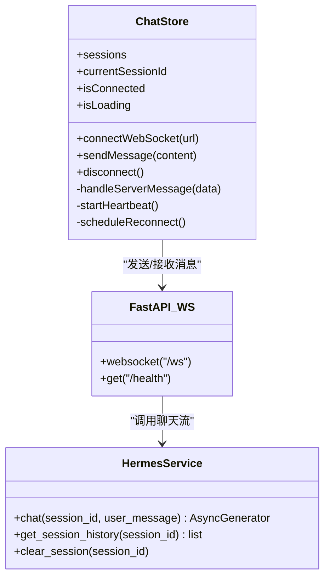
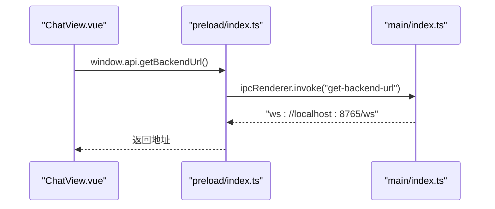
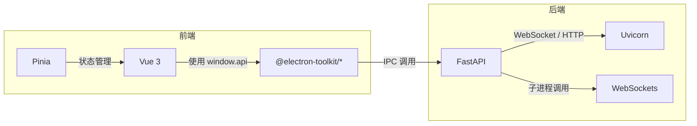

# API参考

<cite>
**本文引用的文件**
- [backend/main.py](file://backend/main.py)
- [backend/services/hermes_service.py](file://backend/services/hermes_service.py)
- [src/main/index.ts](file://src/main/index.ts)
- [src/preload/index.ts](file://src/preload/index.ts)
- [src/preload/index.d.ts](file://src/preload/index.d.ts)
- [src/renderer/src/stores/chat.ts](file://src/renderer/src/stores/chat.ts)
- [src/renderer/src/views/ChatView.vue](file://src/renderer/src/views/ChatView.vue)
- [electron.vite.config.ts](file://electron.vite.config.ts)
- [package.json](file://package.json)
- [backend/requirements.txt](file://backend/requirements.txt)
</cite>

## 目录
1. [简介](#简介)
2. [项目结构](#项目结构)
3. [核心组件](#核心组件)
4. [架构总览](#架构总览)
5. [详细组件分析](#详细组件分析)
6. [依赖关系分析](#依赖关系分析)
7. [性能与可用性](#性能与可用性)
8. [故障排查指南](#故障排查指南)
9. [结论](#结论)
10. [附录：协议与消息规范](#附录协议与消息规范)

## 简介
本文件为 Hermes Desktop 的 API 参考文档，覆盖以下方面：
- WebSocket API：连接处理、消息格式、事件类型、心跳与重连、实时交互模式
- IPC 通信接口：数据流、消息传递与进程同步机制
- HTTP API：当前实现的健康检查端点
- 安全与速率限制建议
- 常见用例、客户端实现指南与性能优化技巧
- 调试与监控方法

## 项目结构
Hermes Desktop 采用 Electron + Vue 3 + FastAPI 的分层架构：
- 前端渲染层（Vue 3 + Pinia）负责用户界面与 WebSocket 交互
- 主进程（Electron）负责窗口生命周期与 IPC
- 后端服务（FastAPI）提供 WebSocket 与健康检查端点

图表来源
- [src/renderer/src/views/ChatView.vue:118-126](file://src/renderer/src/views/ChatView.vue#L118-L126)
- [src/renderer/src/stores/chat.ts:110-150](file://src/renderer/src/stores/chat.ts#L110-L150)
- [src/main/index.ts:45-48](file://src/main/index.ts#L45-L48)
- [src/preload/index.ts:5-7](file://src/preload/index.ts#L5-L7)
- [backend/main.py:31-66](file://backend/main.py#L31-L66)
- [backend/services/hermes_service.py:16-72](file://backend/services/hermes_service.py#L16-L72)

章节来源
- [src/renderer/src/views/ChatView.vue:118-126](file://src/renderer/src/views/ChatView.vue#L118-L126)
- [src/renderer/src/stores/chat.ts:110-150](file://src/renderer/src/stores/chat.ts#L110-L150)
- [src/main/index.ts:45-48](file://src/main/index.ts#L45-L48)
- [src/preload/index.ts:5-7](file://src/preload/index.ts#L5-L7)
- [backend/main.py:31-66](file://backend/main.py#L31-L66)
- [backend/services/hermes_service.py:16-72](file://backend/services/hermes_service.py#L16-L72)

## 核心组件
- WebSocket 端点：ws://localhost:8765/ws
- HTTP 健康检查：GET /health
- IPC 接口：window.api.getBackendUrl()

章节来源
- [backend/main.py:26-28](file://backend/main.py#L26-L28)
- [backend/main.py:31-66](file://backend/main.py#L31-L66)
- [src/main/index.ts:45-48](file://src/main/index.ts#L45-L48)
- [src/preload/index.ts:5-7](file://src/preload/index.ts#L5-L7)

## 架构总览
下图展示了从前端到后端的完整交互流程，包括连接建立、心跳、消息发送与接收、错误处理与重连。

图表来源
- [src/renderer/src/views/ChatView.vue:118-126](file://src/renderer/src/views/ChatView.vue#L118-L126)
- [src/renderer/src/stores/chat.ts:110-150](file://src/renderer/src/stores/chat.ts#L110-L150)
- [src/preload/index.ts:5-7](file://src/preload/index.ts#L5-L7)
- [src/main/index.ts:45-48](file://src/main/index.ts#L45-L48)
- [backend/main.py:31-66](file://backend/main.py#L31-L66)
- [backend/services/hermes_service.py:16-72](file://backend/services/hermes_service.py#L16-L72)

## 详细组件分析

### WebSocket API 规范
- 端点：ws://localhost:8765/ws
- 协议：JSON 文本帧
- 认证：未实现（可扩展）
- 速率限制：未实现（可扩展）

#### 连接与生命周期
- 前端通过 window.api.getBackendUrl 获取后端地址
- 建立连接后立即发送心跳 {type:"ping"}，周期约 15 秒
- 断线自动指数退避重连，最大延迟约 30 秒

图表来源
- [src/renderer/src/stores/chat.ts:83-108](file://src/renderer/src/stores/chat.ts#L83-L108)
- [src/renderer/src/stores/chat.ts:110-150](file://src/renderer/src/stores/chat.ts#L110-L150)
- [backend/main.py:31-66](file://backend/main.py#L31-L66)

章节来源
- [src/main/index.ts:45-48](file://src/main/index.ts#L45-L48)
- [src/preload/index.ts:5-7](file://src/preload/index.ts#L5-L7)
- [src/renderer/src/stores/chat.ts:83-108](file://src/renderer/src/stores/chat.ts#L83-L108)
- [src/renderer/src/stores/chat.ts:110-150](file://src/renderer/src/stores/chat.ts#L110-L150)
- [backend/main.py:31-66](file://backend/main.py#L31-L66)

#### 消息格式与事件类型
- 客户端发送
  - {type:"chat", session_id:string?, content:string}
  - {type:"ping"}（心跳）
- 服务器推送
  - {type:"token", content:string}（流式增量）
  - {type:"message_done"}（消息结束）
  - {type:"error", message:string}（错误）
  - {type:"pong"}（心跳响应）
  - {type:"tool_call", name:string, args:string}（可选：工具调用开始）
  - {type:"tool_result", result:string, error?:boolean}（可选：工具结果）

图表来源
- [src/renderer/src/stores/chat.ts:26-262](file://src/renderer/src/stores/chat.ts#L26-L262)
- [backend/services/hermes_service.py:16-72](file://backend/services/hermes_service.py#L16-L72)
- [backend/main.py:31-66](file://backend/main.py#L31-L66)

章节来源
- [src/renderer/src/stores/chat.ts:152-207](file://src/renderer/src/stores/chat.ts#L152-L207)
- [backend/main.py:41-54](file://backend/main.py#L41-L54)
- [backend/services/hermes_service.py:16-72](file://backend/services/hermes_service.py#L16-L72)

#### 实时交互模式
- 用户输入经由 ChatView.vue 处理，调用 chat.ts 的 sendMessage
- 会话状态由 Pinia store 维护，支持多会话与消息增量渲染
- 后端以流式方式推送 token，前端实时追加到当前 assistant 消息

章节来源
- [src/renderer/src/views/ChatView.vue:90-102](file://src/renderer/src/views/ChatView.vue#L90-L102)
- [src/renderer/src/stores/chat.ts:209-232](file://src/renderer/src/stores/chat.ts#L209-L232)
- [backend/main.py:47-54](file://backend/main.py#L47-L54)

### IPC 通信接口
- 渲染进程通过 preload 暴露的 window.api.getBackendUrl 获取后端地址
- 主进程在 ipcMain.handle 中注册该方法，返回固定地址 ws://localhost:8765/ws

图表来源
- [src/renderer/src/views/ChatView.vue:121-122](file://src/renderer/src/views/ChatView.vue#L121-L122)
- [src/preload/index.ts:5-7](file://src/preload/index.ts#L5-L7)
- [src/main/index.ts:45-48](file://src/main/index.ts#L45-L48)

章节来源
- [src/preload/index.ts:5-7](file://src/preload/index.ts#L5-L7)
- [src/preload/index.d.ts:1-10](file://src/preload/index.d.ts#L1-L10)
- [src/main/index.ts:45-48](file://src/main/index.ts#L45-L48)

### HTTP API 端点
- GET /health：健康检查，返回服务状态

章节来源
- [backend/main.py:26-28](file://backend/main.py#L26-L28)

## 依赖关系分析
- 前端依赖
  - Vue 3、Pinia、Vue Router
  - Electron Toolkit 预加载桥接
- 后端依赖
  - FastAPI、Uvicorn、WebSockets

图表来源
- [package.json:17-33](file://package.json#L17-L33)
- [backend/requirements.txt:1-4](file://backend/requirements.txt#L1-L4)

章节来源
- [package.json:17-33](file://package.json#L17-L33)
- [backend/requirements.txt:1-4](file://backend/requirements.txt#L1-L4)

## 性能与可用性
- 心跳与断线重连
  - 心跳间隔：约 15 秒
  - 重连策略：指数退避，最大延迟约 30 秒
- 流式响应
  - 后端按行流式输出 token，前端增量渲染，降低首包延迟
- 会话管理
  - 后端维护会话历史，便于上下文延续
- 建议优化
  - 前端：批量更新 DOM、节流滚动、虚拟列表（如消息量大）
  - 后端：增加速率限制、连接数上限、超时控制
  - 安全：添加鉴权、CORS 白名单、WSS 支持

章节来源
- [src/renderer/src/stores/chat.ts:83-108](file://src/renderer/src/stores/chat.ts#L83-L108)
- [backend/services/hermes_service.py:16-72](file://backend/services/hermes_service.py#L16-L72)

## 故障排查指南
- 无法连接后端
  - 检查后端是否运行于 0.0.0.0:8765
  - 确认 ws://localhost:8765/ws 可访问
  - 查看前端日志中的连接/断开信息
- 心跳失败或频繁重连
  - 检查网络与防火墙
  - 关注前端重连日志与延迟
- 消息不显示或卡住
  - 确认后端已返回 {type:"message_done"}
  - 检查前端 handleServerMessage 是否正确处理 token
- 错误消息
  - 后端异常会通过 {type:"error"} 推送，前端显示系统消息
- 工具与监控
  - 使用浏览器开发者工具 Network 面板查看 WebSocket 通讯
  - 在后端启用 Uvicorn 日志，观察连接与异常

章节来源
- [src/renderer/src/stores/chat.ts:134-147](file://src/renderer/src/stores/chat.ts#L134-L147)
- [src/renderer/src/stores/chat.ts:197-205](file://src/renderer/src/stores/chat.ts#L197-L205)
- [backend/main.py:56-65](file://backend/main.py#L56-L65)

## 结论
Hermes Desktop 提供了简洁而高效的桌面端聊天体验：前端通过 IPC 获取后端地址，建立 WebSocket 连接进行实时流式交互；后端以 FastAPI 提供 WebSocket 与健康检查端点，并通过子进程调用 Hermes Agent。当前实现未包含鉴权与速率限制，建议在生产环境中补充安全与限流策略。

## 附录：协议与消息规范

### WebSocket 端点
- 地址：ws://localhost:8765/ws
- 方法：GET（升级为 WebSocket）
- 协议：文本帧 JSON
- 认证：无
- 速率限制：无

章节来源
- [backend/main.py:31-31](file://backend/main.py#L31-L31)
- [src/main/index.ts:47-47](file://src/main/index.ts#L47-L47)

### HTTP 端点
- GET /health
  - 请求：无
  - 成功响应：{"status":"ok","service":"hermes-desktop-backend"}
  - 状态码：200

章节来源
- [backend/main.py:26-28](file://backend/main.py#L26-L28)

### IPC 接口
- 名称：get-backend-url
- 类型：invoke
- 返回值：字符串（后端 WebSocket 地址）
- 调用方：渲染进程
- 实现位置：主进程 ipcMain.handle 注册；preload 暴露给渲染进程

章节来源
- [src/main/index.ts:45-48](file://src/main/index.ts#L45-L48)
- [src/preload/index.ts:5-7](file://src/preload/index.ts#L5-L7)
- [src/preload/index.d.ts:1-10](file://src/preload/index.d.ts#L1-L10)

### 消息协议与事件类型
- 客户端发送
  - {type:"chat", session_id:string?, content:string}
  - {type:"ping"}
- 服务器推送
  - {type:"token", content:string}
  - {type:"message_done"}
  - {type:"error", message:string}
  - {type:"pong"}
  - {type:"tool_call", name:string, args:string}
  - {type:"tool_result", result:string, error?:boolean}

章节来源
- [src/renderer/src/stores/chat.ts:225-231](file://src/renderer/src/stores/chat.ts#L225-L231)
- [src/renderer/src/stores/chat.ts:156-207](file://src/renderer/src/stores/chat.ts#L156-L207)
- [backend/main.py:41-54](file://backend/main.py#L41-L54)

### 安全与速率限制建议
- 安全
  - 引入鉴权（如 JWT 或 Cookie）
  - 仅允许受信源访问 WebSocket
  - 后端启用 WSS（WebSocket Secure）
- 速率限制
  - 限制每分钟消息数与并发连接数
  - 对 token 输出速率进行节流
- 其他
  - 添加 CORS 白名单
  - 记录审计日志

[本节为通用建议，不直接对应具体文件]

### 常见用例与实现要点
- 新建会话并发起聊天
  - 前端：创建会话，调用 sendMessage
  - 后端：接收 chat 消息，调用 HermesService.chat，流式返回 token，最后发送 message_done
- 心跳与断线重连
  - 前端：定时发送 ping，收到 pong 后继续
  - 断线后指数退避重连，直至成功
- 工具调用与结果
  - 后端可推送 tool_call/tool_result，前端渲染工具执行状态与结果

章节来源
- [src/renderer/src/stores/chat.ts:41-51](file://src/renderer/src/stores/chat.ts#L41-L51)
- [src/renderer/src/stores/chat.ts:209-232](file://src/renderer/src/stores/chat.ts#L209-L232)
- [backend/services/hermes_service.py:16-72](file://backend/services/hermes_service.py#L16-L72)

### 调试与监控方法
- 前端
  - 打开开发者工具，查看 Console、Network 中的 WebSocket 通讯
  - 关注连接/断开、心跳、消息解析错误日志
- 后端
  - 启用 Uvicorn 日志，观察连接建立、异常与错误推送
  - 健康检查端点用于快速验证服务可用性

章节来源
- [src/renderer/src/stores/chat.ts:134-147](file://src/renderer/src/stores/chat.ts#L134-L147)
- [backend/main.py:56-65](file://backend/main.py#L56-L65)
- [backend/main.py:26-28](file://backend/main.py#L26-L28)