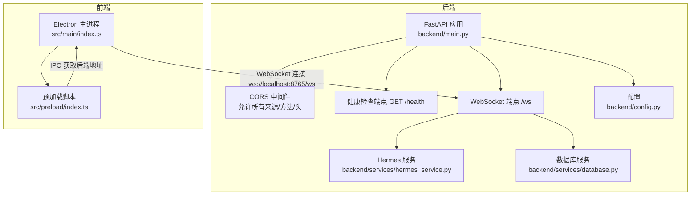
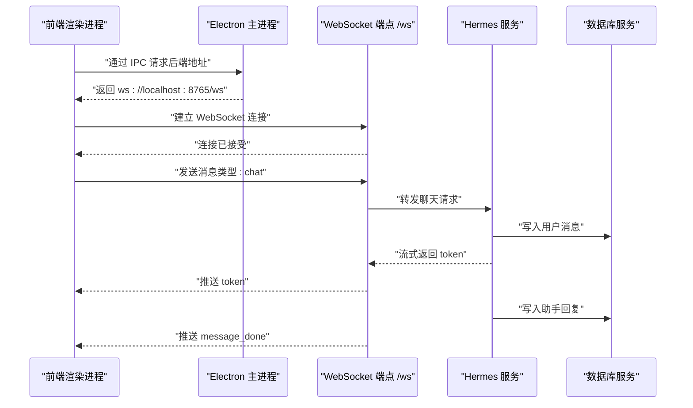
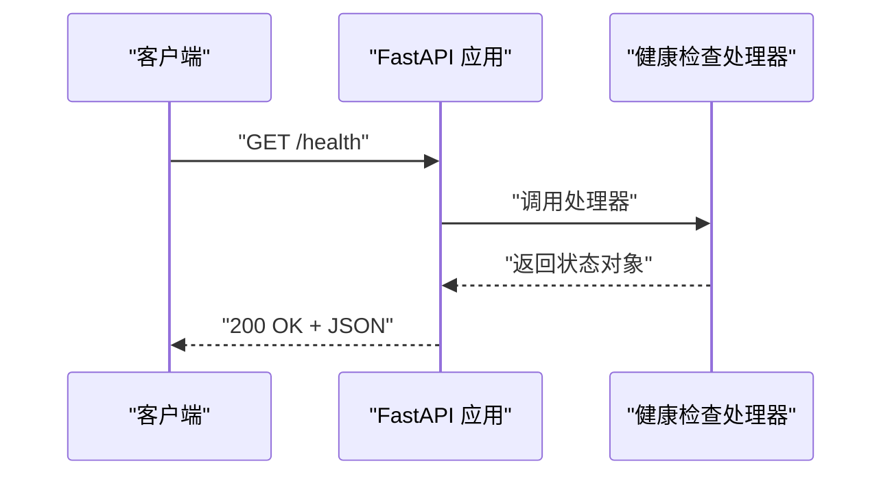
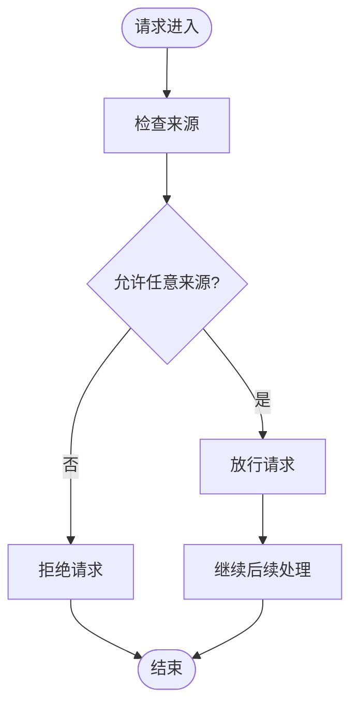
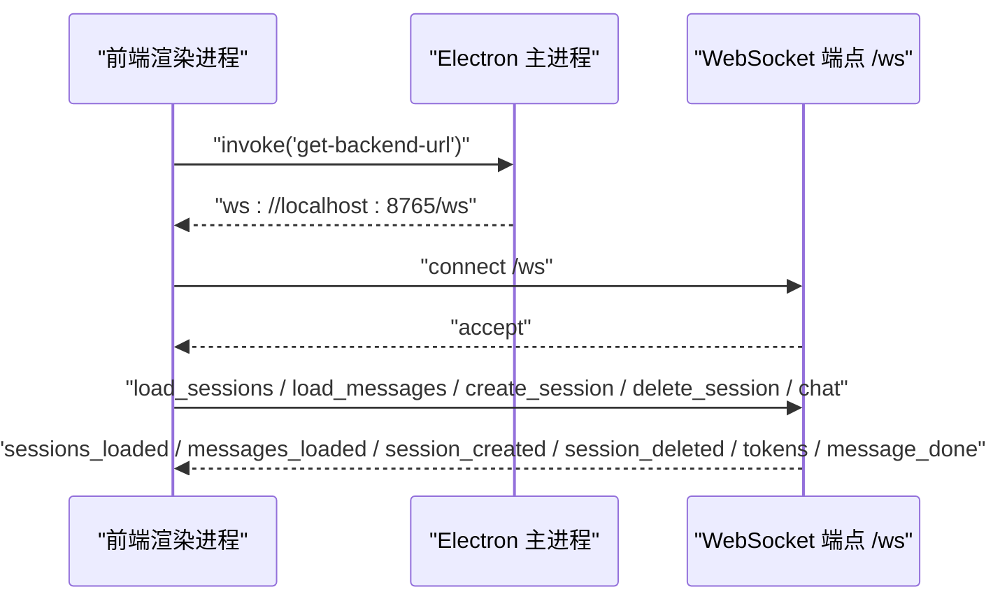
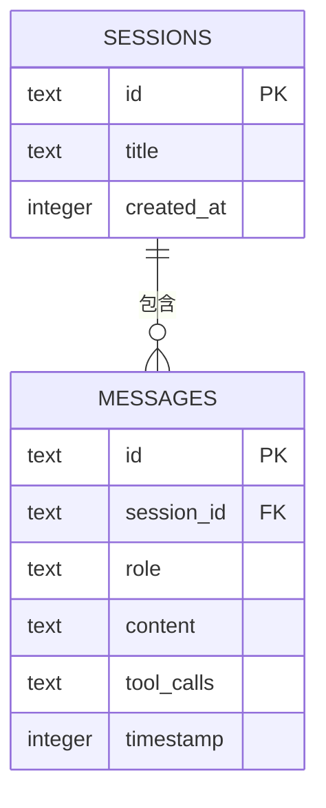
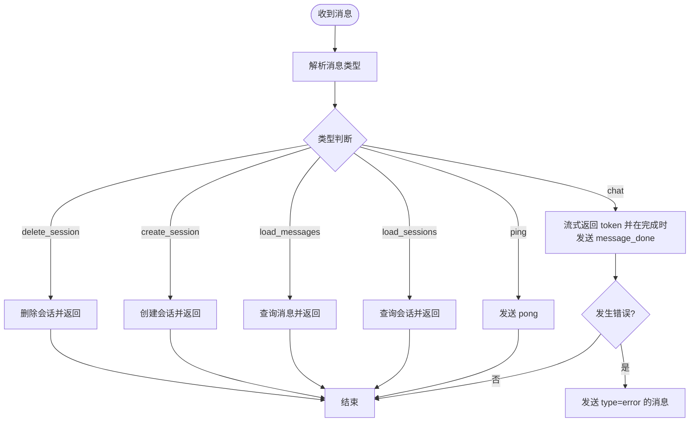
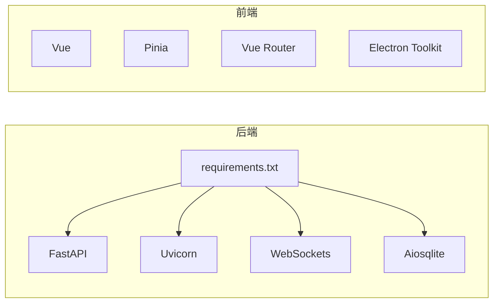

# HTTP API

<cite>
**本文引用的文件**
- [backend/main.py](file://backend/main.py)
- [backend/config.py](file://backend/config.py)
- [backend/requirements.txt](file://backend/requirements.txt)
- [backend/services/hermes_service.py](file://backend/services/hermes_service.py)
- [backend/services/database.py](file://backend/services/database.py)
- [src/main/index.ts](file://src/main/index.ts)
- [src/preload/index.ts](file://src/preload/index.ts)
- [package.json](file://package.json)
</cite>

## 目录
1. [简介](#简介)
2. [项目结构](#项目结构)
3. [核心组件](#核心组件)
4. [架构总览](#架构总览)
5. [详细组件分析](#详细组件分析)
6. [依赖分析](#依赖分析)
7. [性能考虑](#性能考虑)
8. [故障排除指南](#故障排除指南)
9. [结论](#结论)
10. [附录](#附录)

## 简介
本文件为 Hermes Desktop 的 HTTP API 文档，重点覆盖以下内容：
- 健康检查端点 GET /health 的状态信息与响应格式
- CORS 配置与跨域访问支持
- HTTP API 使用场景、响应格式与错误处理
- 完整的 API 调用示例（请求参数、响应数据结构、状态码含义）
- API 版本管理、安全考虑与性能监控
- 可用的 HTTP 端点及其用途，并说明与 WebSocket API 的关系

说明：当前仓库中仅实现了 WebSocket 端点 /ws，未发现标准 HTTP REST 端点。本文将基于现有实现进行准确描述，并指出当前系统以 WebSocket 为主的数据交互方式。

## 项目结构
后端采用 FastAPI 框架，提供一个健康检查端点与一个 WebSocket 端点；前端通过 Electron 渲染进程与后端建立 WebSocket 连接。

图表来源
- [backend/main.py:24-40](file://backend/main.py#L24-L40)
- [backend/main.py:42-109](file://backend/main.py#L42-L109)
- [backend/services/hermes_service.py:13-86](file://backend/services/hermes_service.py#L13-L86)
- [backend/services/database.py:1-137](file://backend/services/database.py#L1-L137)
- [backend/config.py:1-24](file://backend/config.py#L1-L24)
- [src/main/index.ts:45-48](file://src/main/index.ts#L45-L48)

章节来源
- [backend/main.py:1-114](file://backend/main.py#L1-L114)
- [backend/config.py:1-24](file://backend/config.py#L1-L24)
- [src/main/index.ts:1-62](file://src/main/index.ts#L1-L62)
- [src/preload/index.ts:1-24](file://src/preload/index.ts#L1-L24)

## 核心组件
- FastAPI 应用与生命周期：应用在启动时初始化数据库，关闭时自动清理。
- CORS 中间件：允许来自任意源、凭证、方法与头部的请求，便于开发与调试。
- 健康检查端点：返回服务状态与服务名称。
- WebSocket 端点：负责会话管理、消息加载、创建/删除会话、与 Hermes Agent 通信并流式传输响应。
- Hermes 服务：封装与外部 Hermes Agent 的交互，支持异步流式输出。
- 数据库服务：基于 SQLite 的会话与消息持久化，提供增删改查能力。

章节来源
- [backend/main.py:17-32](file://backend/main.py#L17-L32)
- [backend/main.py:37-39](file://backend/main.py#L37-L39)
- [backend/main.py:42-109](file://backend/main.py#L42-L109)
- [backend/services/hermes_service.py:13-86](file://backend/services/hermes_service.py#L13-L86)
- [backend/services/database.py:20-137](file://backend/services/database.py#L20-L137)

## 架构总览
下图展示了前端、后端与外部 Hermes Agent 的交互流程，以及数据在后端的存储路径。

图表来源
- [src/main/index.ts:45-48](file://src/main/index.ts#L45-L48)
- [backend/main.py:42-109](file://backend/main.py#L42-L109)
- [backend/services/hermes_service.py:24-86](file://backend/services/hermes_service.py#L24-L86)
- [backend/services/database.py:86-103](file://backend/services/database.py#L86-L103)

## 详细组件分析

### 健康检查端点 GET /health
- 描述：用于检测后端服务是否正常运行。
- 方法与路径：GET /health
- 成功响应：返回 JSON 对象，包含状态与服务名称字段。
- 响应格式：键值对形式，包含状态字符串与服务标识。
- 状态码：200 OK
- 典型用途：容器编排、负载均衡探活、CI/CD 集成。

图表来源
- [backend/main.py:37-39](file://backend/main.py#L37-L39)

章节来源
- [backend/main.py:37-39](file://backend/main.py#L37-L39)

### CORS 配置与跨域访问支持
- 配置范围：允许任意来源、凭证、方法与头部。
- 生效范围：对所有路由生效，包括健康检查与 WebSocket。
- 开发建议：生产环境建议限制来源列表，仅允许受信域名。
- 影响：便于前端开发阶段直接从本地开发服务器访问后端，或在浏览器中直接测试健康检查端点。

图表来源
- [backend/main.py:26-32](file://backend/main.py#L26-L32)

章节来源
- [backend/main.py:26-32](file://backend/main.py#L26-L32)

### WebSocket API（与 HTTP 的关系）
- 当前系统未实现标准 HTTP REST 端点，主要通过 WebSocket 提供实时交互能力。
- HTTP 端点仅包含健康检查 GET /health。
- WebSocket 端点 /ws 负责：
  - 心跳：ping/pong
  - 会话管理：列出、创建、删除会话
  - 消息加载与持久化
  - 与 Hermes Agent 通信并流式返回结果
- 前端通过 IPC 获取后端 WebSocket 地址，然后建立连接。

图表来源
- [src/main/index.ts:45-48](file://src/main/index.ts#L45-L48)
- [backend/main.py:42-109](file://backend/main.py#L42-L109)

章节来源
- [src/main/index.ts:45-48](file://src/main/index.ts#L45-L48)
- [backend/main.py:42-109](file://backend/main.py#L42-L109)

### 数据模型与持久化
- 会话表：主键为会话 ID，包含标题与创建时间。
- 消息表：外键关联会话，包含角色、内容、时间戳等。
- 索引：按会话与时间戳排序，优化查询性能。

图表来源
- [backend/services/database.py:24-42](file://backend/services/database.py#L24-L42)

章节来源
- [backend/services/database.py:12-137](file://backend/services/database.py#L12-L137)

### 错误处理与异常传播
- WebSocket 层：捕获断开与异常，向客户端发送错误消息。
- Hermes 服务层：捕获二进制不存在、外部进程错误与未知异常，向客户端发送结构化的错误消息。
- 建议：前端应统一解析 type 为 error 的消息并提示用户。

图表来源
- [backend/main.py:47-108](file://backend/main.py#L47-L108)
- [backend/services/hermes_service.py:78-86](file://backend/services/hermes_service.py#L78-L86)

章节来源
- [backend/main.py:99-108](file://backend/main.py#L99-L108)
- [backend/services/hermes_service.py:78-86](file://backend/services/hermes_service.py#L78-L86)

## 依赖分析
- 后端依赖：FastAPI、Uvicorn、WebSockets、Aiosqlite。
- 前端依赖：Vue、Pinia、Vue Router、Electron Toolkit。
- 配置项：HERMES_VENV_DIR、HERMES_BIN、DB_PATH、HOST、PORT。

图表来源
- [backend/requirements.txt:1-5](file://backend/requirements.txt#L1-L5)
- [package.json:17-33](file://package.json#L17-L33)

章节来源
- [backend/requirements.txt:1-5](file://backend/requirements.txt#L1-5)
- [package.json:1-35](file://package.json#L1-L35)
- [backend/config.py:6-23](file://backend/config.py#L6-L23)

## 性能考虑
- 数据库：启用 WAL 模式与外键约束，提升并发与一致性；为消息表建立复合索引，优化按会话与时间戳的查询。
- 流式响应：Hermes 服务以流式方式返回 token，降低前端等待时间。
- WebSocket：长连接减少握手开销，适合高频交互场景。
- 建议：生产环境可引入连接池、限流与超时控制；对大文本分片传输时注意内存占用。

章节来源
- [backend/services/database.py:15-16](file://backend/services/database.py#L15-L16)
- [backend/services/database.py:40-41](file://backend/services/database.py#L40-L41)
- [backend/services/hermes_service.py:58-66](file://backend/services/hermes_service.py#L58-L66)

## 故障排除指南
- 健康检查失败
  - 检查后端是否启动且监听端口。
  - 查看后端日志中的数据库初始化信息。
- WebSocket 连接失败
  - 确认前端通过 IPC 正确获取到 ws://localhost:8765/ws。
  - 检查防火墙与端口占用。
- Hermes 二进制不可用
  - 设置 HERMES_VENV_DIR 环境变量指向正确的虚拟环境目录。
  - 确认 HERMES_BIN 路径存在。
- 数据库问题
  - 检查 DB_PATH 是否可写。
  - 确认 WAL 模式与外键约束已启用。

章节来源
- [backend/main.py:18-21](file://backend/main.py#L18-L21)
- [backend/config.py:6-19](file://backend/config.py#L6-L19)
- [backend/services/hermes_service.py:78-83](file://backend/services/hermes_service.py#L78-L83)

## 结论
- 当前系统以 WebSocket 为核心交互协议，HTTP 端点仅包含健康检查。
- CORS 已配置为宽松策略，便于开发与测试。
- 健康检查端点可用于自动化运维与集成测试。
- 建议在生产环境中收紧 CORS 策略，并根据需要扩展 HTTP 端点以满足不同客户端需求。

## 附录

### API 端点一览
- GET /health
  - 用途：健康检查
  - 成功响应：包含状态与服务名
  - 状态码：200
- /ws（WebSocket）
  - 用途：实时聊天、会话管理、消息加载与持久化
  - 支持的消息类型：ping、load_sessions、load_messages、create_session、delete_session、chat
  - 响应类型：pong、sessions_loaded、messages_loaded、session_created、session_deleted、token、message_done、error

章节来源
- [backend/main.py:37-39](file://backend/main.py#L37-L39)
- [backend/main.py:42-109](file://backend/main.py#L42-L109)

### 调用示例（路径参考）
- 健康检查
  - 请求：GET /health
  - 响应：包含状态与服务名的 JSON 对象
  - 参考路径：[backend/main.py:37-39](file://backend/main.py#L37-L39)
- WebSocket 连接与消息
  - 前端获取地址：通过 IPC 调用获取后端地址
    - 参考路径：[src/main/index.ts:45-48](file://src/main/index.ts#L45-L48)
  - 建立连接：ws://localhost:8765/ws
    - 参考路径：[backend/main.py:42-44](file://backend/main.py#L42-L44)
  - 发送消息：chat、load_sessions、load_messages、create_session、delete_session、ping
    - 参考路径：[backend/main.py:47-97](file://backend/main.py#L47-L97)
  - 接收消息：token、message_done、sessions_loaded、messages_loaded、session_created、session_deleted、pong、error
    - 参考路径：[backend/main.py:53-108](file://backend/main.py#L53-L108)

### 安全与版本管理
- 安全
  - CORS 当前为宽松策略，生产环境建议限制来源列表。
  - WebSocket 未内置鉴权机制，建议在网关或反向代理层增加认证与速率限制。
- 版本管理
  - 当前未实现 API 版本号，建议在路径或请求头中引入版本前缀或字段，以便未来演进。
- 性能监控
  - 建议在 WebSocket 层添加连接数统计、消息吞吐量与延迟指标。
  - 对 Hermes 服务的外部调用增加超时与重试策略。

章节来源
- [backend/main.py:26-32](file://backend/main.py#L26-L32)
- [backend/services/hermes_service.py:46-66](file://backend/services/hermes_service.py#L46-L66)