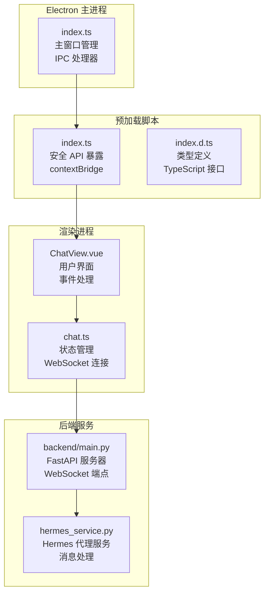
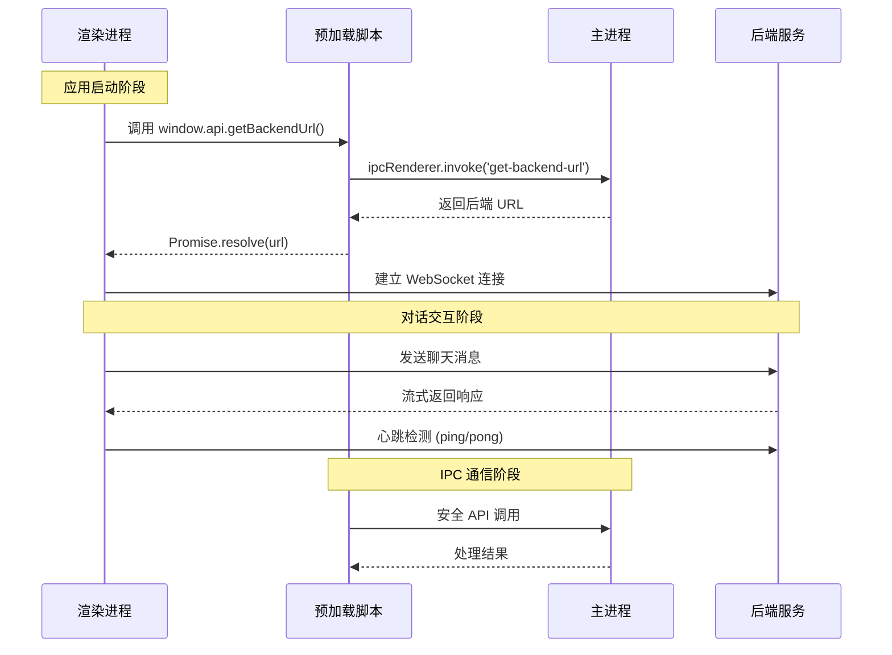
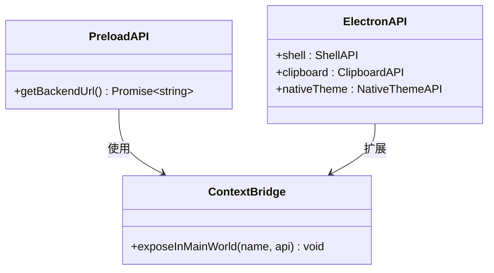
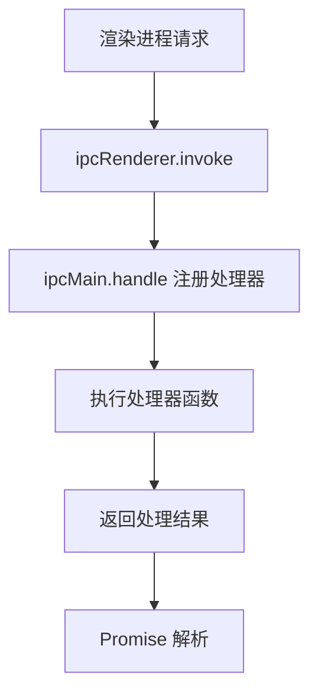
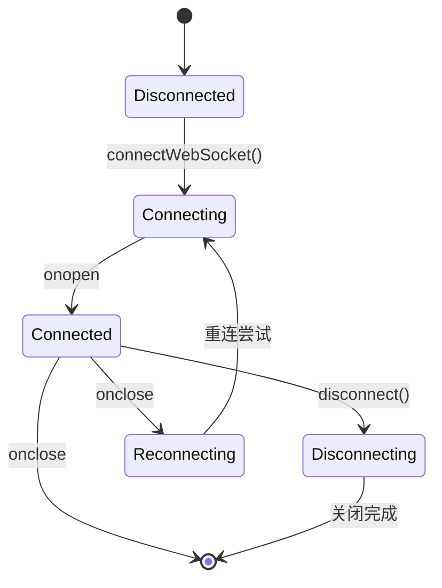
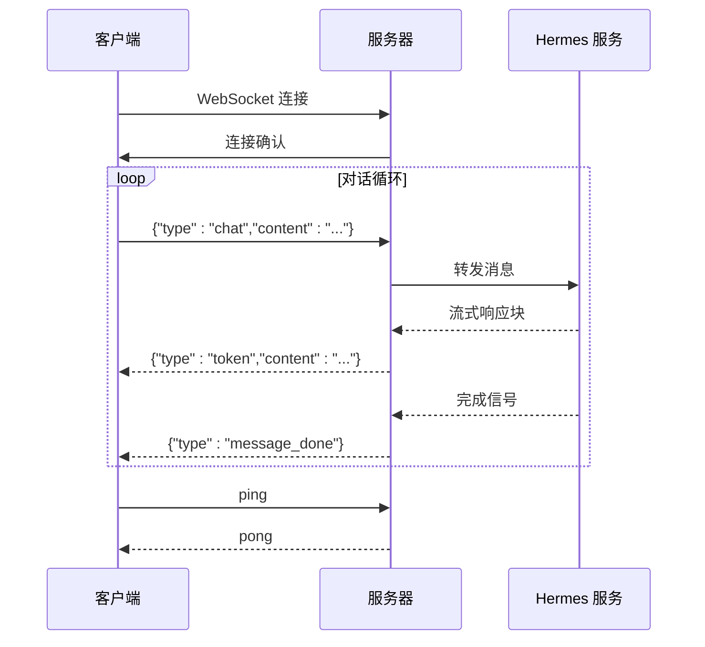
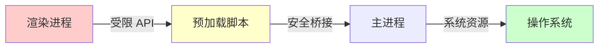
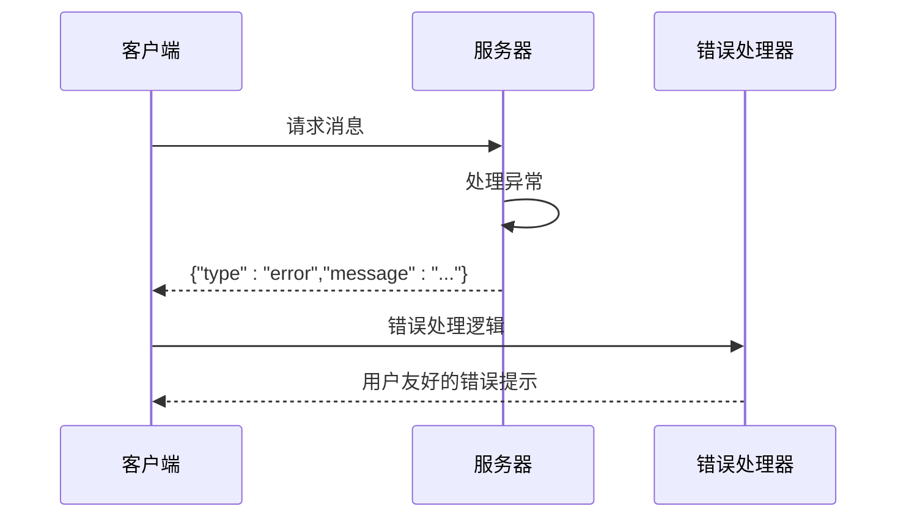
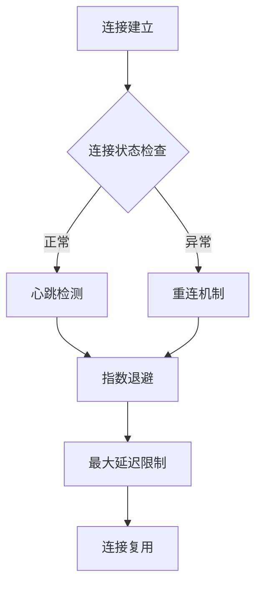

# IPC通信接口

<cite>
**本文档引用的文件**
- [src/main/index.ts](file://src/main/index.ts)
- [src/preload/index.ts](file://src/preload/index.ts)
- [src/preload/index.d.ts](file://src/preload/index.d.ts)
- [src/renderer/src/stores/chat.ts](file://src/renderer/src/stores/chat.ts)
- [src/renderer/src/views/ChatView.vue](file://src/renderer/src/views/ChatView.vue)
- [backend/main.py](file://backend/main.py)
- [backend/services/hermes_service.py](file://backend/services/hermes_service.py)
- [package.json](file://package.json)
</cite>

## 目录
1. [简介](#简介)
2. [项目结构](#项目结构)
3. [核心组件](#核心组件)
4. [架构概览](#架构概览)
5. [详细组件分析](#详细组件分析)
6. [IPC通道定义](#ipc通道定义)
7. [消息格式规范](#消息格式规范)
8. [调用示例](#调用示例)
9. [安全考虑](#安全考虑)
10. [性能优化](#性能优化)
11. [调试技巧](#调试技巧)
12. [故障排除指南](#故障排除指南)
13. [结论](#结论)

## 简介

Hermes Desktop 是一个基于 Electron 的桌面应用程序，提供了与后端 Hermes Agent 的智能对话功能。本文档详细记录了应用程序中 IPC（进程间通信）通信接口的设计和实现，包括 Electron 主进程与渲染进程之间的异步通信机制，以及通过预加载脚本提供的安全 IPC 接口。

该系统采用双层通信架构：主进程通过 IPC 通道向渲染进程暴露受限制的 API，渲染进程通过 WebSocket 与后端 Python 服务进行实时通信。这种设计确保了前端应用能够安全地访问必要的系统功能，同时保持了良好的性能和可维护性。

## 项目结构

Hermes Desktop 采用标准的 Electron 应用程序结构，主要分为三个核心部分：



**图表来源**
- [src/main/index.ts:1-62](file://src/main/index.ts#L1-L62)
- [src/preload/index.ts:1-24](file://src/preload/index.ts#L1-L24)
- [src/renderer/src/views/ChatView.vue:1-325](file://src/renderer/src/views/ChatView.vue#L1-L325)
- [backend/main.py:1-71](file://backend/main.py#L1-L71)

**章节来源**
- [src/main/index.ts:1-62](file://src/main/index.ts#L1-L62)
- [src/preload/index.ts:1-24](file://src/preload/index.ts#L1-L24)
- [src/preload/index.d.ts:1-11](file://src/preload/index.d.ts#L1-L11)

## 核心组件

### 主进程组件

主进程负责应用程序的生命周期管理和 IPC 通信处理。当前实现中，主进程主要提供后端连接 URL 的查询功能。

### 预加载脚本组件

预加载脚本通过 `contextBridge` API 安全地向渲染进程暴露有限的 Electron 功能，确保了上下文隔离的安全性。

### 渲染进程组件

渲染进程包含 Vue.js 应用程序，使用 Pinia 状态管理库来处理 WebSocket 连接和消息流式处理。

### 后端服务组件

后端使用 FastAPI 提供 WebSocket 服务，与前端进行实时双向通信。

**章节来源**
- [src/main/index.ts:45-48](file://src/main/index.ts#L45-L48)
- [src/preload/index.ts:5-7](file://src/preload/index.ts#L5-L7)
- [src/renderer/src/stores/chat.ts:26-262](file://src/renderer/src/stores/chat.ts#L26-L262)
- [backend/main.py:31-65](file://backend/main.py#L31-L65)

## 架构概览

整个 IPC 通信系统遵循以下架构模式：



**图表来源**
- [src/preload/index.ts:6](file://src/preload/index.ts#L6)
- [src/main/index.ts:46-48](file://src/main/index.ts#L46-L48)
- [src/renderer/src/views/ChatView.vue:119-125](file://src/renderer/src/views/ChatView.vue#L119-L125)

## 详细组件分析

### 预加载脚本安全接口

预加载脚本通过 `contextBridge` API 实现了安全的跨上下文通信：



**图表来源**
- [src/preload/index.ts:5-7](file://src/preload/index.ts#L5-L7)
- [src/preload/index.ts:11-23](file://src/preload/index.ts#L11-L23)

预加载脚本实现了以下关键功能：
- 仅暴露必要的 API 方法
- 维护上下文隔离的安全边界
- 提供类型安全的接口定义

**章节来源**
- [src/preload/index.ts:1-24](file://src/preload/index.ts#L1-L24)
- [src/preload/index.d.ts:1-11](file://src/preload/index.d.ts#L1-L11)

### 主进程 IPC 处理器

主进程通过 `ipcMain.handle()` 注册异步处理器：



**图表来源**
- [src/main/index.ts:45-48](file://src/main/index.ts#L45-L48)

当前实现的处理器功能：
- 提供后端 WebSocket URL 查询服务
- 支持异步处理和错误传播

**章节来源**
- [src/main/index.ts:45-48](file://src/main/index.ts#L45-L48)

### 渲染进程状态管理

渲染进程使用 Pinia 管理复杂的 WebSocket 连接状态：



**图表来源**
- [src/renderer/src/stores/chat.ts:110-150](file://src/renderer/src/stores/chat.ts#L110-L150)

状态管理特性：
- 自动重连机制
- 心跳检测和保活
- 会话状态持久化
- 错误处理和恢复

**章节来源**
- [src/renderer/src/stores/chat.ts:26-262](file://src/renderer/src/stores/chat.ts#L26-L262)

### 后端 WebSocket 服务

后端服务提供实时双向通信能力：



**图表来源**
- [backend/main.py:31-65](file://backend/main.py#L31-L65)
- [backend/services/hermes_service.py:16-72](file://backend/services/hermes_service.py#L16-L72)

**章节来源**
- [backend/main.py:31-65](file://backend/main.py#L31-L65)
- [backend/services/hermes_service.py:16-72](file://backend/services/hermes_service.py#L16-L72)

## IPC 通道定义

### 当前可用的 IPC 通道

| 通道名称 | 类型 | 描述 | 数据类型 | 返回值 |
|---------|------|------|----------|--------|
| `get-backend-url` | `ipcMain.handle` | 获取后端 WebSocket URL | 无参数 | `Promise<string>` |

### 通道详细说明

#### get-backend-url 通道

**用途**: 为渲染进程提供后端服务的连接地址

**调用方式**:
```typescript
// 在渲染进程中
const backendUrl = await window.api.getBackendUrl()
```

**实现细节**:
- 主进程处理器返回固定的 WebSocket URL
- 支持异步处理模式
- 错误自动传播到渲染进程

**章节来源**
- [src/main/index.ts:46-48](file://src/main/index.ts#L46-L48)
- [src/preload/index.ts:6](file://src/preload/index.ts#L6)
- [src/preload/index.d.ts:7](file://src/preload/index.d.ts#L7)

## 消息格式规范

### WebSocket 消息格式

前端与后端之间的 WebSocket 消息遵循统一的 JSON 格式：

#### 请求消息格式

| 字段 | 类型 | 必需 | 描述 |
|------|------|------|------|
| `type` | string | 是 | 消息类型标识符 |
| `session_id` | string | 可选 | 会话唯一标识符 |
| `content` | string | 可选 | 消息内容 |
| `name` | string | 可选 | 工具调用名称 |
| `args` | string | 可选 | 工具调用参数 |
| `result` | string | 可选 | 工具调用结果 |
| `error` | boolean | 可选 | 错误状态标志 |

#### 响应消息格式

| 字段 | 类型 | 必需 | 描述 |
|------|------|------|------|
| `type` | string | 是 | 响应类型标识符 |
| `content` | string | 可选 | 文本内容 |
| `message` | string | 可选 | 错误消息 |
| `status` | string | 可选 | 状态信息 |

### 支持的消息类型

#### 聊天消息 (`chat`)

用于发起对话请求：
```json
{
  "type": "chat",
  "session_id": "unique-session-id",
  "content": "用户输入的消息内容"
}
```

#### 流式文本 (`token`)

后端流式返回的文本片段：
```json
{
  "type": "token",
  "content": "部分响应内容"
}
```

#### 消息完成 (`message_done`)

表示单条消息处理完成：
```json
{
  "type": "message_done"
}
```

#### 工具调用 (`tool_call`)

指示后端正在执行工具调用：
```json
{
  "type": "tool_call",
  "name": "工具名称",
  "args": "工具参数"
}
```

#### 工具结果 (`tool_result`)

工具调用的执行结果：
```json
{
  "type": "tool_result",
  "result": "执行结果",
  "error": false
}
```

#### 错误消息 (`error`)

错误情况下的错误信息：
```json
{
  "type": "error",
  "message": "错误描述信息"
}
```

#### 心跳检测 (`ping/pong`)

用于维持连接活跃状态：
```json
// ping 请求
{
  "type": "ping"
}

// pong 响应
{
  "type": "pong"
}
```

**章节来源**
- [src/renderer/src/stores/chat.ts:152-207](file://src/renderer/src/stores/chat.ts#L152-L207)
- [backend/main.py:41-54](file://backend/main.py#L41-L54)
- [backend/main.py:61-63](file://backend/main.py#L61-L63)

## 调用示例

### 基础 IPC 调用示例

#### 获取后端 URL

```typescript
// 在渲染进程中
try {
  const backendUrl = await window.api.getBackendUrl()
  console.log('后端 URL:', backendUrl)
  // 建立 WebSocket 连接
  chatStore.connectWebSocket(backendUrl)
} catch (error) {
  console.error('获取后端 URL 失败:', error)
}
```

**章节来源**
- [src/renderer/src/views/ChatView.vue:119-125](file://src/renderer/src/views/ChatView.vue#L119-L125)

### WebSocket 通信示例

#### 发送聊天消息

```typescript
// 在聊天存储中
function sendMessage(content: string) {
  if (!ws.value || ws.value.readyState !== WebSocket.OPEN) {
    console.error('[WS] 未连接')
    return
  }

  const message = {
    type: 'chat',
    session_id: currentSessionId.value,
    content: content
  }

  ws.value.send(JSON.stringify(message))
}
```

#### 处理服务器消息

```typescript
// 在聊天存储中
function handleServerMessage(data: any) {
  switch (data.type) {
    case 'token':
      // 追加流式文本
      break
    case 'message_done':
      // 结束加载状态
      break
    case 'error':
      // 显示错误消息
      break
  }
}
```

**章节来源**
- [src/renderer/src/stores/chat.ts:209-232](file://src/renderer/src/stores/chat.ts#L209-L232)
- [src/renderer/src/stores/chat.ts:152-207](file://src/renderer/src/stores/chat.ts#L152-L207)

### 错误处理示例

#### 连接错误处理

```typescript
// 在聊天存储中
socket.onerror = (err) => {
  console.error('[WS] 连接错误:', err)
  // onclose 将在错误后触发，自动开始重连
}
```

#### 重连机制

```typescript
// 指数退避重连
function scheduleReconnect() {
  const delay = Math.min(1000 * Math.pow(2, reconnectAttempts), MAX_RECONNECT_DELAY)
  reconnectTimer = setTimeout(() => {
    reconnectAttempts++
    connectWebSocket(backendUrl)
  }, delay)
}
```

**章节来源**
- [src/renderer/src/stores/chat.ts:134-137](file://src/renderer/src/stores/chat.ts#L134-L137)
- [src/renderer/src/stores/chat.ts:99-108](file://src/renderer/src/stores/chat.ts#L99-L108)

## 安全考虑

### 上下文隔离

预加载脚本通过 `contextBridge` 实现了严格的上下文隔离：



**安全措施**:
- 仅暴露必要的 API 方法
- 维护类型安全的接口定义
- 防止直接访问 Node.js API

### 输入验证和清理

WebSocket 消息处理包含严格的数据验证：

```typescript
// 消息解析和验证
socket.onmessage = (event) => {
  try {
    const data = JSON.parse(event.data)
    // 验证必需字段
    if (!data.type) {
      throw new Error('缺少 type 字段')
    }
    handleServerMessage(data)
  } catch (e) {
    console.error('[WS] 消息解析失败:', e)
  }
}
```

### 错误传播机制

系统实现了完善的错误传播机制：



**章节来源**
- [src/preload/index.ts:11-23](file://src/preload/index.ts#L11-L23)
- [src/renderer/src/stores/chat.ts:139-147](file://src/renderer/src/stores/chat.ts#L139-L147)
- [backend/main.py:58-65](file://backend/main.py#L58-L65)

## 性能优化

### 连接池管理

WebSocket 连接采用智能管理策略：



**优化策略**:
- 指数退避重连算法
- 最大重连延迟限制 (30秒)
- 心跳保活机制 (15秒间隔)
- 连接池大小控制

### 内存管理

状态管理采用响应式设计，避免内存泄漏：

```typescript
// 清理定时器和连接
function disconnect() {
  stopHeartbeat()
  if (reconnectTimer) {
    clearTimeout(reconnectTimer)
    reconnectTimer = null
  }
  if (ws.value) {
    ws.value.close()
    ws.value = null
  }
}
```

### 流式处理优化

后端服务实现高效的流式处理：

```python
# 异步流式响应
async for chunk in hermes_service.chat(session_id, content):
    await websocket.send_text(json.dumps(chunk))
```

**章节来源**
- [src/renderer/src/stores/chat.ts:38](file://src/renderer/src/stores/chat.ts#L38)
- [src/renderer/src/stores/chat.ts:83-97](file://src/renderer/src/stores/chat.ts#L83-L97)
- [backend/services/hermes_service.py:46-52](file://backend/services/hermes_service.py#L46-L52)

## 调试技巧

### 开发环境调试

#### 启用详细日志

```typescript
// 在聊天存储中启用详细日志
console.log('[WS] 连接状态:', isConnected.value)
console.log('[WS] 重连尝试:', reconnectAttempts)
```

#### 浏览器开发者工具

使用 Chrome DevTools 调试 IPC 通信：
- 打开渲染进程的开发者工具
- 查看 Console 标签页的错误信息
- 使用 Network 标签页监控 WebSocket 连接

### 生产环境监控

#### 错误追踪

```typescript
// 全局错误处理
window.addEventListener('error', (event) => {
  console.error('全局错误:', event.error)
})

// Promise 错误处理
window.addEventListener('unhandledrejection', (event) => {
  console.error('未处理的 Promise 错误:', event.reason)
})
```

#### 性能监控

```typescript
// 连接性能指标
const startTime = performance.now()
// 连接建立后的操作
const endTime = performance.now()
console.log('连接耗时:', endTime - startTime, 'ms')
```

**章节来源**
- [src/renderer/src/stores/chat.ts:102](file://src/renderer/src/stores/chat.ts#L102)
- [src/renderer/src/stores/chat.ts:134-137](file://src/renderer/src/stores/chat.ts#L134-L137)

## 故障排除指南

### 常见问题诊断

#### IPC 通信失败

**症状**: `window.api.getBackendUrl()` 返回未定义

**排查步骤**:
1. 检查预加载脚本是否正确加载
2. 验证 `contextBridge` 是否成功暴露 API
3. 确认渲染进程上下文隔离设置

**解决方案**:
```typescript
// 检查 API 是否可用
if (!window.api || !window.api.getBackendUrl) {
  console.error('API 未正确加载')
}
```

#### WebSocket 连接问题

**症状**: 无法建立 WebSocket 连接

**排查步骤**:
1. 验证后端服务是否运行
2. 检查防火墙设置
3. 确认网络连接状态

**解决方案**:
```typescript
// 添加连接超时处理
const timeout = setTimeout(() => {
  console.error('WebSocket 连接超时')
  scheduleReconnect()
}, 10000)
```

#### 消息处理错误

**症状**: 消息解析失败或处理异常

**排查步骤**:
1. 检查消息格式是否符合规范
2. 验证 JSON 解析是否正确
3. 确认消息类型处理逻辑

**解决方案**:
```typescript
// 增强错误处理
socket.onmessage = (event) => {
  try {
    const data = JSON.parse(event.data)
    if (typeof data !== 'object' || data === null) {
      throw new Error('无效的消息格式')
    }
    handleServerMessage(data)
  } catch (error) {
    console.error('[WS] 消息处理错误:', error)
    // 发送错误通知给用户
  }
}
```

**章节来源**
- [src/preload/index.ts:15-17](file://src/preload/index.ts#L15-L17)
- [src/renderer/src/stores/chat.ts:139-147](file://src/renderer/src/stores/chat.ts#L139-L147)

## 结论

Hermes Desktop 的 IPC 通信接口设计体现了现代 Electron 应用的最佳实践。通过预加载脚本的安全桥接机制，系统实现了主进程与渲染进程之间的受控通信，既保证了安全性，又提供了良好的开发体验。

### 主要优势

1. **安全性**: 严格的上下文隔离和 API 暴露控制
2. **可靠性**: 完善的错误处理和重连机制
3. **性能**: 流式处理和智能连接管理
4. **可维护性**: 清晰的架构分层和模块化设计

### 技术亮点

- **双层通信架构**: IPC + WebSocket 的混合通信模式
- **流式消息处理**: 支持实时对话和工具调用
- **智能重连**: 指数退避算法确保连接稳定性
- **类型安全**: 完整的 TypeScript 类型定义

### 未来改进方向

1. **扩展 IPC 通道**: 增加更多系统级 API 访问权限
2. **增强错误报告**: 提供更详细的错误诊断信息
3. **性能监控**: 集成应用性能指标收集
4. **安全审计**: 实施更严格的安全检查机制

该系统为构建高性能、安全可靠的桌面应用程序提供了优秀的参考实现，其设计理念和最佳实践值得在类似项目中借鉴和应用。