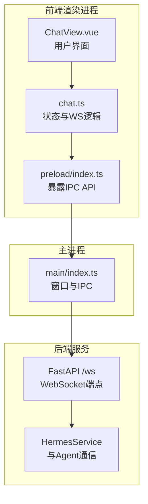
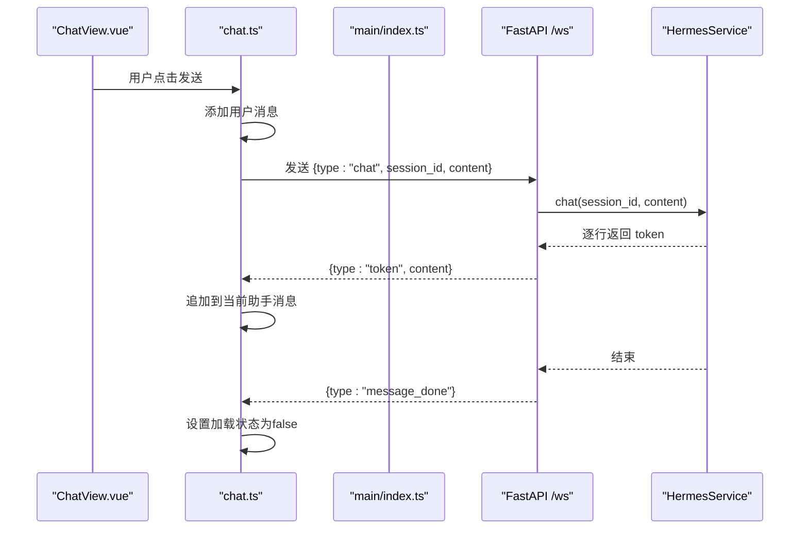
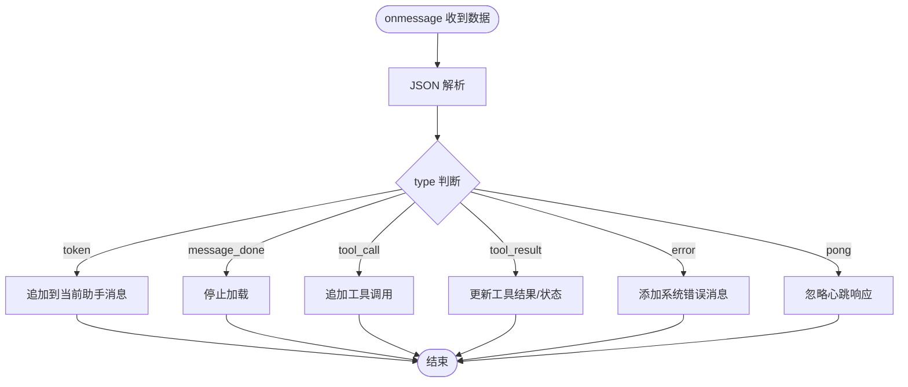
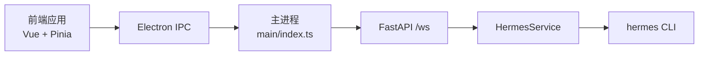

# WebSocket API

<cite>
**本文引用的文件**
- [backend/main.py](file://backend/main.py)
- [backend/services/hermes_service.py](file://backend/services/hermes_service.py)
- [src/main/index.ts](file://src/main/index.ts)
- [src/preload/index.ts](file://src/preload/index.ts)
- [src/renderer/src/stores/chat.ts](file://src/renderer/src/stores/chat.ts)
- [src/renderer/src/views/ChatView.vue](file://src/renderer/src/views/ChatView.vue)
- [package.json](file://package.json)
- [backend/requirements.txt](file://backend/requirements.txt)
</cite>

## 目录
1. [简介](#简介)
2. [项目结构](#项目结构)
3. [核心组件](#核心组件)
4. [架构总览](#架构总览)
5. [详细组件分析](#详细组件分析)
6. [依赖分析](#依赖分析)
7. [性能考虑](#性能考虑)
8. [故障排查指南](#故障排查指南)
9. [结论](#结论)
10. [附录：消息协议与示例](#附录消息协议与示例)

## 简介
本文件为 Hermes Desktop 的 WebSocket API 文档，覆盖连接端点 ws://localhost:8765/ws 的连接处理、消息格式与实时交互模式。重点说明：
- 连接建立、心跳保活、自动重连策略
- 消息协议规范：chat 请求、token 流式响应、message_done 完成信号、error 错误处理
- 会话管理机制（基于 session_id）
- 流式响应处理与状态管理
- 完整生命周期：连接、发送消息、接收流式响应、断开
- 错误处理策略、性能优化建议与调试方法

## 项目结构
Hermes Desktop 采用 Electron + Vue + FastAPI 的分层架构：
- 前端（Electron 渲染进程）通过 Pinia 状态管理 WebSocket 生命周期与消息流
- 后端（Python FastAPI）提供 WebSocket 服务与 Hermes Agent 通信
- IPC 层负责在主进程与渲染进程之间传递后端地址

图表来源
- [src/renderer/src/views/ChatView.vue:118-126](file://src/renderer/src/views/ChatView.vue#L118-L126)
- [src/renderer/src/stores/chat.ts:110-150](file://src/renderer/src/stores/chat.ts#L110-L150)
- [src/preload/index.ts:1-24](file://src/preload/index.ts#L1-L24)
- [src/main/index.ts:45-48](file://src/main/index.ts#L45-L48)
- [backend/main.py:31-65](file://backend/main.py#L31-L65)
- [backend/services/hermes_service.py:16-73](file://backend/services/hermes_service.py#L16-L73)

章节来源
- [src/renderer/src/views/ChatView.vue:118-126](file://src/renderer/src/views/ChatView.vue#L118-L126)
- [src/renderer/src/stores/chat.ts:110-150](file://src/renderer/src/stores/chat.ts#L110-L150)
- [src/preload/index.ts:1-24](file://src/preload/index.ts#L1-L24)
- [src/main/index.ts:45-48](file://src/main/index.ts#L45-L48)
- [backend/main.py:31-65](file://backend/main.py#L31-L65)
- [backend/services/hermes_service.py:16-73](file://backend/services/hermes_service.py#L16-L73)

## 核心组件
- 前端 WebSocket 管理器（Pinia Store）
  - 负责连接建立、心跳保活、消息发送、流式响应解析、自动重连与错误处理
  - 维护会话列表、当前会话 ID、加载状态
- 主进程 IPC
  - 提供后端 WebSocket 地址（ws://localhost:8765/ws）
- 后端 WebSocket 服务
  - 接受 chat 请求，调用 HermesService，以流式 token 返回，并在结束时发送 message_done
  - 处理 ping/pong 心跳与异常时返回 error
- HermesService
  - 通过子进程调用 hermes CLI，逐行读取输出作为 token 流
  - 维护会话历史（内存字典），并在成功时保存 assistant 回复

章节来源
- [src/renderer/src/stores/chat.ts:26-262](file://src/renderer/src/stores/chat.ts#L26-L262)
- [src/main/index.ts:45-48](file://src/main/index.ts#L45-L48)
- [backend/main.py:31-65](file://backend/main.py#L31-L65)
- [backend/services/hermes_service.py:10-82](file://backend/services/hermes_service.py#L10-L82)

## 架构总览
WebSocket 交互序列如下：

图表来源
- [src/renderer/src/stores/chat.ts:209-232](file://src/renderer/src/stores/chat.ts#L209-L232)
- [backend/main.py:43-54](file://backend/main.py#L43-L54)
- [backend/services/hermes_service.py:16-73](file://backend/services/hermes_service.py#L16-L73)

## 详细组件分析

### 前端 WebSocket 管理（Pinia Store）
- 连接与重连
  - connectWebSocket(url) 建立连接；onopen/onclose/onerror/onmessage 分别处理状态变化与消息解析
  - 自动重连：指数退避，最大延迟上限，避免频繁重试
  - 心跳：每 15 秒发送 ping，收到 pong 即可忽略
- 会话管理
  - createSession/deleteSession/switchSession/getCurrentSession 管理会话列表与当前会话 ID
  - sendMessage 将用户消息加入当前会话，并向后端发送 chat 请求
- 流式响应处理
  - token 类型：追加到当前助手消息；若无则新建一条
  - message_done：停止加载状态
  - tool_call/tool_result：在当前助手消息上追加工具调用及其结果
  - error：添加系统消息提示错误
- 断开连接
  - disconnect 停止心跳、取消重连定时器、关闭 WebSocket

图表来源
- [src/renderer/src/stores/chat.ts:139-207](file://src/renderer/src/stores/chat.ts#L139-L207)

章节来源
- [src/renderer/src/stores/chat.ts:26-262](file://src/renderer/src/stores/chat.ts#L26-L262)

### 主进程与 IPC
- 主进程通过 ipcMain.handle 暴露 get-backend-url，返回 ws://localhost:8765/ws
- preload 暴露 window.api.getBackendUrl 供渲染进程调用
- 渲染进程在 ChatView.vue 挂载时获取后端地址并建立 WebSocket

章节来源
- [src/main/index.ts:45-48](file://src/main/index.ts#L45-L48)
- [src/preload/index.ts:1-24](file://src/preload/index.ts#L1-L24)
- [src/renderer/src/views/ChatView.vue:118-126](file://src/renderer/src/views/ChatView.vue#L118-L126)

### 后端 WebSocket 服务
- 接受文本帧，解析为 JSON
- 支持两类消息：
  - ping：回显 pong
  - chat：启动会话（若未提供 session_id 则生成），调用 HermesService.chat 并逐行发送 token
  - 在流结束后发送 message_done
- 异常：捕获 WebSocketDisconnect 与通用异常，向客户端发送 error

章节来源
- [backend/main.py:31-65](file://backend/main.py#L31-L65)

### HermesService（会话与流式代理）
- 会话存储：内存字典，键为 session_id，值为消息数组（含 role/content）
- chat 方法：
  - 子进程调用 hermes CLI chat -q <content>
  - 逐行读取 stdout 作为 token 流，yield {type:"token", content}
  - 若 CLI 返回码非零，yield {type:"error", message}
  - 成功时将 assistant 回复追加到会话历史
- 异常处理：找不到 hermes CLI 或其他异常时，yield error

章节来源
- [backend/services/hermes_service.py:10-82](file://backend/services/hermes_service.py#L10-L82)

## 依赖分析
- 前端依赖
  - Vue 3、Pinia、Vue Router（用于状态管理与路由）
- 后端依赖
  - FastAPI、Uvicorn、WebSockets（提供 WebSocket 服务）
- 运行时依赖
  - hermes CLI（通过子进程调用）

图表来源
- [package.json:17-23](file://package.json#L17-L23)
- [backend/requirements.txt:1-4](file://backend/requirements.txt#L1-L4)
- [backend/services/hermes_service.py:32-54](file://backend/services/hermes_service.py#L32-L54)

章节来源
- [package.json:17-23](file://package.json#L17-L23)
- [backend/requirements.txt:1-4](file://backend/requirements.txt#L1-L4)

## 性能考虑
- 流式传输
  - 后端按行推送 token，前端即时追加，降低首屏延迟
- 心跳与重连
  - 15 秒心跳减少空闲连接占用；指数退避避免风暴重连
- 内存会话
  - 会话历史保存在内存，适合桌面应用场景；如需持久化可在生产环境扩展
- 前端渲染
  - 使用 Vue 计算属性与 watch 自动滚动，避免不必要的重渲染

[本节为通用性能建议，不直接分析具体文件]

## 故障排查指南
- 连接失败
  - 检查后端是否运行在 0.0.0.0:8765；确认防火墙放行
  - 查看前端控制台日志：连接、断开、错误事件
- 心跳无效
  - 确认前端每 15 秒发送 ping；后端是否正确回显 pong
- 消息未显示
  - 检查前端 handleServerMessage 是否正确解析 token/message_done/error
  - 确认当前会话存在且消息追加逻辑正常
- CLI 问题
  - hermes CLI 未安装或不在 PATH 中会导致 error；检查系统环境变量
- 重连策略
  - 观察指数退避延迟是否达到上限；必要时手动断线重连

章节来源
- [src/renderer/src/stores/chat.ts:83-108](file://src/renderer/src/stores/chat.ts#L83-L108)
- [backend/main.py:56-65](file://backend/main.py#L56-L65)
- [backend/services/hermes_service.py:66-72](file://backend/services/hermes_service.py#L66-L72)

## 结论
该 WebSocket API 以简洁的消息协议实现了端到端的流式对话体验：前端负责连接、心跳、重连与 UI 更新，后端负责会话管理与 Agent 通信，二者通过 token 流实现低延迟、高可用的实时交互。建议在生产环境中增加持久化会话、更细粒度的错误分类与可观测性指标。

[本节为总结性内容，不直接分析具体文件]

## 附录：消息协议与示例

### 连接端点
- ws://localhost:8765/ws

章节来源
- [src/main/index.ts:46-48](file://src/main/index.ts#L46-L48)

### 消息类型与字段
- 客户端 -> 服务端
  - chat
    - 字段：type（固定为 chat）、session_id（可选，未提供时由服务端生成）、content（必填）
  - ping
    - 字段：type（固定为 ping）
- 服务端 -> 客户端
  - token
    - 字段：type（固定为 token）、content（字符串片段）
  - message_done
    - 字段：type（固定为 message_done）
  - error
    - 字段：type（固定为 error）、message（字符串）
  - pong
    - 字段：type（固定为 pong）

章节来源
- [backend/main.py:41-54](file://backend/main.py#L41-L54)
- [backend/services/hermes_service.py:16-73](file://backend/services/hermes_service.py#L16-L73)
- [src/renderer/src/stores/chat.ts:139-207](file://src/renderer/src/stores/chat.ts#L139-L207)

### 生命周期示例（文字描述）
- 连接建立
  - 渲染进程通过 IPC 获取后端地址，建立 WebSocket 连接
  - 连接成功后启动心跳
- 发送消息
  - 用户输入消息，前端添加到当前会话，发送 chat 请求
- 流式响应
  - 后端逐行推送 token，前端追加到当前助手消息
- 完成信号
  - 后端发送 message_done，前端停止加载状态
- 错误处理
  - 后端异常时发送 error，前端展示系统消息
- 断开与重连
  - 连接断开触发自动重连，指数退避至上限

章节来源
- [src/renderer/src/stores/chat.ts:110-150](file://src/renderer/src/stores/chat.ts#L110-L150)
- [backend/main.py:36-65](file://backend/main.py#L36-L65)

### 会话管理要点
- session_id 可选：若客户端未提供，后端会生成一个唯一 ID
- 会话历史：后端维护内存字典，保存 user/assistant 消息
- 当前会话：前端 Pinia store 维护 currentSessionId，决定消息归属

章节来源
- [backend/main.py:44-45](file://backend/main.py#L44-L45)
- [backend/services/hermes_service.py:14-29](file://backend/services/hermes_service.py#L14-L29)

### 自动重连策略
- 指数退避：2^N 秒，上限 30 秒
- 防抖：同一时间仅允许一个重连定时器
- 成功连接后重置尝试次数

章节来源
- [src/renderer/src/stores/chat.ts:99-108](file://src/renderer/src/stores/chat.ts#L99-L108)