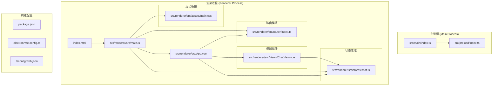
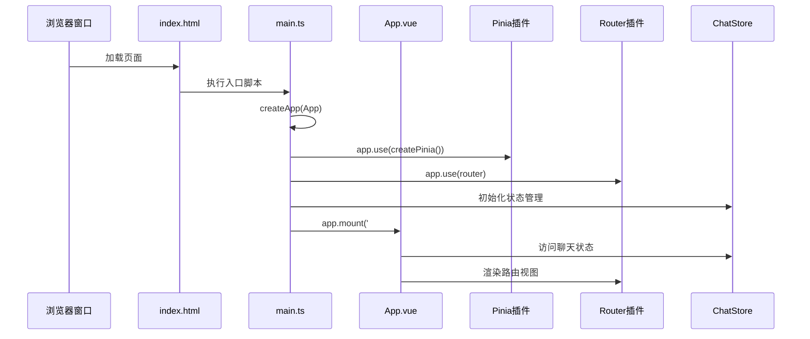
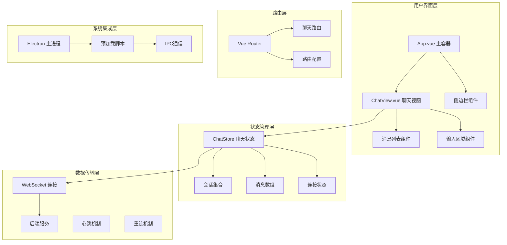
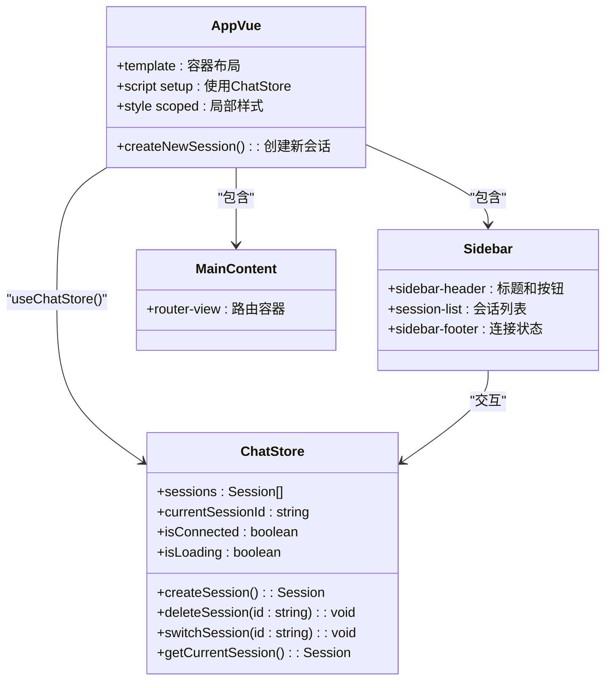
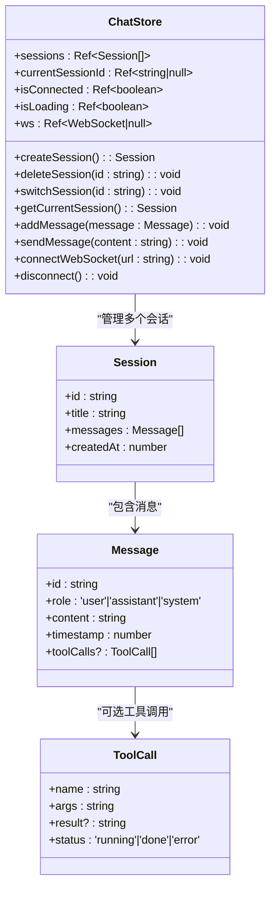
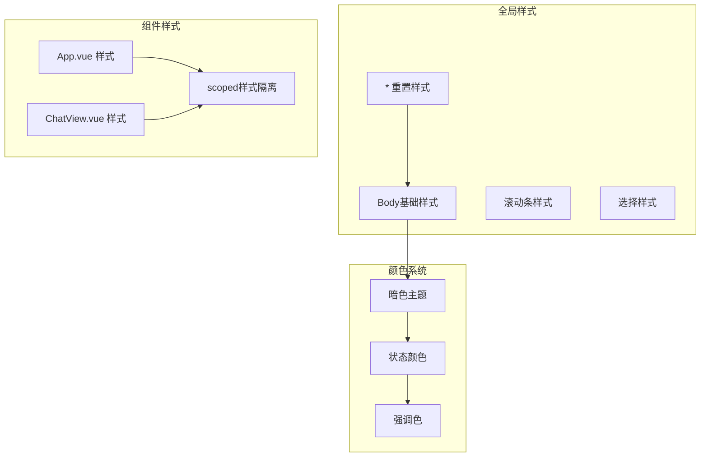
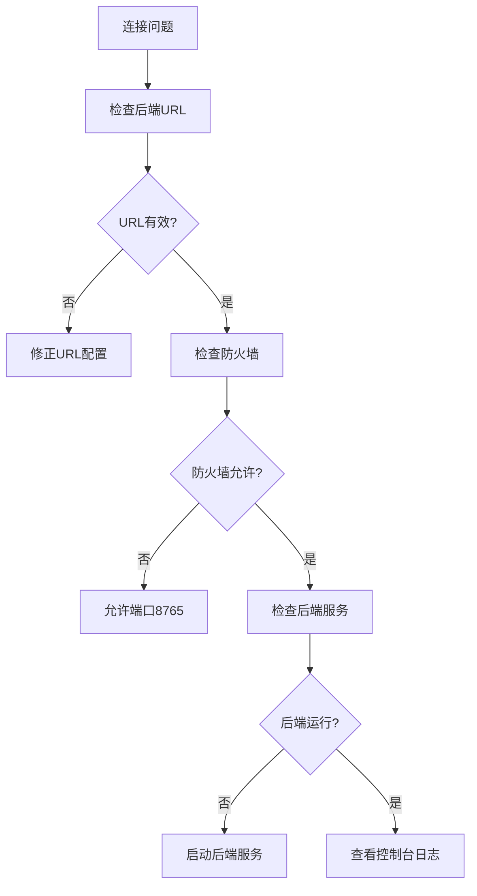

# Vue应用架构

<cite>
**本文档引用的文件**
- [main.ts](file://src/renderer/src/main.ts)
- [App.vue](file://src/renderer/src/App.vue)
- [router/index.ts](file://src/renderer/src/router/index.ts)
- [stores/chat.ts](file://src/renderer/src/stores/chat.ts)
- [views/ChatView.vue](file://src/renderer/src/views/ChatView.vue)
- [assets/main.css](file://src/renderer/src/assets/main.css)
- [index.html](file://src/renderer/index.html)
- [package.json](file://package.json)
- [electron.vite.config.ts](file://electron.vite.config.ts)
- [src/main/index.ts](file://src/main/index.ts)
- [src/preload/index.ts](file://src/preload/index.ts)
- [tsconfig.web.json](file://tsconfig.web.json)
</cite>

## 目录
1. [简介](#简介)
2. [项目结构](#项目结构)
3. [核心组件](#核心组件)
4. [架构概览](#架构概览)
5. [详细组件分析](#详细组件分析)
6. [依赖关系分析](#依赖关系分析)
7. [性能考虑](#性能考虑)
8. [故障排除指南](#故障排除指南)
9. [结论](#结论)

## 简介

这是一个基于Electron和Vue 3构建的桌面聊天应用，名为Hermes Desktop。该应用采用现代化的前端技术栈，结合了Vue 3的组合式API、Pinia状态管理、Vue Router路由系统和Electron桌面框架。应用的核心功能是提供一个桌面端的聊天界面，支持与后端服务的WebSocket通信，并具备会话管理和消息处理能力。

## 项目结构

该项目采用了清晰的分层架构设计，将渲染进程代码与主进程代码分离，同时在渲染进程中实现了标准的Vue 3应用结构。



**图表来源**
- [src/main/index.ts:1-62](file://src/main/index.ts#L1-L62)
- [src/preload/index.ts:1-24](file://src/preload/index.ts#L1-L24)
- [src/renderer/index.html:1-13](file://src/renderer/index.html#L1-L13)
- [src/renderer/src/main.ts:1-11](file://src/renderer/src/main.ts#L1-L11)

**章节来源**
- [package.json:1-35](file://package.json#L1-L35)
- [electron.vite.config.ts:1-21](file://electron.vite.config.ts#L1-L21)
- [tsconfig.web.json:1-16](file://tsconfig.web.json#L1-L16)

## 核心组件

### 应用初始化流程

应用的启动过程遵循标准的Vue 3应用初始化模式，通过明确的依赖注入和插件注册顺序确保应用的正确运行。



**图表来源**
- [src/renderer/index.html:8-10](file://src/renderer/index.html#L8-L10)
- [src/renderer/src/main.ts:1-11](file://src/renderer/src/main.ts#L1-L11)

### 依赖注入机制

应用采用显式的依赖注入模式，通过createApp创建应用实例，然后依次注册必要的插件和服务。

**章节来源**
- [src/renderer/src/main.ts:1-11](file://src/renderer/src/main.ts#L1-L11)

## 架构概览

该应用采用了典型的三层架构：主进程负责系统级操作和窗口管理，渲染进程负责用户界面展示，数据层负责业务逻辑和状态管理。



**图表来源**
- [src/renderer/src/App.vue:1-178](file://src/renderer/src/App.vue#L1-L178)
- [src/renderer/src/views/ChatView.vue:1-325](file://src/renderer/src/views/ChatView.vue#L1-L325)
- [src/renderer/src/stores/chat.ts:1-263](file://src/renderer/src/stores/chat.ts#L1-L263)

## 详细组件分析

### App.vue 主组件设计

App.vue作为应用的根组件，采用了经典的侧边栏+主内容区的布局设计，体现了现代桌面应用的典型UI模式。

#### 组件结构分析



**图表来源**
- [src/renderer/src/App.vue:1-178](file://src/renderer/src/App.vue#L1-L178)
- [src/renderer/src/stores/chat.ts:26-262](file://src/renderer/src/stores/chat.ts#L26-L262)

#### 布局结构特点

应用采用了Flexbox布局系统，实现了响应式和自适应的界面设计：

- **侧边栏区域**：固定宽度260px，包含会话列表和连接状态显示
- **主内容区域**：占据剩余空间，通过router-view动态加载视图
- **深色主题配色**：使用统一的暗色主题色调(#181825, #1e1e2e, #313244)

**章节来源**
- [src/renderer/src/App.vue:1-178](file://src/renderer/src/App.vue#L1-L178)

### 路由容器功能

应用使用Vue Router实现单页应用的路由管理，当前版本仅包含一个主要路由。

#### 路由配置分析

```mermaid
flowchart TD
Start([应用启动]) --> CreateRouter[创建路由实例]
CreateRouter --> ConfigRoutes[配置路由表]
ConfigRoutes --> HashHistory[使用哈希历史模式]
HashHistory --> DefineRoutes[定义聊天路由]
DefineRoutes --> ExportRouter[导出路由实例]
ExportRouter --> UseInApp[在应用中使用]
subgraph "路由配置详情"
Path[/ 路径]
Name[chat 名称]
Component[ChatView 组件]
end
DefineRoutes --> Path
DefineRoutes --> Name
DefineRoutes --> Component
```

**图表来源**
- [src/renderer/src/router/index.ts:1-16](file://src/renderer/src/router/index.ts#L1-L16)

**章节来源**
- [src/renderer/src/router/index.ts:1-16](file://src/renderer/src/router/index.ts#L1-L16)

### 全局状态管理

应用使用Pinia作为状态管理解决方案，实现了完整的聊天应用所需的状态管理功能。

#### 状态管理架构



**图表来源**
- [src/renderer/src/stores/chat.ts:1-263](file://src/renderer/src/stores/chat.ts#L1-L263)

#### WebSocket通信机制

应用实现了完整的WebSocket通信协议，包括连接管理、心跳检测和自动重连功能。

**章节来源**
- [src/renderer/src/stores/chat.ts:1-263](file://src/renderer/src/stores/chat.ts#L1-L263)

### 样式系统组织

应用采用了模块化的样式组织方式，通过CSS变量和组件作用域样式实现一致的视觉体验。

#### 样式架构分析



**图表来源**
- [src/renderer/src/assets/main.css:1-36](file://src/renderer/src/assets/main.css#L1-L36)
- [src/renderer/src/App.vue:47-177](file://src/renderer/src/App.vue#L47-L177)
- [src/renderer/src/views/ChatView.vue:129-324](file://src/renderer/src/views/ChatView.vue#L129-L324)

**章节来源**
- [src/renderer/src/assets/main.css:1-36](file://src/renderer/src/assets/main.css#L1-L36)

## 依赖关系分析

### 外部依赖管理

应用使用npm包管理器管理依赖，核心依赖包括Vue 3生态系统的关键组件。

```mermaid
graph LR
subgraph "应用依赖"
Vue[Vue 3.5.13]
Pinia[Pinia 2.2.6]
Router[Vue Router 4.4.5]
Electron[Electron 33.2.1]
end
subgraph "开发依赖"
Vite[Vite 6.0.7]
TypeScript[TypeScript 5.7.2]
VueTSC[Vue TSC 2.1.10]
ESLint[ESLint]
end
subgraph "Electron工具"
ToolkitPreload[@electron-toolkit/preload]
ToolkitUtils[@electron-toolkit/utils]
end
Vue --> Pinia
Vue --> Router
Electron --> ToolkitPreload
Electron --> ToolkitUtils
```

**图表来源**
- [package.json:17-33](file://package.json#L17-L33)

### 构建配置分析

应用使用electron-vite进行构建，支持开发和生产环境的不同配置。

**章节来源**
- [package.json:1-35](file://package.json#L1-L35)
- [electron.vite.config.ts:1-21](file://electron.vite.config.ts#L1-L21)

## 性能考虑

### 启动性能优化

应用在启动时采用了最小化依赖加载策略，确保快速的首屏渲染。

### 内存管理

- **组件卸载清理**：WebSocket连接在组件卸载时自动清理
- **定时器管理**：心跳和重连定时器在适当时机停止
- **事件监听器**：避免内存泄漏的事件监听器清理

### 网络性能

- **连接池管理**：单WebSocket连接复用所有消息通信
- **心跳机制**：15秒心跳保持连接活跃
- **指数退避重连**：最多30秒延迟的智能重连策略

## 故障排除指南

### 常见问题诊断

#### WebSocket连接问题



#### 状态同步问题

当出现状态不同步时，检查以下要点：
- 确保所有组件都使用相同的store实例
- 验证响应式数据的正确更新
- 检查异步操作的完成状态

**章节来源**
- [src/renderer/src/stores/chat.ts:109-150](file://src/renderer/src/stores/chat.ts#L109-L150)

### 调试技巧

1. **浏览器开发者工具**：使用Vue DevTools检查组件状态
2. **网络面板**：监控WebSocket连接状态
3. **控制台日志**：利用store中的console.log输出
4. **Electron主进程日志**：检查IPC通信状态

## 结论

该Vue 3应用展现了现代桌面应用开发的最佳实践，通过合理的架构设计和组件化开发实现了功能完整、性能优良的聊天客户端。应用的主要优势包括：

- **清晰的架构层次**：主进程与渲染进程分离，职责明确
- **现代化的技术栈**：Vue 3 + TypeScript + Pinia + Electron的组合
- **完善的用户体验**：响应式设计、深色主题、流畅的动画效果
- **健壮的通信机制**：WebSocket + 心跳 + 重连的完整方案
- **良好的扩展性**：模块化的组件设计便于功能扩展

未来可以考虑的改进方向：
- 添加更多的路由和视图组件
- 实现更丰富的消息类型支持
- 增强离线缓存和数据持久化
- 优化大消息的渲染性能
- 添加国际化支持