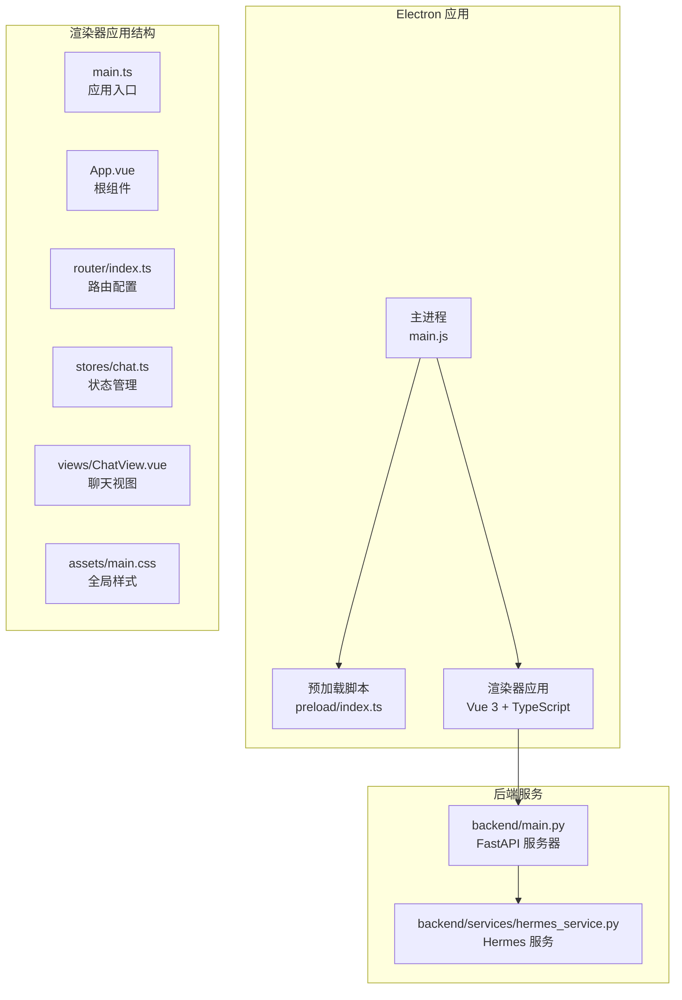
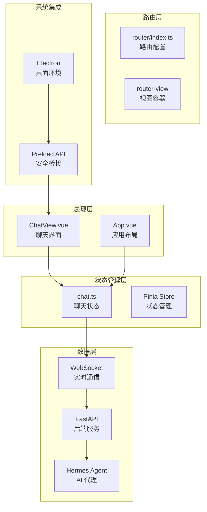
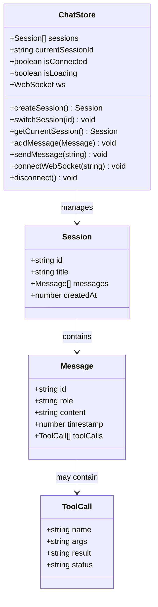
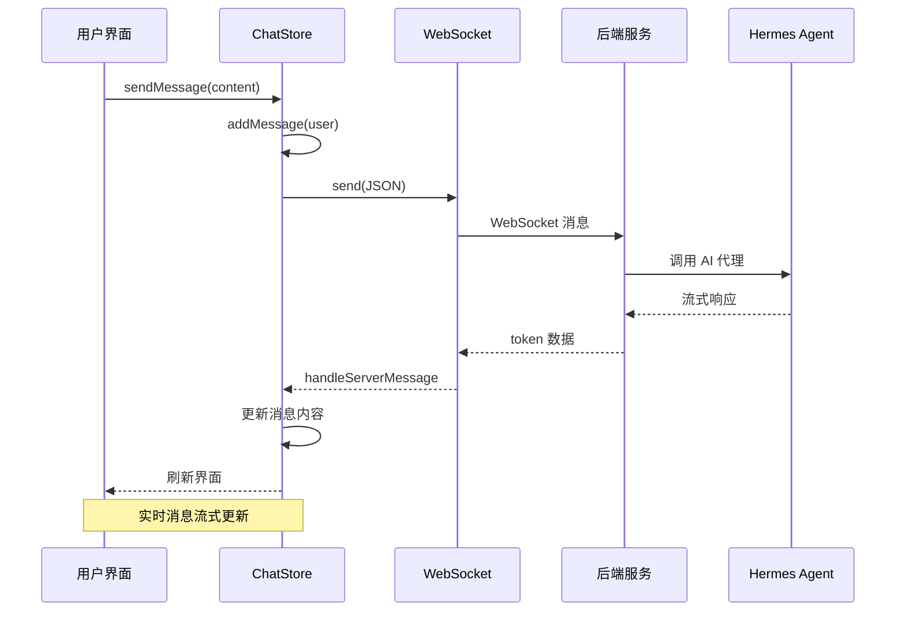
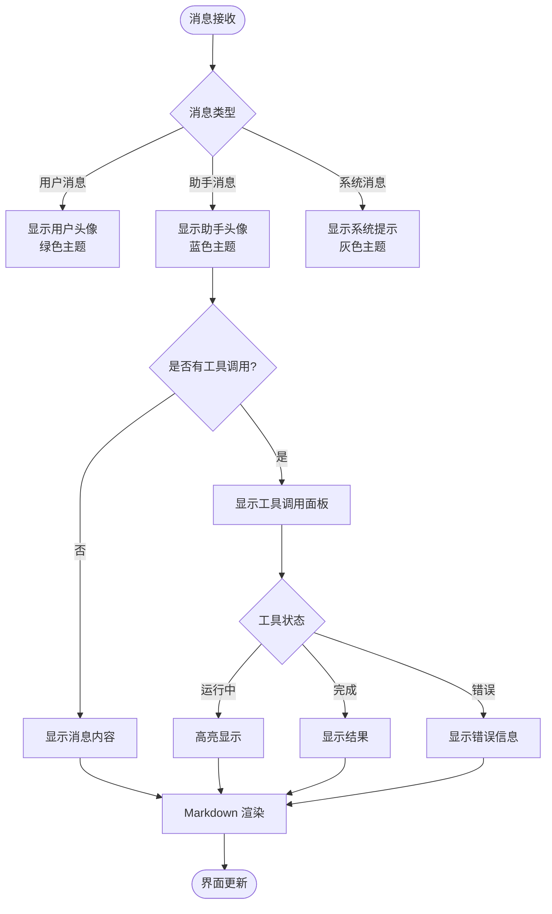
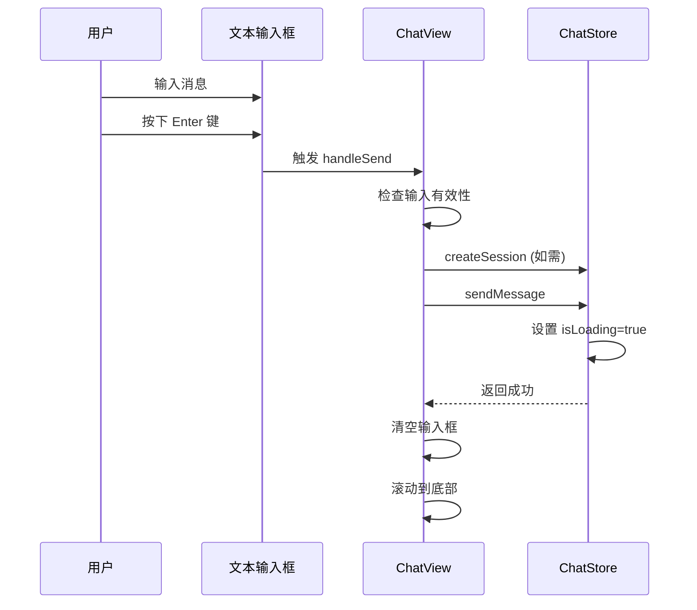
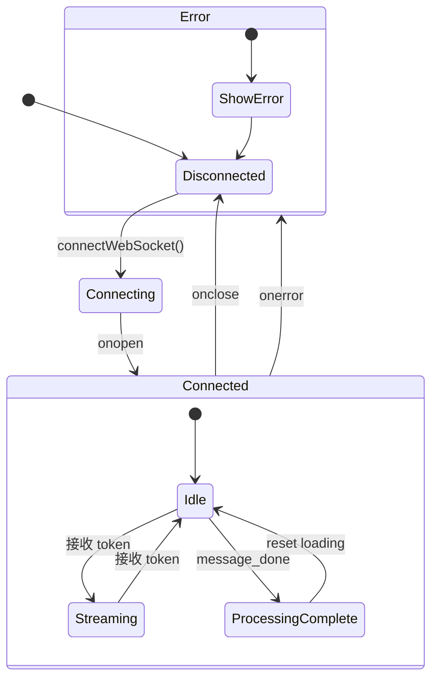
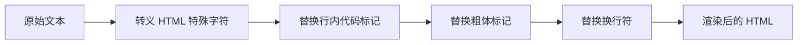
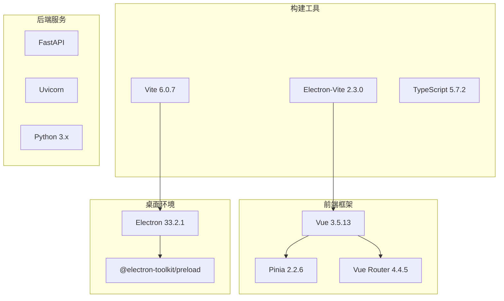
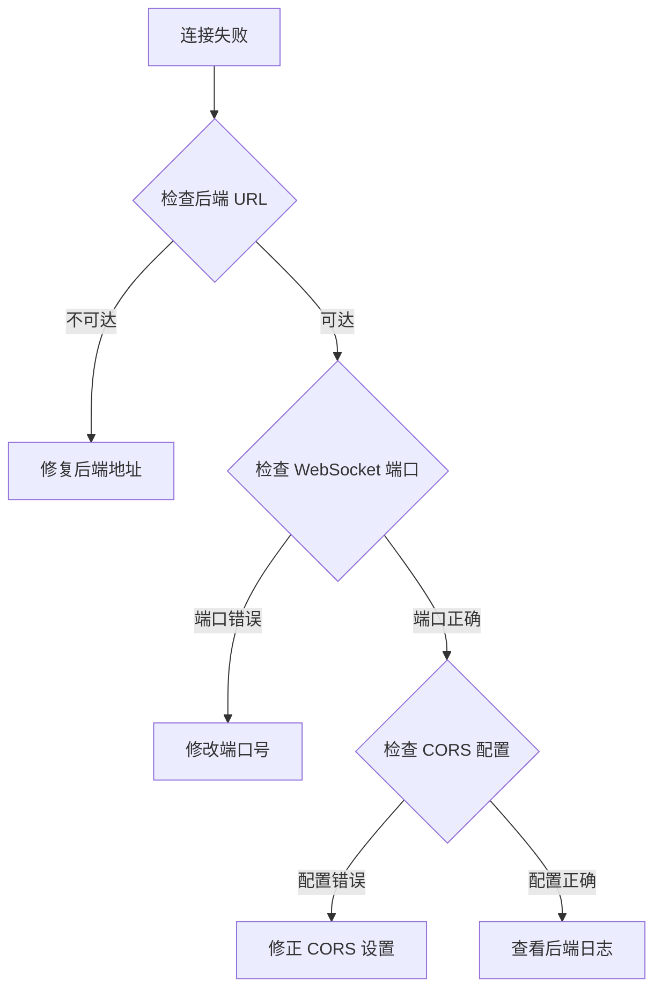

# 前端应用

<cite>
**本文引用的文件**
- [main.ts](file://src/renderer/src/main.ts)
- [App.vue](file://src/renderer/src/App.vue)
- [router/index.ts](file://src/renderer/src/router/index.ts)
- [stores/chat.ts](file://src/renderer/src/stores/chat.ts)
- [views/ChatView.vue](file://src/renderer/src/views/ChatView.vue)
- [assets/main.css](file://src/renderer/src/assets/main.css)
- [package.json](file://package.json)
- [electron.vite.config.ts](file://electron.vite.config.ts)
- [preload/index.ts](file://src/preload/index.ts)
- [preload/index.d.ts](file://src/preload/index.d.ts)
- [backend/main.py](file://backend/main.py)
- [backend/services/hermes_service.py](file://backend/services/hermes_service.py)
</cite>

## 目录
1. [简介](#简介)
2. [项目结构](#项目结构)
3. [核心组件](#核心组件)
4. [架构总览](#架构总览)
5. [详细组件分析](#详细组件分析)
6. [依赖关系分析](#依赖关系分析)
7. [性能考虑](#性能考虑)
8. [故障排除指南](#故障排除指南)
9. [结论](#结论)
10. [附录](#附录)

## 简介
Hermes Desktop 是一个基于 Electron 的桌面聊天客户端，采用 Vue 3 + Pinia + TypeScript 技术栈构建。该应用通过 WebSocket 与后端 Python 服务通信，实现了实时对话、消息流式传输、工具调用展示等功能。应用采用暗色主题设计，具有现代化的 UI 组件和良好的用户体验。

## 项目结构
项目采用 Electron-Vite 架构，分为主进程、预加载脚本和渲染器三个部分：

**图表来源**
- [main.ts:1-11](file://src/renderer/src/main.ts#L1-L11)
- [App.vue:1-144](file://src/renderer/src/App.vue#L1-L144)
- [router/index.ts:1-16](file://src/renderer/src/router/index.ts#L1-L16)
- [stores/chat.ts:1-197](file://src/renderer/src/stores/chat.ts#L1-L197)
- [views/ChatView.vue:1-327](file://src/renderer/src/views/ChatView.vue#L1-L327)

**章节来源**
- [package.json:1-35](file://package.json#L1-L35)
- [electron.vite.config.ts:1-21](file://electron.vite.config.ts#L1-L21)

## 核心组件
应用的核心由以下关键组件构成：

### 应用入口与初始化
应用通过 main.ts 进行初始化，配置 Pinia 状态管理和路由系统：

- 创建 Vue 应用实例
- 注册 Pinia 状态管理
- 配置路由系统
- 加载全局样式
- 挂载到 DOM

### 根组件架构
App.vue 实现了侧边栏导航和主内容区域的布局结构：

- 左侧边栏：会话列表、新对话按钮、连接状态显示
- 主内容区：路由视图容器
- 响应式布局：Flexbox 布局，100vh 视口高度

### 聊天视图组件
ChatView.vue 提供完整的聊天界面功能：

- 消息显示区域：支持 Markdown 渲染
- 输入区域：文本输入框和发送按钮
- 工具调用展示：支持工具执行状态显示
- 加载指示器：打字动画效果

**章节来源**
- [main.ts:1-11](file://src/renderer/src/main.ts#L1-L11)
- [App.vue:32-40](file://src/renderer/src/App.vue#L32-L40)
- [views/ChatView.vue:68-127](file://src/renderer/src/views/ChatView.vue#L68-L127)

## 架构总览
应用采用分层架构设计，实现了清晰的关注点分离：

**图表来源**
- [stores/chat.ts:26-196](file://src/renderer/src/stores/chat.ts#L26-L196)
- [router/index.ts:4-13](file://src/renderer/src/router/index.ts#L4-L13)
- [backend/main.py:31-63](file://backend/main.py#L31-L63)

## 详细组件分析

### Pinia 状态管理实现
应用使用 Pinia 实现集中式状态管理，定义了完整的聊天状态模型：

#### 数据结构设计

**图表来源**
- [stores/chat.ts:4-24](file://src/renderer/src/stores/chat.ts#L4-L24)
- [stores/chat.ts:26-196](file://src/renderer/src/stores/chat.ts#L26-L196)

#### 状态管理流程

**图表来源**
- [stores/chat.ts:153-176](file://src/renderer/src/stores/chat.ts#L153-L176)
- [stores/chat.ts:98-151](file://src/renderer/src/stores/chat.ts#L98-L151)

**章节来源**
- [stores/chat.ts:1-197](file://src/renderer/src/stores/chat.ts#L1-L197)

### 路由配置与导航
应用使用 Vue Router 实现单页应用导航：

#### 路由配置
- 使用哈希历史模式 (`createWebHashHistory`)
- 单一路由：根路径 `/` 映射到 `ChatView`
- 支持未来的多视图扩展

#### 导航模式
- 侧边栏会话切换
- 连接状态指示
- 响应式布局适配

**章节来源**
- [router/index.ts:1-16](file://src/renderer/src/router/index.ts#L1-L16)
- [App.vue:8-28](file://src/renderer/src/App.vue#L8-L28)

### 聊天界面设计与交互
ChatView.vue 实现了完整的聊天界面，包含多种交互模式：

#### 消息渲染机制

**图表来源**
- [views/ChatView.vue:11-46](file://src/renderer/src/views/ChatView.vue#L11-L46)
- [views/ChatView.vue:79-88](file://src/renderer/src/views/ChatView.vue#L79-L88)

#### 输入处理逻辑

**图表来源**
- [views/ChatView.vue:90-102](file://src/renderer/src/views/ChatView.vue#L90-L102)
- [stores/chat.ts:153-176](file://src/renderer/src/stores/chat.ts#L153-L176)

**章节来源**
- [views/ChatView.vue:1-327](file://src/renderer/src/views/ChatView.vue#L1-L327)

### WebSocket 通信实现
应用通过 WebSocket 实现与后端的实时通信：

#### 连接管理
- 自动连接：应用挂载时获取后端 URL 并建立连接
- 连接状态：实时显示连接状态（已连接/未连接）
- 错误处理：网络异常时自动断开连接

#### 消息协议

**图表来源**
- [stores/chat.ts:64-96](file://src/renderer/src/stores/chat.ts#L64-L96)
- [stores/chat.ts:98-151](file://src/renderer/src/stores/chat.ts#L98-L151)

**章节来源**
- [stores/chat.ts:64-181](file://src/renderer/src/stores/chat.ts#L64-L181)

### Markdown 渲染实现
应用实现了基础的 Markdown 渲染功能：

#### 支持的语法
- 行内代码：使用反引号包裹
- 粗体文本：使用双星号包围
- 换行符：转换为 HTML ` ` 标签
- HTML 转义：防止 XSS 攻击

#### 渲染流程

**图表来源**
- [views/ChatView.vue:79-88](file://src/renderer/src/views/ChatView.vue#L79-L88)

**章节来源**
- [views/ChatView.vue:79-88](file://src/renderer/src/views/ChatView.vue#L79-L88)

## 依赖关系分析

### 技术栈依赖

**图表来源**
- [package.json:17-33](file://package.json#L17-L33)
- [electron.vite.config.ts:1-21](file://electron.vite.config.ts#L1-L21)

### 外部依赖管理
应用使用 pnpm 作为包管理器，配置了工作空间结构：

- 主要依赖：Vue 生态系统、Electron 桌面环境
- 开发依赖：TypeScript 类型检查、ESLint 代码规范
- 构建工具：Vite 快速开发、Electron-Vite 专门优化

**章节来源**
- [package.json:1-35](file://package.json#L1-L35)
- [electron.vite.config.ts:1-21](file://electron.vite.config.ts#L1-L21)

## 性能考虑

### 响应式设计优化
应用采用了多项性能优化策略：

#### 内存管理
- 使用 `ref` 和 `reactive` 进行响应式数据管理
- 及时清理 WebSocket 连接避免内存泄漏
- 合理使用 `computed` 属性避免重复计算

#### 渲染优化
- 使用 `v-for` 的 key 属性确保列表正确更新
- 条件渲染减少不必要的 DOM 元素
- 滚动位置管理避免频繁重排

#### 网络优化
- WebSocket 流式传输减少延迟
- 连接池复用避免频繁握手
- 错误重连机制提升稳定性

### 性能监控建议
- 使用 Vue DevTools 监控组件渲染性能
- 分析 WebSocket 消息大小和频率
- 监控内存使用情况和垃圾回收

## 故障排除指南

### 常见问题诊断

#### WebSocket 连接问题

**图表来源**
- [stores/chat.ts:64-96](file://src/renderer/src/stores/chat.ts#L64-L96)
- [backend/main.py:15-21](file://backend/main.py#L15-L21)

#### 消息显示异常
- 检查 Markdown 渲染函数是否正确
- 验证消息内容的 HTML 转义
- 确认 CSS 样式是否正确加载

#### 输入处理问题
- 验证键盘事件绑定
- 检查输入框的双向绑定
- 确认发送按钮的状态控制

**章节来源**
- [stores/chat.ts:86-93](file://src/renderer/src/stores/chat.ts#L86-L93)
- [views/ChatView.vue:90-102](file://src/renderer/src/views/ChatView.vue#L90-L102)

### 调试工具使用
- Vue DevTools：检查组件状态和 props
- 浏览器开发者工具：监控网络请求和 WebSocket 通信
- Electron DevTools：调试主进程和渲染器通信

## 结论
Hermes Desktop 前端应用展现了现代桌面应用开发的最佳实践。通过合理的架构设计、完善的组件化实现和高效的性能优化，该应用提供了流畅的用户体验。Pinia 状态管理确保了数据流的可预测性，WebSocket 实时通信实现了低延迟的消息传递，而精心设计的 UI 组件则保证了良好的交互体验。

未来可以考虑的功能增强包括：更丰富的 Markdown 渲染支持、主题切换功能、消息搜索和过滤、以及更完善的错误处理机制。

## 附录

### 样式定制指南
应用支持通过 CSS 变量进行主题定制：

#### 主题颜色变量
- 主背景色：`#181825`
- 侧边栏背景：`#1e1e2e`
- 边框颜色：`#313244`
- 文本颜色：`#cdd6f4`

#### 组件样式定制
- 修改 `.sidebar` 类调整侧边栏外观
- 调整 `.message` 类定制消息显示
- 修改 `.input-wrapper` 类改变输入区域样式

### 无障碍访问支持
应用已具备基本的无障碍特性：
- 语义化 HTML 结构
- 键盘导航支持
- 屏幕阅读器兼容
- 高对比度颜色方案

### 跨浏览器兼容性
应用针对现代浏览器进行了优化：
- 支持 Chrome、Firefox、Edge 最新版本
- 使用标准 CSS 属性避免浏览器前缀
- 通过 TypeScript 编译确保兼容性