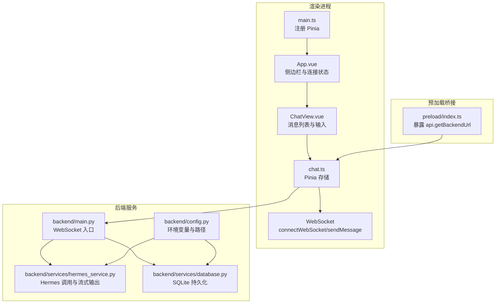
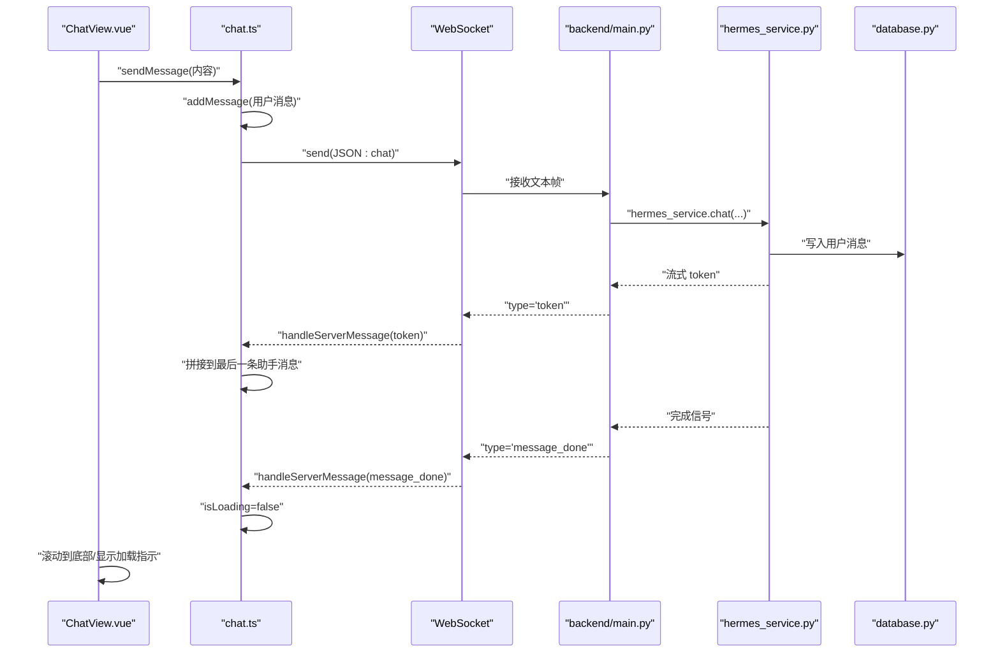
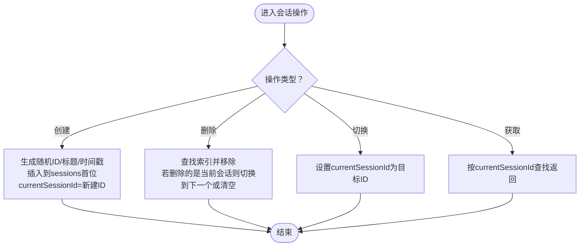
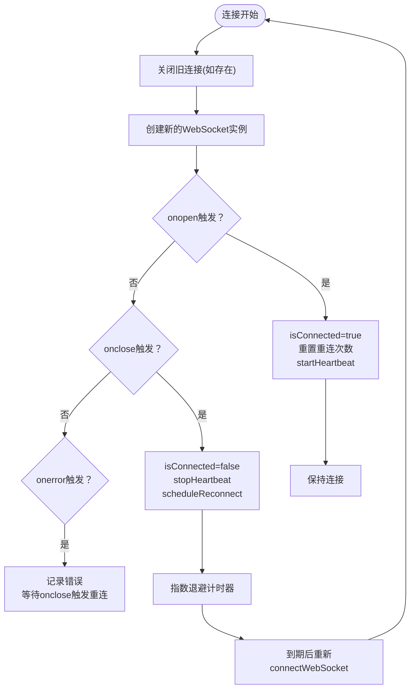
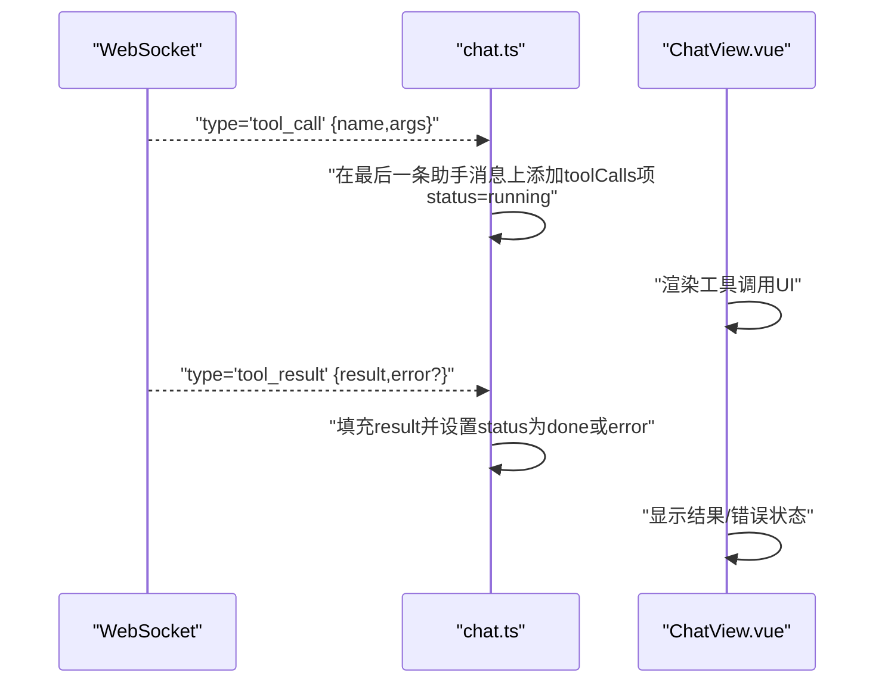
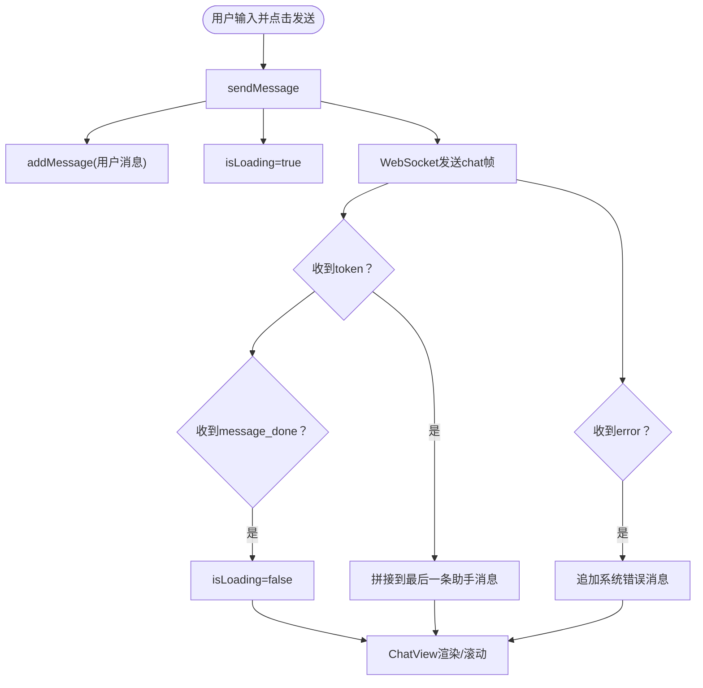
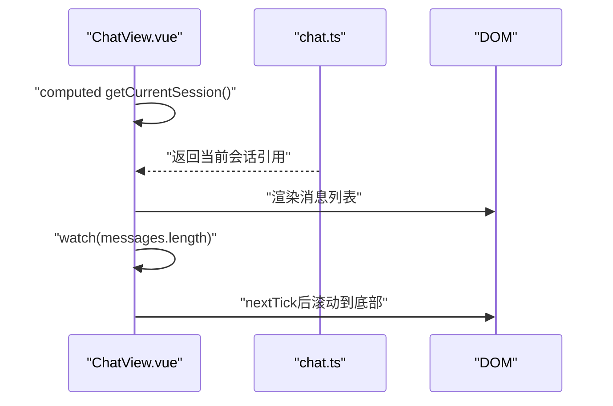
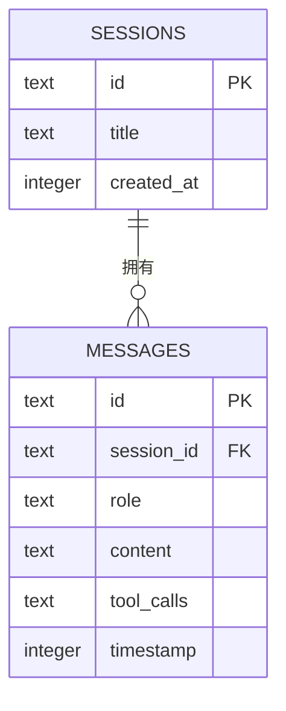
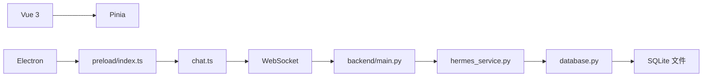

# 状态管理

<cite>
**本文引用的文件**
- [chat.ts](file://src/renderer/src/stores/chat.ts)
- [ChatView.vue](file://src/renderer/src/views/ChatView.vue)
- [App.vue](file://src/renderer/src/App.vue)
- [main.ts](file://src/renderer/src/main.ts)
- [index.ts](file://src/preload/index.ts)
- [main.py](file://backend/main.py)
- [hermes_service.py](file://backend/services/hermes_service.py)
- [database.py](file://backend/services/database.py)
- [config.py](file://backend/config.py)
- [package.json](file://package.json)
</cite>

## 目录
1. [简介](#简介)
2. [项目结构](#项目结构)
3. [核心组件](#核心组件)
4. [架构总览](#架构总览)
5. [详细组件分析](#详细组件分析)
6. [依赖关系分析](#依赖关系分析)
7. [性能考量](#性能考量)
8. [故障排查指南](#故障排查指南)
9. [结论](#结论)
10. [附录](#附录)

## 简介
本文件围绕前端渲染进程中的 Pinia 存储 chat.ts 的设计与实现进行系统性解析，重点覆盖以下方面：
- 会话状态、消息集合、WebSocket 连接状态与工具调用状态的建模与管理
- 状态变更的触发条件、副作用处理与异步操作管理
- 数据持久化策略、重置机制与数据同步
- 状态订阅模式、计算属性使用与性能优化技巧
- 最佳实践与常见问题解决方案

该应用采用 Electron + Vue + Pinia 架构，前端通过 WebSocket 与后端 Python FastAPI 服务交互，后端以 SQLite 持久化会话与消息，并通过子进程调用 Hermes Agent 执行推理与工具调用。

## 项目结构
前端渲染进程的关键文件组织如下：
- 应用入口：在应用根组件中注册 Pinia 并挂载
- 状态存储：chat.ts 定义了会话、消息、连接与加载状态，并封装 WebSocket 生命周期与消息处理
- 视图层：App.vue 提供侧边栏与连接状态展示；ChatView.vue 负责消息渲染、输入与发送逻辑
- 预加载桥接：preload/index.ts 暴露安全的 IPC 接口给渲染进程获取后端地址
- 后端服务：FastAPI 提供 WebSocket 接入点与数据库访问接口；HermesService 调用本地 Hermes 可执行程序并流式返回结果；SQLite 实现会话与消息持久化

**图表来源**
- [main.ts:1-11](file://src/renderer/src/main.ts#L1-L11)
- [App.vue:1-178](file://src/renderer/src/App.vue#L1-L178)
- [ChatView.vue:1-325](file://src/renderer/src/views/ChatView.vue#L1-L325)
- [chat.ts:1-263](file://src/renderer/src/stores/chat.ts#L1-L263)
- [index.ts:1-24](file://src/preload/index.ts#L1-L24)
- [main.py:1-114](file://backend/main.py#L1-L114)
- [hermes_service.py:1-86](file://backend/services/hermes_service.py#L1-L86)
- [database.py:1-137](file://backend/services/database.py#L1-L137)
- [config.py:1-24](file://backend/config.py#L1-L24)

**章节来源**
- [main.ts:1-11](file://src/renderer/src/main.ts#L1-L11)
- [package.json:17-22](file://package.json#L17-L22)

## 核心组件
本节聚焦 chat.ts 中的核心状态与方法，解释其职责与协作方式。

- 状态字段
  - sessions：会话数组，包含 id、标题、消息列表与创建时间
  - currentSessionId：当前选中会话 ID 或空
  - isConnected：WebSocket 连接状态
  - isLoading：当前是否正在等待后端响应
  - ws：当前 WebSocket 实例（可为空）

- 关键方法
  - createSession/deleteSession/switchSession/getCurrentSession：会话生命周期管理
  - addMessage：向当前会话追加消息，首条用户消息用于更新会话标题
  - connectWebSocket/scheduleReconnect/startHeartbeat/stopHeartbeat/disconnect：WebSocket 生命周期与心跳
  - sendMessage：构建用户消息并发送到后端
  - handleServerMessage：根据服务端消息类型更新状态（增量文本、工具调用、工具结果、错误提示与结束标记）

这些方法共同构成“请求-响应-增量渲染”的闭环，确保 UI 与后端实时流式交互。

**章节来源**
- [chat.ts:26-263](file://src/renderer/src/stores/chat.ts#L26-L263)

## 架构总览
下图展示了从前端视图到后端服务的端到端流程，以及状态在各层之间的流转。

**图表来源**
- [ChatView.vue:90-102](file://src/renderer/src/views/ChatView.vue#L90-L102)
- [chat.ts:209-232](file://src/renderer/src/stores/chat.ts#L209-L232)
- [chat.ts:139-150](file://src/renderer/src/stores/chat.ts#L139-L150)
- [chat.ts:152-207](file://src/renderer/src/stores/chat.ts#L152-L207)
- [main.py:89-97](file://backend/main.py#L89-L97)
- [hermes_service.py:24-86](file://backend/services/hermes_service.py#L24-L86)
- [database.py:86-103](file://backend/services/database.py#L86-L103)

## 详细组件分析

### 会话状态与消息集合管理
- 会话模型
  - Session 包含 id、title、messages 数组与 createdAt
  - 首条用户消息到达时自动将会话标题设为该消息内容前缀
- 消息模型
  - Message 包含 id、role、content、timestamp 与可选的 toolCalls
  - ToolCall 包含 name、args、result 与 status（running/done/error）
- 会话操作
  - createSession：生成唯一 ID、默认标题与创建时间，插入到 sessions 列表首位并切换为当前会话
  - deleteSession：定位并移除指定会话；若删除的是当前会话，则切换到列表首个或清空
  - switchSession：直接设置当前会话 ID
  - getCurrentSession：按 currentSessionId 查找当前会话

**图表来源**
- [chat.ts:41-67](file://src/renderer/src/stores/chat.ts#L41-L67)

**章节来源**
- [chat.ts:19-24](file://src/renderer/src/stores/chat.ts#L19-L24)
- [chat.ts:41-67](file://src/renderer/src/stores/chat.ts#L41-L67)

### WebSocket 连接状态与心跳重连
- 连接建立
  - connectWebSocket 接收后端地址，关闭旧连接并创建新 WebSocket
  - onopen 设置 isConnected=true，清零重连尝试次数并启动心跳
  - onclose 设置 isConnected=false，停止心跳并调度指数退避重连
  - onerror 记录错误，随后 onclose 将触发重连
- 心跳机制
  - startHeartbeat 周期性发送 ping；stopHeartbeat 清理定时器
  - 心跳间隔固定，避免频繁 IO
- 重连策略
  - scheduleReconnect 使用指数退避，最大延迟上限保护
  - 避免并发重连任务，防止资源浪费

**图表来源**
- [chat.ts:110-150](file://src/renderer/src/stores/chat.ts#L110-L150)
- [chat.ts:83-97](file://src/renderer/src/stores/chat.ts#L83-L97)
- [chat.ts:99-108](file://src/renderer/src/stores/chat.ts#L99-L108)

**章节来源**
- [chat.ts:110-150](file://src/renderer/src/stores/chat.ts#L110-L150)
- [chat.ts:83-97](file://src/renderer/src/stores/chat.ts#L83-L97)
- [chat.ts:99-108](file://src/renderer/src/stores/chat.ts#L99-L108)

### 工具调用状态管理
- 工具调用生命周期
  - 服务端推送 tool_call：在当前助手消息末尾追加一个 toolCalls 条目，初始状态为 running
  - 服务端推送 tool_result：填充 result 并根据是否存在错误将状态置为 done 或 error
- 前端渲染
  - ChatView.vue 在消息体下方渲染 toolCalls 列表，依据状态类名高亮不同样式

**图表来源**
- [chat.ts:174-196](file://src/renderer/src/stores/chat.ts#L174-L196)
- [ChatView.vue:24-33](file://src/renderer/src/views/ChatView.vue#L24-L33)

**章节来源**
- [chat.ts:174-196](file://src/renderer/src/stores/chat.ts#L174-L196)
- [ChatView.vue:24-33](file://src/renderer/src/views/ChatView.vue#L24-L33)

### 异步消息流与状态变更
- 用户消息发送
  - sendMessage 构造用户消息并立即加入当前会话，同时设置 isLoading=true
  - 通过 WebSocket 发送 chat 类型消息，携带 session_id 与内容
- 服务端响应
  - token：增量文本追加到当前会话最后一条助手消息
  - message_done：结束标记，清除 isLoading
  - error：追加系统消息，内容包含错误信息
- 自动滚动与输入禁用
  - ChatView.vue 监听消息数量变化，使用 nextTick 滚动到底部
  - 发送按钮根据 isLoading 与输入内容启用/禁用

**图表来源**
- [chat.ts:209-232](file://src/renderer/src/stores/chat.ts#L209-L232)
- [chat.ts:152-207](file://src/renderer/src/stores/chat.ts#L152-L207)
- [ChatView.vue:90-102](file://src/renderer/src/views/ChatView.vue#L90-L102)
- [ChatView.vue:113-116](file://src/renderer/src/views/ChatView.vue#L113-L116)

**章节来源**
- [chat.ts:209-232](file://src/renderer/src/stores/chat.ts#L209-L232)
- [chat.ts:152-207](file://src/renderer/src/stores/chat.ts#L152-L207)
- [ChatView.vue:90-102](file://src/renderer/src/views/ChatView.vue#L90-L102)
- [ChatView.vue:113-116](file://src/renderer/src/views/ChatView.vue#L113-L116)

### 状态订阅模式与计算属性
- 计算属性
  - ChatView.vue 使用 computed 获取当前会话，确保模板基于响应式数据渲染
- 订阅与副作用
  - watch 监听当前会话的消息数量变化，触发滚动到底部
  - onMounted 在挂载时通过 preload 暴露的 IPC 获取后端地址并建立 WebSocket 连接

**图表来源**
- [ChatView.vue:77](file://src/renderer/src/views/ChatView.vue#L77)
- [ChatView.vue:113-116](file://src/renderer/src/views/ChatView.vue#L113-L116)
- [ChatView.vue:118-126](file://src/renderer/src/views/ChatView.vue#L118-L126)

**章节来源**
- [ChatView.vue:77](file://src/renderer/src/views/ChatView.vue#L77)
- [ChatView.vue:113-116](file://src/renderer/src/views/ChatView.vue#L113-L116)
- [ChatView.vue:118-126](file://src/renderer/src/views/ChatView.vue#L118-L126)

### 数据持久化策略与同步
- 后端持久化
  - database.py 使用 SQLite WAL 模式与外键约束，维护 sessions 与 messages 表
  - hermes_service.py 在用户消息入库后，首次用户消息会触发会话标题更新
  - 流式响应结束后，助手消息被写入数据库
- 前端同步
  - chat.ts 维护内存中的 sessions 与 messages，作为 UI 的直接数据源
  - 后端通过 WebSocket 事件推送增量数据，前端即时更新
  - 若需要离线/重启恢复，可在应用启动时请求后端加载会话与消息列表（当前实现由后端提供加载接口，但前端未显式调用）

**图表来源**
- [database.py:23-42](file://backend/services/database.py#L23-L42)
- [database.py:117-137](file://backend/services/database.py#L117-L137)
- [hermes_service.py:34-77](file://backend/services/hermes_service.py#L34-L77)

**章节来源**
- [database.py:23-42](file://backend/services/database.py#L23-L42)
- [database.py:117-137](file://backend/services/database.py#L117-L137)
- [hermes_service.py:34-77](file://backend/services/hermes_service.py#L34-L77)

### 重置机制与数据同步
- 连接断开后的清理
  - disconnect 停止心跳、清理重连定时器、关闭 WebSocket 并重置 isConnected
- 会话切换与删除
  - deleteSession 删除当前会话时自动切换到其他会话或清空 currentSessionId，避免悬挂引用
- 后端同步
  - 后端提供 load_sessions/load_messages/create_session/delete_session 等接口，可用于初始化或恢复前端状态（当前前端未显式使用这些接口，但后端已实现）

**章节来源**
- [chat.ts:234-246](file://src/renderer/src/stores/chat.ts#L234-L246)
- [chat.ts:53-63](file://src/renderer/src/stores/chat.ts#L53-L63)
- [main.py:56-87](file://backend/main.py#L56-L87)

## 依赖关系分析
- 前端依赖
  - Vue 与 Pinia 提供响应式状态与存储定义
  - Electron 预加载桥接暴露安全的 IPC 接口
- 后端依赖
  - FastAPI 提供 WebSocket 与 HTTP 接口
  - SQLite 作为轻量级持久化存储
  - 子进程调用本地 Hermes 可执行程序

**图表来源**
- [package.json:17-22](file://package.json#L17-L22)
- [index.ts:1-24](file://src/preload/index.ts#L1-L24)
- [chat.ts:1-263](file://src/renderer/src/stores/chat.ts#L1-L263)
- [main.py:1-114](file://backend/main.py#L1-L114)
- [hermes_service.py:1-86](file://backend/services/hermes_service.py#L1-L86)
- [database.py:1-137](file://backend/services/database.py#L1-L137)

**章节来源**
- [package.json:17-22](file://package.json#L17-L22)
- [index.ts:1-24](file://src/preload/index.ts#L1-L24)

## 性能考量
- 心跳与重连
  - 固定心跳间隔减少不必要的网络负载；指数退避避免风暴式重试
- 渲染优化
  - 使用 computed 缓存当前会话引用，避免重复查找
  - 仅在消息数量变化时触发滚动，减少 DOM 操作
- 数据结构
  - 使用数组存储消息，便于顺序遍历与增量拼接
  - 工具调用以数组形式附加在消息对象上，便于逐条渲染与状态更新
- I/O 优化
  - 后端使用 SQLite WAL 模式提升并发读写性能
  - 流式输出 token，前端即时渲染，降低感知延迟

[本节为通用性能建议，不直接分析具体文件]

## 故障排查指南
- WebSocket 未连接
  - 现象：sendMessage 抛出未连接错误
  - 排查：确认 connectWebSocket 已调用且 isConnected 为 true；检查后端地址是否正确
  - 处理：在 ChatView.vue 的 mounted 中调用 IPC 获取后端地址并建立连接
- 心跳失败或频繁重连
  - 现象：控制台打印重连日志
  - 排查：网络不稳定、后端异常或防火墙拦截
  - 处理：检查后端健康检查接口与 WebSocket 端口开放情况
- 工具调用无结果
  - 现象：tool_call 出现但 tool_result 未到达
  - 排查：后端 Hermes 执行异常或子进程退出码非 0
  - 处理：查看后端错误推送与日志输出
- 输入按钮不可用
  - 现象：发送按钮被禁用
  - 排查：isLoading 为 true 或输入为空
  - 处理：等待 message_done 或补充输入内容

**章节来源**
- [chat.ts:210-213](file://src/renderer/src/stores/chat.ts#L210-L213)
- [chat.ts:134-137](file://src/renderer/src/stores/chat.ts#L134-L137)
- [ChatView.vue:58](file://src/renderer/src/views/ChatView.vue#L58)
- [ChatView.vue:118-126](file://src/renderer/src/views/ChatView.vue#L118-L126)

## 结论
chat.ts 通过 Pinia 管理会话与消息状态，结合 WebSocket 实现与后端的流式通信，具备完善的连接生命周期管理、心跳与重连机制、工具调用状态跟踪与 UI 即时渲染能力。配合后端 SQLite 持久化与 Hermes 子进程集成，形成从本地可执行程序到桌面应用的完整链路。建议后续增强：
- 显式调用后端加载接口以支持应用启动时的数据恢复
- 对工具调用结果进行更细粒度的错误分类与 UI 展示
- 在高并发场景下进一步优化消息去重与回放一致性

[本节为总结性内容，不直接分析具体文件]

## 附录
- 状态订阅与计算属性最佳实践
  - 使用 computed 缓存派生数据，避免在模板中直接调用函数
  - 使用 watch 监听响应式引用而非原始值，减少不必要的重渲染
- 性能优化建议
  - 对长列表使用虚拟滚动（如后续扩展）
  - 合理拆分消息渲染组件，利用 key 唯一性提升 diff 效率
- 安全与健壮性
  - 前端对后端消息进行类型校验与容错处理
  - 后端对子进程异常进行捕获并向上游推送统一错误格式

[本节为通用指导，不直接分析具体文件]