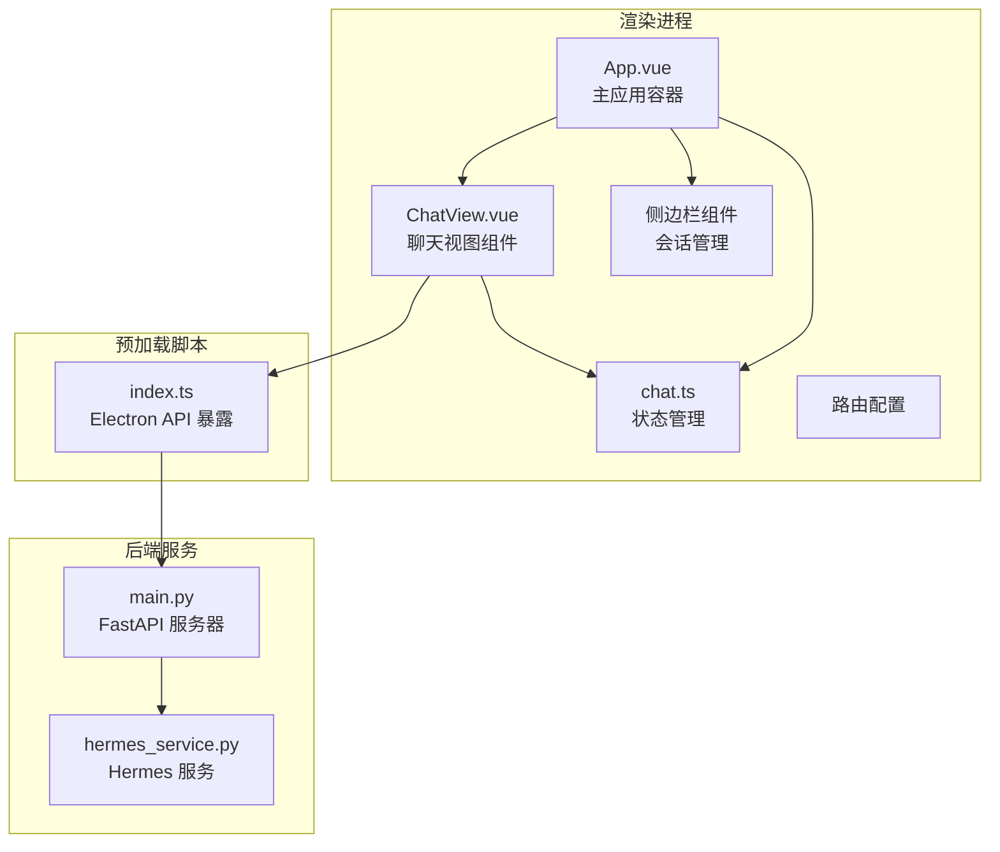
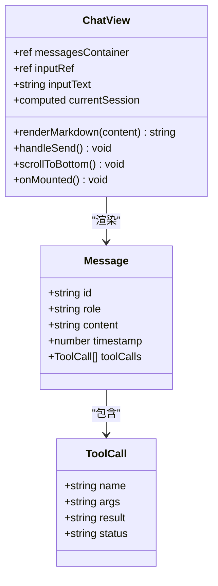
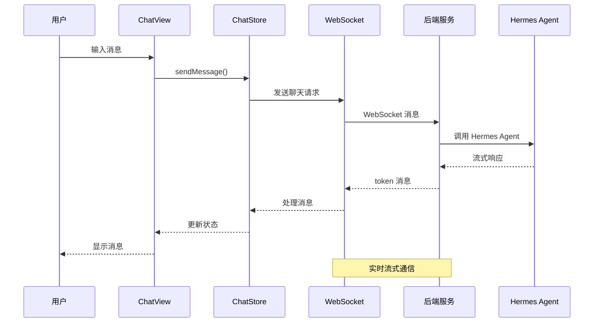
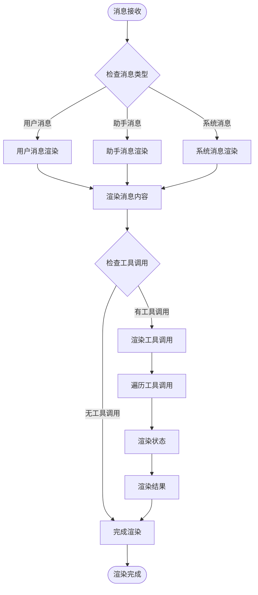
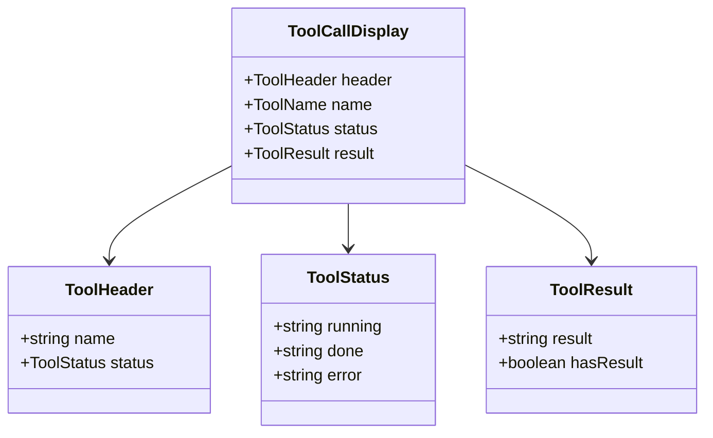
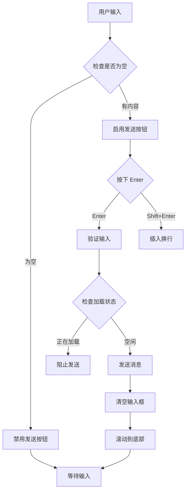
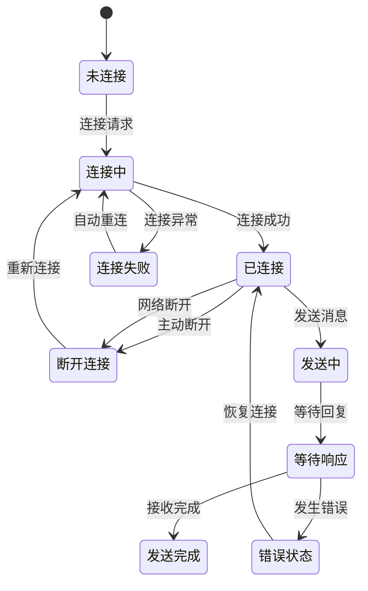

# 聊天功能模块

<cite>
**本文档引用的文件**
- [ChatView.vue](file://src/renderer/src/views/ChatView.vue)
- [chat.ts](file://src/renderer/src/stores/chat.ts)
- [App.vue](file://src/renderer/src/App.vue)
- [main.ts](file://src/renderer/src/main.ts)
- [index.ts](file://src/preload/index.ts)
- [index.ts](file://src/renderer/src/router/index.ts)
- [main.py](file://backend/main.py)
- [hermes_service.py](file://backend/services/hermes_service.py)
- [package.json](file://package.json)
</cite>

## 目录
1. [简介](#简介)
2. [项目结构](#项目结构)
3. [核心组件](#核心组件)
4. [架构概览](#架构概览)
5. [详细组件分析](#详细组件分析)
6. [依赖关系分析](#依赖关系分析)
7. [性能考虑](#性能考虑)
8. [故障排除指南](#故障排除指南)
9. [结论](#结论)
10. [附录](#附录)

## 简介

聊天功能模块是 Hermes 桌面应用的核心组件，为用户提供与 Hermes Agent 进行智能对话的界面。该模块实现了完整的聊天体验，包括消息渲染、实时流式响应、工具调用显示和会话管理等功能。

系统采用前后端分离架构：前端使用 Vue 3 + TypeScript 构建用户界面，后端使用 Python FastAPI 提供 WebSocket 服务。通过 Electron 将两者集成到桌面应用程序中。

## 项目结构

聊天功能模块位于 Electron 应用的渲染进程部分，主要包含以下组件：



**图表来源**
- [App.vue:1-178](file://src/renderer/src/App.vue#L1-L178)
- [ChatView.vue:1-325](file://src/renderer/src/views/ChatView.vue#L1-L325)
- [chat.ts:1-263](file://src/renderer/src/stores/chat.ts#L1-L263)
- [index.ts:1-24](file://src/preload/index.ts#L1-L24)
- [main.py:1-71](file://backend/main.py#L1-L71)

**章节来源**
- [main.ts:1-11](file://src/renderer/src/main.ts#L1-L11)
- [package.json:1-35](file://package.json#L1-L35)

## 核心组件

### ChatView.vue 组件

ChatView 是聊天功能的主要界面组件，负责展示消息、处理用户输入和管理聊天状态。

**主要特性：**
- 实时消息渲染和滚动控制
- Markdown 格式支持（基础实现）
- 工具调用可视化显示
- 加载状态指示器
- 响应式布局适配

**组件架构：**


**图表来源**
- [ChatView.vue:68-127](file://src/renderer/src/views/ChatView.vue#L68-L127)
- [chat.ts:4-24](file://src/renderer/src/stores/chat.ts#L4-L24)

**章节来源**
- [ChatView.vue:1-325](file://src/renderer/src/views/ChatView.vue#L1-L325)

### 状态管理 store

聊天状态管理基于 Pinia，提供完整的会话生命周期管理：

**核心数据结构：**
- Sessions: 会话数组管理
- CurrentSessionId: 当前选中会话标识
- IsConnected: WebSocket 连接状态
- IsLoading: 加载状态标志

**功能特性：**
- 自动重连机制
- 心跳检测
- 实时消息流处理
- 错误处理和恢复

**章节来源**
- [chat.ts:26-262](file://src/renderer/src/stores/chat.ts#L26-L262)

## 架构概览

聊天功能采用事件驱动的实时通信架构：



**图表来源**
- [ChatView.vue:90-102](file://src/renderer/src/views/ChatView.vue#L90-L102)
- [chat.ts:152-207](file://src/renderer/src/stores/chat.ts#L152-L207)
- [main.py:31-66](file://backend/main.py#L31-L66)

**章节来源**
- [main.py:31-66](file://backend/main.py#L31-L66)
- [hermes_service.py:16-72](file://backend/services/hermes_service.py#L16-L72)

## 详细组件分析

### 消息渲染系统

消息渲染系统实现了多层次的消息展示：



**图表来源**
- [ChatView.vue:11-46](file://src/renderer/src/views/ChatView.vue#L11-L46)
- [ChatView.vue:24-33](file://src/renderer/src/views/ChatView.vue#L24-L33)

**章节来源**
- [ChatView.vue:19-46](file://src/renderer/src/views/ChatView.vue#L19-L46)

### Markdown 渲染实现

基础 Markdown 渲染功能提供了以下支持：

**支持的格式：**
- 行内代码：使用反引号包围
- 粗体文本：使用双星号包围
- 换行符转换：自动转换为 HTML 换行标签

**安全处理：**
- HTML 转义防止 XSS 攻击
- 内容清理确保显示安全

**章节来源**
- [ChatView.vue:79-88](file://src/renderer/src/views/ChatView.vue#L79-L88)

### 工具调用显示系统

工具调用系统提供了完整的工具执行可视化：



**图表来源**
- [ChatView.vue:24-33](file://src/renderer/src/views/ChatView.vue#L24-L33)
- [ChatView.vue:230-247](file://src/renderer/src/views/ChatView.vue#L230-L247)

**章节来源**
- [ChatView.vue:205-247](file://src/renderer/src/views/ChatView.vue#L205-L247)

### 聊天输入组件

输入组件实现了智能的文本处理和快捷键支持：

**功能特性：**
- Enter 发送，Shift+Enter 换行
- 自动高度调整
- 发送按钮禁用状态管理
- 输入验证和清理

**交互流程：**


**图表来源**
- [ChatView.vue:51-63](file://src/renderer/src/views/ChatView.vue#L51-L63)
- [ChatView.vue:90-102](file://src/renderer/src/views/ChatView.vue#L90-L102)

**章节来源**
- [ChatView.vue:50-64](file://src/renderer/src/views/ChatView.vue#L50-L64)

### 消息状态管理

状态管理系统提供了完整的聊天生命周期管理：



**图表来源**
- [chat.ts:110-150](file://src/renderer/src/stores/chat.ts#L110-L150)
- [chat.ts:209-232](file://src/renderer/src/stores/chat.ts#L209-L232)

**章节来源**
- [chat.ts:33-108](file://src/renderer/src/stores/chat.ts#L33-L108)

### 滚动行为控制

滚动控制系统确保用户获得良好的阅读体验：

**自动滚动机制：**
- 新消息到达时自动滚动到底部
- 防止用户手动滚动时被打断
- 平滑滚动动画效果

**章节来源**
- [ChatView.vue:104-116](file://src/renderer/src/views/ChatView.vue#L104-L116)

## 依赖关系分析

聊天功能模块的依赖关系清晰明确：

```mermaid
graph LR
subgraph "前端依赖"
Vue[Vue 3.5.13]
Pinia[Pinia 2.2.6]
Router[Vue Router 4.4.5]
Typescript[TypeScript 5.7.2]
end
subgraph "桌面应用"
Electron[Electron 33.2.1]
ElectronToolkit[@electron-toolkit]
end
subgraph "后端服务"
FastAPI[FastAPI]
Uvicorn[Uvicorn]
end
ChatView --> Vue
ChatView --> Pinia
ChatView --> Router
App --> Electron
App --> ElectronToolkit
Backend --> FastAPI
Backend --> Uvicorn
```

**图表来源**
- [package.json:17-33](file://package.json#L17-L33)
- [main.py:8-21](file://backend/main.py#L8-L21)

**章节来源**
- [package.json:17-33](file://package.json#L17-L33)

## 性能考虑

### 实时通信优化

**WebSocket 连接管理：**
- 自动重连机制，最大延迟 30 秒
- 心跳检测确保连接有效性
- 错误恢复和状态同步

**消息流处理：**
- 流式响应避免大消息阻塞
- 分块传输提高响应速度
- 内存使用优化

### 渲染性能

**虚拟滚动：**
- 大消息列表的高效渲染
- 懒加载减少初始负载
- DOM 元素复用优化

**CSS 优化：**
- 硬件加速的滚动效果
- 最小化的重绘和回流
- 响应式布局适配

## 故障排除指南

### 常见问题诊断

**连接问题：**
- 检查后端服务是否启动
- 验证 WebSocket URL 配置
- 查看网络连接状态

**消息显示问题：**
- 确认 Markdown 格式正确
- 检查 HTML 转义是否正常
- 验证工具调用数据结构

**性能问题：**
- 监控内存使用情况
- 检查消息数量限制
- 优化滚动性能

### 错误处理机制

**客户端错误：**
- 网络异常自动重连
- 消息发送失败提示
- 状态同步错误恢复

**服务端错误：**
- Hermes Agent 可用性检查
- 子进程通信异常处理
- 流式传输中断恢复

**章节来源**
- [chat.ts:134-147](file://src/renderer/src/stores/chat.ts#L134-L147)
- [hermes_service.py:66-72](file://backend/services/hermes_service.py#L66-L72)

## 结论

聊天功能模块展现了现代桌面应用的优秀设计实践。通过合理的架构分层、完善的错误处理和优化的用户体验，为用户提供了流畅的聊天体验。

**主要优势：**
- 清晰的组件分离和职责划分
- 强大的实时通信能力
- 完善的状态管理和恢复机制
- 良好的可扩展性和维护性

**未来改进方向：**
- 增强 Markdown 渲染功能
- 添加消息编辑和删除功能
- 实现离线消息存储
- 扩展工具调用系统

## 附录

### 扩展点和自定义选项

**主题定制：**
- CSS 变量系统支持
- 动态主题切换
- 自定义颜色方案

**功能扩展：**
- 插件系统支持
- 自定义工具调用
- 消息格式化扩展

**集成选项：**
- 多后端服务支持
- 自定义认证机制
- 第三方 API 集成

### 开发指南

**环境设置：**
1. 安装 Node.js 和 pnpm
2. 安装 Python 和依赖包
3. 配置 Hermes Agent 环境

**开发流程：**
1. 启动后端服务：`python backend/main.py`
2. 启动前端开发：`pnpm dev`
3. 访问应用：`http://localhost:5173`

**构建部署：**
- 生产构建：`pnpm build`
- 应用打包：`electron-vite build`
- 版本发布：`pnpm publish`