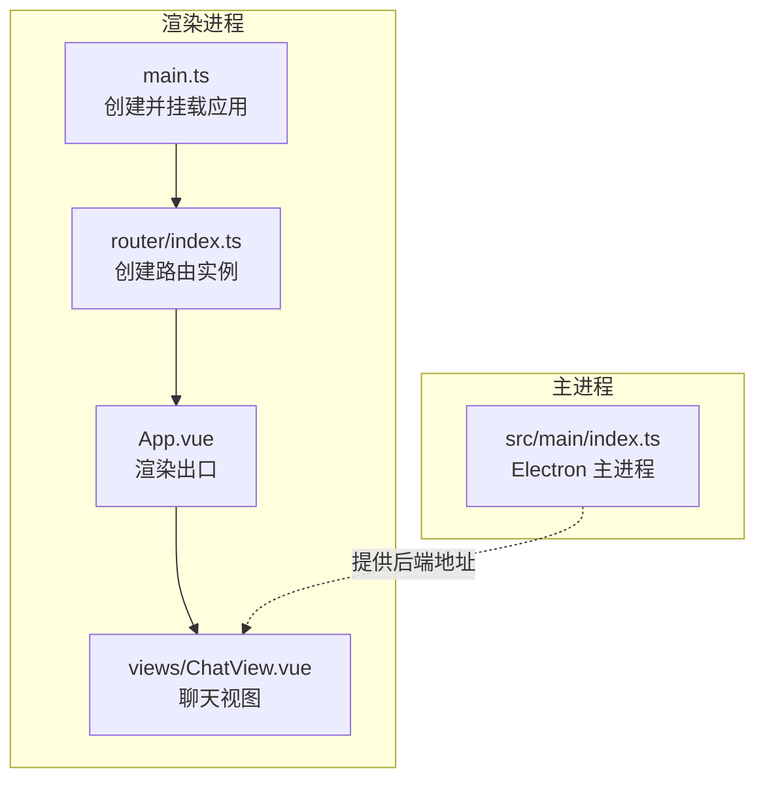
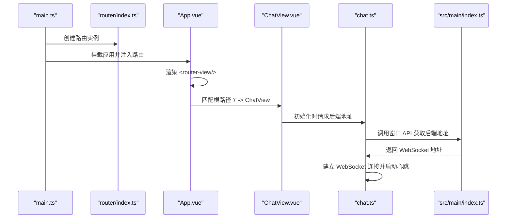
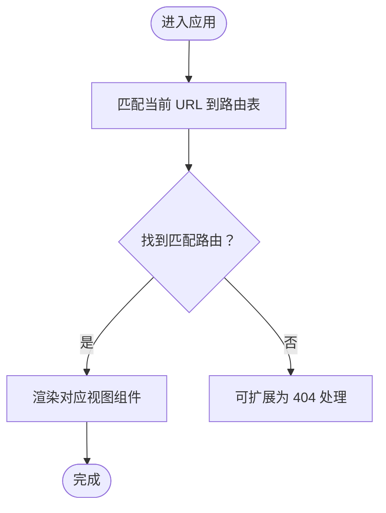
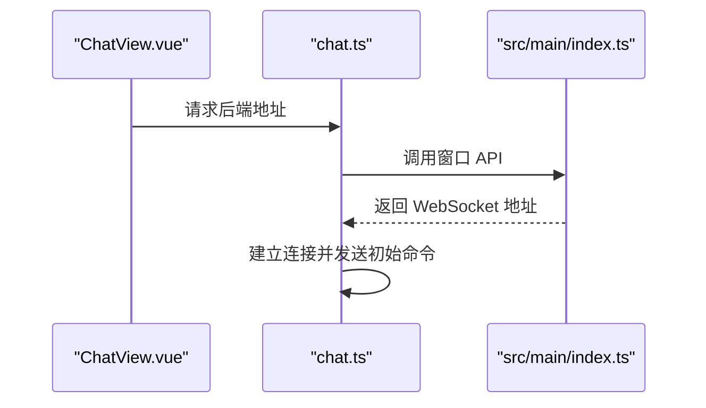
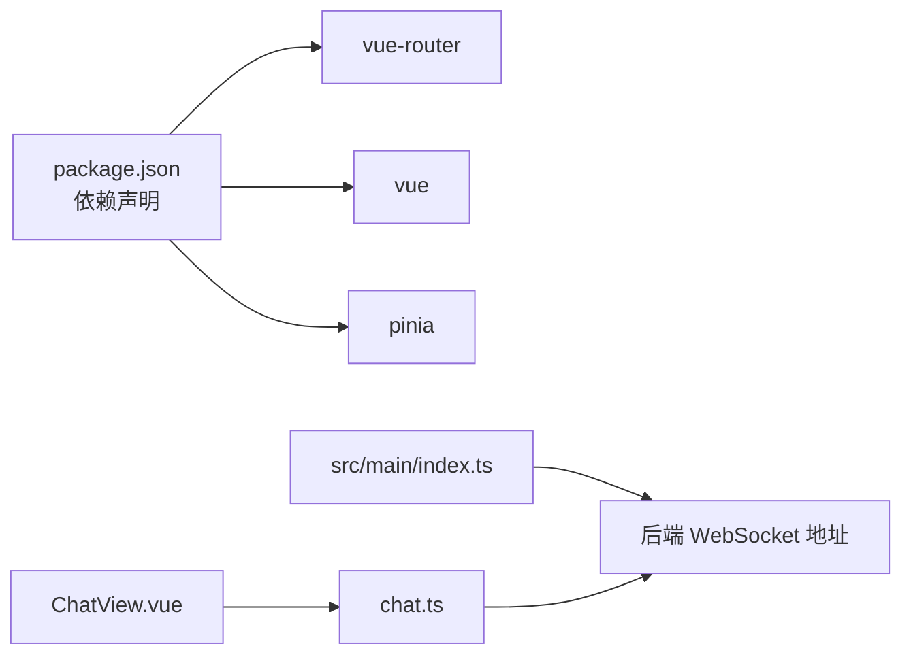

# 路由系统

<cite>
**本文引用的文件**
- [router/index.ts](file://src/renderer/src/router/index.ts)
- [main.ts](file://src/renderer/src/main.ts)
- [App.vue](file://src/renderer/src/App.vue)
- [ChatView.vue](file://src/renderer/src/views/ChatView.vue)
- [chat.ts](file://src/renderer/src/stores/chat.ts)
- [index.ts](file://src/main/index.ts)
- [package.json](file://package.json)
</cite>

## 目录
1. [简介](#简介)
2. [项目结构](#项目结构)
3. [核心组件](#核心组件)
4. [架构总览](#架构总览)
5. [详细组件分析](#详细组件分析)
6. [依赖分析](#依赖分析)
7. [性能考虑](#性能考虑)
8. [故障排查指南](#故障排查指南)
9. [结论](#结论)
10. [附录](#附录)

## 简介
本文件面向 Vue Router 路由系统，结合仓库中的实际实现，系统性梳理路由配置、导航与视图渲染、状态管理与后端通信、以及可扩展点（如自定义指令）。当前项目采用 Hash 模式路由，仅包含一个聊天视图路由，整体结构简洁，便于理解与扩展。

## 项目结构
- 路由入口与注册：在渲染进程的入口中完成路由实例的创建与挂载。
- 路由定义：集中于路由模块，当前仅定义根路径到聊天视图的映射。
- 视图层：通过路由出口渲染对应视图组件。
- 状态与后端：聊天状态通过 Pinia Store 管理，WebSocket 连接由主进程提供地址并通过窗口 API 注入。

图表来源
- [main.ts:1-11](file://src/renderer/src/main.ts#L1-L11)
- [router/index.ts:1-16](file://src/renderer/src/router/index.ts#L1-L16)
- [App.vue:32](file://src/renderer/src/App.vue#L32)
- [ChatView.vue:1-325](file://src/renderer/src/views/ChatView.vue#L1-L325)
- [index.ts:1-62](file://src/main/index.ts#L1-L62)

章节来源
- [main.ts:1-11](file://src/renderer/src/main.ts#L1-L11)
- [router/index.ts:1-16](file://src/renderer/src/router/index.ts#L1-L16)
- [App.vue:1-178](file://src/renderer/src/App.vue#L1-L178)
- [ChatView.vue:1-325](file://src/renderer/src/views/ChatView.vue#L1-L325)
- [index.ts:1-62](file://src/main/index.ts#L1-L62)

## 核心组件
- 路由实例创建与配置
  - 使用 Hash 历史模式，路由表仅包含根路径到聊天视图的映射。
  - 导出路由实例供应用挂载使用。
- 应用挂载与路由注入
  - 在应用入口中安装路由插件，并挂载根组件。
- 视图渲染
  - 根组件中通过路由出口渲染当前匹配的视图组件。
- 聊天视图
  - 承载消息列表、输入区与工具调用展示，负责初始化后端连接。
- 状态与后端
  - 聊天 Store 管理会话、消息、连接状态与重连逻辑；主进程提供后端 WebSocket 地址。

章节来源
- [router/index.ts:1-16](file://src/renderer/src/router/index.ts#L1-L16)
- [main.ts:1-11](file://src/renderer/src/main.ts#L1-L11)
- [App.vue:32](file://src/renderer/src/App.vue#L32)
- [ChatView.vue:118-126](file://src/renderer/src/views/ChatView.vue#L118-L126)
- [chat.ts:121-162](file://src/renderer/src/stores/chat.ts#L121-L162)
- [index.ts:45-48](file://src/main/index.ts#L45-L48)

## 架构总览
下图展示了从应用启动到视图渲染、再到后端连接的关键流程。

图表来源
- [main.ts:1-11](file://src/renderer/src/main.ts#L1-L11)
- [router/index.ts:1-16](file://src/renderer/src/router/index.ts#L1-L16)
- [App.vue:32](file://src/renderer/src/App.vue#L32)
- [ChatView.vue:118-126](file://src/renderer/src/views/ChatView.vue#L118-L126)
- [chat.ts:121-162](file://src/renderer/src/stores/chat.ts#L121-L162)
- [index.ts:45-48](file://src/main/index.ts#L45-L48)

## 详细组件分析

### 路由配置与导航
- 配置要点
  - 历史模式：Hash 模式，利于桌面应用部署。
  - 单路由：根路径映射到聊天视图组件。
- 导航行为
  - 当前无导航守卫与动态路由生成，所有导航均为静态路径匹配。
  - 可通过编程式导航扩展至多视图场景（例如新增“设置”、“历史”等）。

图表来源
- [router/index.ts:4-13](file://src/renderer/src/router/index.ts#L4-L13)

章节来源
- [router/index.ts:1-16](file://src/renderer/src/router/index.ts#L1-L16)

### 视图渲染与路由出口
- 根组件通过路由出口承载当前视图，聊天视图为默认渲染内容。
- 若后续增加多视图，可在根组件内使用条件渲染或嵌套路由组织页面结构。

章节来源
- [App.vue:32](file://src/renderer/src/App.vue#L32)
- [ChatView.vue:1-325](file://src/renderer/src/views/ChatView.vue#L1-L325)

### 状态管理与后端通信
- Store 负责：
  - 会话生命周期（创建、切换、删除）。
  - WebSocket 连接、心跳与断线重连。
  - 服务端消息分发与本地状态更新。
- 后端地址来源：
  - 主进程通过窗口 API 暴露后端地址，渲染进程在视图挂载时读取并建立连接。

图表来源
- [ChatView.vue:118-126](file://src/renderer/src/views/ChatView.vue#L118-L126)
- [chat.ts:121-162](file://src/renderer/src/stores/chat.ts#L121-L162)
- [index.ts:45-48](file://src/main/index.ts#L45-L48)

章节来源
- [chat.ts:1-314](file://src/renderer/src/stores/chat.ts#L1-L314)
- [index.ts:45-48](file://src/main/index.ts#L45-L48)

### 权限控制与路由元信息
- 当前未使用路由元信息与导航守卫，权限控制可通过以下方式扩展：
  - 在路由表中为每个路由添加元信息字段（如需要登录、角色要求等）。
  - 在全局前置守卫中校验用户状态与路由元信息，决定是否放行或跳转至登录页。
  - 对于动态路由，结合用户权限动态拼装路由表并注册。

说明：以上为扩展建议，非现有实现。

### 动态路由与懒加载
- 当前路由为静态配置，未启用动态路由与懒加载。
- 推荐实践：
  - 将大型视图拆分为异步组件，利用路由级懒加载减少首屏体积。
  - 结合代码分割策略，按需加载模块，提升首屏性能。

说明：以上为扩展建议，非现有实现。

### 参数传递、查询字符串与监听
- 参数与查询：
  - 可通过路由参数与查询字符串向视图传递数据。
  - 在视图中使用响应式引用与计算属性读取路由参数，避免直接操作 DOM。
- 路由监听：
  - 可在视图中监听路由变化，执行副作用（如保存状态、刷新数据）。
  - 对于复杂场景，可在 Store 中统一处理路由变更带来的状态同步。

说明：以上为扩展建议，非现有实现。

### 嵌套路由与过渡动画
- 嵌套路由：
  - 可在根组件中为不同区域定义多个路由出口，实现多区域渲染。
  - 子路由通过命名出口进行渲染，适合侧边栏与主内容分离的布局。
- 过渡动画：
  - 可在路由出口外层包裹过渡组件，配合 CSS 或第三方动画库实现页面切换动效。
  - 动画时机与参数可结合路由元信息与视图生命周期进行精细化控制。

说明：以上为扩展建议，非现有实现。

### 错误处理
- 路由层：
  - 可新增全局后置守卫用于错误埋点与兜底处理。
- 视图层：
  - 在视图中捕获网络异常与连接失败，提示用户并引导重试。
- 状态层：
  - Store 中对 WebSocket 错误进行日志记录与状态标记，便于上层感知。

章节来源
- [chat.ts:147-159](file://src/renderer/src/stores/chat.ts#L147-L159)
- [chat.ts:245-253](file://src/renderer/src/stores/chat.ts#L245-L253)

### 扩展方法与自定义指令
- 扩展方法：
  - 在路由模块中集中注册全局导航守卫、滚动行为与导航后置钩子。
  - 将通用逻辑下沉至插件或工具函数，保持路由配置清晰。
- 自定义指令：
  - 可在视图中使用自定义指令简化交互（如快捷键、焦点控制）。
  - 指令与路由联动时，注意在指令销毁阶段清理副作用。

说明：以上为扩展建议，非现有实现。

## 依赖分析
- 路由依赖
  - Vue Router 版本：参见依赖声明。
- 应用依赖
  - Vue 与 Pinia 为视图与状态管理提供基础能力。
- 主进程集成
  - Electron 主进程通过窗口 API 暴露后端地址，渲染进程在运行时获取。

图表来源
- [package.json:17-23](file://package.json#L17-L23)
- [index.ts:45-48](file://src/main/index.ts#L45-L48)
- [ChatView.vue:118-126](file://src/renderer/src/views/ChatView.vue#L118-L126)
- [chat.ts:121-162](file://src/renderer/src/stores/chat.ts#L121-L162)

章节来源
- [package.json:1-35](file://package.json#L1-L35)
- [index.ts:1-62](file://src/main/index.ts#L1-L62)

## 性能考虑
- 代码分割与懒加载
  - 将大型视图拆分为异步组件，减少首屏脚本体积。
- 路由缓存
  - 对频繁切换但不需重新加载的视图，可结合 keep-alive 缓存组件实例。
- 状态与网络
  - Store 中的连接与心跳策略应避免过度轮询，合理设置间隔与退避重连时间。
- 渲染优化
  - 在视图中使用虚拟滚动、防抖与节流，降低高频交互对主线程的压力。

说明：以上为通用优化建议，非现有实现。

## 故障排查指南
- 路由无法匹配
  - 检查路由表路径与当前 URL 是否一致；确认 Hash 模式下的锚点规则。
- 视图未渲染
  - 确认根组件中存在路由出口；检查路由表是否正确导出实例并在入口中安装。
- 后端连接失败
  - 核对主进程窗口 API 的返回值；在 Store 中打印连接状态与错误日志。
- 断线重连异常
  - 检查心跳定时器与重连计时器是否被正确清理；避免重复定时器导致内存泄漏。

章节来源
- [router/index.ts:1-16](file://src/renderer/src/router/index.ts#L1-L16)
- [App.vue:32](file://src/renderer/src/App.vue#L32)
- [chat.ts:108-118](file://src/renderer/src/stores/chat.ts#L108-L118)
- [chat.ts:140-145](file://src/renderer/src/stores/chat.ts#L140-L145)

## 结论
当前路由系统以最小可用为目标，采用 Hash 模式与单一路由映射，配合 Pinia 与主进程 IPC 实现了聊天视图的完整功能闭环。若未来扩展为多视图或多页面应用，建议引入导航守卫、动态路由与懒加载策略，并在路由层统一处理权限与标题管理，同时在视图层完善过渡动画与错误处理，以获得更佳的用户体验与可维护性。

## 附录
- 快速定位
  - 路由配置：[router/index.ts:1-16](file://src/renderer/src/router/index.ts#L1-L16)
  - 应用挂载：[main.ts:1-11](file://src/renderer/src/main.ts#L1-L11)
  - 根组件出口：[App.vue:32](file://src/renderer/src/App.vue#L32)
  - 聊天视图：[ChatView.vue:1-325](file://src/renderer/src/views/ChatView.vue#L1-L325)
  - Store 与后端：[chat.ts:121-162](file://src/renderer/src/stores/chat.ts#L121-L162)，[index.ts:45-48](file://src/main/index.ts#L45-L48)