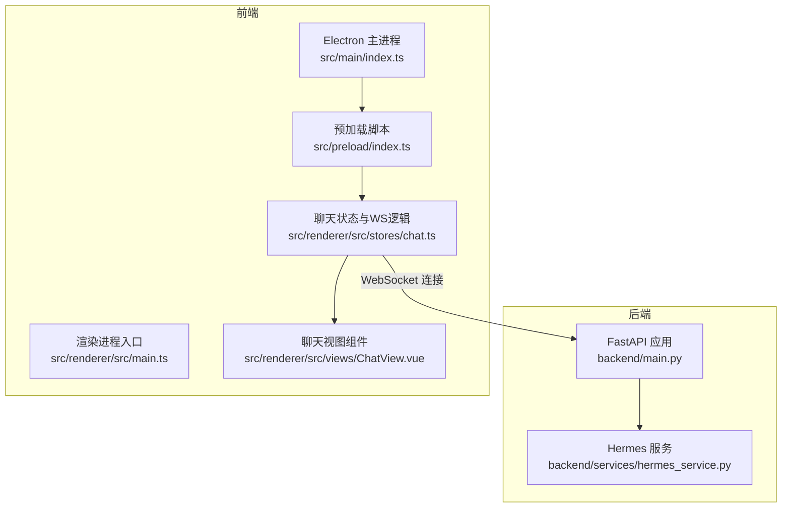
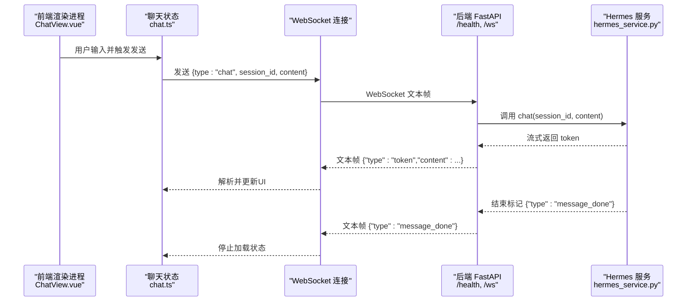
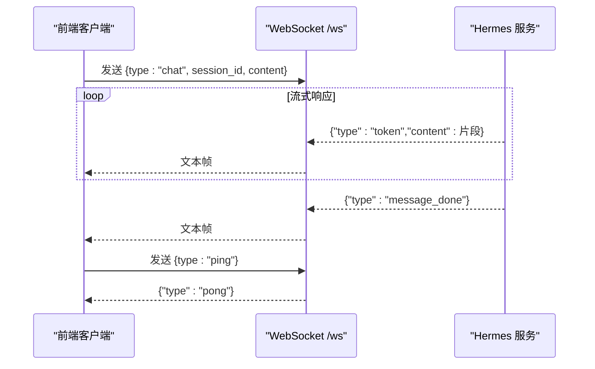
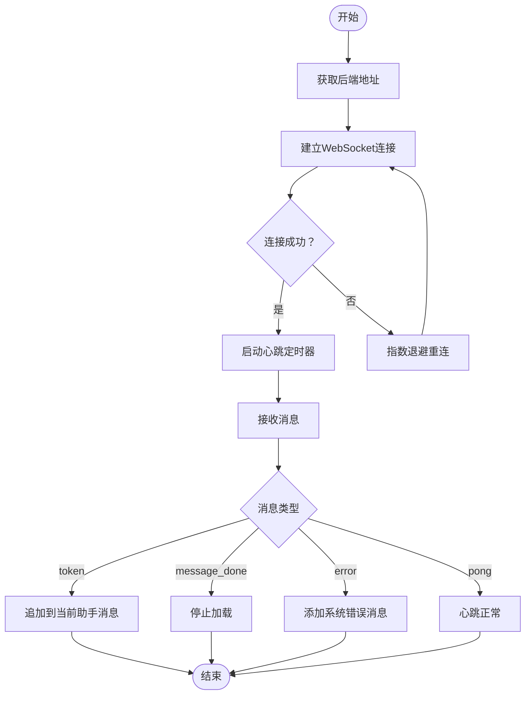
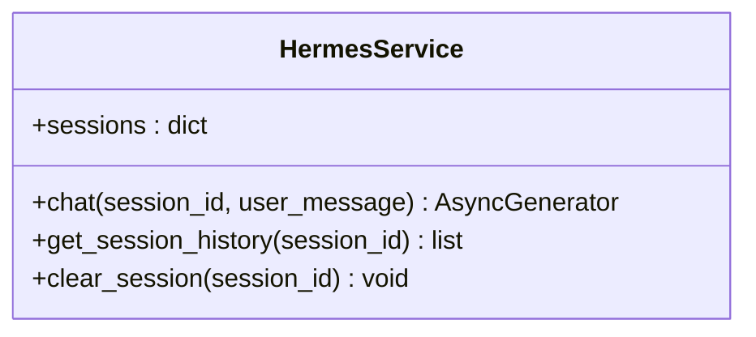
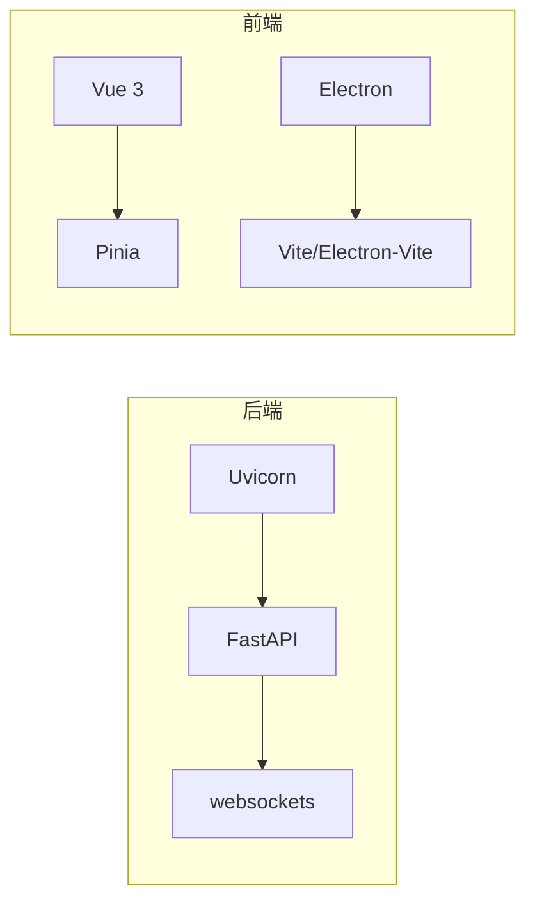

# API端点规范

<cite>
**本文档引用的文件**
- [backend/main.py](file://backend/main.py)
- [backend/services/hermes_service.py](file://backend/services/hermes_service.py)
- [backend/requirements.txt](file://backend/requirements.txt)
- [src/main/index.ts](file://src/main/index.ts)
- [src/preload/index.ts](file://src/preload/index.ts)
- [src/renderer/src/stores/chat.ts](file://src/renderer/src/stores/chat.ts)
- [src/renderer/src/views/ChatView.vue](file://src/renderer/src/views/ChatView.vue)
- [src/renderer/src/main.ts](file://src/renderer/src/main.ts)
- [electron.vite.config.ts](file://electron.vite.config.ts)
- [package.json](file://package.json)
</cite>

## 目录
1. [简介](#简介)
2. [项目结构](#项目结构)
3. [核心组件](#核心组件)
4. [架构总览](#架构总览)
5. [详细组件分析](#详细组件分析)
6. [依赖关系分析](#依赖关系分析)
7. [性能考虑](#性能考虑)
8. [故障排除指南](#故障排除指南)
9. [结论](#结论)
10. [附录](#附录)

## 简介
本文件为 Hermes Desktop 后端 API 的权威规范，覆盖：
- HTTP 健康检查端点 GET /health 的请求/响应格式
- WebSocket 端点 /ws 的连接协议、消息格式与事件类型
- API 版本管理、错误响应格式与状态码定义
- CORS 配置、安全头设置与跨域处理
- API 使用示例、SDK 集成指南与客户端实现建议
- API 限流策略、监控指标与性能基准
- API 测试方法、调试工具与故障排除指南

## 项目结构
后端采用 FastAPI 提供 HTTP 接口与 WebSocket 服务；前端 Electron 应用通过预加载脚本与渲染进程通信，并在渲染层通过 Pinia 状态管理与 WebSocket 连接交互。

图表来源
- [backend/main.py:1-71](file://backend/main.py#L1-L71)
- [backend/services/hermes_service.py:1-82](file://backend/services/hermes_service.py#L1-L82)
- [src/main/index.ts:1-62](file://src/main/index.ts#L1-L62)
- [src/preload/index.ts:1-24](file://src/preload/index.ts#L1-L24)
- [src/renderer/src/stores/chat.ts:1-263](file://src/renderer/src/stores/chat.ts#L1-L263)
- [src/renderer/src/views/ChatView.vue:1-325](file://src/renderer/src/views/ChatView.vue#L1-L325)

章节来源
- [backend/main.py:1-71](file://backend/main.py#L1-L71)
- [backend/services/hermes_service.py:1-82](file://backend/services/hermes_service.py#L1-L82)
- [src/main/index.ts:1-62](file://src/main/index.ts#L1-L62)
- [src/preload/index.ts:1-24](file://src/preload/index.ts#L1-L24)
- [src/renderer/src/stores/chat.ts:1-263](file://src/renderer/src/stores/chat.ts#L1-L263)
- [src/renderer/src/views/ChatView.vue:1-325](file://src/renderer/src/views/ChatView.vue#L1-L325)

## 核心组件
- HTTP 健康检查端点：提供服务可用性检测
- WebSocket 端点：提供实时对话流式响应
- Hermes 服务：封装与 Hermes Agent 的交互（当前通过子进程调用 CLI）
- 前端 WebSocket 客户端：心跳、重连、消息解析与 UI 更新

章节来源
- [backend/main.py:26-28](file://backend/main.py#L26-L28)
- [backend/main.py:31-66](file://backend/main.py#L31-L66)
- [backend/services/hermes_service.py:16-73](file://backend/services/hermes_service.py#L16-L73)
- [src/renderer/src/stores/chat.ts:83-150](file://src/renderer/src/stores/chat.ts#L83-L150)

## 架构总览
后端通过 FastAPI 提供 /health 与 /ws 两个端点；前端 Electron 渲染进程通过预加载脚本获取后端地址，建立 WebSocket 连接，发送用户消息并接收流式响应，同时维护心跳与自动重连。

图表来源
- [backend/main.py:31-66](file://backend/main.py#L31-L66)
- [backend/services/hermes_service.py:16-73](file://backend/services/hermes_service.py#L16-L73)
- [src/renderer/src/stores/chat.ts:152-207](file://src/renderer/src/stores/chat.ts#L152-L207)

## 详细组件分析

### HTTP 健康检查端点
- 方法与路径：GET /health
- 请求参数：无
- 成功响应：JSON 对象，包含服务状态与标识字段
- 状态码：200 OK
- 示例响应体字段
  - status：字符串，表示服务状态
  - service：字符串，服务标识

章节来源
- [backend/main.py:26-28](file://backend/main.py#L26-L28)

### WebSocket 端点 /ws
- 协议：WebSocket
- 地址：ws://localhost:8765/ws（由前端通过 IPC 获取）
- 认证：无（未实现鉴权中间件）
- 心跳：客户端每 15 秒发送 ping，服务端返回 pong
- 事件类型与消息格式
  - 客户端发送
    - chat：触发对话
      - 字段：type（固定值 "chat"）、session_id（可选，字符串）、content（必填，字符串）
    - ping：心跳探测
      - 字段：type（固定值 "ping"）
  - 服务端发送
    - token：流式输出片段
      - 字段：type（固定值 "token"）、content（字符串）
    - message_done：对话完成信号
      - 字段：type（固定值 "message_done"）
    - error：错误通知
      - 字段：type（固定值 "error"）、message（字符串）
    - pong：心跳响应
      - 字段：type（固定值 "pong"）

图表来源
- [backend/main.py:31-66](file://backend/main.py#L31-L66)
- [backend/services/hermes_service.py:16-73](file://backend/services/hermes_service.py#L16-L73)
- [src/renderer/src/stores/chat.ts:139-147](file://src/renderer/src/stores/chat.ts#L139-L147)

章节来源
- [backend/main.py:31-66](file://backend/main.py#L31-L66)
- [src/renderer/src/stores/chat.ts:83-150](file://src/renderer/src/stores/chat.ts#L83-L150)

### 前端 WebSocket 客户端实现要点
- 连接建立：通过预加载脚本 IPC 获取后端地址，构造 WebSocket 并监听生命周期事件
- 心跳机制：每 15 秒发送 ping，收到 pong 后维持连接
- 自动重连：指数退避最大延迟不超过 30 秒，断线后自动重试
- 消息处理：根据服务端消息类型更新会话消息、工具调用状态与加载状态
- 输入发送：构建用户消息并发送 chat 类型消息，等待流式响应

图表来源
- [src/renderer/src/stores/chat.ts:99-150](file://src/renderer/src/stores/chat.ts#L99-L150)
- [src/renderer/src/stores/chat.ts:152-207](file://src/renderer/src/stores/chat.ts#L152-L207)

章节来源
- [src/main/index.ts:46-48](file://src/main/index.ts#L46-L48)
- [src/preload/index.ts:5-7](file://src/preload/index.ts#L5-L7)
- [src/renderer/src/stores/chat.ts:83-207](file://src/renderer/src/stores/chat.ts#L83-L207)

### 后端服务与消息流
- 会话管理：基于内存字典维护会话历史，支持查询与清理
- 流式输出：通过子进程调用 hermes CLI，逐行读取标准输出并以 token 类型推送
- 错误处理：捕获 CLI 不存在、执行失败与异常，统一以 error 类型消息返回
- 完成信号：在子进程结束后发送 message_done

图表来源
- [backend/services/hermes_service.py:10-82](file://backend/services/hermes_service.py#L10-L82)

章节来源
- [backend/services/hermes_service.py:16-73](file://backend/services/hermes_service.py#L16-L73)

## 依赖关系分析
- 后端依赖
  - FastAPI：提供 HTTP 与 WebSocket 能力
  - Uvicorn：ASGI 服务器运行时
  - websockets：WebSocket 支持
- 前端依赖
  - Vue 3 + Pinia：状态管理与组件化
  - Electron：桌面应用框架
  - Electron Vite：开发与打包工具链

图表来源
- [backend/requirements.txt:1-4](file://backend/requirements.txt#L1-L4)
- [package.json:17-33](file://package.json#L17-L33)
- [electron.vite.config.ts:1-21](file://electron.vite.config.ts#L1-L21)

章节来源
- [backend/requirements.txt:1-4](file://backend/requirements.txt#L1-L4)
- [package.json:17-33](file://package.json#L17-L33)
- [electron.vite.config.ts:1-21](file://electron.vite.config.ts#L1-L21)

## 性能考虑
- 流式传输：服务端按行推送 token，前端即时渲染，降低首屏延迟
- 心跳与重连：15 秒心跳与指数退避重连，提升网络波动下的稳定性
- 子进程开销：CLI 方式调用存在进程启动与 IO 开销，建议后续替换为直接 SDK 调用以减少延迟
- 内存会话：会话历史存储于内存，重启后丢失；建议持久化或本地数据库方案
- 前端渲染：大量 token 追加可能导致 DOM 抖动，建议批量更新或虚拟滚动优化

[本节为通用性能讨论，不直接分析具体文件]

## 故障排除指南
- 无法连接后端
  - 检查后端是否在 0.0.0.0:8765 上运行
  - 确认前端通过 IPC 正确获取到 ws://localhost:8765/ws
- WebSocket 断开
  - 查看控制台日志中“Disconnected”与重连尝试
  - 检查网络波动与防火墙
- 服务端错误
  - 服务端捕获异常并发送 error 类型消息，前端会显示系统消息
  - 若 CLI 未安装或不在 PATH 中，会返回相应错误提示
- 健康检查失败
  - 确认后端已启动且 /health 可访问

章节来源
- [src/main/index.ts:46-48](file://src/main/index.ts#L46-L48)
- [src/renderer/src/stores/chat.ts:127-137](file://src/renderer/src/stores/chat.ts#L127-L137)
- [backend/main.py:56-65](file://backend/main.py#L56-L65)
- [backend/services/hermes_service.py:66-72](file://backend/services/hermes_service.py#L66-L72)

## 结论
本文档提供了 Hermes Desktop 后端 API 的完整规范，涵盖 HTTP 与 WebSocket 接口、消息格式、错误处理与前端集成方式。建议后续优化方向包括：引入 API 版本管理、实现鉴权与速率限制、替换 CLI 为 SDK、增强会话持久化与监控指标。

[本节为总结性内容，不直接分析具体文件]

## 附录

### API 规范摘要
- HTTP
  - GET /health：返回服务状态与标识
- WebSocket
  - /ws：实时对话流式接口
  - 客户端发送：chat（含 session_id 与 content），ping
  - 服务端发送：token（流式片段）、message_done（完成）、error（错误）、pong（心跳）

章节来源
- [backend/main.py:26-28](file://backend/main.py#L26-L28)
- [backend/main.py:31-66](file://backend/main.py#L31-L66)
- [src/renderer/src/stores/chat.ts:152-207](file://src/renderer/src/stores/chat.ts#L152-L207)

### CORS 与安全头
- CORS：允许任意源、方法与头部，启用凭据
- 安全头：未显式设置，建议在生产环境增加安全头与 CSP

章节来源
- [backend/main.py:15-21](file://backend/main.py#L15-L21)

### API 版本管理
- 当前未实现版本号路径或头字段
- 建议在路由前缀或请求头中引入版本号，如 /v1/ws 或 X-API-Version

[本小节为建议性内容，不直接分析具体文件]

### 错误响应格式与状态码
- HTTP：/health 返回 200；未定义其他 HTTP 错误码
- WebSocket：统一以 {type:"error", message:"..."} 形式返回错误信息

章节来源
- [backend/main.py:26-28](file://backend/main.py#L26-L28)
- [backend/main.py:56-65](file://backend/main.py#L56-L65)
- [backend/services/hermes_service.py:66-72](file://backend/services/hermes_service.py#L66-L72)

### 限流策略与监控
- 限流：未实现
- 监控：建议在后端增加请求计数、错误率、响应时间等指标
- 建议：对 /ws 增加连接数与消息速率限制，防止滥用

[本小节为建议性内容，不直接分析具体文件]

### API 使用示例与客户端实现建议
- 前端示例流程
  - 获取后端地址：window.api.getBackendUrl()
  - 建立连接：new WebSocket(url)
  - 发送消息：ws.send(JSON.stringify({type:"chat", session_id, content}))
  - 处理流式：监听 onmessage，按 type 分发
  - 心跳：每 15 秒发送 {type:"ping"}
- 客户端建议
  - 实现指数退避重连与最大重连次数
  - 批量更新 UI 以减少渲染压力
  - 在 UI 中展示工具调用与结果

章节来源
- [src/main/index.ts:46-48](file://src/main/index.ts#L46-L48)
- [src/preload/index.ts:5-7](file://src/preload/index.ts#L5-L7)
- [src/renderer/src/stores/chat.ts:99-207](file://src/renderer/src/stores/chat.ts#L99-L207)

### SDK 集成指南
- 当前实现通过子进程调用 hermes CLI
- 建议：替换为直接 SDK 调用，以减少进程开销与提高稳定性
- 注意：确保 SDK 初始化与资源释放逻辑正确

章节来源
- [backend/services/hermes_service.py:32-41](file://backend/services/hermes_service.py#L32-L41)

### 测试方法与调试工具
- 健康检查：curl http://localhost:8765/health
- WebSocket：使用浏览器开发者工具 Network 面板或第三方工具连接 /ws 并发送 chat/ping
- 日志：后端打印连接/断开与异常；前端打印重连与消息解析错误
- 调试：在 Electron 开发模式下打开 DevTools，检查 Console 与 Network

章节来源
- [backend/main.py:26-28](file://backend/main.py#L26-L28)
- [backend/main.py:31-66](file://backend/main.py#L31-L66)
- [src/renderer/src/stores/chat.ts:127-147](file://src/renderer/src/stores/chat.ts#L127-L147)