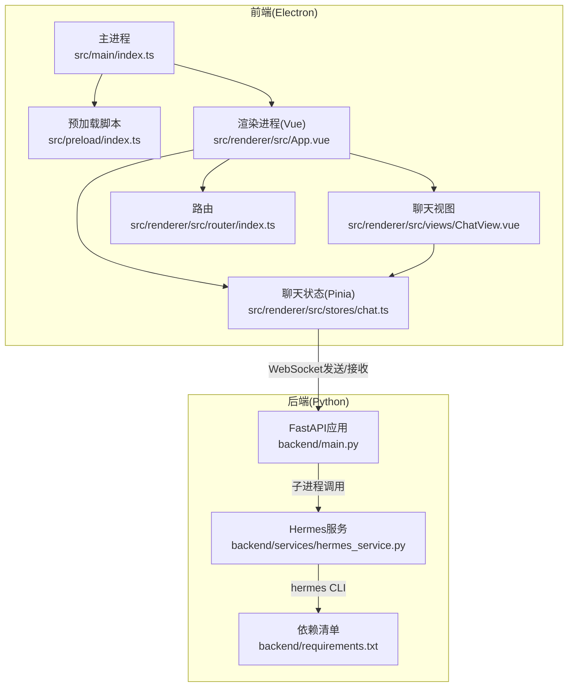
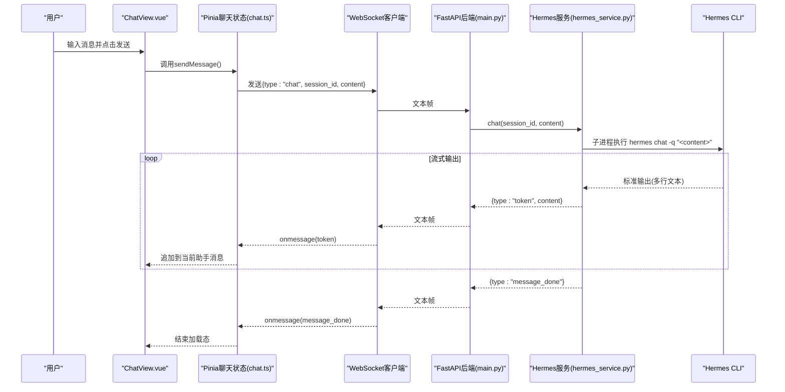
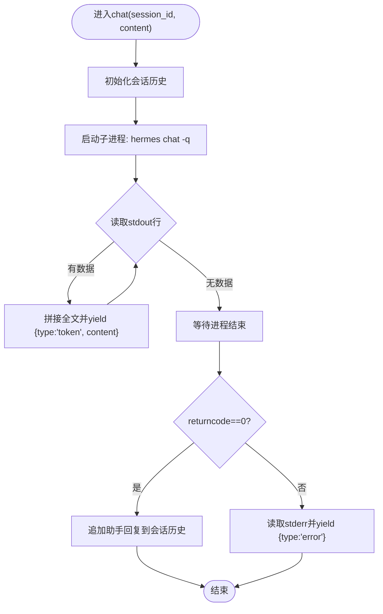
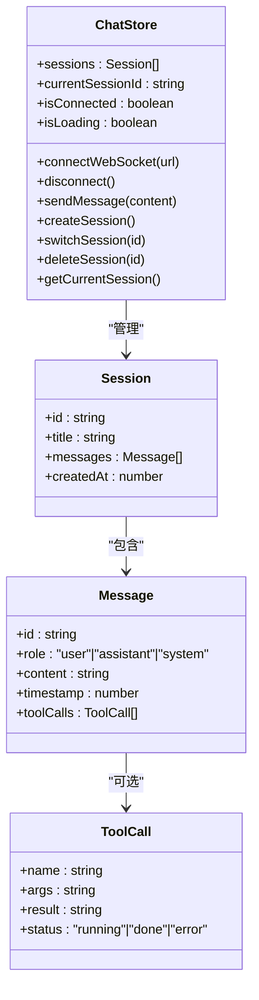
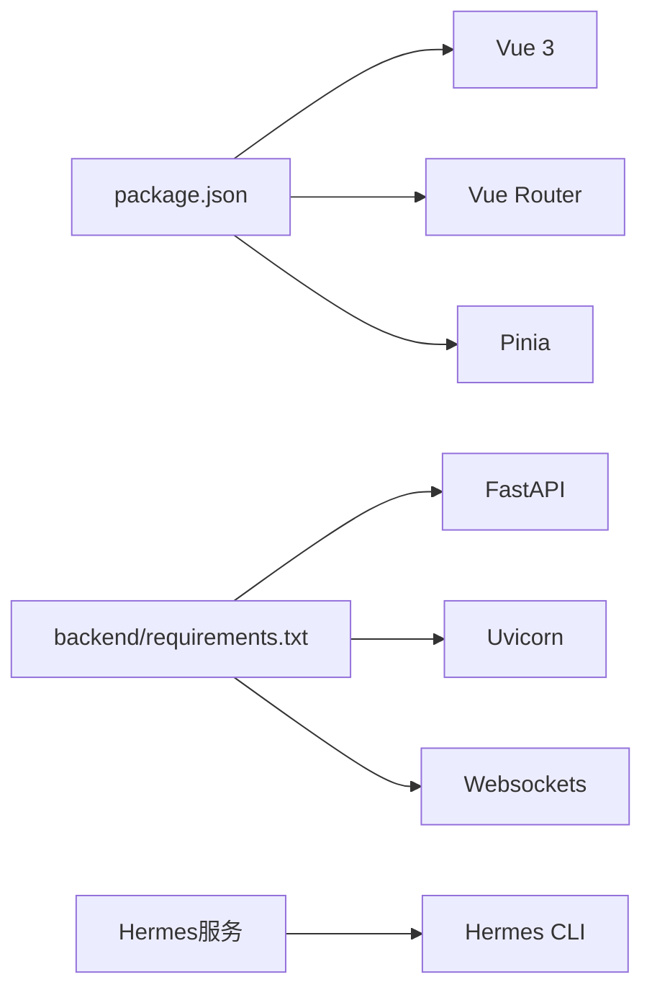
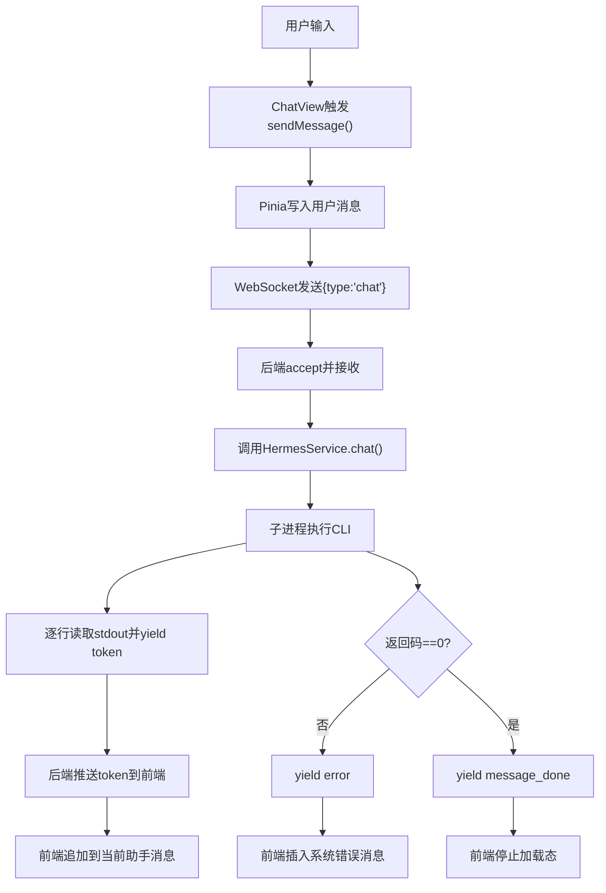

# Hermes Agent集成

<cite>
**本文引用的文件**
- [backend/main.py](file://backend/main.py)
- [backend/services/hermes_service.py](file://backend/services/hermes_service.py)
- [src/main/index.ts](file://src/main/index.ts)
- [src/preload/index.ts](file://src/preload/index.ts)
- [src/renderer/src/stores/chat.ts](file://src/renderer/src/stores/chat.ts)
- [src/renderer/src/views/ChatView.vue](file://src/renderer/src/views/ChatView.vue)
- [src/renderer/src/App.vue](file://src/renderer/src/App.vue)
- [src/renderer/src/router/index.ts](file://src/renderer/src/router/index.ts)
- [package.json](file://package.json)
- [backend/requirements.txt](file://backend/requirements.txt)
</cite>

## 目录
1. [简介](#简介)
2. [项目结构](#项目结构)
3. [核心组件](#核心组件)
4. [架构总览](#架构总览)
5. [详细组件分析](#详细组件分析)
6. [依赖分析](#依赖分析)
7. [性能考虑](#性能考虑)
8. [故障排查指南](#故障排查指南)
9. [结论](#结论)
10. [附录](#附录)

## 简介
本文件面向Hermes Agent集成模块，系统性阐述后端服务设计、前端Electron应用与Hermes Agent CLI之间的交互机制，以及异步流式响应与会话管理的实现。重点覆盖：
- 后端FastAPI WebSocket服务与Hermes Agent子进程通信
- 前端Vue/Pinia状态管理、WebSocket连接与心跳重连
- 工具调用（tool call）在消息中的呈现与结果聚合
- 参数传递、消息流式响应、错误处理与异常恢复
- 性能优化、缓存与资源管理建议
- 调试方法、日志记录与监控指标

## 项目结构
该桌面应用采用Electron + Vue 3 + Pinia的前后端分离架构，后端以Python FastAPI运行在WSL中并通过WebSocket与前端通信。

图表来源
- [src/main/index.ts:1-62](file://src/main/index.ts#L1-L62)
- [src/preload/index.ts:1-24](file://src/preload/index.ts#L1-L24)
- [src/renderer/src/App.vue:1-178](file://src/renderer/src/App.vue#L1-L178)
- [src/renderer/src/views/ChatView.vue:1-325](file://src/renderer/src/views/ChatView.vue#L1-L325)
- [src/renderer/src/stores/chat.ts:1-263](file://src/renderer/src/stores/chat.ts#L1-L263)
- [src/renderer/src/router/index.ts:1-16](file://src/renderer/src/router/index.ts#L1-L16)
- [backend/main.py:1-71](file://backend/main.py#L1-L71)
- [backend/services/hermes_service.py:1-82](file://backend/services/hermes_service.py#L1-L82)
- [backend/requirements.txt:1-4](file://backend/requirements.txt#L1-L4)

章节来源
- [package.json:1-35](file://package.json#L1-L35)
- [backend/requirements.txt:1-4](file://backend/requirements.txt#L1-L4)

## 核心组件
- 后端FastAPI WebSocket服务：负责接受前端请求、转发到Hermes Agent CLI，并将流式响应回传给前端；同时提供健康检查接口。
- Hermes服务：封装与Hermes Agent CLI的交互，使用子进程异步读取标准输出，按行流式产出token；维护会话历史。
- 前端Electron主进程：创建窗口、暴露IPC接口供渲染进程获取后端WebSocket地址。
- 预加载脚本：通过contextBridge向渲染进程暴露安全的API。
- 前端聊天状态与视图：管理会话、消息、连接状态、心跳与重连；解析后端消息类型并更新UI。

章节来源
- [backend/main.py:26-66](file://backend/main.py#L26-L66)
- [backend/services/hermes_service.py:16-72](file://backend/services/hermes_service.py#L16-L72)
- [src/main/index.ts:45-48](file://src/main/index.ts#L45-L48)
- [src/preload/index.ts:5-7](file://src/preload/index.ts#L5-L7)
- [src/renderer/src/stores/chat.ts:110-150](file://src/renderer/src/stores/chat.ts#L110-L150)

## 架构总览
下图展示从用户输入到Hermes Agent CLI执行、再到前端流式渲染的完整链路。

图表来源
- [src/renderer/src/views/ChatView.vue:90-102](file://src/renderer/src/views/ChatView.vue#L90-L102)
- [src/renderer/src/stores/chat.ts:209-232](file://src/renderer/src/stores/chat.ts#L209-L232)
- [backend/main.py:41-54](file://backend/main.py#L41-L54)
- [backend/services/hermes_service.py:34-54](file://backend/services/hermes_service.py#L34-L54)

## 详细组件分析

### 后端FastAPI WebSocket服务
- 提供/CORS中间件，允许跨域访问
- /ws端点接受WebSocket连接，支持“ping/pong”心跳
- 接收前端“chat”消息后，调用Hermes服务的异步生成器，逐块推送“token”，并在完成后发送“message_done”
- 异常时向前端发送“error”消息

章节来源
- [backend/main.py:15-21](file://backend/main.py#L15-L21)
- [backend/main.py:31-66](file://backend/main.py#L31-L66)

### Hermes服务（与CLI交互）
- 维护会话字典，每个会话保存消息历史
- 使用asyncio子进程调用hermes chat -q <内容>，逐行读取stdout并yield“token”
- 若CLI返回非零退出码，读取stderr并yield“error”
- 成功时将助手回复追加到会话历史
- 提供获取会话历史与清理会话的方法

图表来源
- [backend/services/hermes_service.py:16-72](file://backend/services/hermes_service.py#L16-L72)

章节来源
- [backend/services/hermes_service.py:13-14](file://backend/services/hermes_service.py#L13-L14)
- [backend/services/hermes_service.py:34-64](file://backend/services/hermes_service.py#L34-L64)

### 前端Electron主进程与预加载
- 主进程创建BrowserWindow，注入预加载脚本
- 暴露IPC：渲染进程通过invoke('get-backend-url')获取WebSocket地址
- 预加载脚本通过contextBridge暴露安全API给渲染进程

章节来源
- [src/main/index.ts:5-35](file://src/main/index.ts#L5-L35)
- [src/main/index.ts:45-48](file://src/main/index.ts#L45-L48)
- [src/preload/index.ts:5-7](file://src/preload/index.ts#L5-L7)

### 前端聊天状态与视图
- 会话管理：创建/切换/删除会话；自动设置标题为第一条用户消息
- 连接管理：建立WebSocket连接、心跳(ping/pong)、指数退避重连
- 消息处理：根据后端消息类型更新UI
  - token：追加到当前助手消息
  - message_done：停止加载态
  - tool_call/tool_result：在当前助手消息上追加工具调用及其结果
  - error：插入系统消息提示错误
- 视图层：Markdown简单渲染、工具调用展示、输入框与发送按钮

图表来源
- [src/renderer/src/stores/chat.ts:26-262](file://src/renderer/src/stores/chat.ts#L26-L262)

章节来源
- [src/renderer/src/stores/chat.ts:41-81](file://src/renderer/src/stores/chat.ts#L41-L81)
- [src/renderer/src/stores/chat.ts:110-150](file://src/renderer/src/stores/chat.ts#L110-L150)
- [src/renderer/src/stores/chat.ts:152-207](file://src/renderer/src/stores/chat.ts#L152-L207)
- [src/renderer/src/views/ChatView.vue:12-46](file://src/renderer/src/views/ChatView.vue#L12-L46)
- [src/renderer/src/views/ChatView.vue:24-33](file://src/renderer/src/views/ChatView.vue#L24-L33)

### CLI集成与参数传递
- 后端通过子进程调用hermes chat -q <用户消息>，其中-q表示静默模式（仅输出回答）
- 前端发送的消息包含type、session_id、content三要素
- 后端在收到“chat”消息后，直接将content作为hermes CLI的查询参数

章节来源
- [backend/services/hermes_service.py:34-41](file://backend/services/hermes_service.py#L34-L41)
- [backend/main.py:44-49](file://backend/main.py#L44-L49)

### 工具调用处理流程
- 后端若检测到工具调用，应产生“tool_call”消息；前端将其附加到当前助手消息的toolCalls数组
- 工具执行完成后，后端产生“tool_result”消息；前端更新对应工具调用的状态与结果
- 当前代码中，后端生成的消息类型为“token”、“message_done”、“error”，未显式生成“tool_call”和“tool_result”。如需完整工具调用链路，应在后端扩展消息类型并同步前端处理逻辑

章节来源
- [src/renderer/src/stores/chat.ts:174-196](file://src/renderer/src/stores/chat.ts#L174-L196)
- [backend/services/hermes_service.py:52-64](file://backend/services/hermes_service.py#L52-L64)

### 消息流式响应与结果聚合
- 后端逐行读取CLI输出，yield“token”，前端实时追加到当前助手消息
- 全量回答完成后，后端发送“message_done”，前端停止加载态
- 会话历史保存在内存字典中，便于后续检索与清理

章节来源
- [backend/services/hermes_service.py:46-54](file://backend/services/hermes_service.py#L46-L54)
- [src/renderer/src/stores/chat.ts:157-173](file://src/renderer/src/stores/chat.ts#L157-L173)
- [backend/main.py:51-54](file://backend/main.py#L51-L54)

### 会话管理、上下文维护与状态同步
- 会话ID由前端传入；后端默认生成UUID作为会话标识
- 后端维护每会话的消息列表，包含用户与助手消息
- 前端通过Pinia集中管理会话、消息与连接状态，确保UI与后端状态一致

章节来源
- [backend/main.py:44](file://backend/main.py#L44)
- [backend/services/hermes_service.py:24-29](file://backend/services/hermes_service.py#L24-L29)
- [src/renderer/src/stores/chat.ts:27-31](file://src/renderer/src/stores/chat.ts#L27-L31)

## 依赖分析
- 后端依赖：FastAPI、Uvicorn、Websockets
- 前端依赖：Vue 3、Pinia、Vue Router
- 运行时依赖：Hermes CLI（需安装并位于PATH）

图表来源
- [package.json:17-23](file://package.json#L17-L23)
- [backend/requirements.txt:1-4](file://backend/requirements.txt#L1-L4)
- [backend/services/hermes_service.py:34-41](file://backend/services/hermes_service.py#L34-L41)

章节来源
- [package.json:17-23](file://package.json#L17-L23)
- [backend/requirements.txt:1-4](file://backend/requirements.txt#L1-L4)

## 性能考虑
- I/O密集型：后端通过子进程与CLI交互，I/O受限于CLI输出速度；建议：
  - 在后端合并小块输出后再发送，减少帧数量
  - 对CLI输出进行缓冲，避免频繁yield
- 内存占用：会话历史保存在内存字典中；建议：
  - 设置最大会话数与过期清理策略
  - 对长历史进行分页或压缩存储
- 并发与稳定性：WebSocket连接采用心跳与指数退避重连；建议：
  - 前端增加发送队列与去重机制
  - 后端对同一会话串行处理，避免竞态

## 故障排查指南
- 后端无法连接CLI
  - 现象：yield“Hermes Agent not found”或“Unexpected error”
  - 处理：确认Hermes CLI已安装且在PATH中；检查权限与WSL环境
- 前端无法建立WebSocket
  - 现象：连接失败、反复重连
  - 处理：检查后端是否运行、端口8765是否开放、CORS配置是否正确
- CLI执行失败
  - 现象：yield“error”消息，包含stderr内容
  - 处理：查看stderr输出，修正参数或环境配置
- 工具调用未显示
  - 现象：前端未显示tool_call/tool_result
  - 处理：后端需补充相应消息类型；前端需完善handleServerMessage分支

章节来源
- [backend/services/hermes_service.py:66-72](file://backend/services/hermes_service.py#L66-L72)
- [backend/main.py:58-65](file://backend/main.py#L58-L65)
- [src/renderer/src/stores/chat.ts:134-147](file://src/renderer/src/stores/chat.ts#L134-L147)

## 结论
本集成方案通过FastAPI WebSocket与Hermes CLI子进程实现低耦合的异步流式对话体验。前端以Pinia集中管理会话与连接状态，配合心跳与重连策略提升鲁棒性。当前实现聚焦基础token流式输出与会话历史维护；如需完整工具调用链路，建议在后端扩展消息类型并在前端完善渲染与状态更新逻辑。

## 附录

### 关键流程图：前端发送消息到后端处理

图表来源
- [src/renderer/src/views/ChatView.vue:90-102](file://src/renderer/src/views/ChatView.vue#L90-L102)
- [src/renderer/src/stores/chat.ts:209-232](file://src/renderer/src/stores/chat.ts#L209-L232)
- [backend/main.py:41-54](file://backend/main.py#L41-L54)
- [backend/services/hermes_service.py:34-64](file://backend/services/hermes_service.py#L34-L64)