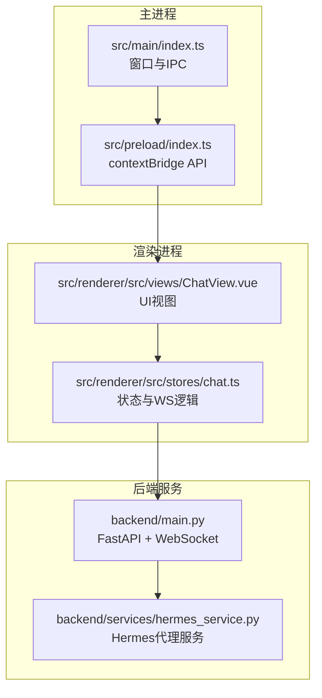
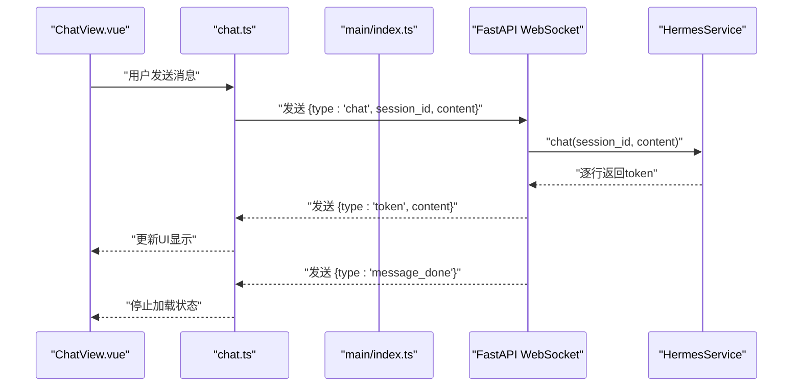
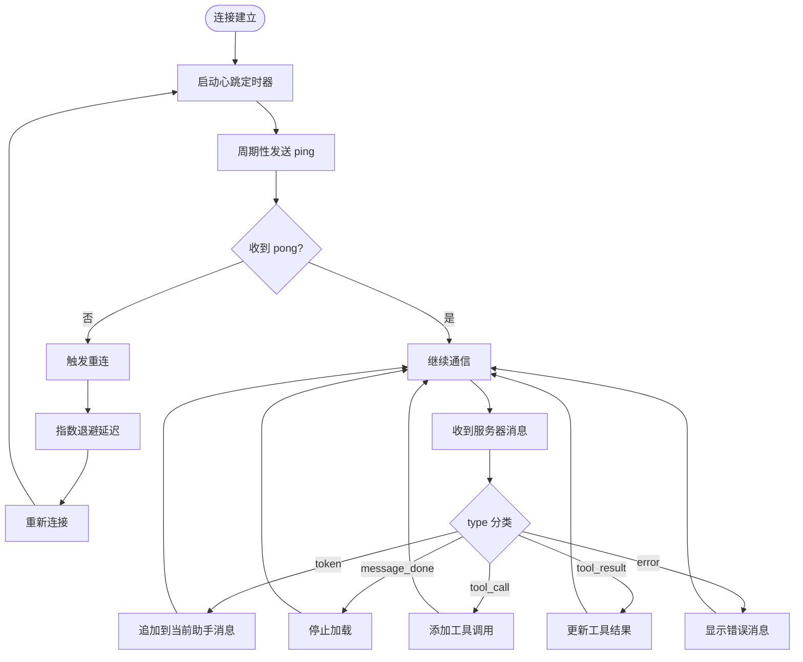
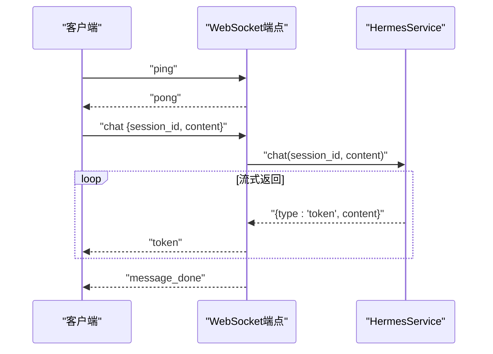
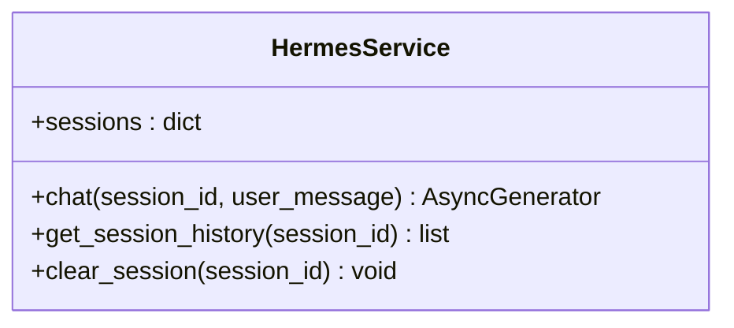
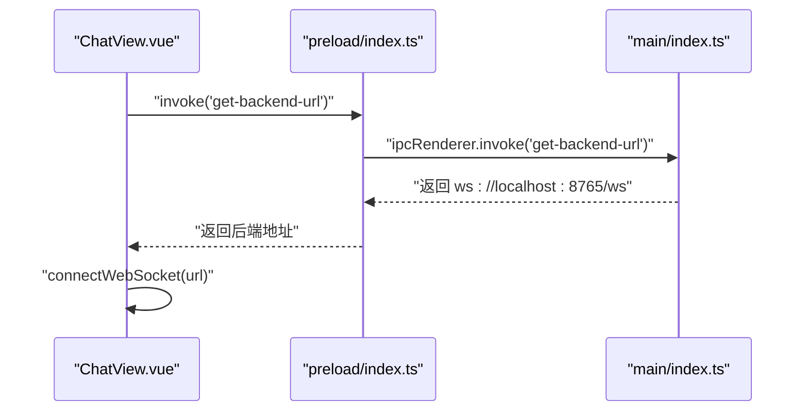
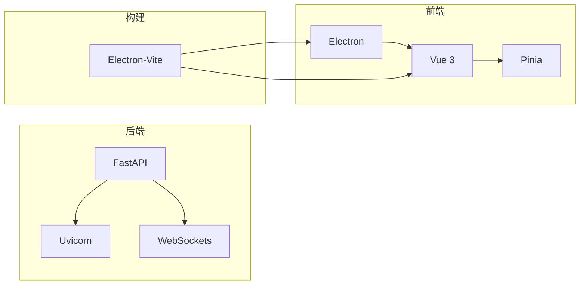

# WebSocket通信层

<cite>
**本文档引用的文件**
- [backend/main.py](file://backend/main.py)
- [backend/services/hermes_service.py](file://backend/services/hermes_service.py)
- [src/main/index.ts](file://src/main/index.ts)
- [src/preload/index.ts](file://src/preload/index.ts)
- [src/renderer/src/stores/chat.ts](file://src/renderer/src/stores/chat.ts)
- [src/renderer/src/views/ChatView.vue](file://src/renderer/src/views/ChatView.vue)
- [package.json](file://package.json)
- [electron.vite.config.ts](file://electron.vite.config.ts)
- [backend/requirements.txt](file://backend/requirements.txt)
</cite>

## 目录
1. [简介](#简介)
2. [项目结构](#项目结构)
3. [核心组件](#核心组件)
4. [架构总览](#架构总览)
5. [详细组件分析](#详细组件分析)
6. [依赖分析](#依赖分析)
7. [性能考虑](#性能考虑)
8. [故障排除指南](#故障排除指南)
9. [结论](#结论)

## 简介
本文件针对Hermes Desktop的WebSocket通信层进行系统化技术文档整理，覆盖连接建立、消息协议设计、实时通信实现、会话管理、心跳与断线重连策略、消息路由与并发处理机制，并提供与Electron前端的通信协议说明及使用示例。文档同时包含架构图、序列图与流程图，帮助开发者快速理解并扩展该通信层。

## 项目结构
Hermes Desktop采用Electron + Vue 3 + FastAPI的分层架构：
- 主进程负责窗口生命周期与IPC通信（暴露后端WebSocket地址）
- 预加载脚本通过contextBridge向渲染进程暴露安全API
- 渲染进程使用Pinia状态管理与WebSocket实现实时聊天
- 后端FastAPI提供WebSocket端点，内部通过子进程调用Hermes Agent CLI

图表来源
- [src/main/index.ts:45-48](file://src/main/index.ts#L45-L48)
- [src/preload/index.ts:5-7](file://src/preload/index.ts#L5-L7)
- [src/renderer/src/views/ChatView.vue:118-126](file://src/renderer/src/views/ChatView.vue#L118-L126)
- [backend/main.py:31-66](file://backend/main.py#L31-L66)
- [backend/services/hermes_service.py:16-72](file://backend/services/hermes_service.py#L16-L72)

章节来源
- [src/main/index.ts:1-62](file://src/main/index.ts#L1-L62)
- [src/preload/index.ts:1-24](file://src/preload/index.ts#L1-L24)
- [src/renderer/src/views/ChatView.vue:1-325](file://src/renderer/src/views/ChatView.vue#L1-L325)
- [backend/main.py:1-71](file://backend/main.py#L1-L71)
- [backend/services/hermes_service.py:1-82](file://backend/services/hermes_service.py#L1-L82)

## 核心组件
- Electron主进程：提供窗口创建与IPC，向渲染进程暴露后端WebSocket地址
- 预加载脚本：通过contextBridge安全地将IPC封装为window.api
- 渲染进程状态管理：维护会话、连接状态、心跳与重连逻辑，处理消息路由
- 后端FastAPI：WebSocket端点接收消息，调用Hermes服务并流式返回响应
- Hermes服务：通过子进程调用CLI，按行流式输出token，维护会话历史

章节来源
- [src/main/index.ts:45-48](file://src/main/index.ts#L45-L48)
- [src/preload/index.ts:5-7](file://src/preload/index.ts#L5-L7)
- [src/renderer/src/stores/chat.ts:26-262](file://src/renderer/src/stores/chat.ts#L26-L262)
- [backend/main.py:31-66](file://backend/main.py#L31-L66)
- [backend/services/hermes_service.py:16-72](file://backend/services/hermes_service.py#L16-L72)

## 架构总览
WebSocket通信链路从渲染进程发起，经由主进程获取后端地址，建立WS连接；后端收到消息后，通过Hermes服务以流式方式返回token，最终在前端完成实时显示与会话管理。

图表来源
- [src/renderer/src/views/ChatView.vue:90-102](file://src/renderer/src/views/ChatView.vue#L90-L102)
- [src/renderer/src/stores/chat.ts:209-232](file://src/renderer/src/stores/chat.ts#L209-L232)
- [backend/main.py:43-54](file://backend/main.py#L43-L54)
- [backend/services/hermes_service.py:16-72](file://backend/services/hermes_service.py#L16-L72)

## 详细组件分析

### 渲染进程WebSocket客户端（chat.ts）
- 连接管理：支持显式关闭、自动重连（指数退避，最大延迟限制）、心跳保活
- 心跳机制：定时发送ping，收到pong即视为连接正常
- 断线重连：onclose触发，按2^attempt递增延迟，上限保护
- 消息路由：根据type分发到不同处理分支（token、message_done、tool_call、tool_result、error）
- 会话管理：基于当前会话ID，动态追加消息，支持工具调用结果展示
- 并发处理：单连接串行处理，避免竞态；消息按到达顺序拼接

图表来源
- [src/renderer/src/stores/chat.ts:83-97](file://src/renderer/src/stores/chat.ts#L83-L97)
- [src/renderer/src/stores/chat.ts:99-108](file://src/renderer/src/stores/chat.ts#L99-L108)
- [src/renderer/src/stores/chat.ts:139-147](file://src/renderer/src/stores/chat.ts#L139-L147)
- [src/renderer/src/stores/chat.ts:152-207](file://src/renderer/src/stores/chat.ts#L152-L207)

章节来源
- [src/renderer/src/stores/chat.ts:26-262](file://src/renderer/src/stores/chat.ts#L26-L262)

### 后端WebSocket服务（main.py）
- 端点：/ws，接受文本帧，解析JSON消息
- 事件类型：
  - ping：回传pong，用于心跳
  - chat：携带session_id与content，调用Hermes服务流式返回token
  - message_done：表示一次消息生成结束
- 错误处理：捕获WebSocketDisconnect与异常，向客户端发送error消息
- 跨域：启用CORS中间件，允许任意来源

图表来源
- [backend/main.py:41-54](file://backend/main.py#L41-L54)
- [backend/main.py:47-54](file://backend/main.py#L47-L54)
- [backend/services/hermes_service.py:16-72](file://backend/services/hermes_service.py#L16-L72)

章节来源
- [backend/main.py:31-66](file://backend/main.py#L31-L66)

### Hermes服务（hermes_service.py）
- 会话存储：内存字典sessions，键为session_id，值为消息列表
- 流式输出：通过子进程调用hermes CLI，逐行读取stdout，yield token
- 错误处理：捕获CLI未找到、返回码非零、异常等，统一以error消息返回
- 历史维护：将用户与助手消息分别追加到会话历史

图表来源
- [backend/services/hermes_service.py:10-82](file://backend/services/hermes_service.py#L10-L82)

章节来源
- [backend/services/hermes_service.py:16-72](file://backend/services/hermes_service.py#L16-L72)

### Electron主进程与预加载（index.ts, preload/index.ts）
- 主进程暴露IPC：提供get-backend-url，返回ws://localhost:8765/ws
- 预加载脚本：通过contextBridge.exposeInMainWorld暴露window.api.getBackendUrl
- 渲染进程：在挂载时调用window.api.getBackendUrl获取后端地址并建立WS连接

图表来源
- [src/renderer/src/views/ChatView.vue:118-126](file://src/renderer/src/views/ChatView.vue#L118-L126)
- [src/preload/index.ts:5-7](file://src/preload/index.ts#L5-L7)
- [src/main/index.ts:45-48](file://src/main/index.ts#L45-L48)

章节来源
- [src/main/index.ts:45-48](file://src/main/index.ts#L45-L48)
- [src/preload/index.ts:5-7](file://src/preload/index.ts#L5-L7)
- [src/renderer/src/views/ChatView.vue:118-126](file://src/renderer/src/views/ChatView.vue#L118-L126)

### 消息协议与数据流转

#### 客户端发送消息（type: chat）
- 字段
  - type: 固定为chat
  - session_id: 当前会话ID（可选，若缺失则后端生成）
  - content: 用户消息内容
- 行为
  - 后端调用Hermes服务，流式返回token
  - 结束时发送message_done

章节来源
- [src/renderer/src/stores/chat.ts:209-232](file://src/renderer/src/stores/chat.ts#L209-L232)
- [backend/main.py:43-54](file://backend/main.py#L43-L54)

#### 服务器推送消息
- token
  - type: token
  - content: 单个token片段
  - 行为：前端追加到当前助手消息末尾
- message_done
  - type: message_done
  - 行为：前端停止加载状态
- tool_call
  - type: tool_call
  - name: 工具名称
  - args: 工具参数（字符串化）
  - 行为：在当前助手消息中添加工具调用条目
- tool_result
  - type: tool_result
  - result: 工具执行结果
  - error: 可选错误标记
  - 行为：更新最近工具调用的状态与结果
- error
  - type: error
  - message: 错误描述
  - 行为：前端插入系统消息提示错误

章节来源
- [src/renderer/src/stores/chat.ts:152-207](file://src/renderer/src/stores/chat.ts#L152-L207)
- [backend/main.py:41-54](file://backend/main.py#L41-L54)
- [backend/services/hermes_service.py:66-72](file://backend/services/hermes_service.py#L66-L72)

### 会话ID管理与并发处理
- 会话ID生成：客户端首次发送时可不提供session_id，后端自动生成UUID
- 会话存储：后端内存字典sessions按session_id组织消息历史
- 并发模型：单连接串行处理，避免多消息交错；Hermes服务内部按行流式输出，前端按到达顺序拼接
- 会话切换：前端store支持切换当前会话，消息路由基于当前会话ID

章节来源
- [backend/main.py:44](file://backend/main.py#L44)
- [backend/services/hermes_service.py:14](file://backend/services/hermes_service.py#L14)
- [src/renderer/src/stores/chat.ts:65-71](file://src/renderer/src/stores/chat.ts#L65-L71)

### 心跳检测与断线重连
- 心跳：每15秒发送一次ping，收到pong即确认连接存活
- 重连：onclose触发，指数退避（2^attempt毫秒），最大延迟30秒
- 优雅关闭：disconnect时停止心跳与定时器，防止重复触发重连

章节来源
- [src/renderer/src/stores/chat.ts:83-97](file://src/renderer/src/stores/chat.ts#L83-L97)
- [src/renderer/src/stores/chat.ts:99-108](file://src/renderer/src/stores/chat.ts#L99-L108)
- [src/renderer/src/stores/chat.ts:234-246](file://src/renderer/src/stores/chat.ts#L234-L246)

### 与前端Electron应用的通信协议
- 地址获取：window.api.getBackendUrl()返回ws://localhost:8765/ws
- 连接建立：ChatView.vue在mounted时获取地址并调用connectWebSocket
- 消息交互：使用JSON文本帧，遵循上述消息协议
- UI渲染：ChatView.vue基于Pinia状态实时渲染消息与工具调用结果

章节来源
- [src/renderer/src/views/ChatView.vue:118-126](file://src/renderer/src/views/ChatView.vue#L118-L126)
- [src/preload/index.ts:5-7](file://src/preload/index.ts#L5-L7)
- [src/main/index.ts:45-48](file://src/main/index.ts#L45-L48)

## 依赖分析
- 后端依赖：FastAPI、Uvicorn、WebSockets
- 前端依赖：Vue 3、Pinia、Electron Toolkit
- 构建工具：Electron-Vite

图表来源
- [backend/requirements.txt:1-4](file://backend/requirements.txt#L1-L4)
- [package.json:17-33](file://package.json#L17-L33)
- [electron.vite.config.ts:1-21](file://electron.vite.config.ts#L1-L21)

章节来源
- [backend/requirements.txt:1-4](file://backend/requirements.txt#L1-L4)
- [package.json:17-33](file://package.json#L17-L33)
- [electron.vite.config.ts:1-21](file://electron.vite.config.ts#L1-L21)

## 性能考虑
- 流式传输：后端按行输出token，前端即时渲染，降低首包延迟
- 心跳频率：15秒一次，平衡保活与网络开销
- 重连退避：指数增长避免风暴式重试，上限30秒
- 内存会话：仅内存存储，适合桌面应用场景；如需持久化可扩展为数据库
- CLI调用：当前通过子进程调用CLI，后续可替换为直接SDK集成以减少进程开销

## 故障排除指南
- 连接失败
  - 检查后端是否运行在ws://localhost:8765/ws
  - 确认CORS配置允许跨域访问
- 心跳失效
  - 查看控制台日志中的ping/pong交互
  - 网络环境可能丢包，适当调整心跳间隔
- 消息未显示
  - 确认onmessage解析成功，检查JSON格式
  - 检查当前会话ID是否正确
- Hermes不可用
  - CLI未安装或不在PATH中：服务会返回相应错误消息
  - 返回码非零：检查stderr输出

章节来源
- [backend/main.py:56-65](file://backend/main.py#L56-L65)
- [backend/services/hermes_service.py:66-72](file://backend/services/hermes_service.py#L66-L72)

## 结论
Hermes Desktop的WebSocket通信层以简洁清晰的方式实现了前后端实时通信：前端通过Pinia集中管理连接与消息，后端以FastAPI提供WebSocket端点并委托Hermes服务进行流式响应。心跳与断线重连策略保障了连接稳定性，消息协议定义明确，便于扩展更多事件类型与工具调用能力。后续可在保持现有协议不变的前提下，引入持久化会话、SDK直连、批量消息与更细粒度的错误恢复机制。