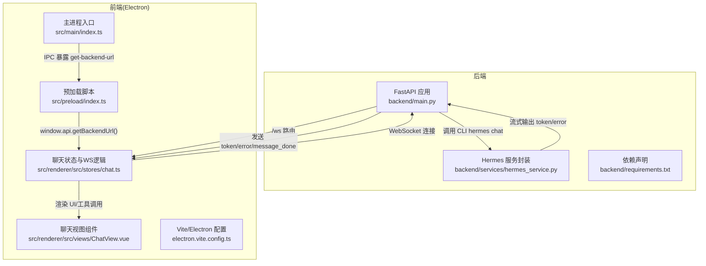
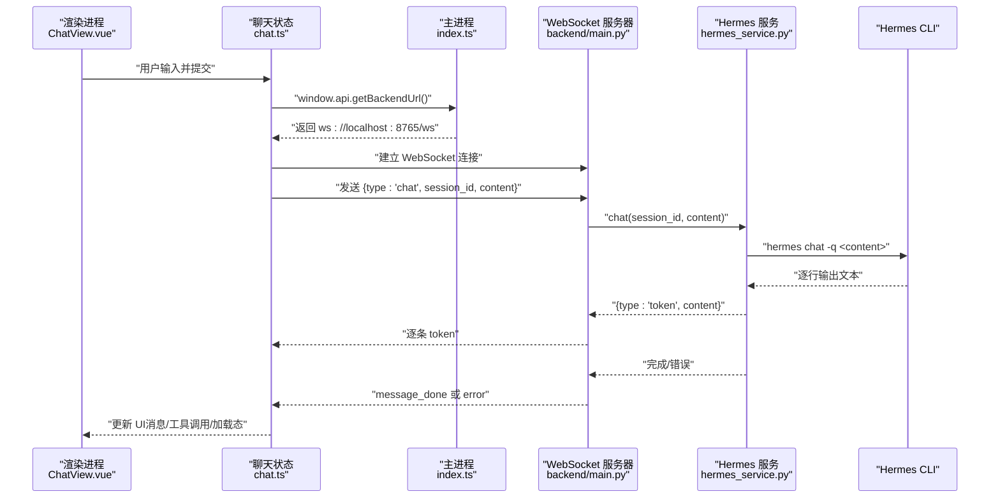
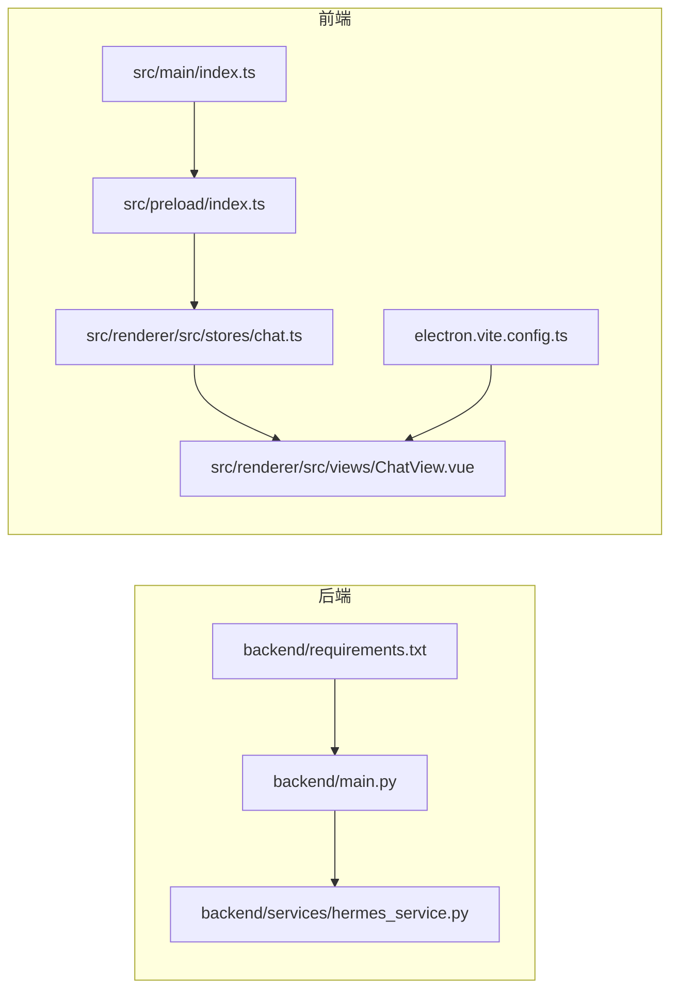

# 后端服务

<cite>
**本文引用的文件**
- [backend/main.py](file://backend/main.py)
- [backend/services/hermes_service.py](file://backend/services/hermes_service.py)
- [backend/requirements.txt](file://backend/requirements.txt)
- [src/main/index.ts](file://src/main/index.ts)
- [src/preload/index.ts](file://src/preload/index.ts)
- [src/preload/index.d.ts](file://src/preload/index.d.ts)
- [src/renderer/src/stores/chat.ts](file://src/renderer/src/stores/chat.ts)
- [src/renderer/src/views/ChatView.vue](file://src/renderer/src/views/ChatView.vue)
- [electron.vite.config.ts](file://electron.vite.config.ts)
- [package.json](file://package.json)
</cite>

## 目录
1. [简介](#简介)
2. [项目结构](#项目结构)
3. [核心组件](#核心组件)
4. [架构总览](#架构总览)
5. [详细组件分析](#详细组件分析)
6. [依赖关系分析](#依赖关系分析)
7. [性能考量](#性能考量)
8. [故障排查指南](#故障排查指南)
9. [结论](#结论)
10. [附录](#附录)

## 简介
本文件面向Hermes Desktop后端服务，系统性梳理基于FastAPI的HTTP与WebSocket服务、与Hermes Agent CLI的交互机制、以及Electron前端通过WebSocket进行消息路由与连接管理的实现。文档覆盖：
- 异步处理与流式响应机制
- WebSocket消息类型与路由策略
- 会话管理与历史记录
- API端点与错误处理
- 服务启动流程、配置与部署要点
- 性能优化与监控建议
- 安全与访问控制

## 项目结构
后端服务位于Python子目录，前端使用Electron + Vue3 + Pinia，通过IPC在主进程暴露后端WebSocket地址，渲染进程通过预加载脚本调用获取地址并建立WebSocket连接。

图表来源
- [backend/main.py:1-69](file://backend/main.py#L1-L69)
- [backend/services/hermes_service.py:1-82](file://backend/services/hermes_service.py#L1-L82)
- [src/main/index.ts:1-62](file://src/main/index.ts#L1-L62)
- [src/preload/index.ts:1-24](file://src/preload/index.ts#L1-L24)
- [src/renderer/src/stores/chat.ts:1-263](file://src/renderer/src/stores/chat.ts#L1-L263)
- [src/renderer/src/views/ChatView.vue:1-327](file://src/renderer/src/views/ChatView.vue#L1-L327)
- [electron.vite.config.ts:1-21](file://electron.vite.config.ts#L1-L21)

章节来源
- [backend/main.py:1-69](file://backend/main.py#L1-L69)
- [backend/services/hermes_service.py:1-82](file://backend/services/hermes_service.py#L1-L82)
- [src/main/index.ts:1-62](file://src/main/index.ts#L1-L62)
- [src/preload/index.ts:1-24](file://src/preload/index.ts#L1-L24)
- [src/renderer/src/stores/chat.ts:1-263](file://src/renderer/src/stores/chat.ts#L1-L263)
- [src/renderer/src/views/ChatView.vue:1-327](file://src/renderer/src/views/ChatView.vue#L1-L327)
- [electron.vite.config.ts:1-21](file://electron.vite.config.ts#L1-L21)

## 核心组件
- FastAPI应用与CORS中间件：提供健康检查端点与WebSocket端点，允许跨域访问。
- WebSocket端点：接收客户端消息，分发到Hermes服务，并将流式响应回传给客户端。
- Hermes服务封装：维护会话历史，通过子进程调用Hermes CLI执行聊天任务，逐行流式返回token，处理错误并记录助手回复。
- 前端Electron主进程：通过IPC向渲染进程提供后端WebSocket地址。
- 预加载脚本：桥接渲染进程与Electron主进程，暴露API供前端调用。
- 前端聊天状态与WebSocket逻辑：负责会话管理、心跳、重连、消息解析与UI渲染。

章节来源
- [backend/main.py:13-69](file://backend/main.py#L13-L69)
- [backend/services/hermes_service.py:10-82](file://backend/services/hermes_service.py#L10-L82)
- [src/main/index.ts:45-48](file://src/main/index.ts#L45-L48)
- [src/preload/index.ts:5-7](file://src/preload/index.ts#L5-L7)
- [src/renderer/src/stores/chat.ts:26-262](file://src/renderer/src/stores/chat.ts#L26-L262)

## 架构总览
下图展示从Electron渲染进程发起WebSocket连接，到后端FastAPI处理、调用Hermes CLI并流式返回消息的完整链路。

图表来源
- [src/renderer/src/views/ChatView.vue:118-126](file://src/renderer/src/views/ChatView.vue#L118-L126)
- [src/renderer/src/stores/chat.ts:109-150](file://src/renderer/src/stores/chat.ts#L109-L150)
- [src/main/index.ts:45-48](file://src/main/index.ts#L45-L48)
- [backend/main.py:31-63](file://backend/main.py#L31-L63)
- [backend/services/hermes_service.py:16-72](file://backend/services/hermes_service.py#L16-L72)

## 详细组件分析

### FastAPI 应用与路由
- 应用名称与标题设置，启用CORS中间件，允许任意来源、方法与头。
- 健康检查端点用于服务可用性探测。
- WebSocket端点“/ws”：
  - 接受连接后进入循环读取客户端消息。
  - 识别消息类型为“chat”时，生成或复用会话ID，调用Hermes服务的异步生成器，逐条发送“token”类型消息。
  - 在生成器结束后发送“message_done”表示本次消息完成。
  - 捕获断开与异常，向客户端发送“error”消息。

章节来源
- [backend/main.py:13-21](file://backend/main.py#L13-L21)
- [backend/main.py:26-28](file://backend/main.py#L26-L28)
- [backend/main.py:31-63](file://backend/main.py#L31-L63)

### WebSocket 消息协议与路由
- 客户端发送：
  - 类型“chat”，包含字段：session_id（可选）、content（必填）。
- 服务端发送：
  - 类型“token”，携带增量内容；用于流式显示。
  - 类型“message_done”，表示当前消息生成结束。
  - 类型“error”，携带错误信息；用于异常反馈。
- 前端解析：
  - “token”：追加到当前助手消息或新建助手消息。
  - “message_done”：停止加载态。
  - “tool_call/tool_result”：在消息末尾追加工具调用及其结果。
  - “error”：新增系统消息提示错误。

章节来源
- [backend/main.py:41-52](file://backend/main.py#L41-L52)
- [src/renderer/src/stores/chat.ts:152-207](file://src/renderer/src/stores/chat.ts#L152-L207)

### Hermes 服务封装与会话管理
- 会话存储：以字典维护每个session_id对应的对话历史列表，每条消息含role与content。
- 聊天接口：
  - 使用子进程调用“hermes chat -q <content>”，标准输出逐行读取并yield“token”类型消息。
  - 若CLI返回码非零，读取stderr并yield“error”类型消息。
  - 成功时将完整响应作为“assistant”角色加入会话历史。
  - 异常处理：未找到CLI时返回特定错误；其他异常统一包装为错误消息。
- 历史查询与清理：提供查询与删除会话历史的方法。

章节来源
- [backend/services/hermes_service.py:10-82](file://backend/services/hermes_service.py#L10-L82)

### 前端连接管理与心跳重连
- 主进程通过IPC暴露“get-backend-url”，默认返回本地WebSocket地址。
- 预加载脚本将该API暴露至渲染进程，供聊天视图在挂载时调用。
- 聊天状态store：
  - 维护当前会话、连接状态、加载状态与WebSocket实例。
  - 心跳：周期性发送“ping”，保持连接活跃。
  - 重连：指数退避定时器，最大延迟限制，断线自动重连。
  - 消息处理：根据服务端消息类型更新UI与会话历史。

章节来源
- [src/main/index.ts:45-48](file://src/main/index.ts#L45-L48)
- [src/preload/index.ts:5-7](file://src/preload/index.ts#L5-L7)
- [src/renderer/src/stores/chat.ts:33-108](file://src/renderer/src/stores/chat.ts#L33-L108)
- [src/renderer/src/stores/chat.ts:139-147](file://src/renderer/src/stores/chat.ts#L139-L147)
- [src/renderer/src/stores/chat.ts:152-207](file://src/renderer/src/stores/chat.ts#L152-L207)

### 前端聊天视图与工具调用展示
- 渲染层负责消息列表、工具调用块、加载指示器与Markdown渲染。
- 工具调用状态（running/done/error）以不同样式标识，结果以等宽块展示并可滚动。
- 输入区支持多行输入与发送按钮，自动滚动到底部。

章节来源
- [src/renderer/src/views/ChatView.vue:118-126](file://src/renderer/src/views/ChatView.vue#L118-L126)
- [src/renderer/src/views/ChatView.vue:19-46](file://src/renderer/src/views/ChatView.vue#L19-L46)
- [src/renderer/src/views/ChatView.vue:205-247](file://src/renderer/src/views/ChatView.vue#L205-L247)

## 依赖关系分析

图表来源
- [backend/main.py:11](file://backend/main.py#L11)
- [backend/services/hermes_service.py:10](file://backend/services/hermes_service.py#L10)
- [src/main/index.ts:45-48](file://src/main/index.ts#L45-L48)
- [src/preload/index.ts:5-7](file://src/preload/index.ts#L5-L7)
- [src/renderer/src/stores/chat.ts:26-262](file://src/renderer/src/stores/chat.ts#L26-L262)
- [src/renderer/src/views/ChatView.vue:118-126](file://src/renderer/src/views/ChatView.vue#L118-L126)
- [electron.vite.config.ts:1-21](file://electron.vite.config.ts#L1-L21)
- [backend/requirements.txt:1-4](file://backend/requirements.txt#L1-L4)

章节来源
- [backend/main.py:11](file://backend/main.py#L11)
- [backend/services/hermes_service.py:10](file://backend/services/hermes_service.py#L10)
- [src/main/index.ts:45-48](file://src/main/index.ts#L45-L48)
- [src/preload/index.ts:5-7](file://src/preload/index.ts#L5-L7)
- [src/renderer/src/stores/chat.ts:26-262](file://src/renderer/src/stores/chat.ts#L26-L262)
- [src/renderer/src/views/ChatView.vue:118-126](file://src/renderer/src/views/ChatView.vue#L118-L126)
- [electron.vite.config.ts:1-21](file://electron.vite.config.ts#L1-L21)
- [backend/requirements.txt:1-4](file://backend/requirements.txt#L1-L4)

## 性能考量
- 流式输出：后端按行读取CLI输出并立即发送，降低首字节延迟，提升交互体验。
- 子进程并发：当前实现为串行调用，若需要并发聊天，需引入队列与并发控制，避免CLI资源竞争。
- 心跳与重连：前端心跳与指数退避重连减少网络抖动影响，但应避免过于频繁的心跳导致CPU占用。
- 前端渲染：长消息与大量工具调用时，建议虚拟滚动与懒渲染，减少DOM压力。
- 日志与监控：建议在后端增加结构化日志与指标上报（如响应时间、错误率），前端记录连接状态与重连次数。
- 资源隔离：生产环境建议将后端运行在独立WSL或容器中，避免与桌面GUI共享过多资源。

## 故障排查指南
- 无法连接后端：
  - 确认后端已启动且监听在0.0.0.0:8765。
  - 检查CORS配置是否允许前端来源。
  - 查看前端是否正确通过IPC获取到WebSocket地址。
- CLI不可用：
  - 确保Hermes CLI安装并位于PATH中。
  - 检查CLI权限与工作目录。
- WebSocket异常：
  - 关注后端异常捕获与错误消息发送。
  - 前端检查心跳与重连逻辑是否触发。
- 会话历史缺失：
  - 确认session_id传递正确，后端会话字典是否被清理。

章节来源
- [backend/main.py:54-63](file://backend/main.py#L54-L63)
- [backend/services/hermes_service.py:66-72](file://backend/services/hermes_service.py#L66-L72)
- [src/renderer/src/stores/chat.ts:109-108](file://src/renderer/src/stores/chat.ts#L109-L108)

## 结论
本后端服务以FastAPI+WebSocket为核心，结合Electron预加载与Pinia状态管理，实现了与Hermes Agent CLI的流式交互。整体架构清晰、扩展性强，适合在桌面环境中提供低延迟的对话体验。后续可在并发控制、指标监控与安全加固方面进一步完善。

## 附录

### API 端点规范
- GET /health
  - 功能：健康检查
  - 返回：包含服务状态与名称的对象
  - 示例：{"status":"ok","service":"hermes-desktop-backend"}

章节来源
- [backend/main.py:26-28](file://backend/main.py#L26-L28)

### WebSocket 消息格式
- 客户端发送（chat）
  - 字段：type（固定为"chat"）、session_id（可选）、content（必填）
- 服务端推送
  - token：{"type":"token","content":"<增量文本>"}
  - message_done：{"type":"message_done"}
  - error：{"type":"error","message":"<错误描述>"}

章节来源
- [backend/main.py:41-52](file://backend/main.py#L41-L52)
- [src/renderer/src/stores/chat.ts:152-207](file://src/renderer/src/stores/chat.ts#L152-L207)

### 服务启动与部署
- 启动命令：直接运行后端入口文件，使用Uvicorn在0.0.0.0:8765监听。
- 依赖：FastAPI、Uvicorn、WebSockets。
- 部署建议：
  - 将后端与前端打包为独立进程或容器，确保CLI可用。
  - 生产环境开启防火墙与反向代理，限制来源IP与速率。
  - 使用系统服务或进程管理器（如systemd）保证后端自启。

章节来源
- [backend/main.py:66-69](file://backend/main.py#L66-L69)
- [backend/requirements.txt:1-4](file://backend/requirements.txt#L1-L4)

### 安全与访问控制
- CORS：当前允许任意来源，生产环境建议限定来源。
- 认证：当前未实现认证；建议在WebSocket握手阶段或消息层面增加鉴权。
- 访问控制：限制端口暴露范围，仅对本地或内网开放。
- 数据保护：CLI输出可能包含敏感信息，建议在后端过滤或脱敏。

章节来源
- [backend/main.py:15-21](file://backend/main.py#L15-L21)