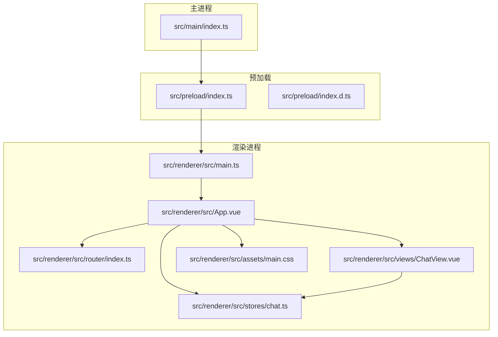
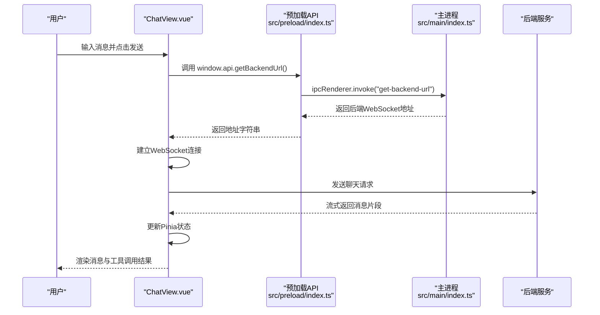
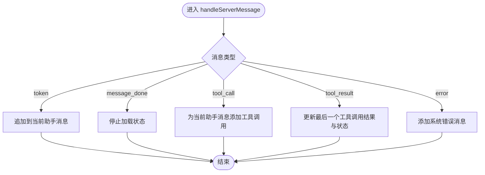
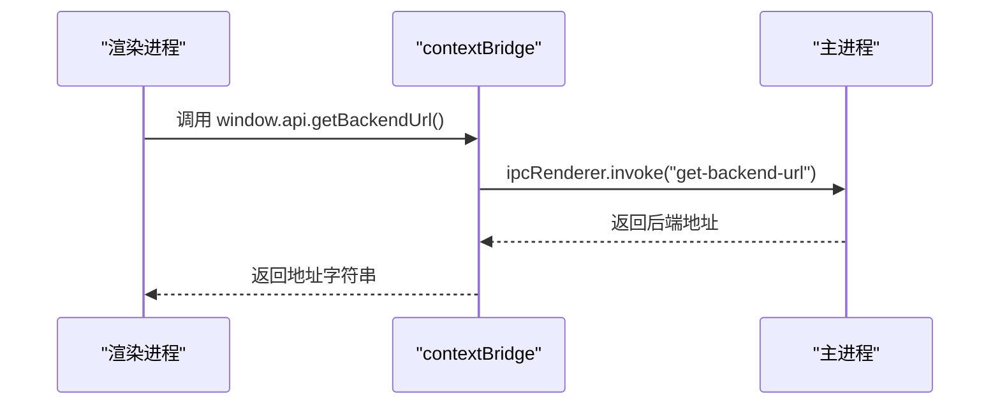
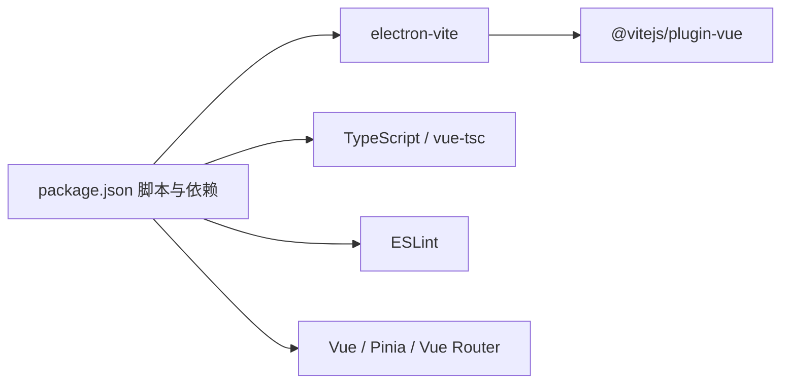

# 代码规范与最佳实践

<cite>
**本文引用的文件**
- [package.json](file://package.json)
- [tsconfig.json](file://tsconfig.json)
- [tsconfig.node.json](file://tsconfig.node.json)
- [tsconfig.web.json](file://tsconfig.web.json)
- [electron.vite.config.ts](file://electron.vite.config.ts)
- [src/main/index.ts](file://src/main/index.ts)
- [src/preload/index.ts](file://src/preload/index.ts)
- [src/preload/index.d.ts](file://src/preload/index.d.ts)
- [src/renderer/src/main.ts](file://src/renderer/src/main.ts)
- [src/renderer/src/App.vue](file://src/renderer/src/App.vue)
- [src/renderer/src/router/index.ts](file://src/renderer/src/router/index.ts)
- [src/renderer/src/stores/chat.ts](file://src/renderer/src/stores/chat.ts)
- [src/renderer/src/views/ChatView.vue](file://src/renderer/src/views/ChatView.vue)
- [src/renderer/src/assets/main.css](file://src/renderer/src/assets/main.css)
</cite>

## 目录
1. [简介](#简介)
2. [项目结构](#项目结构)
3. [核心组件](#核心组件)
4. [架构总览](#架构总览)
5. [详细组件分析](#详细组件分析)
6. [依赖关系分析](#依赖关系分析)
7. [性能考虑](#性能考虑)
8. [故障排查指南](#故障排查指南)
9. [结论](#结论)
10. [附录](#附录)

## 简介
本文件为 Hermes Desktop 的代码规范与最佳实践指南，覆盖 TypeScript 配置规则、命名约定、代码组织原则；Vue 3 组件开发规范；Pinia 状态管理最佳实践；Electron 架构设计模式；代码风格与注释规范；文档编写标准；性能优化原则、内存管理与错误处理最佳实践；以及代码审查检查清单与质量保证流程。内容基于仓库现有实现进行提炼与扩展，确保团队协作一致性与长期可维护性。

## 项目结构
项目采用 Electron + Vue 3 + Pinia 的桌面应用架构，前端通过 Vite 进行构建，TypeScript 多配置分层（Node/Renderer）以隔离主进程与渲染进程类型定义。目录组织清晰，职责边界明确：
- 主进程：负责窗口生命周期、IPC 注册与系统集成
- 预加载脚本：通过 contextBridge 暴露受控 API 至渲染进程
- 渲染进程：Vue 应用入口、路由、状态、视图与样式

**图表来源**
- [src/main/index.ts:1-62](file://src/main/index.ts#L1-L62)
- [src/preload/index.ts:1-24](file://src/preload/index.ts#L1-L24)
- [src/preload/index.d.ts:1-11](file://src/preload/index.d.ts#L1-L11)
- [src/renderer/src/main.ts:1-11](file://src/renderer/src/main.ts#L1-L11)
- [src/renderer/src/App.vue:1-178](file://src/renderer/src/App.vue#L1-L178)
- [src/renderer/src/router/index.ts:1-16](file://src/renderer/src/router/index.ts#L1-L16)
- [src/renderer/src/stores/chat.ts:1-263](file://src/renderer/src/stores/chat.ts#L1-L263)
- [src/renderer/src/views/ChatView.vue:1-325](file://src/renderer/src/views/ChatView.vue#L1-L325)
- [src/renderer/src/assets/main.css:1-36](file://src/renderer/src/assets/main.css#L1-L36)

**章节来源**
- [package.json:1-35](file://package.json#L1-L35)
- [tsconfig.json:1-8](file://tsconfig.json#L1-L8)
- [tsconfig.node.json:1-13](file://tsconfig.node.json#L1-L13)
- [tsconfig.web.json:1-16](file://tsconfig.web.json#L1-L16)
- [electron.vite.config.ts:1-21](file://electron.vite.config.ts#L1-L21)

## 核心组件
- TypeScript 配置分层
  - 根配置通过 references 引入 Node 与 Web 两套 tsconfig，分别用于主进程与渲染进程类型检查与路径别名
  - Node 配置启用 composite 并包含主进程与预加载源码，使用 @electron-toolkit 的 tsconfig 基础
  - Web 配置启用 composite，设置 baseUrl 与 @ 路径别名，包含 env.d.ts 与所有 Vue 文件
- 构建与开发
  - electron-vite 提供多环境构建与热更新；Vite 插件按进程启用
  - 脚本统一通过 npm scripts 管理，包含类型检查与 ESLint 自动修复
- Electron 架构
  - 主进程创建窗口、注册 IPC、处理窗口事件
  - 预加载脚本通过 contextBridge 暴露受控 API（如获取后端 WebSocket 地址）
  - 渲染进程通过 Pinia 管理会话与消息状态，Vue Router 管理页面路由，ChatView 展示消息与输入

**章节来源**
- [tsconfig.json:1-8](file://tsconfig.json#L1-L8)
- [tsconfig.node.json:1-13](file://tsconfig.node.json#L1-L13)
- [tsconfig.web.json:1-16](file://tsconfig.web.json#L1-L16)
- [electron.vite.config.ts:1-21](file://electron.vite.config.ts#L1-L21)
- [package.json:8-16](file://package.json#L8-L16)

## 架构总览
下图展示从用户交互到后端服务的端到端流程：渲染进程通过预加载暴露的 API 获取后端地址，建立 WebSocket 连接，接收消息流并更新 Pinia 状态，驱动视图渲染。

**图表来源**
- [src/renderer/src/views/ChatView.vue:118-126](file://src/renderer/src/views/ChatView.vue#L118-L126)
- [src/preload/index.ts:4-7](file://src/preload/index.ts#L4-L7)
- [src/main/index.ts:45-48](file://src/main/index.ts#L45-L48)

**章节来源**
- [src/renderer/src/views/ChatView.vue:118-126](file://src/renderer/src/views/ChatView.vue#L118-L126)
- [src/preload/index.ts:4-7](file://src/preload/index.ts#L4-L7)
- [src/main/index.ts:45-48](file://src/main/index.ts#L45-L48)

## 详细组件分析

### TypeScript 配置与命名约定
- 配置分层
  - 根 tsconfig 使用 references 引入 Node 与 Web 配置，避免重复声明
  - Node 配置 include 主进程与预加载目录，并启用 electron-vite/node 类型
  - Web 配置 include env.d.ts 与所有 Vue 文件，设置 baseUrl 与 @ 别名映射至 src/renderer/src
- 命名约定
  - Store 使用 useXxx 前缀导出（如 useChatStore），便于在模板中识别
  - 接口与类型采用 PascalCase（如 Message、ToolCall、Session）
  - 常量使用 UPPER_SNAKE_CASE（如 HEARTBEAT_INTERVAL、MAX_RECONNECT_DELAY）
  - 变量与函数采用 camelCase（如 currentSessionId、addMessage、scheduleReconnect）

**章节来源**
- [tsconfig.json:1-8](file://tsconfig.json#L1-L8)
- [tsconfig.node.json:1-13](file://tsconfig.node.json#L1-L13)
- [tsconfig.web.json:1-16](file://tsconfig.web.json#L1-L16)
- [src/renderer/src/stores/chat.ts:26-40](file://src/renderer/src/stores/chat.ts#L26-L40)

### Vue 3 组件开发规范
- 单文件组件组织
  - 模板、脚本、样式分离，脚本使用 <script setup> 语法，减少样板代码
  - 样式使用 scoped，避免全局污染；必要时通过 :deep 作用于子组件
- 数据与行为
  - 使用 ref/computed/watch 管理响应式数据与副作用
  - 事件处理函数在组件内定义，避免在模板中直接绑定复杂表达式
- 生命周期与副作用
  - 在 onMounted 中发起网络请求或建立连接，确保 DOM 已挂载
  - 合理清理定时器与订阅，防止内存泄漏
- 可访问性与可读性
  - 语义化标签与可读的类名，保持 CSS 结构清晰
  - 文本内容使用占位符与本地化文案，便于国际化

**章节来源**
- [src/renderer/src/views/ChatView.vue:68-127](file://src/renderer/src/views/ChatView.vue#L68-L127)
- [src/renderer/src/App.vue:37-45](file://src/renderer/src/App.vue#L37-L45)

### Pinia 状态管理最佳实践
- Store 设计
  - 使用组合式 defineStore，集中管理会话、消息、连接状态与加载状态
  - 将与 UI 直接相关的状态（如当前会话 ID、是否连接、是否加载）置于 store
  - 将与业务逻辑相关的操作（如连接、断开、心跳、重连）封装为方法
- 数据模型
  - 明确接口定义（Message、ToolCall、Session），约束字段与取值范围
  - 对可选字段使用可选属性（如 ToolCall.result、Message.toolCalls）
- 事件与消息处理
  - WebSocket onmessage 解析后根据 type 分发到对应分支，避免在事件回调中做过多逻辑
  - 对异常消息与错误进行统一处理，避免 UI 崩溃
- 内存与资源管理
  - 心跳与重连定时器需在断开连接时清理
  - 关闭 WebSocket 时移除事件监听，防止悬挂引用

**图表来源**
- [src/renderer/src/stores/chat.ts:152-207](file://src/renderer/src/stores/chat.ts#L152-L207)

**章节来源**
- [src/renderer/src/stores/chat.ts:1-263](file://src/renderer/src/stores/chat.ts#L1-L263)

### Electron 架构设计模式
- 主进程职责
  - 创建窗口、设置 webPreferences（预加载路径、沙箱关闭）、窗口事件处理
  - 注册 IPC：向渲染进程提供只读后端地址查询能力
  - 开发与生产环境加载策略：开发时加载 Vite 服务器，生产时加载打包后的 HTML
- 预加载脚本职责
  - 通过 contextBridge 暴露受控 API 至渲染进程，避免直接暴露 Node/Electron 全能 API
  - 在上下文隔离开启失败时回退到 window 注入，但应尽量避免
- 渲染进程职责
  - 通过 window.api 调用后端地址，建立 WebSocket 连接
  - 与 Pinia 协作，驱动 UI 更新

**图表来源**
- [src/preload/index.ts:4-7](file://src/preload/index.ts#L4-L7)
- [src/main/index.ts:45-48](file://src/main/index.ts#L45-L48)

**章节来源**
- [src/main/index.ts:1-62](file://src/main/index.ts#L1-L62)
- [src/preload/index.ts:1-24](file://src/preload/index.ts#L1-L24)
- [src/preload/index.d.ts:1-11](file://src/preload/index.d.ts#L1-L11)

### 代码风格与注释规范
- 命名
  - 组件与页面：PascalCase（如 ChatView）
  - 方法与变量：camelCase（如 createSession、sendMessage）
  - 常量：UPPER_SNAKE_CASE（如 MAX_RECONNECT_DELAY）
- 导入与路径
  - 使用 @ 别名导入，避免相对路径过深
  - 相对路径仅用于同级或局部模块
- 注释
  - 函数与复杂逻辑添加简要注释，说明目的、参数与返回值
  - 临时解决方案与边界条件标注 TODO/NOTE
- 格式化与校验
  - 使用 ESLint 自动修复，统一格式与潜在问题
  - TypeScript 类型检查分为 Node 与 Web 两套，确保主/渲染进程类型安全

**章节来源**
- [electron.vite.config.ts:14-16](file://electron.vite.config.ts#L14-L16)
- [tsconfig.web.json:11-13](file://tsconfig.web.json#L11-L13)
- [package.json:15-16](file://package.json#L15-L16)

### 文档编写标准
- README/变更日志
  - 记录安装步骤、运行方式、构建命令与版本变更
- 代码内文档
  - 对外暴露的 API（如 window.api）在类型声明中补充注释
  - 复杂算法与业务流程在文件顶部或函数注释中说明背景与约束
- 架构文档
  - 绘制组件交互图与数据流图，标注关键节点与职责

**章节来源**
- [src/preload/index.d.ts:1-11](file://src/preload/index.d.ts#L1-L11)

## 依赖关系分析
- 构建与工具链
  - electron-vite 提供多进程构建与开发体验
  - Vite + @vitejs/plugin-vue 用于渲染进程开发
  - TypeScript 与 vue-tsc 提供类型检查
  - ESLint 用于代码风格与静态检查
- 运行时依赖
  - Vue 3、Pinia、Vue Router 作为前端框架与状态管理
  - @electron-toolkit/preload 与 @electron-toolkit/utils 提供 Electron 辅助能力

**图表来源**
- [package.json:8-33](file://package.json#L8-L33)

**章节来源**
- [package.json:1-35](file://package.json#L1-L35)

## 性能考虑
- 渲染性能
  - 避免在模板中执行复杂计算，使用 computed 缓存结果
  - 列表渲染使用 v-for 与唯一 key，减少不必要的重排
  - 滚动容器使用虚拟滚动或分页，控制消息列表长度
- 状态与内存
  - Pinia store 中避免存储超大对象，拆分细粒度状态
  - 及时清理定时器、WebSocket 事件监听，防止内存泄漏
- 网络与连接
  - WebSocket 心跳与指数退避重连，限制最大重连间隔
  - 错误与异常消息统一处理，避免 UI 抛错导致卡顿
- 构建与打包
  - 使用 electron-vite 的 externalizeDepsPlugin 外部化依赖，缩短编译时间
  - 生产构建前进行类型检查与 ESLint 修复，降低运行时风险

**章节来源**
- [src/renderer/src/stores/chat.ts:83-108](file://src/renderer/src/stores/chat.ts#L83-L108)
- [src/renderer/src/views/ChatView.vue:104-116](file://src/renderer/src/views/ChatView.vue#L104-L116)

## 故障排查指南
- WebSocket 连接问题
  - 检查主进程 IPC 是否正确返回后端地址
  - 确认预加载 API 是否成功暴露至渲染进程
  - 查看控制台日志中的连接/断开/错误信息
- 类型检查失败
  - 分别运行 typecheck:node 与 typecheck:web，定位具体配置问题
  - 检查 tsconfig.references 与 baseUrl/@ 别名配置
- 开发与生产差异
  - 开发环境确认 ELETRON_RENDERER_URL 环境变量
  - 生产环境确认打包后 HTML 路径与资源可用性
- 内存泄漏
  - 确认断开连接时清理心跳与重连定时器
  - 确认组件卸载时移除事件监听与订阅

**章节来源**
- [src/main/index.ts:45-48](file://src/main/index.ts#L45-L48)
- [src/preload/index.ts:4-7](file://src/preload/index.ts#L4-L7)
- [src/renderer/src/stores/chat.ts:234-246](file://src/renderer/src/stores/chat.ts#L234-L246)

## 结论
本规范以现有代码为基础，结合 Electron + Vue 3 + Pinia 的实际实现，给出了 TypeScript 配置、组件开发、状态管理、架构设计与质量保障的系统性建议。遵循上述规范有助于提升代码一致性、可维护性与运行稳定性。

## 附录

### 代码审查检查清单
- TypeScript
  - 是否使用组合式 defineStore？接口定义是否完整？
  - 是否存在未使用的常量/变量？是否使用了合适的类型？
- Vue 组件
  - 是否使用 <script setup>？是否存在复杂计算在模板中？
  - 是否在 onMounted 中发起网络请求？是否清理副作用？
- Pinia
  - 是否将 UI 状态与业务状态分离？是否在断开连接时清理定时器？
- Electron
  - 预加载 API 是否最小化暴露？IPC 是否有权限控制？
  - 主进程是否处理窗口事件与系统集成需求？

### 质量保证流程
- 提交前
  - 运行 npm run typecheck 与 npm run lint，修复类型与风格问题
- 合并与发布
  - 审查关键改动（状态、网络、IPC、构建配置）
  - 执行端到端测试（打开应用、切换会话、发送消息、断线重连）