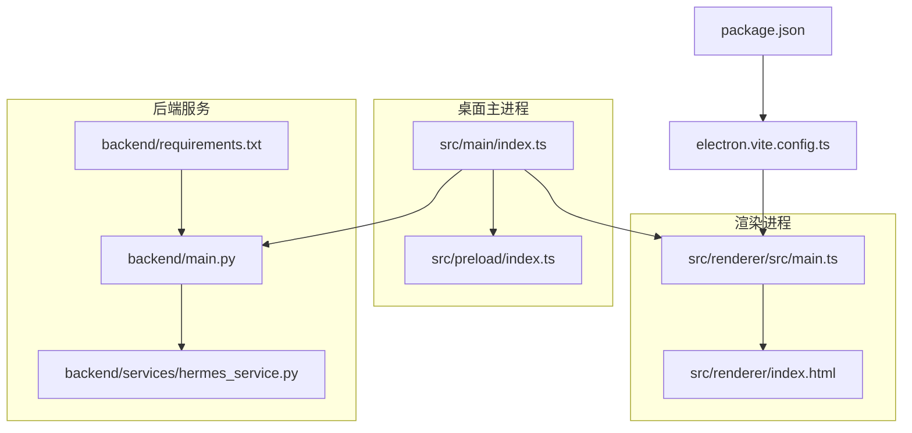
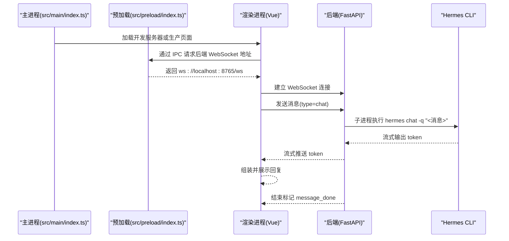
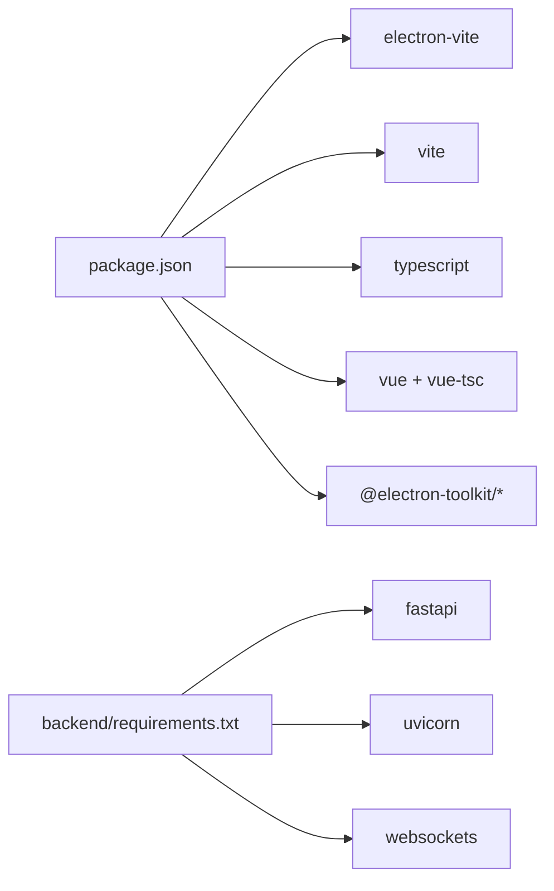

# 开发环境配置

<cite>
**本文引用的文件**
- [package.json](file://package.json)
- [pnpm-workspace.yaml](file://pnpm-workspace.yaml)
- [electron.vite.config.ts](file://electron.vite.config.ts)
- [tsconfig.json](file://tsconfig.json)
- [tsconfig.node.json](file://tsconfig.node.json)
- [tsconfig.web.json](file://tsconfig.web.json)
- [backend/requirements.txt](file://backend/requirements.txt)
- [backend/main.py](file://backend/main.py)
- [backend/services/hermes_service.py](file://backend/services/hermes_service.py)
- [src/main/index.ts](file://src/main/index.ts)
- [src/preload/index.ts](file://src/preload/index.ts)
- [src/renderer/src/main.ts](file://src/renderer/src/main.ts)
- [src/renderer/src/env.d.ts](file://src/renderer/src/env.d.ts)
- [src/renderer/index.html](file://src/renderer/index.html)
</cite>

## 目录
1. [简介](#简介)
2. [项目结构](#项目结构)
3. [核心组件](#核心组件)
4. [架构总览](#架构总览)
5. [详细组件分析](#详细组件分析)
6. [依赖分析](#依赖分析)
7. [性能考虑](#性能考虑)
8. [故障排查指南](#故障排查指南)
9. [结论](#结论)
10. [附录](#附录)

## 简介
本指南面向首次参与 Hermes Desktop 桌面应用开发的工程师，目标是帮助你在本地快速搭建可运行的开发环境。内容覆盖：
- Node.js 版本与包管理器（pnpm）选择及工作区配置
- 开发依赖安装与类型检查、代码格式化脚本
- Python 后端环境配置与服务启动
- Hermes Agent CLI 准备与调用
- IDE 推荐配置（VS Code 扩展与调试）
- 环境变量与开发服务器启动、热重载
- 常见问题排查与解决方案

## 项目结构
该项目采用 Electron + Vue 3 + TypeScript 技术栈，使用 electron-vite 作为构建与开发工具。前端为单页应用，后端为 Python FastAPI 服务，通过 WebSocket 与前端通信；桌面主进程负责窗口生命周期与 IPC，并在开发模式下从 Vite 开发服务器加载渲染进程。

图表来源
- [src/main/index.ts:1-62](file://src/main/index.ts#L1-L62)
- [src/preload/index.ts:1-24](file://src/preload/index.ts#L1-L24)
- [src/renderer/src/main.ts:1-11](file://src/renderer/src/main.ts#L1-L11)
- [src/renderer/index.html:1-13](file://src/renderer/index.html#L1-L13)
- [backend/main.py:1-71](file://backend/main.py#L1-L71)
- [backend/requirements.txt:1-4](file://backend/requirements.txt#L1-L4)
- [backend/services/hermes_service.py:1-82](file://backend/services/hermes_service.py#L1-L82)
- [electron.vite.config.ts:1-21](file://electron.vite.config.ts#L1-L21)
- [package.json:1-35](file://package.json#L1-L35)

章节来源
- [package.json:1-35](file://package.json#L1-L35)
- [electron.vite.config.ts:1-21](file://electron.vite.config.ts#L1-L21)
- [tsconfig.json:1-8](file://tsconfig.json#L1-L8)
- [tsconfig.node.json:1-13](file://tsconfig.node.json#L1-L13)
- [tsconfig.web.json:1-16](file://tsconfig.web.json#L1-L16)
- [backend/requirements.txt:1-4](file://backend/requirements.txt#L1-L4)
- [backend/main.py:1-71](file://backend/main.py#L1-L71)
- [backend/services/hermes_service.py:1-82](file://backend/services/hermes_service.py#L1-L82)
- [src/main/index.ts:1-62](file://src/main/index.ts#L1-L62)
- [src/preload/index.ts:1-24](file://src/preload/index.ts#L1-L24)
- [src/renderer/src/main.ts:1-11](file://src/renderer/src/main.ts#L1-L11)
- [src/renderer/src/env.d.ts:1-8](file://src/renderer/src/env.d.ts#L1-L8)
- [src/renderer/index.html:1-13](file://src/renderer/index.html#L1-L13)

## 核心组件
- 包管理与工作区：使用 pnpm 作为包管理器，并通过 pnpm-workspace.yaml 配置允许特定原生依赖构建（如 electron、esbuild、vue-demi），确保桌面应用编译顺利。
- 构建与开发：electron-vite 提供开发服务器与打包能力；TypeScript 多配置文件分别覆盖 Node 主进程与 Web 渲染进程。
- 前端：Vue 3 + Pinia + Vue Router，入口在渲染进程根 HTML 中挂载。
- 后端：FastAPI + Uvicorn，WebSocket 路由处理聊天请求；通过子进程调用 hermes CLI 获取响应流。
- 主进程：Electron 主进程负责窗口创建、菜单、IPC 注册以及在开发模式下加载 Vite 开发服务器地址。

章节来源
- [pnpm-workspace.yaml:1-5](file://pnpm-workspace.yaml#L1-L5)
- [electron.vite.config.ts:1-21](file://electron.vite.config.ts#L1-L21)
- [tsconfig.json:1-8](file://tsconfig.json#L1-L8)
- [tsconfig.node.json:1-13](file://tsconfig.node.json#L1-L13)
- [tsconfig.web.json:1-16](file://tsconfig.web.json#L1-L16)
- [src/renderer/src/main.ts:1-11](file://src/renderer/src/main.ts#L1-L11)
- [backend/main.py:1-71](file://backend/main.py#L1-L71)
- [backend/services/hermes_service.py:1-82](file://backend/services/hermes_service.py#L1-L82)
- [src/main/index.ts:1-62](file://src/main/index.ts#L1-L62)

## 架构总览
下图展示开发时的典型交互流程：Electron 主进程在开发模式下读取环境变量指向 Vite 开发服务器，渲染进程加载前端应用；用户输入经 WebSocket 发送到后端；后端通过 hermes CLI 子进程流式返回结果，再回传到前端进行展示。

图表来源
- [src/main/index.ts:46-48](file://src/main/index.ts#L46-L48)
- [src/preload/index.ts:5-7](file://src/preload/index.ts#L5-L7)
- [backend/main.py:31-54](file://backend/main.py#L31-L54)
- [backend/services/hermes_service.py:33-54](file://backend/services/hermes_service.py#L33-L54)

章节来源
- [src/main/index.ts:29-34](file://src/main/index.ts#L29-L34)
- [src/preload/index.ts:5-7](file://src/preload/index.ts#L5-L7)
- [backend/main.py:31-54](file://backend/main.py#L31-L54)
- [backend/services/hermes_service.py:33-54](file://backend/services/hermes_service.py#L33-L54)

## 详细组件分析

### Node.js 与包管理器（pnpm）配置
- 使用 pnpm 作为包管理器，具备更快安装速度与更严格的依赖隔离特性。
- 工作区配置允许对原生依赖（如 electron、esbuild、vue-demi）放行构建，避免因原生模块导致的安装失败。
- 项目脚本通过 electron-vite 提供开发、构建、预览与类型检查等命令。

章节来源
- [pnpm-workspace.yaml:1-5](file://pnpm-workspace.yaml#L1-L5)
- [package.json:8-16](file://package.json#L8-L16)
- [electron.vite.config.ts:1-21](file://electron.vite.config.ts#L1-L21)

### TypeScript 多配置与别名
- 根 tsconfig.json 引用 Node 与 Web 两套配置，分别用于主进程与渲染进程的类型检查。
- Web 配置启用路径别名 @/*，并与 electron-vite 的别名保持一致，便于统一导入。

章节来源
- [tsconfig.json:1-8](file://tsconfig.json#L1-L8)
- [tsconfig.node.json:1-13](file://tsconfig.node.json#L1-L13)
- [tsconfig.web.json:1-16](file://tsconfig.web.json#L1-L16)
- [electron.vite.config.ts:13-18](file://electron.vite.config.ts#L13-L18)

### 开发服务器与热重载
- 开发模式下，主进程会优先读取环境变量中的渲染器地址；若未设置，则加载生产页面。
- electron-vite 提供开发服务器与热重载能力，结合 Vue 插件实现前端热更新。

章节来源
- [src/main/index.ts:29-34](file://src/main/index.ts#L29-L34)
- [electron.vite.config.ts:1-21](file://electron.vite.config.ts#L1-L21)
- [package.json:8-11](file://package.json#L8-L11)

### 前端应用入口与路由状态
- 渲染进程入口初始化 Vue 应用、Pinia、路由，并挂载到页面根节点。
- 页面模板中以模块脚本方式引入入口文件，确保在现代浏览器中正确执行。

章节来源
- [src/renderer/src/main.ts:1-11](file://src/renderer/src/main.ts#L1-L11)
- [src/renderer/index.html:10-10](file://src/renderer/index.html#L10-L10)

### 后端服务与 WebSocket 协议
- 后端基于 FastAPI，开放健康检查与 WebSocket 接口。
- WebSocket 支持心跳与聊天两类消息；聊天消息通过子进程调用 hermes CLI 并流式返回 token，最后发送结束标记。

章节来源
- [backend/main.py:26-28](file://backend/main.py#L26-L28)
- [backend/main.py:31-54](file://backend/main.py#L31-L54)
- [backend/services/hermes_service.py:16-72](file://backend/services/hermes_service.py#L16-L72)

### 主进程与预加载桥接
- 主进程注册 IPC 事件，向渲染进程暴露后端地址；预加载脚本通过 contextBridge 暴露安全 API。
- 预加载脚本在隔离上下文中将 Electron 与自定义 API 暴露给渲染进程。

章节来源
- [src/main/index.ts:46-48](file://src/main/index.ts#L46-L48)
- [src/preload/index.ts:5-23](file://src/preload/index.ts#L5-L23)

### Python 环境与依赖
- 后端依赖通过 requirements.txt 管理，包含 FastAPI、Uvicorn 与 WebSocket 支持。
- 建议在 WSL 或 Linux 环境中运行后端，以便与 hermes CLI 协同工作。

章节来源
- [backend/requirements.txt:1-4](file://backend/requirements.txt#L1-L4)
- [backend/main.py:68-70](file://backend/main.py#L68-L70)

### Hermes Agent CLI 准备
- 后端通过子进程调用 hermes CLI，需确保其已安装且可在当前 PATH 中访问。
- 若未找到 CLI，服务会返回错误提示；建议在系统 PATH 中添加 CLI 安装目录。

章节来源
- [backend/services/hermes_service.py:34-41](file://backend/services/hermes_service.py#L34-L41)
- [backend/services/hermes_service.py:66-70](file://backend/services/hermes_service.py#L66-L70)

## 依赖分析
- Node 侧：electron-vite、Vite、Vue 生态、TypeScript 及相关类型定义。
- Python 侧：FastAPI、Uvicorn、websockets。
- 工作区策略：允许原生依赖构建，减少编译失败风险。

图表来源
- [package.json:17-33](file://package.json#L17-L33)
- [backend/requirements.txt:1-4](file://backend/requirements.txt#L1-L4)

章节来源
- [package.json:17-33](file://package.json#L17-L33)
- [backend/requirements.txt:1-4](file://backend/requirements.txt#L1-L4)

## 性能考虑
- 使用 pnpm 与 electron-vite 可显著提升安装与冷启动速度。
- 在渲染进程启用热重载与按需资源加载，避免不必要的全量刷新。
- 后端 WebSocket 流式传输减少等待时间，提升交互体验。

## 故障排查指南
- 后端无法启动或端口占用
  - 检查端口是否被占用，必要时修改后端监听端口或释放端口。
  - 章节来源: [backend/main.py:68-70](file://backend/main.py#L68-L70)
- hermes CLI 未找到
  - 确认 CLI 已安装并在 PATH 中可用；若未安装，请先完成 CLI 安装步骤。
  - 章节来源: [backend/services/hermes_service.py:66-70](file://backend/services/hermes_service.py#L66-L70)
- 开发服务器未加载或空白页面
  - 确认已设置渲染器地址环境变量，或检查开发服务器是否正常运行。
  - 章节来源: [src/main/index.ts:29-34](file://src/main/index.ts#L29-L34)
- WebSocket 连接失败
  - 检查后端是否在线、防火墙是否放行端口、CORS 是否允许跨域。
  - 章节来源: [backend/main.py:15-21](file://backend/main.py#L15-L21), [backend/main.py:31-54](file://backend/main.py#L31-L54)
- TypeScript 类型报错
  - 分别运行 Node 与 Web 的类型检查脚本，修复对应配置下的类型问题。
  - 章节来源: [package.json:12-14](file://package.json#L12-L14), [tsconfig.node.json:1-13](file://tsconfig.node.json#L1-L13), [tsconfig.web.json:1-16](file://tsconfig.web.json#L1-L16)

## 结论
通过以上配置与流程，你可以在本地完成 Hermes Desktop 的开发与调试。建议优先保证后端服务与 hermes CLI 的可用性，再启动前端开发服务器，以获得最佳的热重载与调试体验。

## 附录

### 环境变量与启动顺序
- 设置渲染器地址环境变量以启用开发服务器加载（开发模式）。
- 启动后端服务后再启动 Electron 主进程，确保 WebSocket 可用。
- 章节来源: [src/main/index.ts:29-34](file://src/main/index.ts#L29-L34), [backend/main.py:68-70](file://backend/main.py#L68-L70)

### VS Code 推荐扩展与调试
- 扩展建议：ESLint、TypeScript Vue Plugin、Prettier、Python、Debugger for Chrome（调试渲染进程）、ES7+ React/Redux/React-Native snippets（如需）。
- 调试配置要点：
  - 使用 Electron 主进程调试任务，附加到主进程。
  - 使用浏览器调试工具调试渲染进程。
  - 使用 Python 调试器启动后端服务，或直接在终端运行后端脚本。
- 章节来源: [src/main/index.ts:1-62](file://src/main/index.ts#L1-L62), [backend/main.py:68-70](file://backend/main.py#L68-L70)