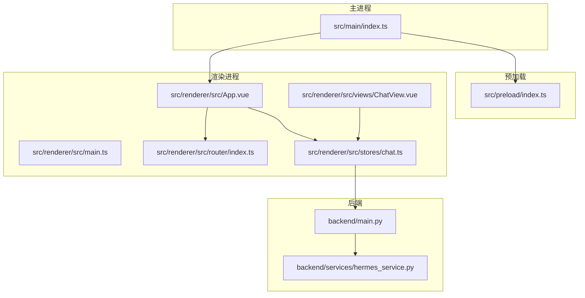
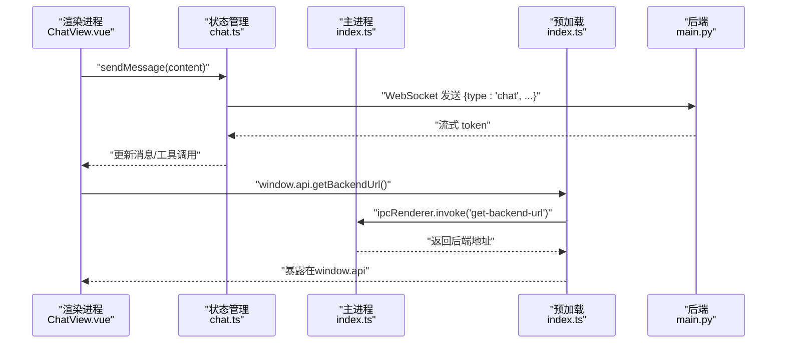
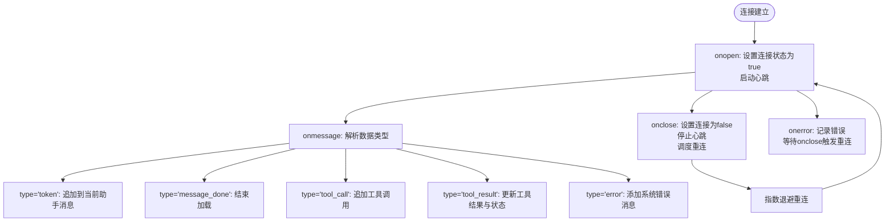
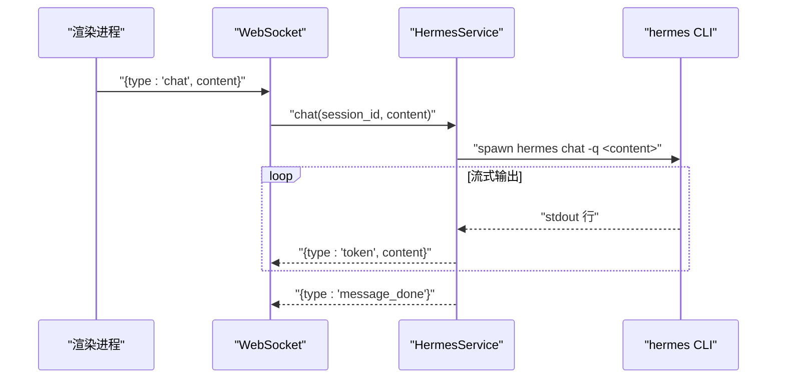
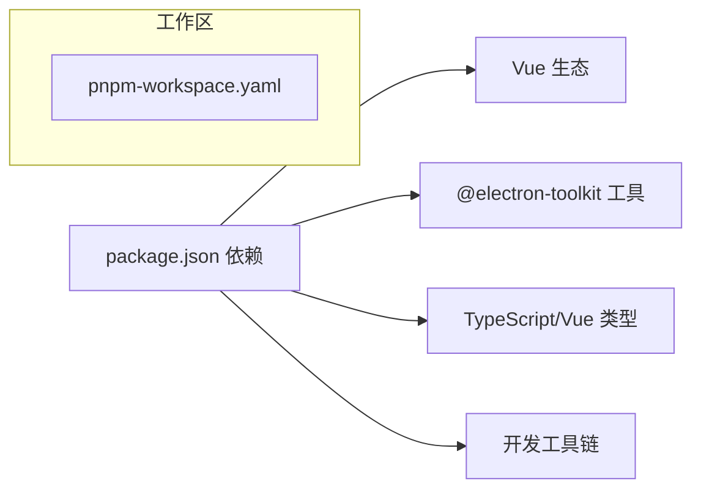

# 开发者指南

<cite>
**本文引用的文件**
- [package.json](file://package.json)
- [electron.vite.config.ts](file://electron.vite.config.ts)
- [tsconfig.json](file://tsconfig.json)
- [tsconfig.node.json](file://tsconfig.node.json)
- [tsconfig.web.json](file://tsconfig.web.json)
- [pnpm-workspace.yaml](file://pnpm-workspace.yaml)
- [src/main/index.ts](file://src/main/index.ts)
- [src/preload/index.ts](file://src/preload/index.ts)
- [src/renderer/src/main.ts](file://src/renderer/src/main.ts)
- [src/renderer/src/App.vue](file://src/renderer/src/App.vue)
- [src/renderer/src/router/index.ts](file://src/renderer/src/router/index.ts)
- [src/renderer/src/stores/chat.ts](file://src/renderer/src/stores/chat.ts)
- [src/renderer/src/views/ChatView.vue](file://src/renderer/src/views/ChatView.vue)
- [backend/main.py](file://backend/main.py)
- [backend/services/hermes_service.py](file://backend/services/hermes_service.py)
</cite>

## 目录
1. [简介](#简介)
2. [项目结构](#项目结构)
3. [核心组件](#核心组件)
4. [架构总览](#架构总览)
5. [详细组件分析](#详细组件分析)
6. [依赖分析](#依赖分析)
7. [性能考虑](#性能考虑)
8. [故障排查指南](#故障排查指南)
9. [结论](#结论)
10. [附录](#附录)

## 简介
本指南面向Hermes Desktop的开发者，覆盖开发环境搭建、代码规范与最佳实践、调试与性能分析、构建与测试、持续集成、项目结构与模块依赖、常见问题与性能优化建议，以及贡献与发布流程。项目采用Electron + Vue 3 + TypeScript + Pinia + Vite的组合，前端通过WebSocket与Python后端通信。

## 项目结构
项目采用分层与职责分离的组织方式：
- 主进程：负责窗口生命周期、IPC、加载渲染进程资源（开发模式下指向Vite Dev Server，生产模式加载打包后的HTML）。
- 预加载脚本：通过contextBridge暴露受控API给渲染进程，确保安全隔离。
- 渲染进程：Vue应用，包含路由、状态管理（Pinia）、视图组件与样式。
- 后端服务：Python FastAPI应用，提供健康检查与WebSocket接口，内部通过子进程调用Hermes CLI进行对话流式响应。

图表来源
- [src/main/index.ts:1-62](file://src/main/index.ts#L1-L62)
- [src/preload/index.ts:1-24](file://src/preload/index.ts#L1-L24)
- [src/renderer/src/main.ts:1-11](file://src/renderer/src/main.ts#L1-L11)
- [src/renderer/src/App.vue:1-178](file://src/renderer/src/App.vue#L1-L178)
- [src/renderer/src/router/index.ts:1-16](file://src/renderer/src/router/index.ts#L1-L16)
- [src/renderer/src/stores/chat.ts:1-263](file://src/renderer/src/stores/chat.ts#L1-L263)
- [src/renderer/src/views/ChatView.vue:1-325](file://src/renderer/src/views/ChatView.vue#L1-L325)
- [backend/main.py:1-71](file://backend/main.py#L1-L71)
- [backend/services/hermes_service.py:1-82](file://backend/services/hermes_service.py#L1-L82)

章节来源
- [package.json:1-35](file://package.json#L1-L35)
- [electron.vite.config.ts:1-21](file://electron.vite.config.ts#L1-L21)
- [tsconfig.json:1-8](file://tsconfig.json#L1-L8)
- [tsconfig.node.json:1-13](file://tsconfig.node.json#L1-L13)
- [tsconfig.web.json:1-16](file://tsconfig.web.json#L1-L16)

## 核心组件
- 主进程窗口与生命周期：创建窗口、菜单栏隐藏、外部链接处理、开发模式加载Vite Dev Server或生产HTML。
- 预加载脚本：通过contextBridge暴露自定义API（如获取后端地址），并与@electron-toolkit/utils提供的API桥接。
- 渲染主程序：创建Vue应用，挂载Pinia与路由。
- 聊天状态管理：维护会话列表、当前会话、连接状态、加载状态与WebSocket连接；实现心跳、指数退避重连、消息解析与工具调用展示。
- 路由与视图：单页路由到聊天视图，视图内实现Markdown渲染、自动滚动、发送消息等交互。
- 后端FastAPI：健康检查、WebSocket端点、CORS中间件；服务封装Hermes Agent子进程调用，流式返回token与错误信息。

章节来源
- [src/main/index.ts:1-62](file://src/main/index.ts#L1-L62)
- [src/preload/index.ts:1-24](file://src/preload/index.ts#L1-L24)
- [src/renderer/src/main.ts:1-11](file://src/renderer/src/main.ts#L1-L11)
- [src/renderer/src/stores/chat.ts:1-263](file://src/renderer/src/stores/chat.ts#L1-L263)
- [src/renderer/src/router/index.ts:1-16](file://src/renderer/src/router/index.ts#L1-L16)
- [src/renderer/src/views/ChatView.vue:1-325](file://src/renderer/src/views/ChatView.vue#L1-L325)
- [backend/main.py:1-71](file://backend/main.py#L1-L71)
- [backend/services/hermes_service.py:1-82](file://backend/services/hermes_service.py#L1-L82)

## 架构总览
系统采用“桌面客户端 + Web服务 + AI代理”的三层架构：
- 客户端层：Electron主进程负责窗口与系统集成，渲染进程负责UI与交互。
- 通信层：渲染进程通过WebSocket与后端通信；主进程通过IPC向渲染进程提供后端地址。
- 服务层：后端FastAPI提供REST与WebSocket接口，内部通过子进程调用Hermes CLI以流式方式返回响应。

图表来源
- [src/renderer/src/views/ChatView.vue:118-126](file://src/renderer/src/views/ChatView.vue#L118-L126)
- [src/renderer/src/stores/chat.ts:209-232](file://src/renderer/src/stores/chat.ts#L209-L232)
- [src/preload/index.ts:5-7](file://src/preload/index.ts#L5-L7)
- [src/main/index.ts:45-48](file://src/main/index.ts#L45-L48)
- [backend/main.py:31-66](file://backend/main.py#L31-L66)

## 详细组件分析

### TypeScript与构建配置
- 多TS配置文件分层：
  - 根tsconfig.json：聚合node/web两个编译引用。
  - tsconfig.node.json：扩展@electron-toolkit/tsconfig，包含主进程与预加载脚本，启用electron-vite/node类型。
  - tsconfig.web.json：扩展@electron-toolkit/tsconfig，包含渲染器源码与env.d.ts，设置路径别名@指向src/renderer/src。
- electron.vite.config.ts：为main/preload启用externalizeDepsPlugin，为renderer启用@vitejs/plugin-vue并配置路径别名。
- package.json脚本：提供dev/build/preview/typecheck/lint等命令，分别对应开发、构建、预览、类型检查与代码格式修复。

章节来源
- [tsconfig.json:1-8](file://tsconfig.json#L1-L8)
- [tsconfig.node.json:1-13](file://tsconfig.node.json#L1-L13)
- [tsconfig.web.json:1-16](file://tsconfig.web.json#L1-L16)
- [electron.vite.config.ts:1-21](file://electron.vite.config.ts#L1-L21)
- [package.json:8-16](file://package.json#L8-L16)

### 主进程与窗口控制
- 创建窗口：设置尺寸、最小宽高、菜单栏隐藏、preload路径、沙箱关闭；开发模式优先加载ELECTRON_RENDERER_URL，否则加载打包后的index.html。
- 全局快捷键监听：F12默认打开/关闭DevTools。
- IPC：提供get-backend-url的invoke处理，返回后端WebSocket地址。

章节来源
- [src/main/index.ts:5-35](file://src/main/index.ts#L5-L35)
- [src/main/index.ts:37-55](file://src/main/index.ts#L37-L55)
- [src/main/index.ts:45-48](file://src/main/index.ts#L45-L48)

### 预加载脚本与安全桥接
- 使用contextBridge将electronAPI与自定义api暴露到window对象，支持上下文隔离与非隔离两种场景。
- 自定义API：getBackendUrl通过ipcRenderer.invoke调用主进程处理函数。

章节来源
- [src/preload/index.ts:1-24](file://src/preload/index.ts#L1-L24)

### 渲染主程序与应用入口
- 创建Vue应用，注册Pinia与路由，挂载根组件。

章节来源
- [src/renderer/src/main.ts:1-11](file://src/renderer/src/main.ts#L1-L11)

### 应用布局与侧边栏
- 布局容器：左右分栏，左侧侧边栏显示会话列表与连接状态，右侧主内容区承载路由视图。
- 交互：新建会话、切换会话、删除会话、连接状态指示。

章节来源
- [src/renderer/src/App.vue:1-178](file://src/renderer/src/App.vue#L1-L178)

### 路由与视图
- 单页路由：Hash History，根路径映射到ChatView。
- ChatView：空态提示、消息渲染、工具调用展示、输入框与发送按钮、自动滚动至底部。

章节来源
- [src/renderer/src/router/index.ts:1-16](file://src/renderer/src/router/index.ts#L1-L16)
- [src/renderer/src/views/ChatView.vue:1-325](file://src/renderer/src/views/ChatView.vue#L1-L325)

### 状态管理（Pinia）
- 数据模型：Message、ToolCall、Session。
- 核心能力：
  - 会话管理：创建、删除、切换、获取当前会话。
  - WebSocket：建立连接、心跳、断线重连（指数退避，最大延迟限制）、消息解析（token/message_done/tool_call/tool_result/error）。
  - 发送消息：构造用户消息并发送，标记加载状态。
  - 断开连接：停止心跳、清理定时器、关闭WebSocket。

图表来源
- [src/renderer/src/stores/chat.ts:110-150](file://src/renderer/src/stores/chat.ts#L110-L150)
- [src/renderer/src/stores/chat.ts:152-207](file://src/renderer/src/stores/chat.ts#L152-L207)
- [src/renderer/src/stores/chat.ts:99-108](file://src/renderer/src/stores/chat.ts#L99-L108)

章节来源
- [src/renderer/src/stores/chat.ts:1-263](file://src/renderer/src/stores/chat.ts#L1-L263)

### 后端服务与代理集成
- FastAPI应用：健康检查端点、WebSocket端点、CORS中间件。
- WebSocket协议：
  - 客户端发送：{type:'chat', session_id, content} 或 {type:'ping'}。
  - 服务端响应：流式返回{type:'token', content}，结束时发送{type:'message_done'}；错误时发送{type:'error', message}。
- HermesService：维护会话历史，通过子进程调用hermes CLI，逐行读取stdout并流式返回token；处理CLI不存在与异常情况。

图表来源
- [backend/main.py:31-66](file://backend/main.py#L31-L66)
- [backend/services/hermes_service.py:16-72](file://backend/services/hermes_service.py#L16-L72)

章节来源
- [backend/main.py:1-71](file://backend/main.py#L1-L71)
- [backend/services/hermes_service.py:1-82](file://backend/services/hermes_service.py#L1-L82)

## 依赖分析
- 包管理：使用pnpm工作区，允许Electron、esbuild、vue-demi等包构建。
- 运行时依赖：Vue 3、Pinia、Vue Router、@electron-toolkit/preload、@electron-toolkit/utils。
- 开发依赖：electron、electron-vite、vite、@vitejs/plugin-vue、TypeScript、vue-tsc、@electron-toolkit/tsconfig、@types/node。
- TypeScript配置：多引用tsconfig，分别针对Node/Electron主进程与Web渲染器。

图表来源
- [package.json:17-33](file://package.json#L17-L33)
- [pnpm-workspace.yaml:1-5](file://pnpm-workspace.yaml#L1-L5)

章节来源
- [package.json:1-35](file://package.json#L1-L35)
- [pnpm-workspace.yaml:1-5](file://pnpm-workspace.yaml#L1-L5)

## 性能考虑
- 渲染性能
  - 列表渲染：使用v-for配合key，避免不必要的重排。
  - 自动滚动：仅在消息数量变化时滚动到底部，减少DOM操作。
  - Markdown渲染：当前为基础转义与换行，可按需引入轻量渲染库。
- 状态与内存
  - 会话历史：按会话维护消息数组，删除会话时及时清理引用。
  - WebSocket：断开连接时停止心跳与定时器，防止内存泄漏。
- 网络与连接
  - 心跳：固定间隔发送ping，保持长连接活跃。
  - 重连：指数退避，最大延迟限制，避免频繁重试。
- 打包与构建
  - electron-vite对主进程与预加载启用externalizeDepsPlugin，减少打包体积。
  - 渲染器使用Vue插件与路径别名，提升开发体验与构建效率。

章节来源
- [src/renderer/src/views/ChatView.vue:112-116](file://src/renderer/src/views/ChatView.vue#L112-L116)
- [src/renderer/src/stores/chat.ts:83-97](file://src/renderer/src/stores/chat.ts#L83-L97)
- [src/renderer/src/stores/chat.ts:99-108](file://src/renderer/src/stores/chat.ts#L99-L108)
- [electron.vite.config.ts:6-11](file://electron.vite.config.ts#L6-L11)

## 故障排查指南
- 开发服务器无法访问
  - 确认主进程在开发模式下设置了ELECTRON_RENDERER_URL，并且值有效。
  - 参考：[src/main/index.ts:29-34](file://src/main/index.ts#L29-L34)
- WebSocket连接失败
  - 检查后端是否运行在默认端口，确认CORS配置。
  - 查看渲染端日志与错误消息，确认连接状态与重连逻辑。
  - 参考：[backend/main.py:15-21](file://backend/main.py#L15-L21)，[src/renderer/src/stores/chat.ts:110-150](file://src/renderer/src/stores/chat.ts#L110-L150)
- Hermes CLI不可用
  - 确保hermes命令在PATH中，或修改服务端调用路径。
  - 参考：[backend/services/hermes_service.py:34-41](file://backend/services/hermes_service.py#L34-L41)
- 预加载API不可用
  - 确认上下文隔离与try/catch保护逻辑正常执行。
  - 参考：[src/preload/index.ts:11-23](file://src/preload/index.ts#L11-L23)
- 类型检查失败
  - 分别运行typecheck:node与typecheck:web，定位具体文件。
  - 参考：[package.json:12-14](file://package.json#L12-L14)

章节来源
- [src/main/index.ts:29-34](file://src/main/index.ts#L29-L34)
- [backend/main.py:15-21](file://backend/main.py#L15-L21)
- [src/renderer/src/stores/chat.ts:110-150](file://src/renderer/src/stores/chat.ts#L110-L150)
- [backend/services/hermes_service.py:34-41](file://backend/services/hermes_service.py#L34-L41)
- [src/preload/index.ts:11-23](file://src/preload/index.ts#L11-L23)
- [package.json:12-14](file://package.json#L12-L14)

## 结论
本指南提供了Hermes Desktop的开发环境、代码规范、调试与性能优化、构建与测试、依赖与结构组织的完整参考。遵循本文档可快速上手开发、稳定迭代并高质量交付产品。

## 附录

### 开发环境配置
- Node与包管理：使用pnpm，启用工作区。
- TypeScript：多tsconfig分层，分别校验Node与Web代码。
- Vite/Electron：使用electron-vite进行开发与构建。
- 参考文件：[package.json:1-35](file://package.json#L1-L35)，[electron.vite.config.ts:1-21](file://electron.vite.config.ts#L1-L21)，[tsconfig.json:1-8](file://tsconfig.json#L1-L8)，[tsconfig.node.json:1-13](file://tsconfig.node.json#L1-L13)，[tsconfig.web.json:1-16](file://tsconfig.web.json#L1-L16)，[pnpm-workspace.yaml:1-5](file://pnpm-workspace.yaml#L1-L5)

### 代码规范与最佳实践
- TypeScript
  - 使用严格类型声明，接口与类型拆分清晰。
  - 在渲染器使用setup语法糖，保持组合式API一致性。
- Vue
  - 组件职责单一，状态集中于Pinia。
  - 使用scoped样式与语义化类名，避免全局污染。
- Electron
  - 预加载脚本中谨慎暴露API，确保上下文隔离。
  - 主进程IPC处理集中在一处，便于维护。
- 参考文件：[src/renderer/src/stores/chat.ts:1-263](file://src/renderer/src/stores/chat.ts#L1-L263)，[src/renderer/src/views/ChatView.vue:1-325](file://src/renderer/src/views/ChatView.vue#L1-L325)，[src/preload/index.ts:1-24](file://src/preload/index.ts#L1-L24)，[src/main/index.ts:1-62](file://src/main/index.ts#L1-L62)

### 调试技巧与工具
- 开发服务器调试
  - 使用dev脚本启动，主进程加载ELECTRON_RENDERER_URL。
  - 参考：[package.json:8-9](file://package.json#L8-L9)，[src/main/index.ts:29-34](file://src/main/index.ts#L29-L34)
- 生产环境调试
  - 使用preview脚本预览构建产物，验证窗口与资源加载。
  - 参考：[package.json:10-11](file://package.json#L10-L11)
- 性能分析
  - 使用Electron DevTools与浏览器性能面板分析渲染与网络。
  - 关注WebSocket消息频率与渲染更新节流。
- 参考文件：[src/main/index.ts:40-43](file://src/main/index.ts#L40-L43)

### 构建与测试
- 构建
  - 使用build脚本生成可分发产物，主进程与预加载独立打包。
  - 参考：[package.json](file://package.json#L10)，[electron.vite.config.ts:6-11](file://electron.vite.config.ts#L6-L11)
- 测试策略
  - 建议：单元测试覆盖Pinia Store逻辑；集成测试覆盖WebSocket端到端流程；快照测试覆盖关键UI组件。
  - 当前仓库未包含测试文件，可在后续迭代中补充。
- 持续集成
  - 建议：在CI中执行typecheck、lint与构建，确保跨平台兼容性。
  - 参考：[package.json:12-16](file://package.json#L12-L16)

### 项目结构组织与模块依赖
- 层次化组织：主进程、预加载、渲染器、后端清晰分离。
- 模块依赖：渲染器依赖Vue/Pinia/Router；主进程依赖Electron与工具库；后端依赖FastAPI与子进程。
- 参考文件：[src/renderer/src/main.ts:1-11](file://src/renderer/src/main.ts#L1-L11)，[src/main/index.ts:1-62](file://src/main/index.ts#L1-L62)，[backend/main.py:1-71](file://backend/main.py#L1-L71)

### 常见开发问题与解决方案
- WebSocket未连接：检查后端地址获取与连接状态，确认心跳与重连逻辑。
  - 参考：[src/renderer/src/stores/chat.ts:110-150](file://src/renderer/src/stores/chat.ts#L110-L150)
- 后端不可达：确认后端服务运行与端口开放，检查CORS配置。
  - 参考：[backend/main.py:68-70](file://backend/main.py#L68-L70)
- CLI不可用：确保hermes命令可用或修正调用路径。
  - 参考：[backend/services/hermes_service.py:66-70](file://backend/services/hermes_service.py#L66-L70)

### 贡献指南、代码审查与发布流程
- 贡献指南
  - 提交前执行类型检查与代码格式修复。
  - 参考：[package.json:12-16](file://package.json#L12-L16)
- 代码审查
  - 关注：类型安全、状态管理幂等性、WebSocket连接健壮性、预加载API安全性。
- 发布流程
  - 建议：先构建产物，再进行跨平台打包与签名，最后发布版本标签。
  - 参考：[package.json](file://package.json#L10)