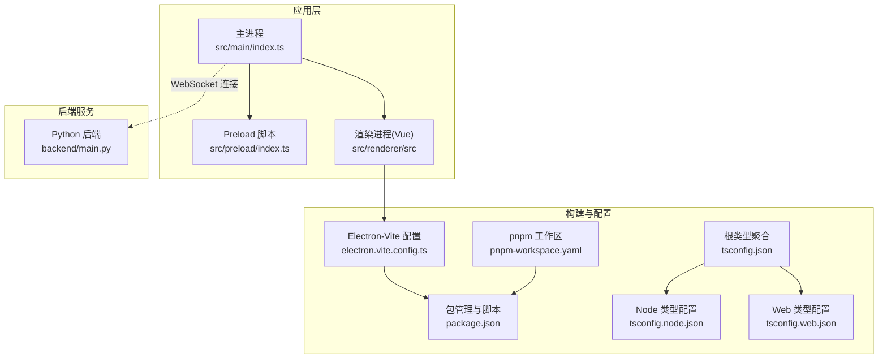
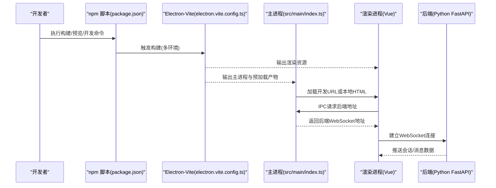
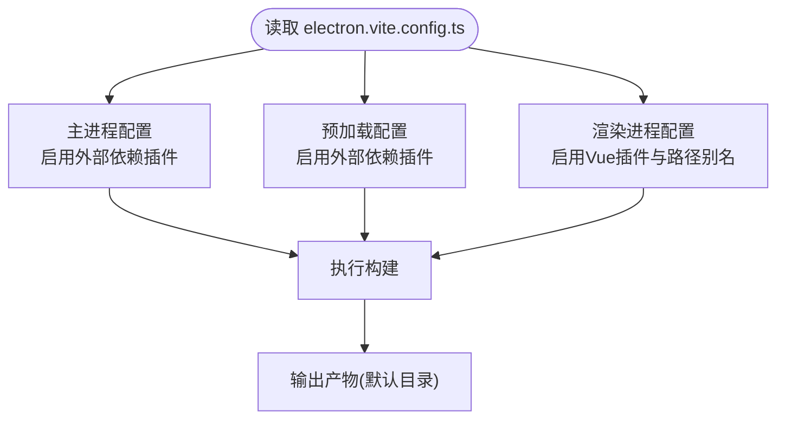
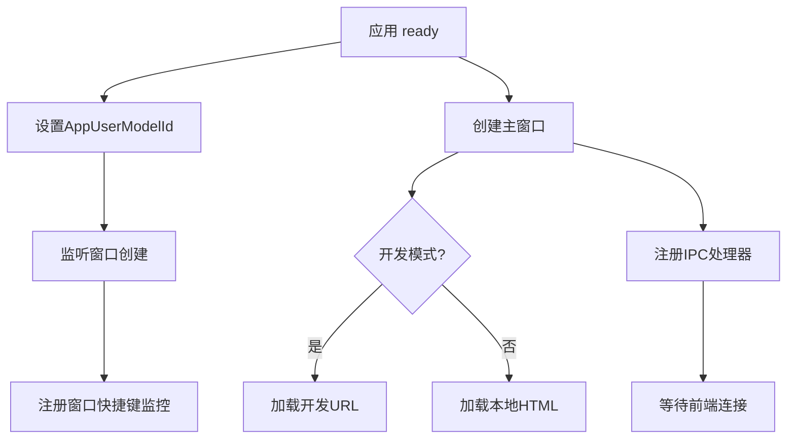
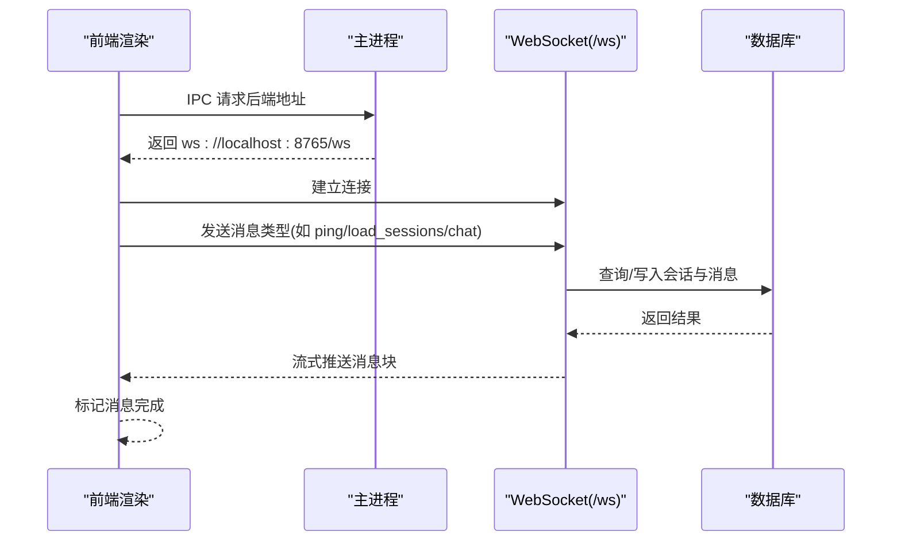
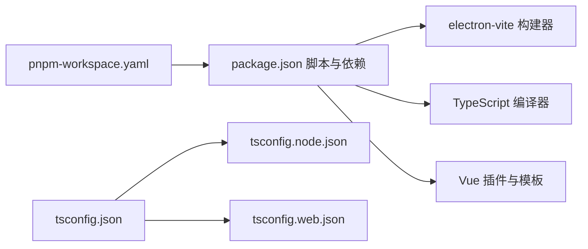

# 构建与部署

<cite>
**本文引用的文件**
- [electron.vite.config.ts](file://electron.vite.config.ts)
- [package.json](file://package.json)
- [src/main/index.ts](file://src/main/index.ts)
- [backend/main.py](file://backend/main.py)
- [pnpm-workspace.yaml](file://pnpm-workspace.yaml)
- [tsconfig.json](file://tsconfig.json)
- [tsconfig.node.json](file://tsconfig.node.json)
- [tsconfig.web.json](file://tsconfig.web.json)
</cite>

## 目录
1. [简介](#简介)
2. [项目结构](#项目结构)
3. [核心组件](#核心组件)
4. [架构总览](#架构总览)
5. [详细组件分析](#详细组件分析)
6. [依赖分析](#依赖分析)
7. [性能考虑](#性能考虑)
8. [故障排查指南](#故障排查指南)
9. [结论](#结论)
10. [附录](#附录)

## 简介
本指南面向Hermes Desktop的构建与部署，聚焦于Electron-Vite工程化体系、资源打包与依赖处理、多平台构建脚本、签名与公证流程、CI/CD集成与自动化测试、发布流程、性能优化（包体积与启动速度）、以及版本管理策略。文档以仓库现有配置为依据，结合实际代码行为，给出可操作的步骤与最佳实践。

## 项目结构
Hermes Desktop采用Electron-Vite多环境（main、preload、renderer）分层组织，配合TypeScript类型检查与Vue渲染层，后端以Python FastAPI运行在WSL中并通过WebSocket与前端通信。构建脚本通过npm scripts统一调度，使用pnpm工作区支持Electron生态工具链。

**图表来源**
- [src/main/index.ts:1-62](file://src/main/index.ts#L1-L62)
- [electron.vite.config.ts:1-21](file://electron.vite.config.ts#L1-L21)
- [package.json:1-35](file://package.json#L1-L35)
- [tsconfig.json:1-8](file://tsconfig.json#L1-L8)
- [tsconfig.node.json:1-13](file://tsconfig.node.json#L1-L13)
- [tsconfig.web.json:1-16](file://tsconfig.web.json#L1-L16)
- [pnpm-workspace.yaml:1-5](file://pnpm-workspace.yaml#L1-L5)
- [backend/main.py:1-114](file://backend/main.py#L1-L114)

**章节来源**
- [package.json:1-35](file://package.json#L1-L35)
- [electron.vite.config.ts:1-21](file://electron.vite.config.ts#L1-L21)
- [tsconfig.json:1-8](file://tsconfig.json#L1-L8)
- [tsconfig.node.json:1-13](file://tsconfig.node.json#L1-L13)
- [tsconfig.web.json:1-16](file://tsconfig.web.json#L1-L16)
- [pnpm-workspace.yaml:1-5](file://pnpm-workspace.yaml#L1-L5)

## 核心组件
- 主进程：负责窗口生命周期、IPC、加载开发或生产资源，并向渲染进程注入预加载脚本。
- 预加载脚本：提供受限的Node能力给渲染进程，确保安全上下文。
- 渲染进程：基于Vue 3 + Vue Router + Pinia，入口位于src/renderer/src/main.ts。
- 构建配置：Electron-Vite按环境拆分配置，启用别名与Vue插件；TypeScript通过多tsconfig实现分层类型检查。
- 后端服务：Python FastAPI在WSL中运行，提供健康检查与WebSocket接口，供前端通过IPC查询后端地址并建立连接。

**章节来源**
- [src/main/index.ts:1-62](file://src/main/index.ts#L1-L62)
- [electron.vite.config.ts:1-21](file://electron.vite.config.ts#L1-L21)
- [tsconfig.node.json:1-13](file://tsconfig.node.json#L1-L13)
- [tsconfig.web.json:1-16](file://tsconfig.web.json#L1-L16)
- [backend/main.py:1-114](file://backend/main.py#L1-L114)

## 架构总览
下图展示从开发到生产的典型流程：开发者执行npm脚本触发Electron-Vite构建，生成主进程、预加载与渲染产物；主进程根据运行模式加载开发服务器或本地HTML；渲染侧由Vite提供热更新；后端在WSL中通过WebSocket与前端通信。

**图表来源**
- [package.json:8-16](file://package.json#L8-L16)
- [electron.vite.config.ts:5-20](file://electron.vite.config.ts#L5-L20)
- [src/main/index.ts:29-34](file://src/main/index.ts#L29-L34)
- [backend/main.py:42-98](file://backend/main.py#L42-L98)

## 详细组件分析

### Electron-Vite 配置与资源打包
- 多环境插件：主进程与预加载使用外部依赖插件，减少打包体积；渲染进程启用Vue插件与路径别名。
- 别名与解析：渲染侧将@指向src/renderer/src，便于模块导入。
- 构建产物：由脚本输出至默认目录，主进程入口在package.json中声明。

**图表来源**
- [electron.vite.config.ts:5-20](file://electron.vite.config.ts#L5-L20)

**章节来源**
- [electron.vite.config.ts:1-21](file://electron.vite.config.ts#L1-L21)

### 主进程与窗口生命周期
- 窗口参数：固定最小尺寸、隐藏显示直至ready-to-show、禁用沙箱的预加载注入。
- 外部链接处理：统一通过系统shell打开，避免在应用内打开未知页面。
- 开发与生产加载逻辑：开发时优先加载环境变量指定的渲染地址，否则加载本地HTML。
- IPC：提供后端地址查询，前端据此连接WebSocket。

**图表来源**
- [src/main/index.ts:37-55](file://src/main/index.ts#L37-L55)
- [src/main/index.ts:5-35](file://src/main/index.ts#L5-L35)

**章节来源**
- [src/main/index.ts:1-62](file://src/main/index.ts#L1-L62)

### 渲染进程与类型配置
- 入口与路由：渲染入口位于src/renderer/src/main.ts，路由与状态管理分别在router与stores目录。
- 类型检查：根tsconfig聚合node/web两套配置，分别约束主/预加载与渲染侧源码范围与路径别名。
- Vue生态：使用@vitejs/plugin-vue，模板与类型由vue-tsc保障。

**章节来源**
- [tsconfig.json:1-8](file://tsconfig.json#L1-L8)
- [tsconfig.node.json:1-13](file://tsconfig.node.json#L1-L13)
- [tsconfig.web.json:1-16](file://tsconfig.web.json#L1-L16)
- [package.json:12-16](file://package.json#L12-L16)

### 后端服务与通信
- 服务职责：FastAPI提供健康检查与WebSocket端点，数据库会话与消息的增删查与流式聊天。
- CORS：允许任意来源，便于前后端联调。
- 异常处理：捕获断开与异常并向客户端发送错误消息。

**图表来源**
- [src/main/index.ts:46-48](file://src/main/index.ts#L46-L48)
- [backend/main.py:37-108](file://backend/main.py#L37-L108)

**章节来源**
- [backend/main.py:1-114](file://backend/main.py#L1-L114)
- [src/main/index.ts:46-48](file://src/main/index.ts#L46-L48)

## 依赖分析
- 包管理与脚本：npm scripts统一调度开发、构建、预览与类型检查；依赖与开发依赖覆盖Electron、Vite、TypeScript与Vue生态。
- 工作区：pnpm工作区允许Electron相关工具链被允许构建。
- 类型系统：根tsconfig引用node/web两套配置，分别约束不同环境的编译范围与路径映射。

**图表来源**
- [package.json:8-33](file://package.json#L8-L33)
- [pnpm-workspace.yaml:1-5](file://pnpm-workspace.yaml#L1-L5)
- [tsconfig.json:3-6](file://tsconfig.json#L3-L6)

**章节来源**
- [package.json:1-35](file://package.json#L1-L35)
- [pnpm-workspace.yaml:1-5](file://pnpm-workspace.yaml#L1-L5)
- [tsconfig.json:1-8](file://tsconfig.json#L1-L8)

## 性能考虑
- 包体积控制
  - 使用外部依赖插件减少主进程与预加载打包体积，降低冷启动时间。
  - 仅引入必要依赖，避免将大型库打入主进程。
- 启动速度优化
  - 将非关键初始化延迟到窗口ready-to-show之后执行。
  - 在开发模式下利用Vite热更新，缩短迭代周期。
- 渲染侧优化
  - 按需加载路由与组件，减少首屏资源。
  - 保持Vue组件简洁，避免深层嵌套与重复渲染。
- 后端通信
  - 使用WebSocket流式推送，避免一次性大包传输。
  - 对异常进行快速反馈，减少无效重试。

[本节为通用指导，无需列出具体文件来源]

## 故障排查指南
- 开发模式无法加载渲染页面
  - 确认开发URL环境变量已正确设置，且主进程分支逻辑命中开发路径。
  - 检查渲染端端口是否被占用，或代理/防火墙拦截。
- WebSocket连接失败
  - 确认后端服务已启动且监听在预期地址与端口。
  - 检查CORS配置与跨域策略，确保前端可访问。
- 构建报错
  - 运行类型检查脚本定位问题，优先修复Node与Web侧类型错误。
  - 清理缓存后重试，必要时升级Electron-Vite与相关插件版本。
- 窗口无法显示或快捷键失效
  - 确认窗口ready-to-show事件已触发后再显示。
  - 检查快捷键监控注册是否在窗口创建事件后执行。

**章节来源**
- [src/main/index.ts:29-34](file://src/main/index.ts#L29-L34)
- [backend/main.py:26-32](file://backend/main.py#L26-L32)
- [package.json:12-16](file://package.json#L12-L16)

## 结论
本指南基于仓库现有配置，梳理了Hermes Desktop的构建与部署要点：以Electron-Vite为核心，结合TypeScript类型系统与Vue渲染层；主进程负责窗口与IPC，后端以Python FastAPI提供WebSocket服务。建议在CI/CD中加入类型检查与构建校验，在发布前完成签名与公证流程，并持续关注包体积与启动性能指标。

[本节为总结性内容，无需列出具体文件来源]

## 附录

### 构建与预览脚本
- 开发：启动Electron-Vite开发服务器，自动热更新。
- 构建：产出主进程、预加载与渲染三类产物。
- 预览：本地预览构建产物。
- 类型检查：分别对Node与Web侧进行类型校验。
- Lint：全局ESLint修复。

**章节来源**
- [package.json:8-16](file://package.json#L8-L16)

### 多平台构建与分发策略
- 平台矩阵：在CI中并行构建Windows/macOS/Linux目标。
- 安装包：使用Electron Forge或类似工具生成安装包（需在CI中配置）。
- 自动化测试：在构建后执行端到端测试，确保窗口、IPC与WebSocket通信正常。
- 发布：制品上传至发布渠道（如GitHub Releases），并生成变更日志。

[本节为通用指导，无需列出具体文件来源]

### 签名与公证流程
- Windows：使用代码签名证书对可执行文件与安装包进行签名。
- macOS：使用Apple Developer证书进行签名与公证，确保Gatekeeper放行。
- Linux：遵循发行渠道要求，必要时提供AppImage/Deb/RPM等格式。

[本节为通用指导，无需列出具体文件来源]

### CI/CD 集成与自动化测试
- 触发条件：主干分支推送触发构建与测试。
- 步骤：安装依赖、类型检查、构建、测试、打包、发布。
- 缓存策略：缓存包管理器与构建缓存，提升流水线效率。
- 产物归档：保存构建产物与测试报告。

[本节为通用指导，无需列出具体文件来源]

### 版本管理策略
- 语义化版本：依据功能与破坏性变更选择主/次/补丁版本号。
- 变更日志：每次发布生成变更摘要，标注新增、修复与废弃项。
- 回滚预案：保留上一版本制品，确保紧急回滚可用。

[本节为通用指导，无需列出具体文件来源]