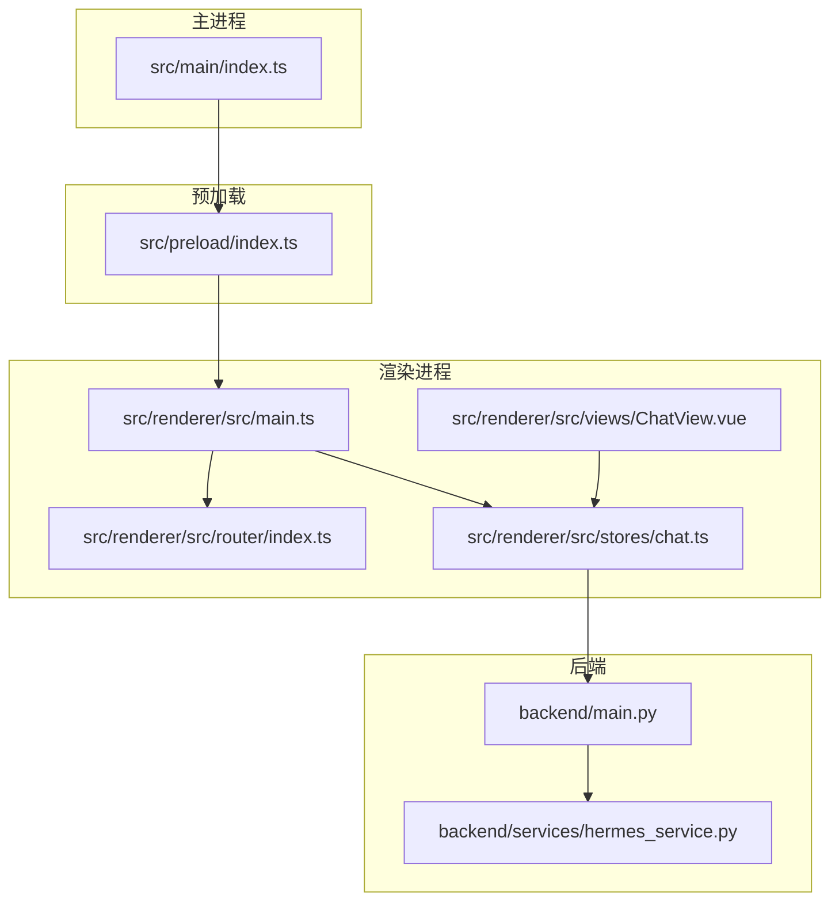
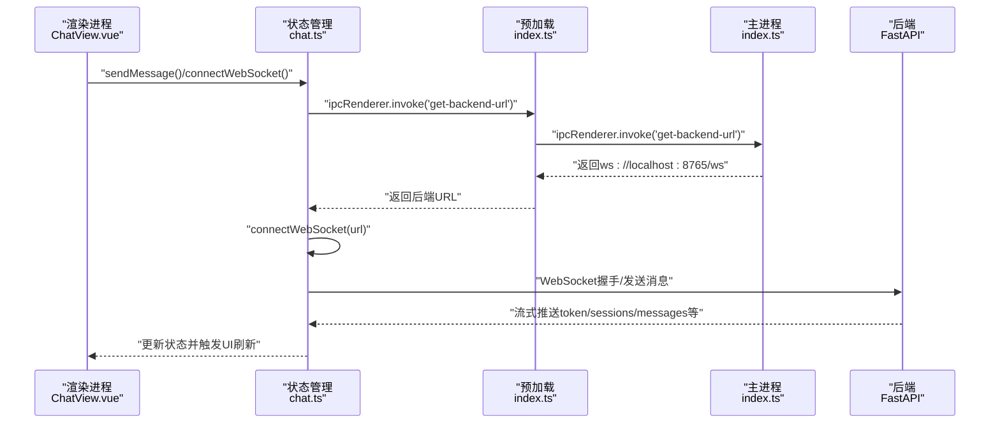
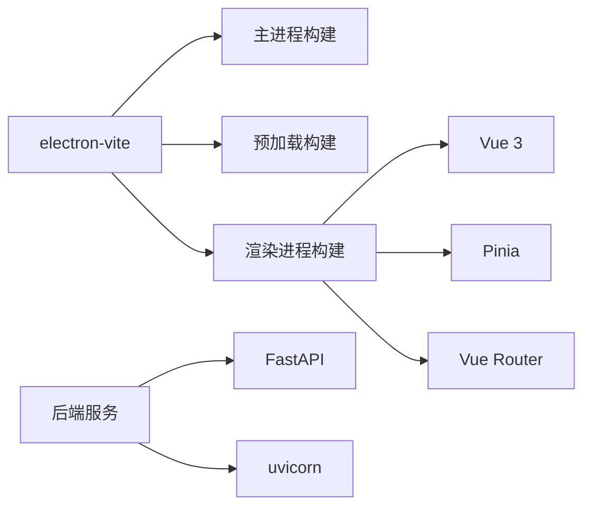

# 调试与测试

<cite>
**本文引用的文件**
- [package.json](file://package.json)
- [electron.vite.config.ts](file://electron.vite.config.ts)
- [src/main/index.ts](file://src/main/index.ts)
- [src/preload/index.ts](file://src/preload/index.ts)
- [src/renderer/src/main.ts](file://src/renderer/src/main.ts)
- [src/renderer/src/router/index.ts](file://src/renderer/src/router/index.ts)
- [src/renderer/src/stores/chat.ts](file://src/renderer/src/stores/chat.ts)
- [src/renderer/src/views/ChatView.vue](file://src/renderer/src/views/ChatView.vue)
- [backend/main.py](file://backend/main.py)
- [backend/services/hermes_service.py](file://backend/services/hermes_service.py)
- [tsconfig.json](file://tsconfig.json)
</cite>

## 目录
1. [简介](#简介)
2. [项目结构](#项目结构)
3. [核心组件](#核心组件)
4. [架构总览](#架构总览)
5. [详细组件分析](#详细组件分析)
6. [依赖分析](#依赖分析)
7. [性能考虑](#性能考虑)
8. [故障排除指南](#故障排除指南)
9. [结论](#结论)
10. [附录](#附录)

## 简介
本指南面向Hermes Desktop的开发者与测试工程师，系统性地介绍开发服务器调试、Electron主进程与渲染进程调试方法；覆盖WebSocket连接调试、IPC通信监控与状态管理调试技巧；提供单元测试、集成测试与端到端测试策略；并记录性能分析工具使用、内存泄漏检测与崩溃日志分析方法，以及常见调试场景与故障排除步骤。

## 项目结构
Hermes Desktop采用Electron + Vue 3 + Pinia + Vite的典型桌面应用分层架构：
- 主进程：负责窗口生命周期、菜单、原生能力与IPC注册（src/main/index.ts）
- 预加载脚本：通过contextBridge暴露受控API至渲染进程（src/preload/index.ts）
- 渲染进程：Vue应用入口、路由与Pinia状态管理（src/renderer/src/main.ts、router、stores）
- 后端服务：Python FastAPI + WebSocket，WSL中运行，为前端提供会话与消息流（backend/main.py、backend/services/hermes_service.py）

图表来源
- [src/main/index.ts:1-62](file://src/main/index.ts#L1-L62)
- [src/preload/index.ts:1-24](file://src/preload/index.ts#L1-L24)
- [src/renderer/src/main.ts:1-11](file://src/renderer/src/main.ts#L1-L11)
- [src/renderer/src/router/index.ts:1-16](file://src/renderer/src/router/index.ts#L1-L16)
- [src/renderer/src/stores/chat.ts:1-314](file://src/renderer/src/stores/chat.ts#L1-L314)
- [src/renderer/src/views/ChatView.vue:1-325](file://src/renderer/src/views/ChatView.vue#L1-L325)
- [backend/main.py:1-114](file://backend/main.py#L1-L114)
- [backend/services/hermes_service.py:1-86](file://backend/services/hermes_service.py#L1-L86)

章节来源
- [package.json:1-35](file://package.json#L1-L35)
- [electron.vite.config.ts:1-21](file://electron.vite.config.ts#L1-L21)
- [tsconfig.json:1-8](file://tsconfig.json#L1-L8)

## 核心组件
- 主进程窗口与IPC
  - 创建窗口、设置webPreferences、DevTools快捷键、注册ipcMain.handle以提供后端WebSocket地址
  - 开发模式下可加载外部开发服务器URL，生产模式加载本地HTML
- 预加载脚本
  - 通过contextBridge向渲染进程暴露安全API（如getBackendUrl），并注入electron工具API
- 渲染进程
  - Vue应用初始化、Pinia与路由挂载
  - ChatView在挂载时调用window.api.getBackendUrl并建立WebSocket连接
- 状态管理（Pinia）
  - chat store封装会话、消息、连接状态、心跳与重连逻辑，并处理后端消息类型
- 后端服务
  - FastAPI提供/ws WebSocket端点，处理心跳、会话与消息持久化、流式响应

章节来源
- [src/main/index.ts:1-62](file://src/main/index.ts#L1-L62)
- [src/preload/index.ts:1-24](file://src/preload/index.ts#L1-L24)
- [src/renderer/src/main.ts:1-11](file://src/renderer/src/main.ts#L1-L11)
- [src/renderer/src/views/ChatView.vue:118-126](file://src/renderer/src/views/ChatView.vue#L118-L126)
- [src/renderer/src/stores/chat.ts:26-314](file://src/renderer/src/stores/chat.ts#L26-L314)
- [backend/main.py:42-109](file://backend/main.py#L42-L109)

## 架构总览
下图展示从渲染进程发起请求到后端处理与流式返回的关键路径，以及主进程与预加载脚本在其中的角色。

图表来源
- [src/renderer/src/views/ChatView.vue:118-126](file://src/renderer/src/views/ChatView.vue#L118-L126)
- [src/renderer/src/stores/chat.ts:121-162](file://src/renderer/src/stores/chat.ts#L121-L162)
- [src/preload/index.ts:5-7](file://src/preload/index.ts#L5-L7)
- [src/main/index.ts:45-48](file://src/main/index.ts#L45-L48)
- [backend/main.py:42-98](file://backend/main.py#L42-L98)

## 详细组件分析

### 主进程调试要点
- 开发服务器加载
  - 在开发模式且存在ELECTRON_RENDERER_URL环境变量时，主进程加载外部开发服务器URL；否则加载本地HTML
  - 可通过设置该环境变量指向Vite开发服务器地址进行联调
- DevTools快捷键
  - 使用优化工具监听窗口快捷键，F12打开/关闭开发者工具
- IPC调试
  - 注册了get-backend-url处理器，返回固定WebSocket地址
  - 建议在需要时增加日志输出与错误捕获，便于定位问题

章节来源
- [src/main/index.ts:29-35](file://src/main/index.ts#L29-L35)
- [src/main/index.ts:40-43](file://src/main/index.ts#L40-L43)
- [src/main/index.ts:45-48](file://src/main/index.ts#L45-L48)

### 预加载与IPC通信监控
- 安全桥接
  - 仅在上下文隔离启用时通过contextBridge暴露API；否则直接挂载到window对象
- 渲染进程API
  - 提供getBackendUrl方法，通过ipcRenderer.invoke调用主进程处理器
- 调试建议
  - 在预加载脚本中添加错误日志
  - 使用浏览器开发者工具的“Sources”面板查看预加载脚本执行栈
  - 在主进程处理器中增加日志，确认invoke返回值

章节来源
- [src/preload/index.ts:1-24](file://src/preload/index.ts#L1-L24)

### 渲染进程与视图调试
- 应用初始化
  - Vue应用挂载Pinia与路由
- 视图交互
  - ChatView在mounted时调用window.api.getBackendUrl并建立WebSocket连接
  - 输入框支持Enter发送、Shift+Enter换行
- 调试建议
  - 打开渲染进程DevTools，检查控制台日志与网络面板中的WebSocket连接
  - 使用Vue DevTools观察Pinia状态变化与组件渲染

章节来源
- [src/renderer/src/main.ts:1-11](file://src/renderer/src/main.ts#L1-L11)
- [src/renderer/src/views/ChatView.vue:118-126](file://src/renderer/src/views/ChatView.vue#L118-L126)
- [src/renderer/src/views/ChatView.vue:90-102](file://src/renderer/src/views/ChatView.vue#L90-L102)

### 状态管理（Pinia）调试技巧
- 关键状态
  - sessions、currentSessionId、isConnected、isLoading、ws实例
- 连接与心跳
  - connectWebSocket负责握手、onopen/onclose/onerror/onmessage处理
  - startHeartbeat定期发送ping，断线自动重连，指数退避最大延迟
- 消息处理
  - handleServerMessage根据type分支处理sessions_loaded/messages_loaded/session_title/token/tool_result/message_done/error
- 调试建议
  - 在store内为关键事件添加console日志
  - 使用Vue DevTools的Pinia插件观察状态变更序列
  - 在onmessage解析失败处增加异常日志

章节来源
- [src/renderer/src/stores/chat.ts:26-314](file://src/renderer/src/stores/chat.ts#L26-L314)

### WebSocket连接调试
- 连接建立
  - 渲染进程通过预加载API获取后端URL，随后在store中创建WebSocket
- 心跳与断线重连
  - 每隔固定时间发送ping，断线后按指数退避重连，最大延迟受限
- 后端协议
  - 支持ping/pong、load_sessions/load_messages/create_session/delete_session/chat等消息类型
- 调试建议
  - 在store中打印连接/断开/错误日志
  - 使用浏览器网络面板查看握手与帧数据
  - 后端增加连接/断开与异常日志

章节来源
- [src/renderer/src/stores/chat.ts:94-162](file://src/renderer/src/stores/chat.ts#L94-L162)
- [backend/main.py:42-98](file://backend/main.py#L42-L98)

### 后端服务调试
- FastAPI应用
  - CORS允许所有来源，提供/ws端点与/health健康检查
- WebSocket处理
  - 接收文本消息，解析type字段，分别处理心跳、会话与消息加载、聊天流式响应
- Hermes服务
  - 通过子进程调用hermes二进制，流式读取stdout并回传token
  - 异常时返回error消息
- 调试建议
  - 启动后访问/health确认服务可用
  - 在receive_text与异常分支增加日志
  - 确认WSL中hermes二进制路径与虚拟环境变量正确

章节来源
- [backend/main.py:24-32](file://backend/main.py#L24-L32)
- [backend/main.py:42-109](file://backend/main.py#L42-L109)
- [backend/services/hermes_service.py:24-86](file://backend/services/hermes_service.py#L24-L86)

## 依赖分析
- 构建与运行
  - electron-vite作为构建工具链，主进程与预加载脚本外置依赖，渲染进程使用Vue插件
  - 开发脚本通过electron-vite dev启动，生产构建通过electron-vite build
- 类型检查
  - 分别对Node与Web进行TypeScript检查
- 依赖关系
  - 渲染进程依赖Vue、Pinia、vue-router
  - 后端依赖FastAPI、uvicorn（通过main.py启动）

图表来源
- [electron.vite.config.ts:1-21](file://electron.vite.config.ts#L1-L21)
- [package.json:8-16](file://package.json#L8-L16)
- [backend/main.py:9-32](file://backend/main.py#L9-L32)

章节来源
- [electron.vite.config.ts:1-21](file://electron.vite.config.ts#L1-L21)
- [package.json:1-35](file://package.json#L1-L35)

## 性能考虑
- 渲染性能
  - 大量消息时避免一次性渲染，保持虚拟滚动或分页加载
  - 图片/长内容使用懒加载与节流
- WebSocket
  - 控制心跳频率与重连退避上限，避免频繁抖动
  - 合理批量处理消息，减少状态更新次数
- 后端性能
  - 子进程I/O流式读取，避免阻塞主线程
  - 数据库操作尽量批量写入
- 工具建议
  - 使用Chrome DevTools Performance面板分析渲染与JS执行
  - 使用Vue DevTools Profiler观察组件渲染热点
  - 使用Node.js内置profiler分析后端CPU占用

## 故障排除指南
- 无法连接后端
  - 检查主进程是否返回正确的WebSocket地址
  - 确认ELECTRON_RENDERER_URL环境变量（开发模式）
  - 检查后端/ws端点是否可达，/health是否返回正常
- WebSocket断线频繁
  - 查看store日志中的重连尝试与延迟
  - 检查网络稳定性与防火墙设置
- IPC调用失败
  - 在预加载与主进程处理器中增加日志，确认invoke/ handle调用链
- 渲染进程无响应
  - 打开DevTools，检查是否有未捕获异常
  - 使用Vue DevTools定位状态更新瓶颈
- 后端hermes调用失败
  - 检查HERMES_BIN与HERMES_VENV_DIR环境变量
  - 查看stderr流与错误消息，确认二进制是否存在与权限

章节来源
- [src/main/index.ts:29-35](file://src/main/index.ts#L29-L35)
- [src/preload/index.ts:5-7](file://src/preload/index.ts#L5-L7)
- [backend/main.py:37-39](file://backend/main.py#L37-L39)
- [backend/services/hermes_service.py:78-85](file://backend/services/hermes_service.py#L78-L85)

## 结论
通过明确的主/渲染进程职责划分、受控的IPC接口与完善的WebSocket状态管理，Hermes Desktop具备良好的可调试性。结合本文提供的调试流程、日志策略与性能分析建议，可快速定位问题并提升整体稳定性与用户体验。

## 附录

### 测试策略
- 单元测试
  - 渲染侧：针对store的纯函数与消息处理逻辑编写测试，模拟WebSocket事件与状态变更
  - 后端侧：针对hermes_service的异步生成器与数据库操作编写测试，覆盖成功与异常分支
- 集成测试
  - 主/渲染进程：通过最小化mock验证IPC调用与窗口行为
  - WebSocket：启动后端服务，验证握手、心跳、消息流与断线重连
- 端到端测试
  - 使用自动化框架驱动应用，模拟用户输入与交互，验证UI与状态一致性
  - 覆盖关键路径：新建会话、发送消息、加载历史、工具调用结果展示

### 调试环境准备
- 开发服务器
  - 使用electron-vite dev启动前端开发服务器，设置ELECTRON_RENDERER_URL指向该地址
- 后端服务
  - 在WSL中启动后端服务，确保端口开放与CORS配置正确
- 日志与监控
  - 在主进程、预加载、渲染进程与后端均增加结构化日志
  - 使用浏览器与Node.js性能分析工具进行热点分析