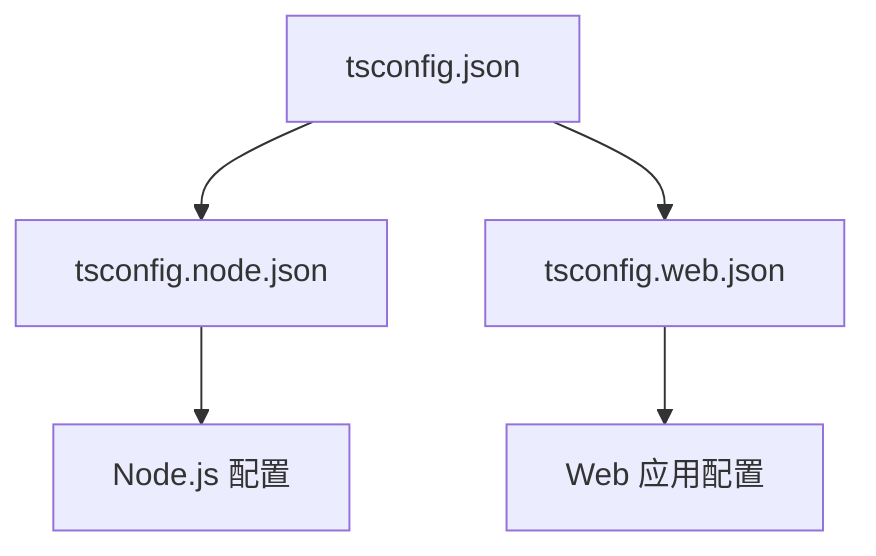
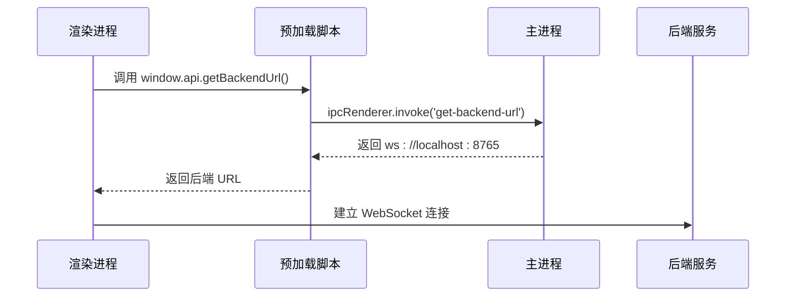
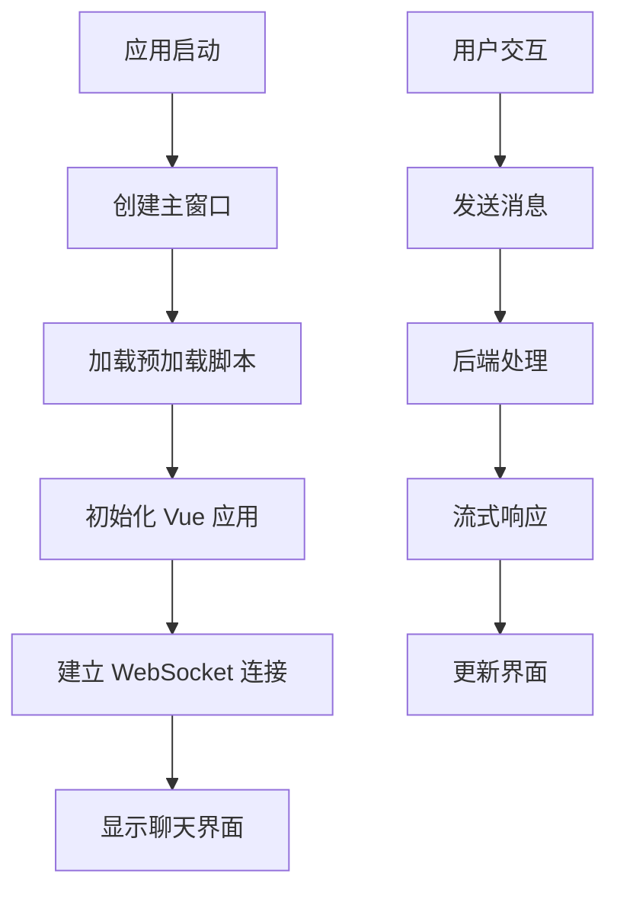
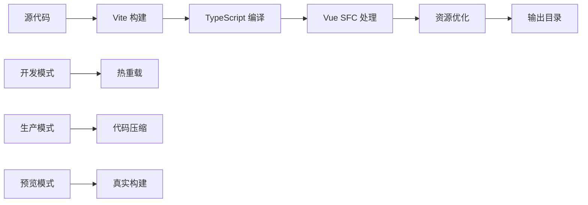
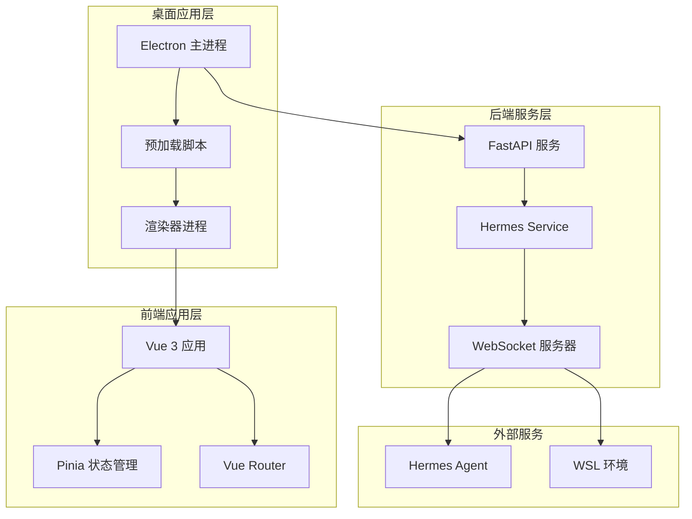
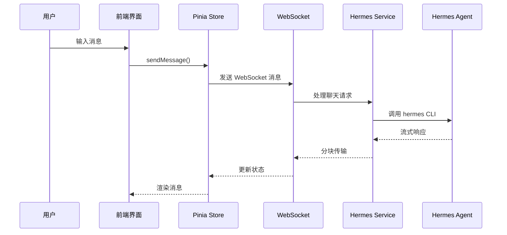
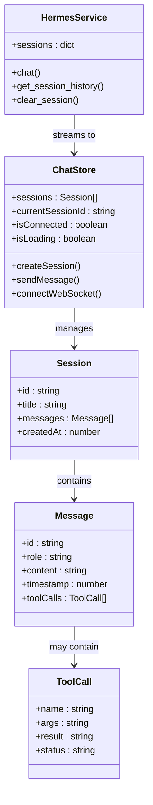

# 快速开始

<cite>
**本文引用的文件**
- [package.json](file://package.json)
- [electron.vite.config.ts](file://electron.vite.config.ts)
- [backend/main.py](file://backend/main.py)
- [backend/requirements.txt](file://backend/requirements.txt)
- [backend/services/hermes_service.py](file://backend/services/hermes_service.py)
- [src/main/index.ts](file://src/main/index.ts)
- [src/preload/index.ts](file://src/preload/index.ts)
- [src/renderer/src/main.ts](file://src/renderer/src/main.ts)
- [src/renderer/src/App.vue](file://src/renderer/src/App.vue)
- [src/renderer/src/views/ChatView.vue](file://src/renderer/src/views/ChatView.vue)
- [src/renderer/src/stores/chat.ts](file://src/renderer/src/stores/chat.ts)
- [src/renderer/src/router/index.ts](file://src/renderer/src/router/index.ts)
- [pnpm-workspace.yaml](file://pnpm-workspace.yaml)
- [tsconfig.json](file://tsconfig.json)
</cite>

## 目录
1. [简介](#简介)
2. [环境要求](#环境要求)
3. [安装步骤](#安装步骤)
4. [首次运行](#首次运行)
5. [开发环境搭建](#开发环境搭建)
6. [依赖安装](#依赖安装)
7. [配置设置](#配置设置)
8. [启动应用](#启动应用)
9. [常见问题解决](#常见问题解决)
10. [故障排除](#故障排除)
11. [开发服务器与构建](#开发服务器与构建)
12. [架构概览](#架构概览)
13. [总结](#总结)

## 简介

Hermes Desktop 是一个基于 Electron 和 Vue 3 的桌面应用程序，为 Hermes Agent 提供图形用户界面。该项目采用现代前端技术栈，结合 Python 后端服务，实现了实时的聊天对话功能。

该应用程序具有以下核心特性：
- 基于 Electron 的跨平台桌面应用
- Vue 3 + TypeScript 的现代化前端界面
- 实时 WebSocket 聊天通信
- 多会话管理功能
- 与 Hermes Agent 的深度集成

## 环境要求

在开始安装之前，请确保您的系统满足以下最低要求：

### 硬件要求
- **处理器**: 至少 2 核心 CPU
- **内存**: 至少 4 GB RAM
- **存储空间**: 至少 500 MB 可用磁盘空间

### 软件要求

#### 必需组件
- **Node.js**: 版本 16 或更高版本
- **Python**: 版本 3.8 或更高版本
- **Hermes Agent**: 已安装并可执行的 Hermes CLI

#### 开发工具
- **包管理器**: pnpm (推荐) 或 npm
- **IDE**: VS Code 或其他支持 TypeScript/Vue 的编辑器
- **Git**: 版本控制系统

#### 平台特定要求

**Windows 用户**:
- Windows 10 或更高版本
- WSL (Windows Subsystem for Linux) 推荐用于 Python 环境

**macOS 用户**:
- macOS 10.15 或更高版本
- Xcode Command Line Tools

**Linux 用户**:
- Ubuntu 20.04 或更高版本
- Python 3.8+

## 安装步骤

### 步骤 1: 克隆仓库

```bash
git clone https://github.com/octave/hermes-desktop.git
cd hermes-desktop
```

### 步骤 2: 安装 Python 依赖

```bash
pip install -r backend/requirements.txt
```

### 步骤 3: 安装 Node.js 依赖

```bash
pnpm install
```

### 步骤 4: 验证 Hermes Agent 安装

```bash
hermes --version
```

如果命令不可用，请参考 [Hermes Agent 官方文档](https://github.com/hermes-ai/hermes) 进行安装。

## 首次运行

### 启动后端服务

#### 一键启动（推荐，Windows）

项目提供了 `start.bat` 脚本实现静默启动：

```bash
# 双击运行 start.bat
start.bat
```

脚本会自动：
1. 清理所有旧进程（node、electron、python）
2. 隐藏启动后端服务（无窗口）
3. 隐藏启动前端应用（无窗口）
4. 启动窗口自动关闭

**最终效果**：只显示 Electron 客户端窗口，无任何命令窗口干扰！

**工作原理**：
- 使用 VBScript 隐藏启动所有服务
- 自动等待服务启动完成（7秒）
- 完全静默，用户体验极佳

#### 重启所有服务

在客户端内重启：
1. 点击左上角 ⚙️ 设置图标
2. 滚动到底部找到"重启所有服务"按钮
3. 点击确认重启

#### 手动启动（开发模式）

```bash
python backend/main.py
```

默认情况下，后端服务将在 `localhost:8765` 上运行。

### 启动前端应用

```bash
pnpm dev
```

这将启动 Electron 应用程序，自动连接到本地后端服务。

### 验证安装

1. 打开浏览器访问 `http://localhost:8765/health` 验证后端服务状态
2. 在 Electron 应用中查看连接状态指示器
3. 尝试发送一条测试消息验证完整功能链路

## 开发环境搭建

### 设置 IDE 配置

#### VS Code 推荐扩展
- Vue Language Features (Volar)
- ESLint
- Prettier
- TypeScript Importer

#### 开发环境变量

创建 `.env.development` 文件：

```env
NODE_ENV=development
ELECTRON_RENDERER_URL=http://localhost:5173
DEBUG=true
```

### TypeScript 配置

项目使用分层 TypeScript 配置：



**图表来源**
- [tsconfig.json:1-8](file://tsconfig.json#L1-L8)

**章节来源**
- [tsconfig.json:1-8](file://tsconfig.json#L1-L8)
- [pnpm-workspace.yaml:1-5](file://pnpm-workspace.yaml#L1-L5)

## 依赖安装

### Node.js 依赖管理

项目使用 pnpm 作为包管理器，主要依赖包括：

#### 生产依赖
- **Vue 3**: 前端框架
- **Pinia**: 状态管理
- **Vue Router**: 路由管理
- **Electron Toolkit**: Electron 开发工具

#### 开发依赖
- **TypeScript**: 类型检查
- **Vite**: 构建工具
- **Vue TSC**: Vue 类型检查
- **ESLint**: 代码质量

### Python 依赖

后端服务依赖：

- **FastAPI**: Web 框架
- **Uvicorn**: ASGI 服务器
- **Websockets**: WebSocket 支持

**章节来源**
- [package.json:17-33](file://package.json#L17-L33)
- [backend/requirements.txt:1-4](file://backend/requirements.txt#L1-L4)

## 配置设置

### Electron 配置

Electron 应用的核心配置位于 `electron.vite.config.ts`：

```mermaid
flowchart TD
A[electron.vite.config.ts] --> B[主进程配置]
A --> C[预加载脚本配置]
A --> D[渲染器配置]
B --> E[externalizeDepsPlugin]
C --> F[externalizeDepsPlugin]
D --> G[@vitejs/plugin-vue]
D --> H[路径别名 @ -> src/renderer/src]
```

**图表来源**
- [electron.vite.config.ts:1-21](file://electron.vite.config.ts#L1-L21)

### 应用窗口配置

主窗口设置包括：
- **尺寸**: 1200x800 像素
- **最小尺寸**: 800x600 像素
- **菜单栏**: 自动隐藏
- **沙箱**: 关闭以简化开发

### WebSocket 连接配置

前端通过 IPC 机制获取后端 URL：



**图表来源**
- [src/preload/index.ts:1-24](file://src/preload/index.ts#L1-L24)
- [src/main/index.ts:46-48](file://src/main/index.ts#L46-L48)

**章节来源**
- [src/main/index.ts:1-62](file://src/main/index.ts#L1-L62)
- [src/preload/index.ts:1-24](file://src/preload/index.ts#L1-L24)

## 启动应用

### 开发模式启动

```bash
# 启动后端服务
python backend/main.py

# 在另一个终端启动前端开发服务器
pnpm dev
```

开发模式特点：
- 热重载支持
- 实时错误报告
- 开发工具集成

### 生产模式启动

```bash
# 构建生产版本
pnpm build

# 启动生产应用
pnpm preview
```

### 应用启动流程



**图表来源**
- [src/main/index.ts:37-55](file://src/main/index.ts#L37-L55)
- [src/renderer/src/main.ts:1-11](file://src/renderer/src/main.ts#L1-L11)

**章节来源**
- [src/main/index.ts:37-55](file://src/main/index.ts#L37-L55)
- [src/renderer/src/main.ts:1-11](file://src/renderer/src/main.ts#L1-L11)

## 常见问题解决

### Python 环境问题

**问题**: `ModuleNotFoundError: No module named 'fastapi'`
**解决方案**: 
```bash
pip install -r backend/requirements.txt
```

**问题**: Python 版本不兼容
**解决方案**: 
```bash
python3 -m pip install --upgrade pip
python3 -m pip install --upgrade setuptools wheel
```

### Node.js 环境问题

**问题**: `pnpm` 命令未找到
**解决方案**: 
```bash
npm install -g pnpm
```

**问题**: 依赖安装失败
**解决方案**: 
```bash
pnpm install --frozen-lockfile
```

### Hermes Agent 问题

**问题**: `hermes: command not found`
**解决方案**: 
```bash
# 检查安装
which hermes

# 如果未安装，使用 pip 安装
pip install hermes-ai

# 或者使用 npm
npm install -g hermes-ai
```

### WebSocket 连接问题

**问题**: 应用无法连接到后端
**解决方案**:
1. 确认后端服务正在运行
2. 检查防火墙设置
3. 验证端口 8765 是否被占用

**章节来源**
- [backend/services/hermes_service.py:66-72](file://backend/services/hermes_service.py#L66-L72)

## 故障排除

### 后端服务故障排除

#### 健康检查
```bash
curl http://localhost:8765/health
```

#### 日志诊断
查看后端日志输出以识别连接问题或消息处理错误。

#### 端口冲突
如果端口 8765 被占用：
```bash
# 查找占用端口的进程
netstat -ano | findstr :8765

# 修改后端配置中的端口号
```

### 前端应用故障排除

#### Vue 开发工具
启用 Vue DevTools 以调试组件状态和数据流。

#### WebSocket 连接调试
在浏览器控制台中检查 WebSocket 连接状态和错误信息。

#### 状态管理问题
使用 Pinia DevTools 检查状态变化和消息流。

### 系统级故障排除

#### 权限问题
```bash
# 给予执行权限
chmod +x backend/main.py

# 检查文件权限
ls -la backend/
```

#### 路径问题
确保 Python 和 Hermes CLI 在系统 PATH 中可用。

**章节来源**
- [backend/main.py:26-28](file://backend/main.py#L26-L28)
- [backend/main.py:54-63](file://backend/main.py#L54-L63)

## 开发服务器与构建

### 开发服务器

#### 启动开发服务器
```bash
pnpm dev
```

开发服务器特性：
- **热重载**: 文件更改自动刷新
- **类型检查**: 运行时 TypeScript 错误检测
- **ESLint**: 代码质量检查

#### 开发服务器配置
- **端口**: 5173
- **主机**: localhost
- **代理**: 自动处理跨域请求

### 生产构建

#### 构建命令
```bash
pnpm build
```

构建输出目录：`out/`

#### 构建优化
- **代码分割**: 自动代码分割
- **资源压缩**: JS/CSS 压缩
- **静态资源**: 图片和字体优化

### 预览模式

#### 启动预览
```bash
pnpm preview
```

预览模式特点：
- **真实构建**: 使用生产构建结果
- **性能测试**: 验证应用性能
- **部署前检查**: 确保功能正常

### 构建流程



**图表来源**
- [package.json:8-16](file://package.json#L8-L16)

**章节来源**
- [package.json:8-16](file://package.json#L8-L16)

## 架构概览

### 系统架构

Hermes Desktop 采用客户端-服务器架构，结合桌面应用和 Web 技术：



**图表来源**
- [src/main/index.ts:1-62](file://src/main/index.ts#L1-L62)
- [backend/main.py:1-69](file://backend/main.py#L1-L69)
- [backend/services/hermes_service.py:1-82](file://backend/services/hermes_service.py#L1-L82)

### 数据流架构



**图表来源**
- [src/renderer/src/stores/chat.ts:153-176](file://src/renderer/src/stores/chat.ts#L153-L176)
- [backend/services/hermes_service.py:16-72](file://backend/services/hermes_service.py#L16-L72)

### 组件关系图



**图表来源**
- [src/renderer/src/stores/chat.ts:1-197](file://src/renderer/src/stores/chat.ts#L1-L197)
- [backend/services/hermes_service.py:10-82](file://backend/services/hermes_service.py#L10-L82)

**章节来源**
- [src/renderer/src/stores/chat.ts:1-197](file://src/renderer/src/stores/chat.ts#L1-L197)
- [backend/services/hermes_service.py:10-82](file://backend/services/hermes_service.py#L10-L82)

## 总结

Hermes Desktop 是一个功能完整的桌面应用程序，提供了现代化的聊天界面和强大的后端服务集成。通过遵循本指南，您应该能够：

1. **成功安装所有必需的依赖项**
2. **正确配置开发环境**
3. **启动并运行完整的应用**
4. **解决常见的安装和运行问题**

### 下一步建议

- 探索 [src/renderer/src/components/](file://src/renderer/src/components/) 目录下的组件结构
- 查看 [src/renderer/src/assets/](file://src/renderer/src/assets/) 中的样式文件
- 研究 [backend/services/](file://backend/services/) 目录下的服务实现

### 支持与反馈

如遇到任何问题，请参考：
- [GitHub Issues](https://github.com/octave/hermes-desktop/issues)
- [Hermes Agent 文档](https://github.com/hermes-ai/hermes)

祝您开发顺利！