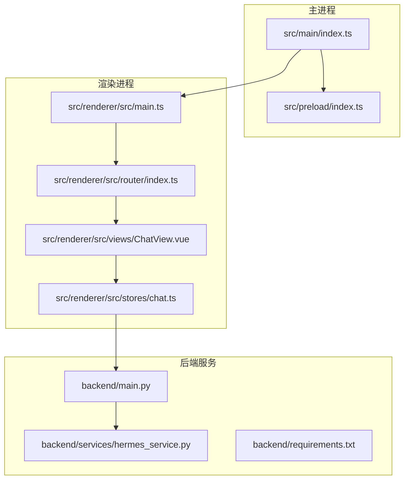
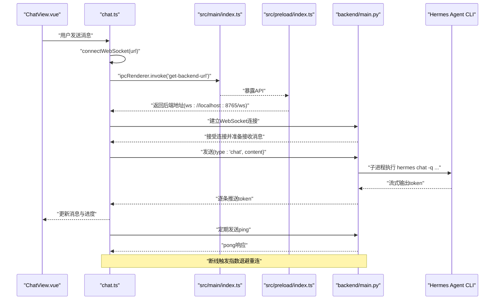
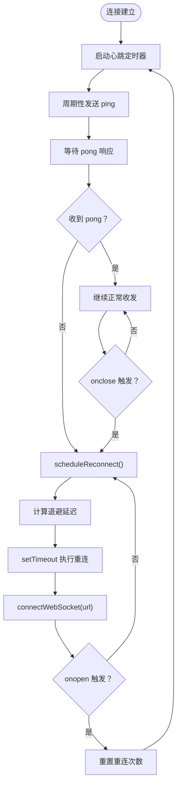
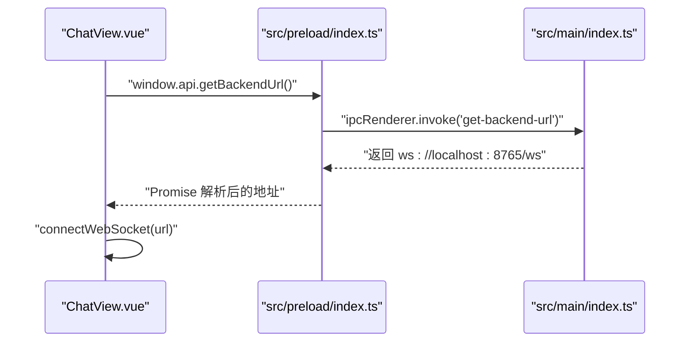
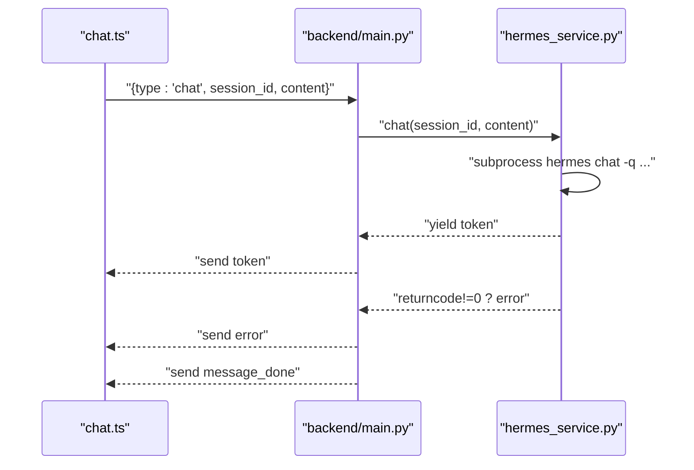
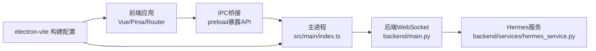

# 故障排除

<cite>
**本文引用的文件**
- [package.json](file://package.json)
- [electron.vite.config.ts](file://electron.vite.config.ts)
- [src/main/index.ts](file://src/main/index.ts)
- [src/preload/index.ts](file://src/preload/index.ts)
- [src/renderer/src/main.ts](file://src/renderer/src/main.ts)
- [src/renderer/src/router/index.ts](file://src/renderer/src/router/index.ts)
- [src/renderer/src/views/ChatView.vue](file://src/renderer/src/views/ChatView.vue)
- [src/renderer/src/stores/chat.ts](file://src/renderer/src/stores/chat.ts)
- [backend/main.py](file://backend/main.py)
- [backend/services/hermes_service.py](file://backend/services/hermes_service.py)
- [backend/requirements.txt](file://backend/requirements.txt)
</cite>

## 目录
1. [简介](#简介)
2. [项目结构](#项目结构)
3. [核心组件](#核心组件)
4. [架构总览](#架构总览)
5. [详细组件分析](#详细组件分析)
6. [依赖分析](#依赖分析)
7. [性能考虑](#性能考虑)
8. [故障排除与常见问题](#故障排除与常见问题)
9. [结论](#结论)
10. [附录](#附录)

## 简介
本指南面向Hermes Desktop用户与维护者，聚焦于运行时常见问题的诊断与解决，涵盖连接问题（WebSocket断开、IPC通信失败）、网络与代理限制、Hermes Agent集成异常、桌面应用崩溃、性能优化与内存泄漏检测、日志与调试方法、系统兼容性与跨平台部署注意事项，以及健康检查与自动恢复机制的配置要点。内容基于仓库中实际实现进行归纳总结，帮助快速定位与修复问题。

## 项目结构
Hermes Desktop采用Electron + Vue 3 + Pinia的桌面应用架构，后端使用Python FastAPI提供WebSocket服务，并通过子进程调用Hermes Agent CLI进行推理与流式输出。构建工具为electron-vite，开发与生产流程清晰分离。

**图表来源**
- [src/main/index.ts:1-62](file://src/main/index.ts#L1-L62)
- [src/preload/index.ts:1-24](file://src/preload/index.ts#L1-L24)
- [src/renderer/src/main.ts:1-11](file://src/renderer/src/main.ts#L1-L11)
- [src/renderer/src/router/index.ts:1-16](file://src/renderer/src/router/index.ts#L1-L16)
- [src/renderer/src/views/ChatView.vue:1-325](file://src/renderer/src/views/ChatView.vue#L1-L325)
- [src/renderer/src/stores/chat.ts:1-263](file://src/renderer/src/stores/chat.ts#L1-L263)
- [backend/main.py:1-71](file://backend/main.py#L1-L71)
- [backend/services/hermes_service.py:1-82](file://backend/services/hermes_service.py#L1-L82)
- [backend/requirements.txt:1-4](file://backend/requirements.txt#L1-L4)

**章节来源**
- [package.json:1-35](file://package.json#L1-L35)
- [electron.vite.config.ts:1-21](file://electron.vite.config.ts#L1-L21)
- [src/main/index.ts:1-62](file://src/main/index.ts#L1-L62)
- [src/preload/index.ts:1-24](file://src/preload/index.ts#L1-L24)
- [src/renderer/src/main.ts:1-11](file://src/renderer/src/main.ts#L1-L11)
- [src/renderer/src/router/index.ts:1-16](file://src/renderer/src/router/index.ts#L1-L16)
- [src/renderer/src/views/ChatView.vue:1-325](file://src/renderer/src/views/ChatView.vue#L1-L325)
- [src/renderer/src/stores/chat.ts:1-263](file://src/renderer/src/stores/chat.ts#L1-L263)
- [backend/main.py:1-71](file://backend/main.py#L1-L71)
- [backend/services/hermes_service.py:1-82](file://backend/services/hermes_service.py#L1-L82)
- [backend/requirements.txt:1-4](file://backend/requirements.txt#L1-L4)

## 核心组件
- 主进程窗口与IPC：负责创建BrowserWindow、加载渲染页面、暴露IPC接口以供渲染进程查询后端地址。
- 预加载脚本：通过contextBridge安全地向渲染进程暴露受限API（如获取后端地址）。
- 渲染进程与路由：Vue应用入口、路由配置、聊天视图组件。
- 聊天状态管理（Pinia）：封装WebSocket连接、心跳、重连策略、消息解析与会话管理。
- 后端FastAPI服务：提供WebSocket端点、健康检查、CORS支持；通过子进程调用Hermes Agent CLI并流式返回结果。
- Hermes服务：封装会话历史、错误处理与CLI交互。

**章节来源**
- [src/main/index.ts:1-62](file://src/main/index.ts#L1-L62)
- [src/preload/index.ts:1-24](file://src/preload/index.ts#L1-L24)
- [src/renderer/src/main.ts:1-11](file://src/renderer/src/main.ts#L1-L11)
- [src/renderer/src/router/index.ts:1-16](file://src/renderer/src/router/index.ts#L1-L16)
- [src/renderer/src/views/ChatView.vue:1-325](file://src/renderer/src/views/ChatView.vue#L1-L325)
- [src/renderer/src/stores/chat.ts:1-263](file://src/renderer/src/stores/chat.ts#L1-L263)
- [backend/main.py:1-71](file://backend/main.py#L1-L71)
- [backend/services/hermes_service.py:1-82](file://backend/services/hermes_service.py#L1-L82)

## 架构总览
下图展示从渲染进程到后端服务的典型请求链路，包括IPC获取后端地址、WebSocket连接、心跳与重连、以及后端通过子进程调用Hermes Agent的流程。

**图表来源**
- [src/renderer/src/views/ChatView.vue:90-126](file://src/renderer/src/views/ChatView.vue#L90-L126)
- [src/renderer/src/stores/chat.ts:110-150](file://src/renderer/src/stores/chat.ts#L110-L150)
- [src/main/index.ts:45-48](file://src/main/index.ts#L45-L48)
- [src/preload/index.ts:5-7](file://src/preload/index.ts#L5-L7)
- [backend/main.py:31-66](file://backend/main.py#L31-L66)
- [backend/services/hermes_service.py:34-54](file://backend/services/hermes_service.py#L34-L54)

## 详细组件分析

### 组件A：WebSocket连接与重连机制
- 心跳：每固定间隔发送ping，收到pong即视为连接正常。
- 断线重连：指数退避（最大延迟上限），避免频繁重试造成资源浪费。
- 错误处理：捕获解析异常、网络异常与后端错误消息，确保UI可感知并提示。

**图表来源**
- [src/renderer/src/stores/chat.ts:83-108](file://src/renderer/src/stores/chat.ts#L83-L108)
- [src/renderer/src/stores/chat.ts:110-150](file://src/renderer/src/stores/chat.ts#L110-L150)

**章节来源**
- [src/renderer/src/stores/chat.ts:1-263](file://src/renderer/src/stores/chat.ts#L1-L263)

### 组件B：IPC通信与后端地址获取
- 渲染进程通过预加载脚本暴露的API调用ipcRenderer.invoke。
- 主进程注册ipcMain.handle，返回固定的后端WebSocket地址。
- 开发模式下可通过环境变量覆盖前端加载地址，便于联调。

**图表来源**
- [src/renderer/src/views/ChatView.vue:119-126](file://src/renderer/src/views/ChatView.vue#L119-L126)
- [src/preload/index.ts:5-7](file://src/preload/index.ts#L5-L7)
- [src/main/index.ts:45-48](file://src/main/index.ts#L45-L48)

**章节来源**
- [src/preload/index.ts:1-24](file://src/preload/index.ts#L1-L24)
- [src/main/index.ts:1-62](file://src/main/index.ts#L1-L62)

### 组件C：后端WebSocket与Hermes Agent集成
- FastAPI提供/ws端点，接受JSON消息，支持ping/pong心跳。
- 接收“chat”类型消息后，通过异步生成器将Hermes Agent CLI的流式输出逐段推送给客户端。
- 异常统一转换为“error”消息类型，便于前端处理。

**图表来源**
- [backend/main.py:31-66](file://backend/main.py#L31-L66)
- [backend/services/hermes_service.py:16-72](file://backend/services/hermes_service.py#L16-L72)

**章节来源**
- [backend/main.py:1-71](file://backend/main.py#L1-L71)
- [backend/services/hermes_service.py:1-82](file://backend/services/hermes_service.py#L1-L82)

## 依赖分析
- 前端依赖：Vue 3、Pinia、Vue Router、@electron-toolkit工具集。
- 后端依赖：FastAPI、Uvicorn、websockets。
- 构建工具：electron-vite，分别对main、preload、renderer三类源码进行插件化处理。

**图表来源**
- [package.json:17-33](file://package.json#L17-L33)
- [electron.vite.config.ts:1-21](file://electron.vite.config.ts#L1-L21)
- [src/main/index.ts:1-62](file://src/main/index.ts#L1-L62)
- [src/preload/index.ts:1-24](file://src/preload/index.ts#L1-L24)
- [backend/main.py:1-71](file://backend/main.py#L1-L71)
- [backend/services/hermes_service.py:1-82](file://backend/services/hermes_service.py#L1-L82)

**章节来源**
- [package.json:1-35](file://package.json#L1-L35)
- [electron.vite.config.ts:1-21](file://electron.vite.config.ts#L1-L21)
- [backend/requirements.txt:1-4](file://backend/requirements.txt#L1-L4)

## 性能考虑
- WebSocket心跳与重连
  - 心跳间隔适中，避免过于频繁导致CPU占用；指数退避上限防止雪崩效应。
  - 建议在高延迟网络下适当增大心跳间隔，减少无效ping。
- 流式输出
  - 后端按行读取CLI输出并立即推送，前端逐条拼接，注意大文本场景下的DOM更新频率。
  - 可在前端对高频更新进行节流或批量更新，降低主线程压力。
- 内存与会话
  - 后端按会话维护历史，建议在长时间对话后清理旧会话，避免内存累积。
  - 前端Pinia store中仅保留当前活跃会话的消息片段，避免无界增长。
- 构建与打包
  - 使用electron-vite外部化依赖，减少打包体积与冷启动时间。
  - 生产构建时启用压缩与Tree Shaking，避免冗余代码进入最终包。

[本节为通用性能建议，不直接分析具体文件]

## 故障排除与常见问题

### 连接问题
- 症状：无法连接后端WebSocket，界面显示未连接或无响应。
- 排查步骤
  - 检查后端服务是否启动且监听在预期端口与路径。
  - 在渲染进程控制台查看是否成功获取后端地址。
  - 确认防火墙/安全软件未拦截本地端口。
  - 若使用代理，请确认代理规则允许本地回环地址。
- 相关实现位置
  - 获取后端地址：[src/main/index.ts:45-48](file://src/main/index.ts#L45-L48)、[src/preload/index.ts:5-7](file://src/preload/index.ts#L5-L7)、[src/renderer/src/views/ChatView.vue:119-126](file://src/renderer/src/views/ChatView.vue#L119-L126)
  - WebSocket连接与心跳：[src/renderer/src/stores/chat.ts:83-150](file://src/renderer/src/stores/chat.ts#L83-L150)

**章节来源**
- [src/main/index.ts:45-48](file://src/main/index.ts#L45-L48)
- [src/preload/index.ts:5-7](file://src/preload/index.ts#L5-L7)
- [src/renderer/src/views/ChatView.vue:119-126](file://src/renderer/src/views/ChatView.vue#L119-L126)
- [src/renderer/src/stores/chat.ts:83-150](file://src/renderer/src/stores/chat.ts#L83-L150)

### WebSocket断开与重连失败
- 症状：连接断开后无法自动恢复，或重连过于频繁。
- 排查步骤
  - 查看控制台日志中的重连延迟与尝试次数，确认是否达到最大退避上限。
  - 检查网络波动与代理设置，必要时调整心跳间隔与最大重连延迟。
  - 确保后端/ws端点可用，且未被中间层（如反向代理、WAF）中断。
- 相关实现位置
  - 重连逻辑与心跳：[src/renderer/src/stores/chat.ts:99-108](file://src/renderer/src/stores/chat.ts#L99-L108)、[src/renderer/src/stores/chat.ts:83-97](file://src/renderer/src/stores/chat.ts#L83-L97)

**章节来源**
- [src/renderer/src/stores/chat.ts:99-108](file://src/renderer/src/stores/chat.ts#L99-L108)
- [src/renderer/src/stores/chat.ts:83-97](file://src/renderer/src/stores/chat.ts#L83-L97)

### IPC通信失败
- 症状：渲染进程无法获取后端地址，报错“Failed to get backend URL”。
- 排查步骤
  - 确认主进程已注册对应ipcMain.handle。
  - 检查预加载脚本是否正确暴露API至window对象。
  - 开发模式下确认环境变量是否正确传递给主进程。
- 相关实现位置
  - 注册与调用：[src/main/index.ts:45-48](file://src/main/index.ts#L45-L48)、[src/preload/index.ts:5-7](file://src/preload/index.ts#L5-L7)、[src/renderer/src/views/ChatView.vue:119-126](file://src/renderer/src/views/ChatView.vue#L119-L126)

**章节来源**
- [src/main/index.ts:45-48](file://src/main/index.ts#L45-L48)
- [src/preload/index.ts:5-7](file://src/preload/index.ts#L5-L7)
- [src/renderer/src/views/ChatView.vue:119-126](file://src/renderer/src/views/ChatView.vue#L119-L126)

### 网络连接问题
- 症状：局域网内其他设备无法访问后端，或通过代理访问不稳定。
- 处理建议
  - 后端默认绑定0.0.0.0，确保防火墙放行端口。
  - 如需外网访问，确认反向代理（Nginx/Traefik）正确转发WebSocket升级。
  - 对于企业网络，确认代理允许ws/wss协议与长连接。
- 相关实现位置
  - 后端监听与路由：[backend/main.py:68-71](file://backend/main.py#L68-L71)

**章节来源**
- [backend/main.py:68-71](file://backend/main.py#L68-L71)

### Hermes Agent集成问题
- 症状：后端返回“Hermes Agent not found”或CLI执行失败。
- 排查步骤
  - 确认Hermes Agent已在PATH中，或在系统中正确安装。
  - 检查CLI命令权限与工作目录，确保可执行。
  - 关注stderr输出，结合后端错误消息定位具体原因。
- 相关实现位置
  - CLI调用与错误映射：[backend/services/hermes_service.py:34-72](file://backend/services/hermes_service.py#L34-L72)

**章节来源**
- [backend/services/hermes_service.py:34-72](file://backend/services/hermes_service.py#L34-L72)

### 桌面应用崩溃
- 症状：应用启动后立即退出或运行中崩溃。
- 排查步骤
  - 检查主进程事件回调（如window-all-closed）与平台差异处理。
  - 确认渲染进程初始化顺序（main.ts挂载顺序）与路由配置正确。
  - 在开发模式下开启DevTools，观察控制台与Sources面板。
- 相关实现位置
  - 应用生命周期与窗口事件：[src/main/index.ts:37-61](file://src/main/index.ts#L37-L61)、[src/renderer/src/main.ts:1-11](file://src/renderer/src/main.ts#L1-L11)

**章节来源**
- [src/main/index.ts:37-61](file://src/main/index.ts#L37-L61)
- [src/renderer/src/main.ts:1-11](file://src/renderer/src/main.ts#L1-L11)

### 性能优化与内存泄漏检测
- 优化建议
  - 控制消息列表长度，定期清理旧会话。
  - 对DOM更新进行节流，避免高频渲染。
  - 合理设置心跳与重连参数，平衡稳定性与资源消耗。
- 内存泄漏检测
  - 使用浏览器开发者工具的Performance/Heap快照对比，定位异常增长。
  - 检查store中是否存在未释放的定时器或事件监听。
  - 关注WebSocket连接数与消息堆积情况。
- 相关实现位置
  - 心跳与重连：[src/renderer/src/stores/chat.ts:83-108](file://src/renderer/src/stores/chat.ts#L83-L108)
  - 会话与消息管理：[src/renderer/src/stores/chat.ts:26-81](file://src/renderer/src/stores/chat.ts#L26-L81)

**章节来源**
- [src/renderer/src/stores/chat.ts:83-108](file://src/renderer/src/stores/chat.ts#L83-L108)
- [src/renderer/src/stores/chat.ts:26-81](file://src/renderer/src/stores/chat.ts#L26-L81)

### 调试方法、日志分析与问题定位
- 日志来源
  - 后端WebSocket连接与异常：[backend/main.py:34-65](file://backend/main.py#L34-L65)
  - 前端连接状态与错误：[src/renderer/src/stores/chat.ts:134-147](file://src/renderer/src/stores/chat.ts#L134-L147)
  - IPC调用与错误：[src/renderer/src/views/ChatView.vue:121-125](file://src/renderer/src/views/ChatView.vue#L121-L125)
- 定位技巧
  - 先确认IPC是否成功获取后端地址。
  - 再验证WebSocket onopen/onclose/onerror事件序列。
  - 最后检查后端CLI执行与stderr输出。
- 相关实现位置
  - 日志打印与错误上报：[backend/main.py:34-65](file://backend/main.py#L34-L65)、[src/renderer/src/stores/chat.ts:134-147](file://src/renderer/src/stores/chat.ts#L134-L147)、[src/renderer/src/views/ChatView.vue:121-125](file://src/renderer/src/views/ChatView.vue#L121-L125)

**章节来源**
- [backend/main.py:34-65](file://backend/main.py#L34-L65)
- [src/renderer/src/stores/chat.ts:134-147](file://src/renderer/src/stores/chat.ts#L134-L147)
- [src/renderer/src/views/ChatView.vue:121-125](file://src/renderer/src/views/ChatView.vue#L121-L125)

### 系统兼容性与跨平台部署
- 平台差异
  - Windows/macOS/Linux上PATH与可执行文件路径不同，确保Hermes Agent在各平台均可用。
  - macOS需注意沙盒与Gatekeeper策略，必要时添加例外。
- 部署建议
  - 使用electron-vite构建，区分main/preload/renderer三类产物。
  - 打包时将后端二进制或Python运行时一并分发，避免运行时缺失。
- 相关实现位置
  - 构建配置：[electron.vite.config.ts:1-21](file://electron.vite.config.ts#L1-L21)
  - 依赖声明：[package.json:17-33](file://package.json#L17-L33)、[backend/requirements.txt:1-4](file://backend/requirements.txt#L1-L4)

**章节来源**
- [electron.vite.config.ts:1-21](file://electron.vite.config.ts#L1-L21)
- [package.json:17-33](file://package.json#L17-L33)
- [backend/requirements.txt:1-4](file://backend/requirements.txt#L1-L4)

### 监控指标、健康检查与自动恢复
- 健康检查
  - 后端提供/health端点，可用于Kubernetes/负载均衡探针。
- 自动恢复
  - 前端实现指数退避重连与心跳保活，提升鲁棒性。
- 指标建议
  - 连接成功率、平均重连耗时、消息吞吐量、CLI执行耗时与错误率。
- 相关实现位置
  - 健康检查端点：[backend/main.py:26-28](file://backend/main.py#L26-L28)
  - 心跳与重连：[src/renderer/src/stores/chat.ts:83-108](file://src/renderer/src/stores/chat.ts#L83-L108)

**章节来源**
- [backend/main.py:26-28](file://backend/main.py#L26-L28)
- [src/renderer/src/stores/chat.ts:83-108](file://src/renderer/src/stores/chat.ts#L83-L108)

## 结论
Hermes Desktop的故障多集中在IPC、WebSocket连接与后端CLI集成三处。通过明确的日志、完善的重连与心跳机制、以及对后端健康状态的监控，可显著提升系统的稳定性与可维护性。建议在生产环境中配合代理与防火墙策略，确保/ws端点与CLI执行环境稳定可用。

## 附录
- 快速自检清单
  - 后端服务是否启动并监听在0.0.0.0:8765/ws？
  - 渲染进程能否成功获取后端地址？
  - WebSocket是否能收到pong并持续收发消息？
  - Hermes Agent是否在PATH中且可执行？
  - 是否存在代理/防火墙阻断本地回环或WebSocket升级？

[本节为通用建议，不直接分析具体文件]