# 前端架构设计

<cite>
**本文档引用的文件**
- [main.ts](file://src/renderer/src/main.ts)
- [App.vue](file://src/renderer/src/App.vue)
- [router/index.ts](file://src/renderer/src/router/index.ts)
- [stores/chat.ts](file://src/renderer/src/stores/chat.ts)
- [views/ChatView.vue](file://src/renderer/src/views/ChatView.vue)
- [main/index.ts](file://src/main/index.ts)
- [preload/index.ts](file://src/preload/index.ts)
- [package.json](file://package.json)
- [electron.vite.config.ts](file://electron.vite.config.ts)
- [assets/main.css](file://src/renderer/src/assets/main.css)
- [renderer/index.html](file://src/renderer/index.html)
</cite>

## 目录
1. [项目概述](#项目概述)
2. [项目结构](#项目结构)
3. [核心组件](#核心组件)
4. [架构概览](#架构概览)
5. [详细组件分析](#详细组件分析)
6. [依赖关系分析](#依赖关系分析)
7. [性能考虑](#性能考虑)
8. [故障排除指南](#故障排除指南)
9. [结论](#结论)

## 项目概述

Hermes Desktop是一个基于Electron的桌面应用程序，采用Vue 3 + TypeScript + Pinia + Vue Router构建的现代化前端架构。该应用实现了桌面端聊天界面，支持多会话管理和WebSocket实时通信功能。

### 主要特性
- **MVVM架构模式**：清晰的数据绑定和视图分离
- **状态管理**：使用Pinia实现集中式状态管理
- **路由系统**：基于Vue Router的单页应用架构
- **实时通信**：WebSocket连接后端服务
- **响应式设计**：自适应布局和主题样式

## 项目结构

项目的整体结构遵循Electron + Vue 3的标准架构模式：

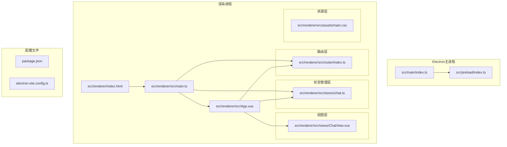

**图表来源**
- [main/index.ts:1-62](file://src/main/index.ts#L1-L62)
- [preload/index.ts:1-24](file://src/preload/index.ts#L1-L24)
- [main.ts:1-11](file://src/renderer/src/main.ts#L1-L11)
- [App.vue:1-178](file://src/renderer/src/App.vue#L1-L178)

**章节来源**
- [package.json:1-35](file://package.json#L1-L35)
- [electron.vite.config.ts:1-21](file://electron.vite.config.ts#L1-L21)

## 核心组件

### 应用入口与初始化

应用通过标准的Vue 3应用初始化流程启动，配置了Pinia状态管理和Vue Router路由系统。

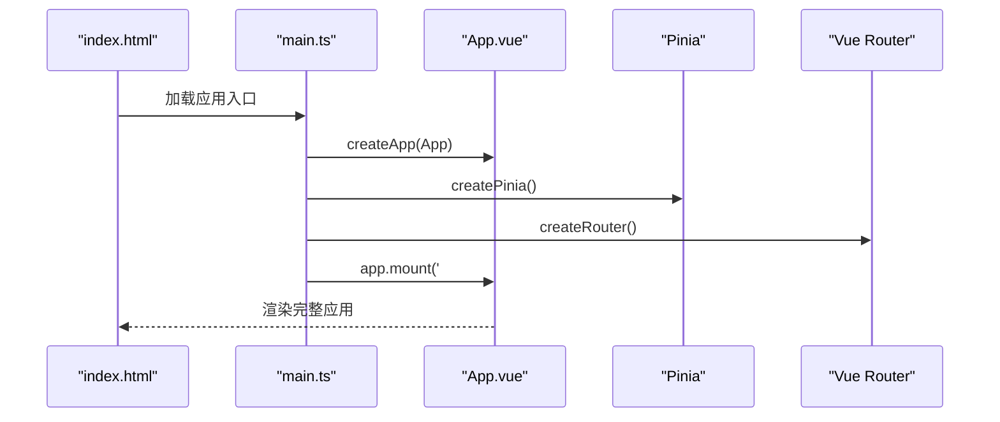

**图表来源**
- [main.ts:1-11](file://src/renderer/src/main.ts#L1-L11)
- [renderer/index.html:1-13](file://src/renderer/index.html#L1-L13)

### 状态管理架构

应用采用Pinia进行状态管理，实现了完整的聊天应用所需的状态逻辑：

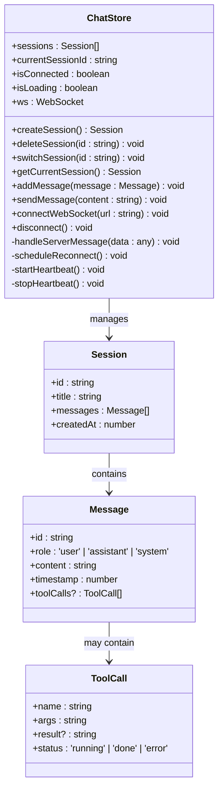

**图表来源**
- [stores/chat.ts:1-263](file://src/renderer/src/stores/chat.ts#L1-L263)

**章节来源**
- [stores/chat.ts:26-262](file://src/renderer/src/stores/chat.ts#L26-L262)

## 架构概览

### MVVM模式应用

Hermes Desktop严格遵循MVVM（Model-View-ViewModel）架构模式：

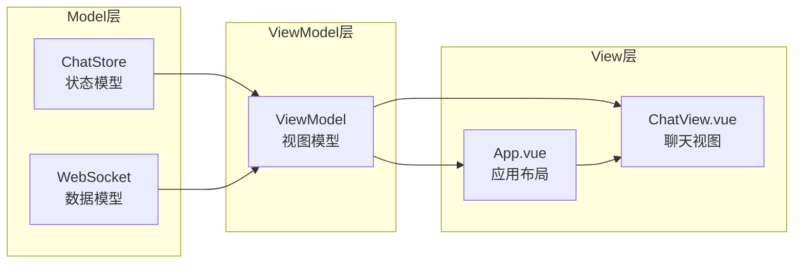

**图表来源**
- [App.vue:1-178](file://src/renderer/src/App.vue#L1-L178)
- [views/ChatView.vue:1-325](file://src/renderer/src/views/ChatView.vue#L1-L325)
- [stores/chat.ts:26-262](file://src/renderer/src/stores/chat.ts#L26-L262)

### 组件层次关系

应用采用分层组件架构，实现了清晰的职责分离：

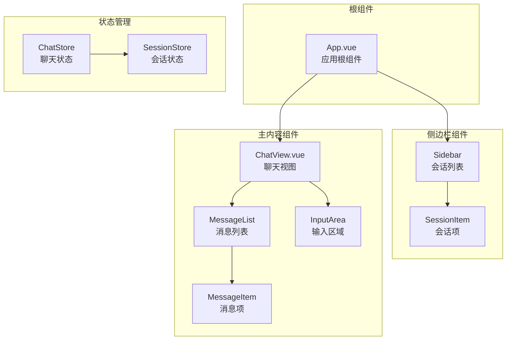

**图表来源**
- [App.vue:1-178](file://src/renderer/src/App.vue#L1-L178)
- [views/ChatView.vue:1-325](file://src/renderer/src/views/ChatView.vue#L1-L325)
- [stores/chat.ts:26-262](file://src/renderer/src/stores/chat.ts#L26-L262)

## 详细组件分析

### 应用根组件 (App.vue)

App.vue作为应用的根组件，实现了侧边栏导航和主内容区域的布局：

#### 核心功能特性
- **会话管理**：显示和管理多个聊天会话
- **连接状态**：实时显示WebSocket连接状态
- **会话切换**：支持在不同会话间切换
- **会话操作**：创建、删除和激活会话

#### 数据绑定与事件处理

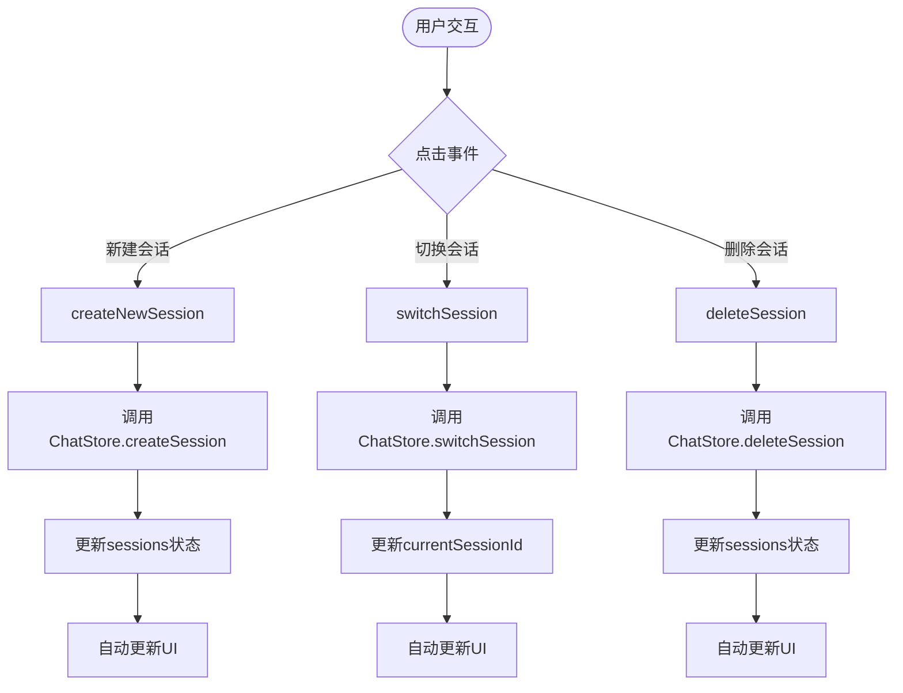

**图表来源**
- [App.vue:37-45](file://src/renderer/src/App.vue#L37-L45)
- [stores/chat.ts:41-63](file://src/renderer/src/stores/chat.ts#L41-L63)

**章节来源**
- [App.vue:1-178](file://src/renderer/src/App.vue#L1-L178)

### 聊天视图组件 (ChatView.vue)

ChatView.vue是应用的核心组件，负责处理用户输入、显示消息和管理聊天体验：

#### 核心功能模块

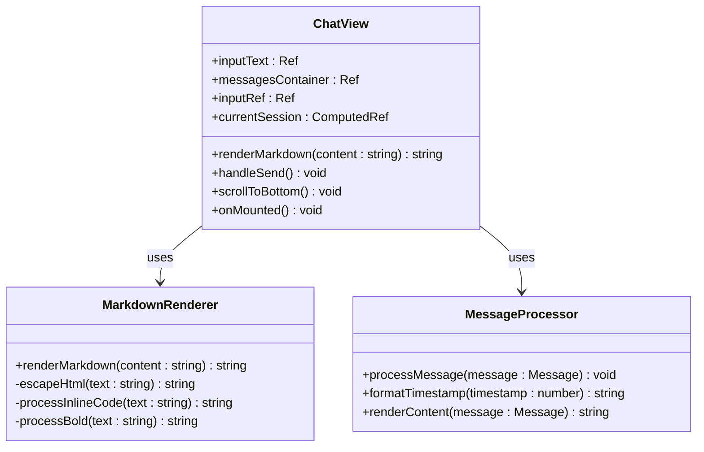

**图表来源**
- [views/ChatView.vue:68-127](file://src/renderer/src/views/ChatView.vue#L68-L127)

#### 输入处理机制

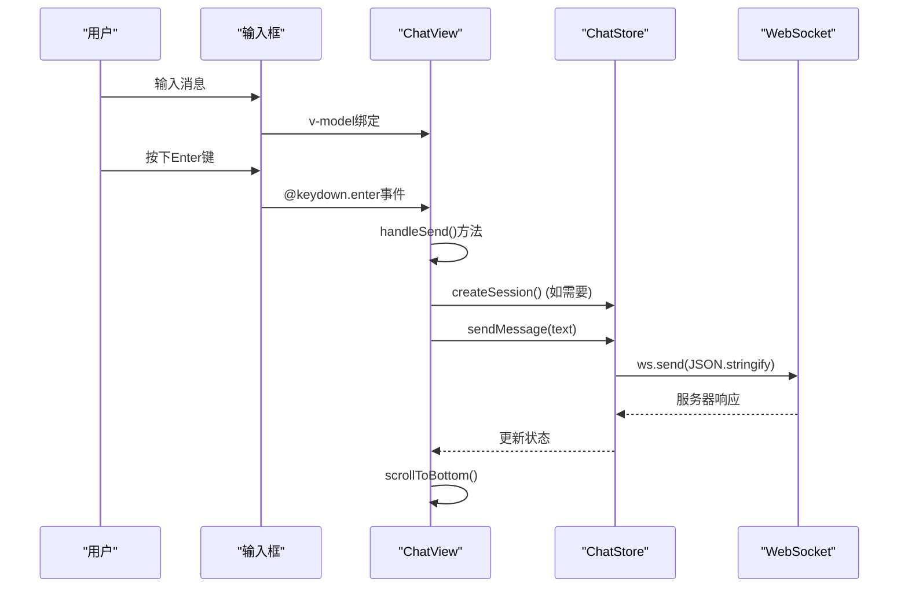

**图表来源**
- [views/ChatView.vue:90-102](file://src/renderer/src/views/ChatView.vue#L90-L102)
- [stores/chat.ts:209-232](file://src/renderer/src/stores/chat.ts#L209-L232)

**章节来源**
- [views/ChatView.vue:1-325](file://src/renderer/src/views/ChatView.vue#L1-L325)

### 状态管理实现 (ChatStore)

ChatStore是应用的核心状态管理模块，实现了完整的聊天应用状态逻辑：

#### 状态结构设计

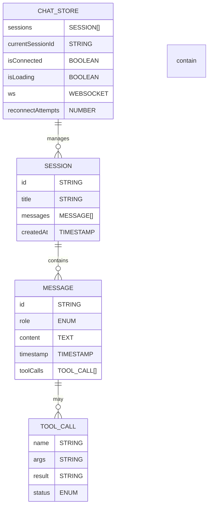

**图表来源**
- [stores/chat.ts:4-24](file://src/renderer/src/stores/chat.ts#L4-L24)
- [stores/chat.ts:26-262](file://src/renderer/src/stores/chat.ts#L26-L262)

#### WebSocket通信流程

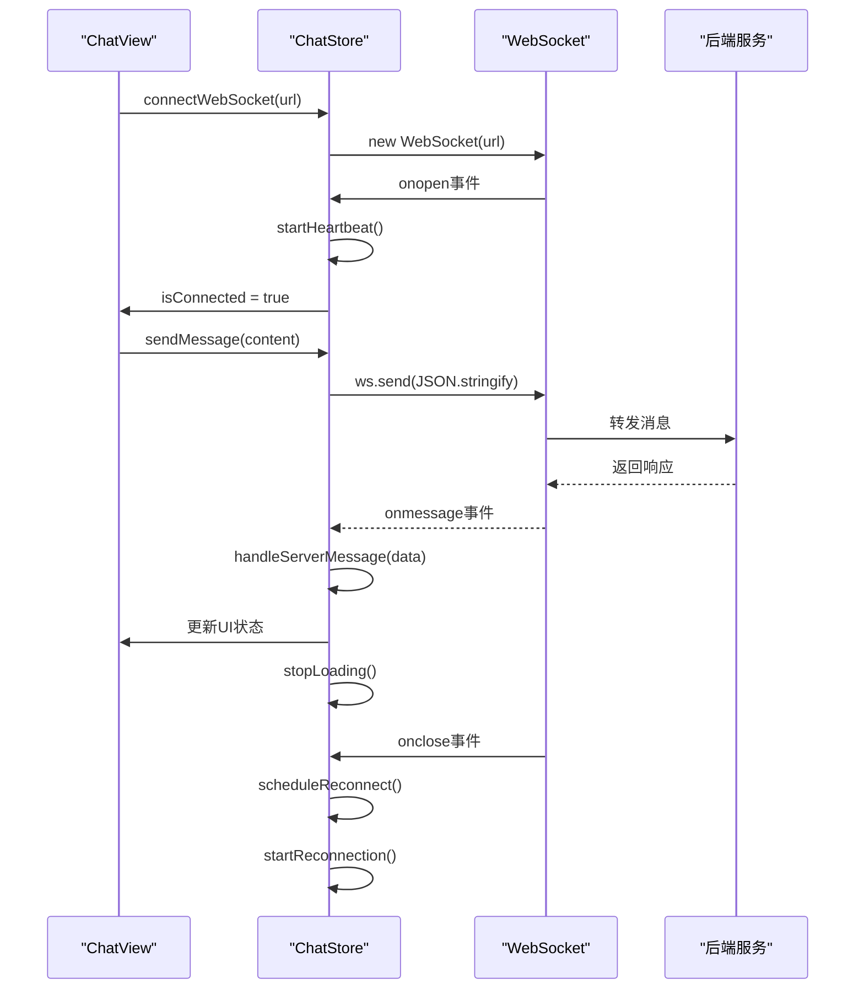

**图表来源**
- [stores/chat.ts:110-150](file://src/renderer/src/stores/chat.ts#L110-L150)
- [stores/chat.ts:139-147](file://src/renderer/src/stores/chat.ts#L139-L147)
- [stores/chat.ts:99-108](file://src/renderer/src/stores/chat.ts#L99-L108)

**章节来源**
- [stores/chat.ts:1-263](file://src/renderer/src/stores/chat.ts#L1-L263)

### 路由系统设计

应用使用Vue Router实现单页应用的路由管理：

#### 路由配置

```mermaid
flowchart LR
subgraph "路由配置"
RouterConfig[createRouter]
HashHistory[createWebHashHistory]
Routes[routes数组]
end
subgraph "路由定义"
HomeRoute[/{path: '/', name: 'chat'}]
ChatComponent[component: ChatView]
end
subgraph "路由导航"
RouterInstance[router实例]
RouterView[<router-view>]
end
RouterConfig --> HashHistory
RouterConfig --> Routes
Routes --> HomeRoute
HomeRoute --> ChatComponent
RouterInstance --> RouterView
```

**图表来源**
- [router/index.ts:1-16](file://src/renderer/src/router/index.ts#L1-L16)

**章节来源**
- [router/index.ts:1-16](file://src/renderer/src/router/index.ts#L1-L16)

## 依赖关系分析

### 外部依赖管理

应用的依赖关系清晰明确，遵循现代前端开发的最佳实践：

```mermaid
graph TB
subgraph "运行时依赖"
Vue[vue ^3.5.13]
Pinia[pinia ^2.2.6]
Router[vue-router ^4.4.5]
Electron[electron ^33.2.1]
end
subgraph "开发时依赖"
Vite[vite ^6.0.7]
VueTSC[vue-tsc ^2.1.10]
TS[typescript ^5.7.2]
ESLint[eslint ^8.x]
ElectronVite[electron-vite ^2.3.0]
end
subgraph "工具库"
ElectronToolkit[@electron-toolkit/*]
Preload[@electron-toolkit/preload]
Utils[@electron-toolkit/utils]
end
Vue --> Pinia
Vue --> Router
Electron --> Vue
Electron --> Pinia
Electron --> Router
```

**图表来源**
- [package.json:17-33](file://package.json#L17-L33)

### 内部模块依赖

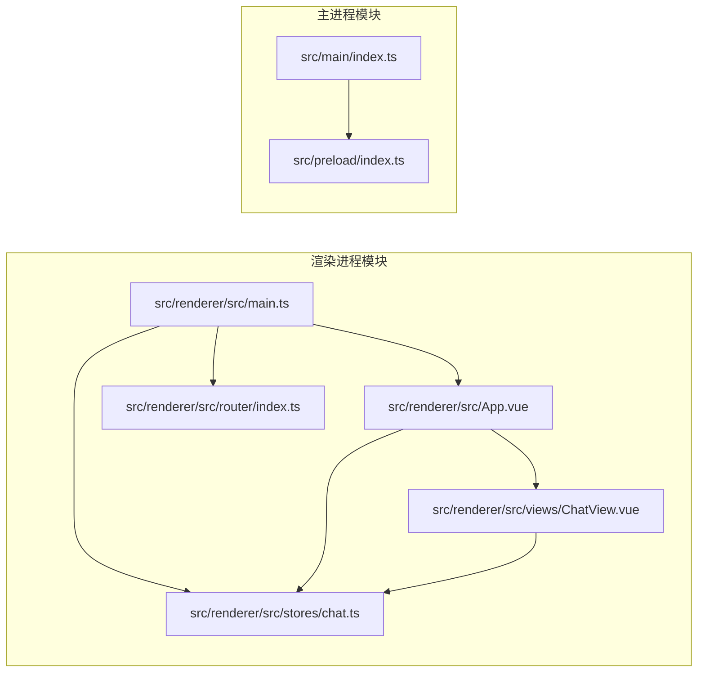

**图表来源**
- [main.ts:1-11](file://src/renderer/src/main.ts#L1-L11)
- [main/index.ts:1-62](file://src/main/index.ts#L1-L62)

**章节来源**
- [package.json:1-35](file://package.json#L1-L35)

## 性能考虑

### 响应式设计优化

应用采用了多项性能优化策略：

#### 内存管理
- 使用`ref`和`computed`确保响应式数据的高效更新
- 合理使用`watch`监听器，避免不必要的计算
- 及时清理定时器和WebSocket连接

#### 渲染优化
- 使用`v-for`的`key`属性确保列表渲染的稳定性
- 实现虚拟滚动以处理大量消息的情况
- 优化CSS动画和过渡效果

#### 网络优化
- 实现WebSocket心跳机制保持连接稳定
- 采用指数退避算法处理重连
- 缓存后端URL配置减少IPC调用

### 用户体验优化

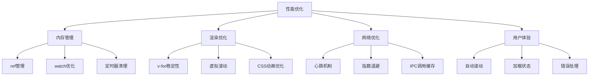

## 故障排除指南

### 常见问题诊断

#### WebSocket连接问题
1. **连接失败**：检查后端服务是否启动
2. **连接断开**：查看控制台日志中的重连信息
3. **消息丢失**：确认心跳机制正常工作

#### 状态同步问题
1. **UI不更新**：确认响应式数据的正确使用
2. **状态丢失**：检查Pinia存储的持久化设置
3. **并发冲突**：避免直接修改响应式对象

#### 性能问题
1. **渲染卡顿**：检查是否有过多的watch监听器
2. **内存泄漏**：确认定时器和事件监听器的清理
3. **网络延迟**：优化WebSocket消息处理逻辑

**章节来源**
- [stores/chat.ts:83-97](file://src/renderer/src/stores/chat.ts#L83-L97)
- [stores/chat.ts:234-246](file://src/renderer/src/stores/chat.ts#L234-L246)

## 结论

Hermes Desktop前端架构展现了现代桌面应用开发的最佳实践：

### 架构优势
- **清晰的分层设计**：MVVM模式确保了良好的代码组织
- **强大的状态管理**：Pinia提供了简洁而强大的状态管理
- **灵活的路由系统**：Vue Router支持复杂的导航需求
- **稳定的通信机制**：WebSocket实现实时双向通信

### 技术亮点
- **TypeScript集成**：提供了完整的类型安全保证
- **响应式设计**：优秀的用户体验和视觉效果
- **模块化架构**：便于维护和扩展
- **性能优化**：针对桌面应用的特殊优化

### 改进建议
- 实现状态持久化存储
- 添加离线模式支持
- 优化大消息的渲染性能
- 增强错误处理和恢复机制

该架构为Hermes Desktop提供了坚实的技术基础，能够支持未来功能的扩展和性能的持续优化。