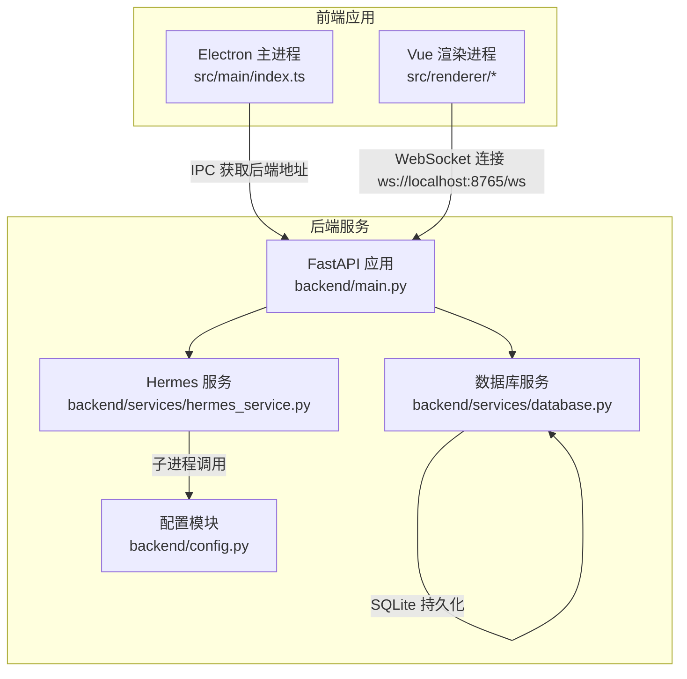
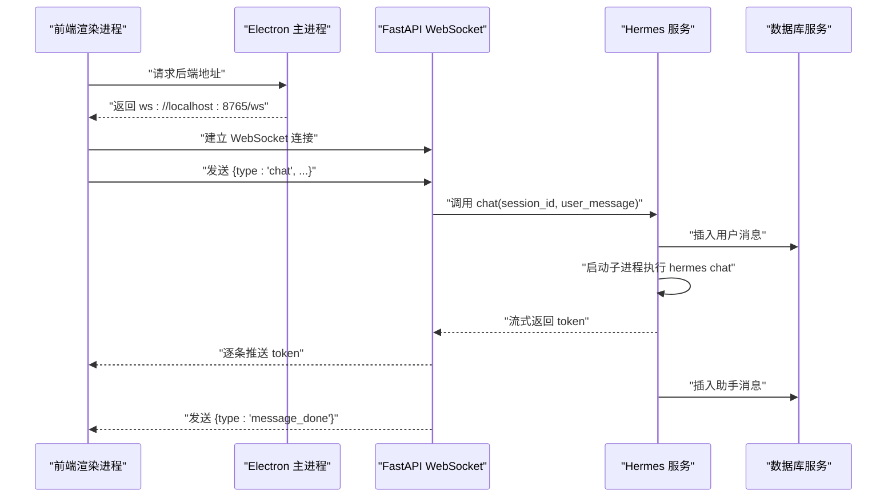
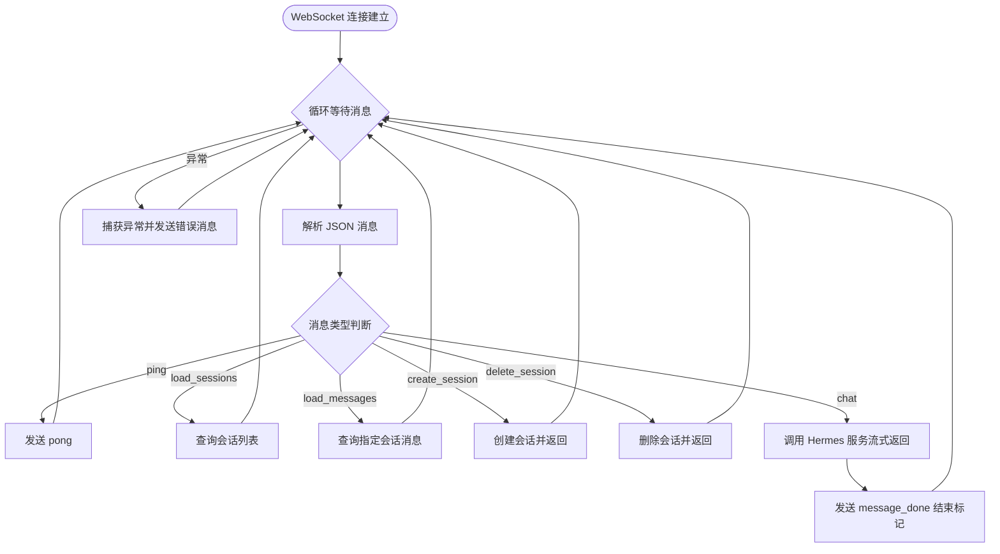
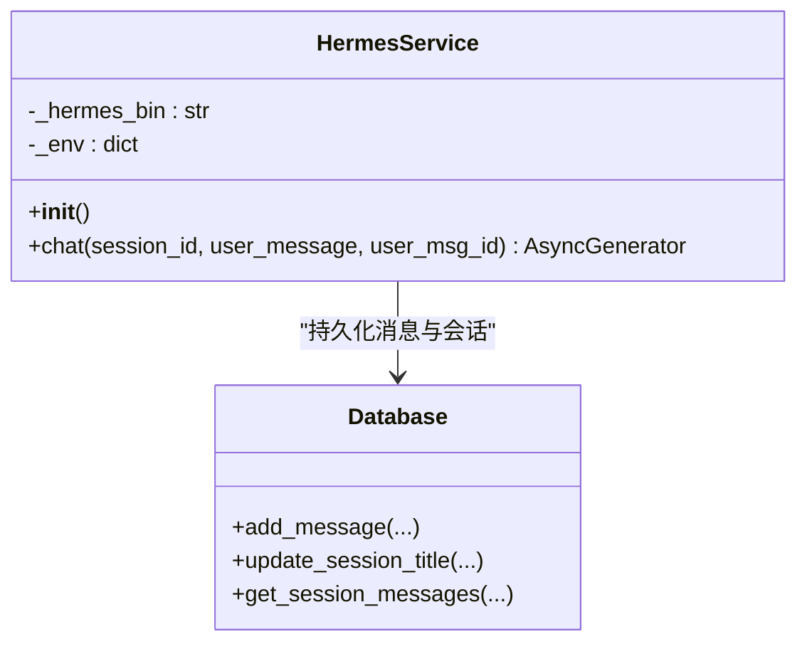
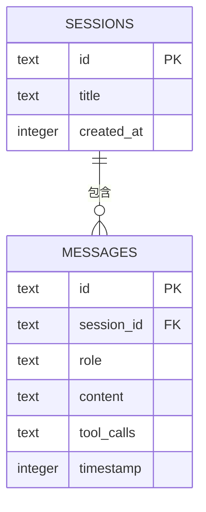
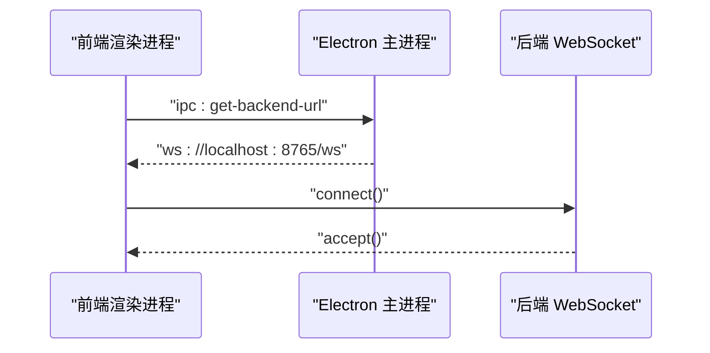
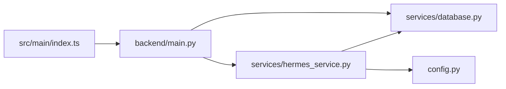

# 后端架构设计

<cite>
**本文档引用的文件**
- [backend/main.py](file://backend/main.py)
- [backend/services/hermes_service.py](file://backend/services/hermes_service.py)
- [backend/services/database.py](file://backend/services/database.py)
- [backend/config.py](file://backend/config.py)
- [backend/requirements.txt](file://backend/requirements.txt)
- [src/main/index.ts](file://src/main/index.ts)
- [electron.vite.config.ts](file://electron.vite.config.ts)
</cite>

## 目录
1. [引言](#引言)
2. [项目结构](#项目结构)
3. [核心组件](#核心组件)
4. [架构总览](#架构总览)
5. [详细组件分析](#详细组件分析)
6. [依赖关系分析](#依赖关系分析)
7. [性能考虑](#性能考虑)
8. [故障排除指南](#故障排除指南)
9. [结论](#结论)

## 引言
本设计文档面向Hermes Desktop后端架构，重点阐述基于FastAPI的Python服务、WebSocket通信架构以及与Hermes Agent CLI的集成方案。文档从系统分层、异步处理机制、消息路由策略入手，逐步深入到与Hermes Agent的交互模式、工具调用处理流程与错误处理机制，并讨论服务发现、负载均衡与扩展性、性能优化、安全策略与监控方案等工程实践。

## 项目结构
后端采用“主服务 + 业务服务 + 数据持久化”的分层组织方式，前端使用Electron + Vue构建桌面应用并通过IPC与后端建立连接。核心文件分布如下：

- 后端服务
  - 主入口：`backend/main.py`（FastAPI应用、WebSocket端点、健康检查）
  - 业务服务：`backend/services/hermes_service.py`（Hermes Agent交互、异步流式响应）
  - 数据持久化：`backend/services/database.py`（SQLite会话与消息存储）
  - 配置管理：`backend/config.py`（路径、端口、环境变量解析）
  - 依赖声明：`backend/requirements.txt`（FastAPI、Uvicorn、WebSockets、Aiosqlite）

- 前端应用
  - Electron主进程：`src/main/index.ts`（窗口创建、IPC处理、后端地址暴露）
  - 构建配置：`electron.vite.config.ts`（Vite+Electron工程化配置）

**图表来源**
- [backend/main.py:1-114](file://backend/main.py#L1-L114)
- [backend/services/hermes_service.py:1-86](file://backend/services/hermes_service.py#L1-L86)
- [backend/services/database.py:1-137](file://backend/services/database.py#L1-L137)
- [backend/config.py:1-24](file://backend/config.py#L1-L24)
- [src/main/index.ts:1-62](file://src/main/index.ts#L1-L62)

**章节来源**
- [backend/main.py:1-114](file://backend/main.py#L1-L114)
- [backend/services/hermes_service.py:1-86](file://backend/services/hermes_service.py#L1-L86)
- [backend/services/database.py:1-137](file://backend/services/database.py#L1-L137)
- [backend/config.py:1-24](file://backend/config.py#L1-L24)
- [src/main/index.ts:1-62](file://src/main/index.ts#L1-L62)
- [electron.vite.config.ts:1-21](file://electron.vite.config.ts#L1-L21)

## 核心组件
- FastAPI应用与生命周期管理
  - 使用生命周期钩子在启动时初始化数据库，确保服务可用性。
  - 提供CORS中间件，便于跨域访问（开发阶段）。
  - 暴露健康检查端点，便于外部监控。

- WebSocket通信层
  - 单一/ws端点，支持多客户端并发连接。
  - 消息类型驱动的路由：心跳、会话列表加载、消息加载、会话创建/删除、聊天请求。
  - 异步接收与发送，配合Hermes服务的流式输出，实现边生成边推送。

- Hermes服务
  - 封装Hermes Agent CLI调用，通过子进程执行并读取标准输出流。
  - 在首次用户消息时自动更新会话标题。
  - 将用户与助手消息持久化到SQLite，支持后续检索。

- 数据库服务
  - 基于SQLite的轻量级持久化，采用WAL模式提升并发写入性能。
  - 提供会话与消息的增删改查接口，支持按时间戳排序的消息查询。

- 配置模块
  - 解析HERMES_VENV_DIR与DB_PATH等关键环境变量，推导Hermes二进制路径与数据库位置。
  - 默认绑定0.0.0.0:8765，便于WSL环境下的外部访问。

**章节来源**
- [backend/main.py:17-39](file://backend/main.py#L17-L39)
- [backend/main.py:42-109](file://backend/main.py#L42-L109)
- [backend/services/hermes_service.py:13-86](file://backend/services/hermes_service.py#L13-L86)
- [backend/services/database.py:20-44](file://backend/services/database.py#L20-L44)
- [backend/config.py:6-24](file://backend/config.py#L6-L24)

## 架构总览
下图展示了从Electron渲染进程发起WebSocket连接，到后端FastAPI路由分发，再到Hermes服务与数据库的完整数据流。

**图表来源**
- [src/main/index.ts:45-48](file://src/main/index.ts#L45-L48)
- [backend/main.py:89-98](file://backend/main.py#L89-L98)
- [backend/services/hermes_service.py:24-86](file://backend/services/hermes_service.py#L24-L86)
- [backend/services/database.py:86-104](file://backend/services/database.py#L86-L104)

## 详细组件分析

### FastAPI应用与WebSocket路由
- 生命周期管理
  - 在应用启动时初始化数据库，保证后续会话与消息操作可用。
- 路由与消息类型
  - 支持心跳、会话管理、消息加载、聊天请求等类型。
  - 聊天请求采用异步生成器，边生成边推送，降低首字延迟。
- 错误处理
  - 捕获WebSocket断开与通用异常，向客户端发送错误消息，避免连接中断导致的静默失败。

**图表来源**
- [backend/main.py:42-109](file://backend/main.py#L42-L109)

**章节来源**
- [backend/main.py:17-39](file://backend/main.py#L17-L39)
- [backend/main.py:42-109](file://backend/main.py#L42-L109)

### Hermes服务与Agent集成
- 环境准备
  - 复制当前环境变量，将虚拟环境bin目录加入PATH，设置虚拟环境标识，确保CLI可找到依赖。
- 聊天流程
  - 首次用户消息时更新会话标题。
  - 子进程执行hermes chat命令，逐行读取标准输出作为token流。
  - 将用户消息与助手回复分别持久化，确保历史可追溯。
- 错误处理
  - 文件未找到、子进程非零退出码、其他异常均转换为统一错误消息类型返回。

**图表来源**
- [backend/services/hermes_service.py:13-86](file://backend/services/hermes_service.py#L13-L86)
- [backend/services/database.py:86-137](file://backend/services/database.py#L86-L137)

**章节来源**
- [backend/services/hermes_service.py:13-86](file://backend/services/hermes_service.py#L13-L86)
- [backend/services/database.py:34-41](file://backend/services/database.py#L34-L41)
- [backend/services/database.py:70-76](file://backend/services/database.py#L70-L76)
- [backend/services/database.py:117-137](file://backend/services/database.py#L117-L137)

### 数据模型与持久化
- 表结构
  - sessions：会话ID、标题、创建时间。
  - messages：消息ID、所属会话、角色（user/assistant）、内容、工具调用信息、时间戳。
- 索引与约束
  - 外键约束保证会话删除时级联清理消息。
  - 按会话与时间戳建立索引，优化消息查询性能。
- 并发与一致性
  - WAL模式提升写入吞吐；每个操作独立打开/关闭连接，简化事务管理。

**图表来源**
- [backend/services/database.py:23-42](file://backend/services/database.py#L23-L42)

**章节来源**
- [backend/services/database.py:20-44](file://backend/services/database.py#L20-L44)
- [backend/services/database.py:48-82](file://backend/services/database.py#L48-L82)
- [backend/services/database.py:86-137](file://backend/services/database.py#L86-L137)

### 前端集成与IPC
- 后端地址暴露
  - Electron主进程通过ipcMain.handle暴露后端WebSocket地址，前端按需获取。
- 连接策略
  - 前端在运行时根据开发或生产环境选择加载URL或本地HTML，随后建立WebSocket连接。

**图表来源**
- [src/main/index.ts:45-48](file://src/main/index.ts#L45-L48)
- [backend/main.py:42-45](file://backend/main.py#L42-L45)

**章节来源**
- [src/main/index.ts:45-48](file://src/main/index.ts#L45-L48)
- [src/main/index.ts:29-34](file://src/main/index.ts#L29-L34)

## 依赖关系分析
- 组件耦合
  - WebSocket路由依赖Hermes服务与数据库服务；Hermes服务依赖配置模块与数据库服务。
  - 前端仅通过IPC与主进程交互，再由主进程决定后端地址，降低前端对后端细节的耦合。
- 外部依赖
  - FastAPI/Uvicorn提供高性能ASGI服务器；WebSockets用于双向通信；Aiosqlite支持异步数据库操作。
- 可能的循环依赖
  - 当前模块间为单向依赖，未见循环导入风险。

**图表来源**
- [backend/main.py:12-14](file://backend/main.py#L12-L14)
- [backend/services/hermes_service.py:9-10](file://backend/services/hermes_service.py#L9-L10)
- [src/main/index.ts:1-62](file://src/main/index.ts#L1-L62)

**章节来源**
- [backend/requirements.txt:1-5](file://backend/requirements.txt#L1-L5)
- [backend/main.py:12-14](file://backend/main.py#L12-L14)
- [backend/services/hermes_service.py:9-10](file://backend/services/hermes_service.py#L9-L10)

## 性能考虑
- 异步与流式
  - WebSocket与Hermes服务均采用异步生成器，减少阻塞，提升响应速度。
- 数据库优化
  - WAL模式与外键启用，结合索引优化消息查询；每个操作独立连接，避免长事务锁争用。
- I/O与并发
  - 子进程读取stdout逐行输出，避免缓冲区积压；WebSocket广播场景建议引入连接池与限流策略。
- 扩展性建议
  - 当前为单实例部署；若需扩展，可引入反向代理与负载均衡，结合Redis共享会话状态或数据库集群。
- 安全与隔离
  - 限制CORS范围、启用TLS、对输入进行校验与白名单过滤；子进程环境严格控制，避免敏感信息泄露。

[本节为通用性能指导，无需特定文件引用]

## 故障排除指南
- WebSocket连接失败
  - 检查后端是否在0.0.0.0:8765监听；确认防火墙放行；前端是否正确获取后端地址。
- Hermes二进制不可用
  - 设置HERMES_VENV_DIR指向正确的虚拟环境路径；验证HERMES_BIN是否存在；检查PATH中是否包含venv/bin。
- 数据库异常
  - 确认DB_PATH可写；SQLite文件权限；如需迁移，备份后重建表结构。
- 流式输出中断
  - 检查子进程返回码与stderr输出；关注网络抖动导致的连接中断，必要时增加重连与断点续传逻辑。

**章节来源**
- [backend/main.py:99-108](file://backend/main.py#L99-L108)
- [backend/services/hermes_service.py:78-85](file://backend/services/hermes_service.py#L78-L85)
- [backend/config.py:6-19](file://backend/config.py#L6-L19)

## 结论
该后端架构以FastAPI为核心，结合WebSocket实现实时交互，通过Hermes服务桥接CLI能力，配合SQLite实现轻量级持久化。整体设计简洁清晰，具备良好的可维护性与扩展空间。建议在生产环境中强化安全策略、引入监控与日志聚合，并根据用户规模评估水平扩展方案。