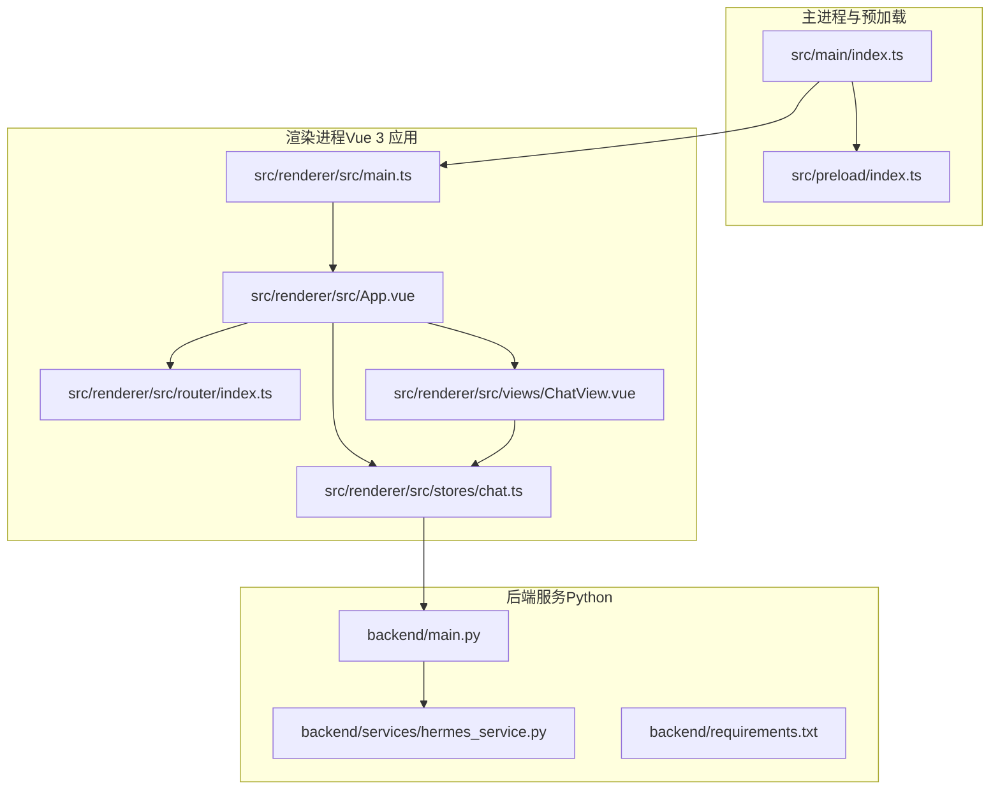
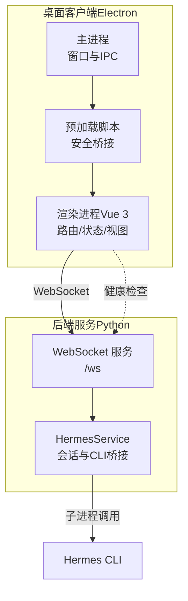
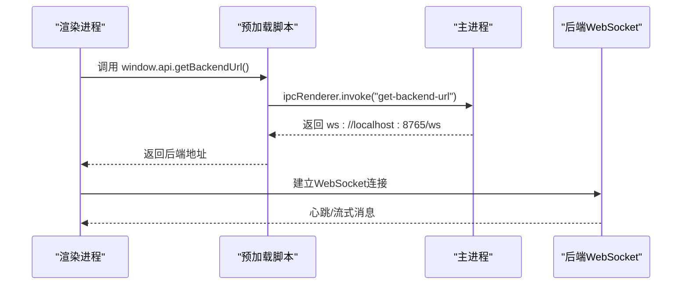
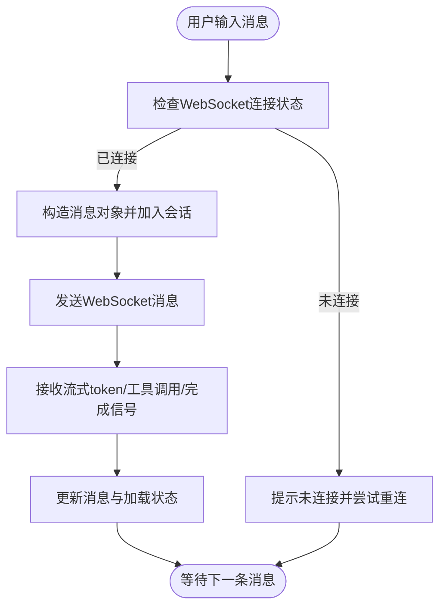
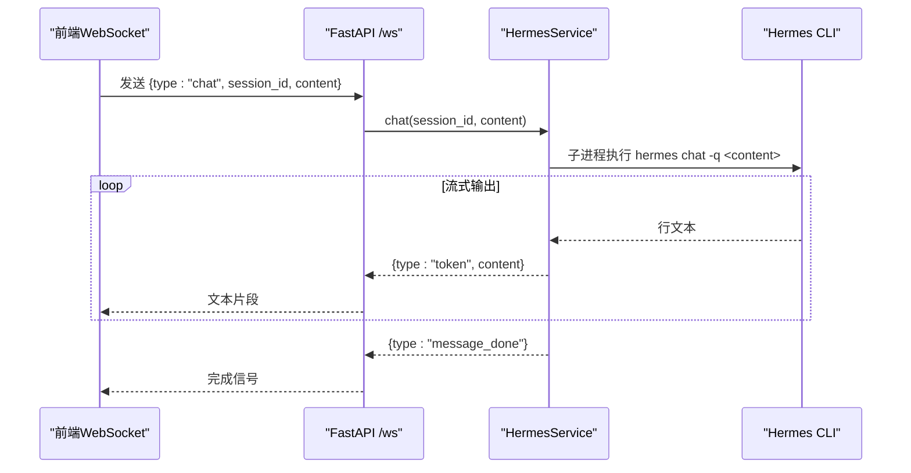
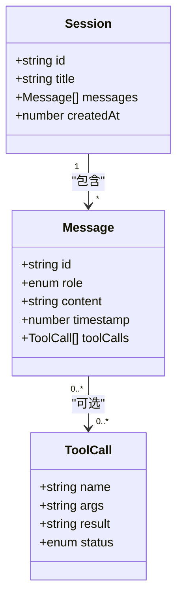
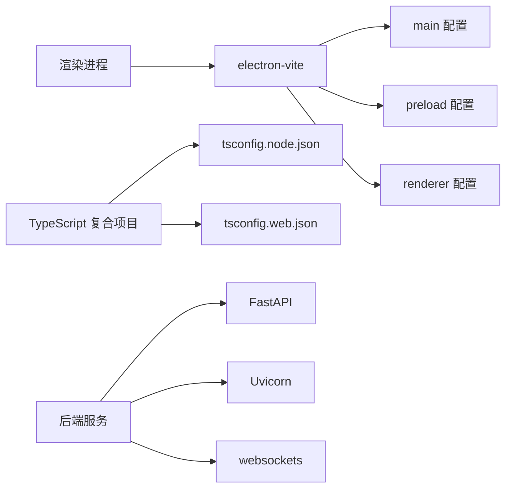
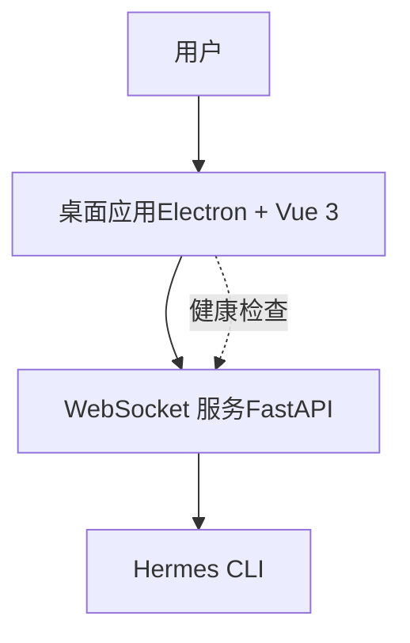

# 整体架构概览

<cite>
**本文引用的文件**
- [package.json](file://package.json)
- [electron.vite.config.ts](file://electron.vite.config.ts)
- [backend/main.py](file://backend/main.py)
- [backend/services/hermes_service.py](file://backend/services/hermes_service.py)
- [backend/requirements.txt](file://backend/requirements.txt)
- [src/main/index.ts](file://src/main/index.ts)
- [src/preload/index.ts](file://src/preload/index.ts)
- [src/renderer/src/main.ts](file://src/renderer/src/main.ts)
- [src/renderer/src/App.vue](file://src/renderer/src/App.vue)
- [src/renderer/src/views/ChatView.vue](file://src/renderer/src/views/ChatView.vue)
- [src/renderer/src/stores/chat.ts](file://src/renderer/src/stores/chat.ts)
- [src/renderer/src/router/index.ts](file://src/renderer/src/router/index.ts)
- [tsconfig.json](file://tsconfig.json)
- [tsconfig.node.json](file://tsconfig.node.json)
- [tsconfig.web.json](file://tsconfig.web.json)
</cite>

## 目录
1. [引言](#引言)
2. [项目结构](#项目结构)
3. [核心组件](#核心组件)
4. [架构总览](#架构总览)
5. [详细组件分析](#详细组件分析)
6. [依赖分析](#依赖分析)
7. [性能考量](#性能考量)
8. [故障排查指南](#故障排查指南)
9. [结论](#结论)
10. [附录](#附录)

## 引言
本文件为 Hermes Desktop 的整体架构概览文档，面向开发者与产品团队，系统性阐述系统的高层设计、架构模式与系统边界。重点覆盖 Electron 主进程与渲染进程的分离架构、Vue 3 前端应用结构、Python 后端服务设计；解释系统各组件之间的交互关系、数据流向与集成模式；给出技术决策、权衡考虑与约束条件；并提供系统上下文图与组件分解图。同时，涵盖跨领域关注点（安全性、监控与灾难恢复）以及技术栈、第三方依赖与版本兼容性。

## 项目结构
Hermes Desktop 采用 Electron + Vue 3 的桌面应用架构，前后端通过 WebSocket 进行实时通信。项目目录按“主进程/预加载脚本/渲染进程”与“后端服务”分层组织，构建工具使用 electron-vite，前端使用 Vite + Vue 3 + TypeScript，后端使用 FastAPI + Uvicorn。

**图表来源**
- [src/main/index.ts:1-62](file://src/main/index.ts#L1-L62)
- [src/preload/index.ts:1-24](file://src/preload/index.ts#L1-L24)
- [src/renderer/src/main.ts:1-11](file://src/renderer/src/main.ts#L1-L11)
- [src/renderer/src/App.vue:1-178](file://src/renderer/src/App.vue#L1-L178)
- [src/renderer/src/router/index.ts:1-16](file://src/renderer/src/router/index.ts#L1-L16)
- [src/renderer/src/views/ChatView.vue:1-325](file://src/renderer/src/views/ChatView.vue#L1-L325)
- [src/renderer/src/stores/chat.ts:1-263](file://src/renderer/src/stores/chat.ts#L1-L263)
- [backend/main.py:1-71](file://backend/main.py#L1-L71)
- [backend/services/hermes_service.py:1-82](file://backend/services/hermes_service.py#L1-L82)
- [backend/requirements.txt:1-4](file://backend/requirements.txt#L1-L4)

**章节来源**
- [package.json:1-35](file://package.json#L1-L35)
- [electron.vite.config.ts:1-21](file://electron.vite.config.ts#L1-L21)
- [tsconfig.json:1-8](file://tsconfig.json#L1-L8)
- [tsconfig.node.json:1-13](file://tsconfig.node.json#L1-L13)
- [tsconfig.web.json:1-16](file://tsconfig.web.json#L1-L16)

## 核心组件
- Electron 主进程：负责窗口生命周期管理、原生能力调用、IPC 通信与后端地址暴露。
- 预加载脚本：通过 contextBridge 暴露受控 API 至渲染进程，隔离安全边界。
- 渲染进程（Vue 3）：单页应用，包含路由、状态管理（Pinia）、视图组件与 WebSocket 客户端。
- Python 后端服务（FastAPI）：提供健康检查与 WebSocket 接口，桥接 Hermes Agent CLI，支持流式响应与心跳保活。
- 会话服务（HermesService）：维护会话历史、调用 Hermes CLI 并流式返回内容，处理错误与状态。

**章节来源**
- [src/main/index.ts:1-62](file://src/main/index.ts#L1-L62)
- [src/preload/index.ts:1-24](file://src/preload/index.ts#L1-L24)
- [src/renderer/src/main.ts:1-11](file://src/renderer/src/main.ts#L1-L11)
- [src/renderer/src/App.vue:1-178](file://src/renderer/src/App.vue#L1-L178)
- [src/renderer/src/views/ChatView.vue:1-325](file://src/renderer/src/views/ChatView.vue#L1-L325)
- [src/renderer/src/stores/chat.ts:1-263](file://src/renderer/src/stores/chat.ts#L1-L263)
- [backend/main.py:1-71](file://backend/main.py#L1-L71)
- [backend/services/hermes_service.py:1-82](file://backend/services/hermes_service.py#L1-L82)

## 架构总览
系统采用“主进程-预加载-渲染进程”的经典 Electron 分层，前端通过 Pinia 管理会话与连接状态，通过 WebSocket 与后端通信。后端以 FastAPI 提供 REST/WS 能力，内部通过子进程调用 Hermes CLI 实现智能体交互，并在内存中维护会话历史。

**图表来源**
- [src/main/index.ts:1-62](file://src/main/index.ts#L1-L62)
- [src/preload/index.ts:1-24](file://src/preload/index.ts#L1-L24)
- [src/renderer/src/stores/chat.ts:1-263](file://src/renderer/src/stores/chat.ts#L1-L263)
- [backend/main.py:1-71](file://backend/main.py#L1-L71)
- [backend/services/hermes_service.py:1-82](file://backend/services/hermes_service.py#L1-L82)

## 详细组件分析

### 组件一：Electron 主进程与预加载
- 主进程职责
  - 创建窗口、设置 webPreferences（禁用沙盒、启用预加载）
  - 处理窗口事件与应用生命周期
  - 暴露 IPC：向渲染进程提供后端 WebSocket 地址
- 预加载脚本职责
  - 使用 contextBridge 将受限 API 暴露到渲染进程
  - 通过 ipcRenderer.invoke 获取后端地址
- 安全与隔离
  - 启用上下文隔离，仅暴露必要 API
  - 禁用沙盒以简化原生能力访问，需谨慎控制暴露面

**图表来源**
- [src/main/index.ts:45-48](file://src/main/index.ts#L45-L48)
- [src/preload/index.ts:5-7](file://src/preload/index.ts#L5-L7)
- [src/renderer/src/views/ChatView.vue:119-126](file://src/renderer/src/views/ChatView.vue#L119-L126)
- [backend/main.py:31-66](file://backend/main.py#L31-L66)

**章节来源**
- [src/main/index.ts:1-62](file://src/main/index.ts#L1-L62)
- [src/preload/index.ts:1-24](file://src/preload/index.ts#L1-L24)

### 组件二：Vue 3 前端应用
- 应用入口与全局注册
  - main.ts 创建应用实例，挂载路由与状态管理
- 视图与路由
  - App.vue 提供侧边栏与会话列表、连接状态指示
  - ChatView.vue 实现消息展示、输入与发送、Markdown 渲染占位
  - router/index.ts 定义根路径路由
- 状态管理（Pinia）
  - stores/chat.ts 管理会话集合、当前会话、连接状态、加载状态与 WebSocket 生命周期
  - 支持心跳保活、指数退避重连、消息聚合与工具调用展示

**图表来源**
- [src/renderer/src/stores/chat.ts:109-150](file://src/renderer/src/stores/chat.ts#L109-L150)
- [src/renderer/src/stores/chat.ts:152-207](file://src/renderer/src/stores/chat.ts#L152-L207)
- [src/renderer/src/views/ChatView.vue:90-102](file://src/renderer/src/views/ChatView.vue#L90-L102)

**章节来源**
- [src/renderer/src/main.ts:1-11](file://src/renderer/src/main.ts#L1-L11)
- [src/renderer/src/App.vue:1-178](file://src/renderer/src/App.vue#L1-L178)
- [src/renderer/src/views/ChatView.vue:1-325](file://src/renderer/src/views/ChatView.vue#L1-L325)
- [src/renderer/src/router/index.ts:1-16](file://src/renderer/src/router/index.ts#L1-L16)
- [src/renderer/src/stores/chat.ts:1-263](file://src/renderer/src/stores/chat.ts#L1-L263)

### 组件三：Python 后端服务与会话服务
- FastAPI 服务
  - CORS 允许所有来源（开发环境）
  - /health 健康检查
  - /ws WebSocket 端点：支持 ping/pong 心跳、chat 流式消息、错误上报
- HermesService
  - 维护会话历史（内存字典）
  - 通过子进程调用 hermes CLI，逐行流式输出 token
  - 捕获错误并回传错误消息
  - 支持会话清理与历史查询

**图表来源**
- [backend/main.py:31-66](file://backend/main.py#L31-L66)
- [backend/services/hermes_service.py:16-72](file://backend/services/hermes_service.py#L16-L72)

**章节来源**
- [backend/main.py:1-71](file://backend/main.py#L1-L71)
- [backend/services/hermes_service.py:1-82](file://backend/services/hermes_service.py#L1-L82)
- [backend/requirements.txt:1-4](file://backend/requirements.txt#L1-L4)

### 组件四：数据模型与状态流转
- 会话模型（Session）
  - 包含 id、title、messages 列表、创建时间
- 消息模型（Message）
  - 包含 id、role、content、timestamp、可选工具调用数组
- 工具调用模型（ToolCall）
  - 包含名称、参数、结果、状态（running/done/error）

**图表来源**
- [src/renderer/src/stores/chat.ts:19-24](file://src/renderer/src/stores/chat.ts#L19-L24)
- [src/renderer/src/stores/chat.ts:4-17](file://src/renderer/src/stores/chat.ts#L4-L17)

**章节来源**
- [src/renderer/src/stores/chat.ts:1-263](file://src/renderer/src/stores/chat.ts#L1-L263)

## 依赖分析
- 构建与开发
  - electron-vite 配置主/预加载/渲染三段式构建，渲染端启用 Vue 插件与路径别名
  - TypeScript 通过复合项目分别编译 Node 与 Web 环境
- 运行时依赖
  - Electron 主进程与预加载脚本由主入口加载
  - 渲染进程由 Vite 开发服务器或打包后的 HTML 加载
- 后端依赖
  - FastAPI、Uvicorn、websockets，满足 WebSocket 与异步处理需求

**图表来源**
- [electron.vite.config.ts:1-21](file://electron.vite.config.ts#L1-L21)
- [tsconfig.json:1-8](file://tsconfig.json#L1-L8)
- [tsconfig.node.json:1-13](file://tsconfig.node.json#L1-L13)
- [tsconfig.web.json:1-16](file://tsconfig.web.json#L1-L16)
- [backend/requirements.txt:1-4](file://backend/requirements.txt#L1-L4)

**章节来源**
- [electron.vite.config.ts:1-21](file://electron.vite.config.ts#L1-L21)
- [tsconfig.json:1-8](file://tsconfig.json#L1-L8)
- [tsconfig.node.json:1-13](file://tsconfig.node.json#L1-L13)
- [tsconfig.web.json:1-16](file://tsconfig.web.json#L1-L16)
- [backend/requirements.txt:1-4](file://backend/requirements.txt#L1-L4)

## 性能考量
- WebSocket 流式传输
  - 后端逐行输出 token，前端增量拼接，避免大块数据一次性渲染
- 心跳与重连
  - 前端定时心跳检测连接状态，断线后指数退避重连，降低网络抖动影响
- 内存会话
  - 会话历史保存在内存，适合桌面端短时对话；若需要持久化，建议引入本地存储或数据库
- 渲染优化
  - 使用虚拟滚动与懒更新策略可进一步优化长对话渲染性能（当前实现为简单追加）

[本节为通用性能指导，不直接分析具体文件]

## 故障排查指南
- 连接失败
  - 检查后端是否启动且监听 0.0.0.0:8765
  - 确认前端能否通过 IPC 获取到正确的 WebSocket 地址
  - 查看浏览器控制台与后端日志中的异常信息
- 消息无响应
  - 确认 WebSocket 已建立并保持 OPEN 状态
  - 检查后端 /ws 是否收到 chat 请求并触发 Hermes CLI
- CLI 无法找到
  - 后端在找不到 hermes CLI 时会返回错误消息，确认 CLI 在 PATH 中或替换为直接 SDK 调用
- 错误处理
  - 后端捕获异常并通过 WebSocket 回传错误类型，前端统一显示为系统消息

**章节来源**
- [src/renderer/src/stores/chat.ts:134-147](file://src/renderer/src/stores/chat.ts#L134-L147)
- [backend/main.py:56-66](file://backend/main.py#L56-L66)
- [backend/services/hermes_service.py:66-72](file://backend/services/hermes_service.py#L66-L72)

## 结论
Hermes Desktop 采用清晰的分层架构：Electron 主进程负责系统级能力，预加载脚本保障安全边界，渲染进程承载业务 UI 与状态管理，后端以 FastAPI 提供 WebSocket 能力并与 Hermes CLI 桥接。该架构在开发体验、实时交互与扩展性之间取得平衡。后续可在会话持久化、安全加固、可观测性与灾难恢复方面持续演进。

[本节为总结性内容，不直接分析具体文件]

## 附录

### 技术栈与版本兼容性
- 构建与运行
  - Electron、electron-vite、Vite、Vue 3、TypeScript
- 前端
  - Vue Router、Pinia、Vue 单文件组件
- 后端
  - FastAPI、Uvicorn、websockets
- 配置
  - tsconfig 复合项目、路径别名、插件化构建

**章节来源**
- [package.json:17-33](file://package.json#L17-L33)
- [electron.vite.config.ts:1-21](file://electron.vite.config.ts#L1-L21)
- [backend/requirements.txt:1-4](file://backend/requirements.txt#L1-L4)
- [tsconfig.json:1-8](file://tsconfig.json#L1-L8)

### 系统上下文图

[此图为概念性上下文图，不直接映射具体源码文件]