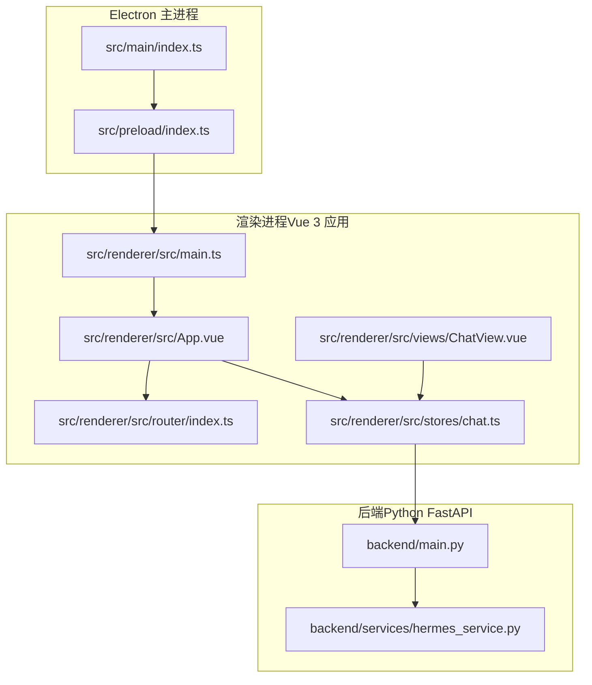
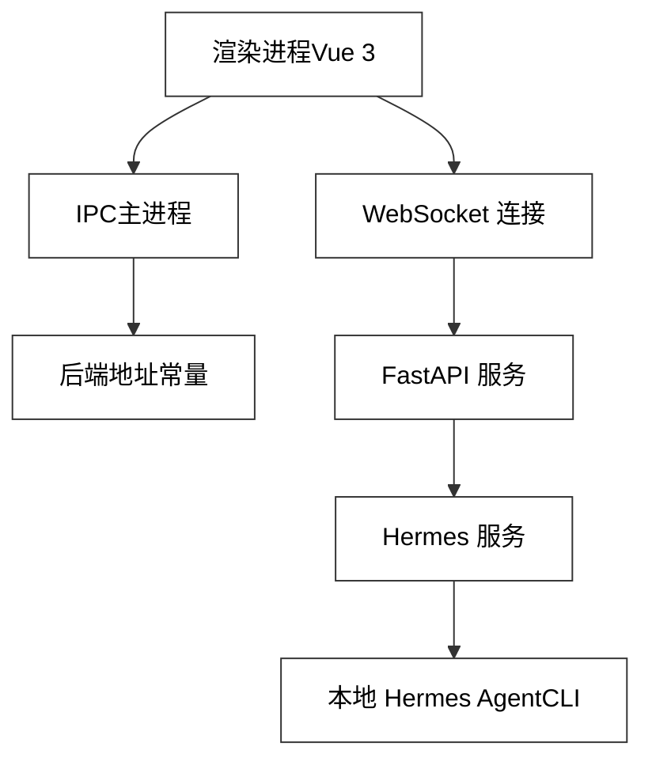
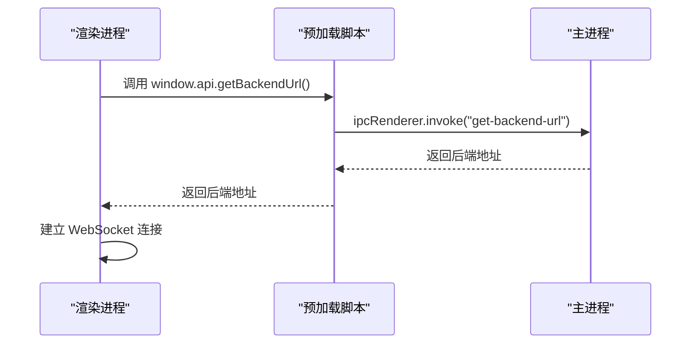
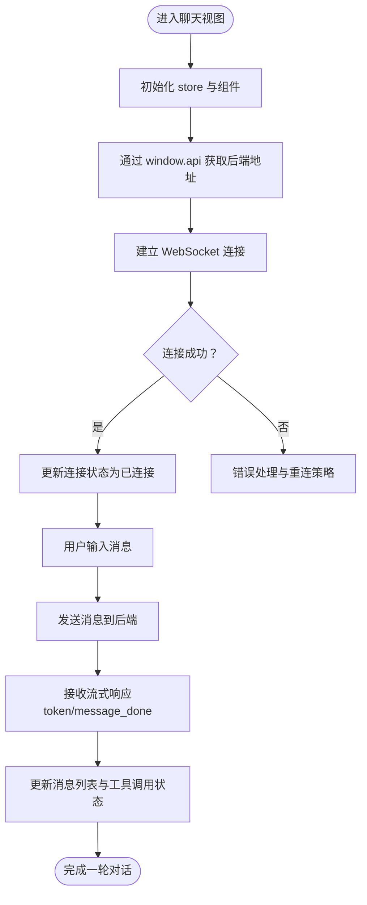
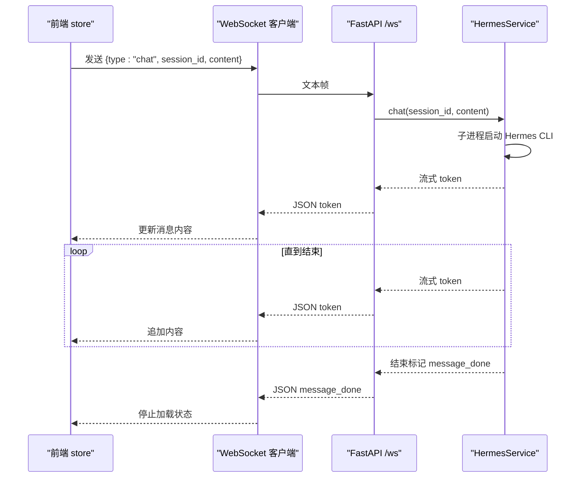
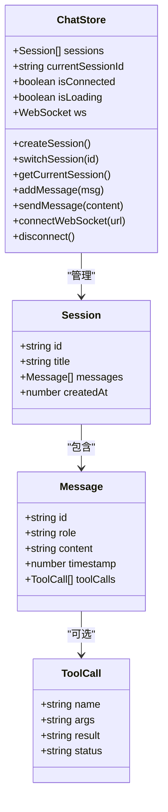
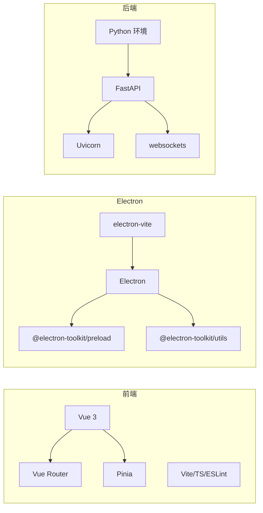

# 架构设计

<cite>
**本文引用的文件**
- [package.json](file://package.json)
- [electron.vite.config.ts](file://electron.vite.config.ts)
- [tsconfig.json](file://tsconfig.json)
- [tsconfig.node.json](file://tsconfig.node.json)
- [tsconfig.web.json](file://tsconfig.web.json)
- [src/main/index.ts](file://src/main/index.ts)
- [src/preload/index.ts](file://src/preload/index.ts)
- [src/renderer/src/main.ts](file://src/renderer/src/main.ts)
- [src/renderer/src/App.vue](file://src/renderer/src/App.vue)
- [src/renderer/src/views/ChatView.vue](file://src/renderer/src/views/ChatView.vue)
- [src/renderer/src/stores/chat.ts](file://src/renderer/src/stores/chat.ts)
- [src/renderer/src/router/index.ts](file://src/renderer/src/router/index.ts)
- [backend/main.py](file://backend/main.py)
- [backend/services/hermes_service.py](file://backend/services/hermes_service.py)
- [backend/requirements.txt](file://backend/requirements.txt)
</cite>

## 目录
1. [引言](#引言)
2. [项目结构](#项目结构)
3. [核心组件](#核心组件)
4. [架构总览](#架构总览)
5. [详细组件分析](#详细组件分析)
6. [依赖分析](#依赖分析)
7. [性能考量](#性能考量)
8. [故障排查指南](#故障排查指南)
9. [结论](#结论)
10. [附录](#附录)

## 引言
本架构设计文档面向 Hermes Desktop 桌面应用，系统采用 Electron 主进程与渲染进程分离的桌面应用架构，前端使用 Vue 3 + Pinia + Vue Router，后端以 Python FastAPI 提供 WebSocket 服务并与本地 Hermes Agent 交互。系统通过 WebSocket 实现实时通信，通过 IPC（Electron 的 ipcMain/ipcRenderer）在主进程与渲染进程之间传递配置与状态，实现前后端解耦与职责清晰。

## 项目结构
项目采用多包/多入口的组织方式：主进程入口负责窗口生命周期与 IPC；预加载脚本暴露受限 API 给渲染进程；渲染进程包含 Vue 应用、路由与状态管理；后端独立为 Python 服务，监听本地端口并通过 WebSocket 与前端通信。

**图表来源**
- [src/main/index.ts:1-62](file://src/main/index.ts#L1-L62)
- [src/preload/index.ts:1-24](file://src/preload/index.ts#L1-L24)
- [src/renderer/src/main.ts:1-11](file://src/renderer/src/main.ts#L1-L11)
- [src/renderer/src/App.vue:1-144](file://src/renderer/src/App.vue#L1-L144)
- [src/renderer/src/router/index.ts:1-16](file://src/renderer/src/router/index.ts#L1-L16)
- [src/renderer/src/stores/chat.ts:1-197](file://src/renderer/src/stores/chat.ts#L1-L197)
- [src/renderer/src/views/ChatView.vue:1-327](file://src/renderer/src/views/ChatView.vue#L1-L327)
- [backend/main.py:1-69](file://backend/main.py#L1-L69)
- [backend/services/hermes_service.py:1-82](file://backend/services/hermes_service.py#L1-L82)

**章节来源**
- [package.json:1-35](file://package.json#L1-L35)
- [electron.vite.config.ts:1-21](file://electron.vite.config.ts#L1-L21)
- [tsconfig.json:1-8](file://tsconfig.json#L1-L8)
- [tsconfig.node.json:1-13](file://tsconfig.node.json#L1-L13)
- [tsconfig.web.json:1-16](file://tsconfig.web.json#L1-L16)

## 核心组件
- Electron 主进程：负责创建窗口、设置 webPreferences、注册 IPC 处理器、处理窗口事件与应用生命周期。
- 预加载脚本：通过 contextBridge 暴露受控 API（如获取后端地址），隔离渲染进程与 Node/Electron 能力。
- 渲染进程（Vue 3）：应用入口、路由、状态管理（Pinia）、视图组件（ChatView）。
- 后端服务（Python FastAPI）：提供健康检查、WebSocket 端点，调用 Hermes Agent 并流式返回结果。
- Hermes 服务：封装与本地 Hermes Agent 的交互，维护会话历史，支持子进程流式输出。

**章节来源**
- [src/main/index.ts:1-62](file://src/main/index.ts#L1-L62)
- [src/preload/index.ts:1-24](file://src/preload/index.ts#L1-L24)
- [src/renderer/src/main.ts:1-11](file://src/renderer/src/main.ts#L1-L11)
- [src/renderer/src/stores/chat.ts:1-197](file://src/renderer/src/stores/chat.ts#L1-L197)
- [backend/main.py:1-69](file://backend/main.py#L1-L69)
- [backend/services/hermes_service.py:1-82](file://backend/services/hermes_service.py#L1-L82)

## 架构总览
系统采用“桌面客户端 + 本地后端服务”的双层架构。主进程负责系统级能力与安全边界，渲染进程负责用户界面与交互，后端服务运行在本地网络中，通过 WebSocket 与前端进行流式通信。IPC 在主进程与渲染进程之间传递基础配置（如后端地址），避免渲染进程直接访问系统资源。

**图表来源**
- [src/main/index.ts:45-48](file://src/main/index.ts#L45-L48)
- [src/preload/index.ts:5-7](file://src/preload/index.ts#L5-L7)
- [src/renderer/src/views/ChatView.vue:119-126](file://src/renderer/src/views/ChatView.vue#L119-L126)
- [backend/main.py:31-63](file://backend/main.py#L31-L63)
- [backend/services/hermes_service.py:16-72](file://backend/services/hermes_service.py#L16-L72)

## 详细组件分析

### Electron 主进程与预加载
- 主进程负责创建 BrowserWindow、设置 webPreferences（禁用沙盒示例路径）、窗口打开处理、应用生命周期事件。
- 注册 IPC 处理器，向渲染进程暴露后端地址查询接口。
- 预加载脚本通过 contextBridge 暴露受限 API，渲染进程仅能通过 window.api 访问该接口。

**图表来源**
- [src/preload/index.ts:5-7](file://src/preload/index.ts#L5-L7)
- [src/main/index.ts:45-48](file://src/main/index.ts#L45-L48)
- [src/renderer/src/views/ChatView.vue:121-122](file://src/renderer/src/views/ChatView.vue#L121-L122)

**章节来源**
- [src/main/index.ts:1-62](file://src/main/index.ts#L1-L62)
- [src/preload/index.ts:1-24](file://src/preload/index.ts#L1-L24)

### Vue 3 前端应用结构
- 入口：创建 Vue 应用，挂载到 DOM。
- 路由：单页路由，根路径指向聊天视图。
- 状态：Pinia 管理会话、当前会话 ID、连接状态、加载状态与 WebSocket 实例。
- 视图：ChatView 负责消息渲染、输入处理、滚动控制、Markdown 简易渲染与工具调用展示。

**图表来源**
- [src/renderer/src/main.ts:1-11](file://src/renderer/src/main.ts#L1-L11)
- [src/renderer/src/router/index.ts:1-16](file://src/renderer/src/router/index.ts#L1-L16)
- [src/renderer/src/stores/chat.ts:64-96](file://src/renderer/src/stores/chat.ts#L64-L96)
- [src/renderer/src/views/ChatView.vue:90-126](file://src/renderer/src/views/ChatView.vue#L90-L126)

**章节来源**
- [src/renderer/src/main.ts:1-11](file://src/renderer/src/main.ts#L1-L11)
- [src/renderer/src/router/index.ts:1-16](file://src/renderer/src/router/index.ts#L1-L16)
- [src/renderer/src/stores/chat.ts:1-197](file://src/renderer/src/stores/chat.ts#L1-L197)
- [src/renderer/src/views/ChatView.vue:1-327](file://src/renderer/src/views/ChatView.vue#L1-L327)

### Python 后端服务与实时通信
- FastAPI 提供健康检查与 WebSocket 端点，接受来自前端的消息，转发给 Hermes 服务。
- Hermes 服务通过子进程调用本地 Hermes Agent CLI，逐行读取标准输出并以流式 JSON 形式回传。
- 后端维护会话字典，记录用户与助手消息，支持错误处理与异常上报。

**图表来源**
- [backend/main.py:31-63](file://backend/main.py#L31-L63)
- [backend/services/hermes_service.py:16-72](file://backend/services/hermes_service.py#L16-L72)
- [src/renderer/src/stores/chat.ts:98-151](file://src/renderer/src/stores/chat.ts#L98-L151)

**章节来源**
- [backend/main.py:1-69](file://backend/main.py#L1-L69)
- [backend/services/hermes_service.py:1-82](file://backend/services/hermes_service.py#L1-L82)

### 数据模型与状态流转
- 会话（Session）：包含唯一 ID、标题、消息数组、创建时间。
- 消息（Message）：角色（用户/助手/系统）、内容、时间戳、可选工具调用列表。
- 工具调用（ToolCall）：名称、参数、结果、状态（运行中/完成/错误）。
- store 中维护 sessions、currentSessionId、isConnected、isLoading、ws 实例，并在 onmessage 分发不同消息类型。

**图表来源**
- [src/renderer/src/stores/chat.ts:19-197](file://src/renderer/src/stores/chat.ts#L19-L197)

**章节来源**
- [src/renderer/src/stores/chat.ts:1-197](file://src/renderer/src/stores/chat.ts#L1-L197)

## 依赖分析
- 前端依赖：Vue 3、Pinia、Vue Router；开发工具链包括 Vite、TypeScript、ESLint、Vue 类型检查。
- Electron 依赖：@electron-toolkit/preload、@electron-toolkit/utils；构建工具 electron-vite。
- 后端依赖：FastAPI、Uvicorn、websockets；要求 Python 环境具备可执行的 Hermes CLI。

**图表来源**
- [package.json:17-33](file://package.json#L17-L33)
- [backend/requirements.txt:1-4](file://backend/requirements.txt#L1-L4)

**章节来源**
- [package.json:1-35](file://package.json#L1-L35)
- [backend/requirements.txt:1-4](file://backend/requirements.txt#L1-L4)

## 性能考量
- WebSocket 流式传输：后端按行读取 CLI 输出并立即推送，前端增量拼接，降低延迟与内存占用。
- 前端渲染优化：使用虚拟滚动与自动滚动至底部，避免长消息列表的重排压力。
- 进程隔离：主进程与渲染进程分离，避免 UI 卡顿影响系统级功能。
- 会话缓存：后端在内存维护会话历史，减少重复计算；建议后续持久化与 LRU 策略。
- 错误与重连：前端在连接断开时应提示并尝试重连，后端异常时返回统一错误格式。

## 故障排查指南
- WebSocket 连接失败
  - 检查后端是否在本地端口监听，确认地址与端口正确。
  - 查看前端 onerror/onclose 回调日志，确认连接状态变更。
- 后端无法找到 Hermes CLI
  - 确认本地环境已安装并可在 PATH 中找到命令。
  - 检查子进程创建与标准输出读取逻辑，确保编码与换行处理正确。
- IPC 无法获取后端地址
  - 确认主进程已注册对应 IPC 处理器且返回值有效。
  - 检查预加载脚本是否正确暴露 window.api。
- CORS 与安全
  - 当前后端允许所有来源，生产环境需限制来源与启用 HTTPS/Token 校验。
- 日志与可观测性
  - 建议在主进程与后端增加结构化日志与错误追踪，前端记录关键事件与错误堆栈。

**章节来源**
- [src/renderer/src/stores/chat.ts:76-93](file://src/renderer/src/stores/chat.ts#L76-L93)
- [backend/services/hermes_service.py:66-72](file://backend/services/hermes_service.py#L66-L72)
- [src/main/index.ts:45-48](file://src/main/index.ts#L45-L48)
- [src/preload/index.ts:5-7](file://src/preload/index.ts#L5-L7)

## 结论
本架构以 Electron 为宿主，前端采用现代 Web 技术栈，后端以 Python 快速实现与本地 Agent 的集成。通过 WebSocket 实现低延迟流式通信，IPC 保障了主/渲染进程的安全边界。整体设计简洁、边界清晰，便于扩展与维护。后续可在安全加固、持久化与可观测性方面进一步完善。

## 附录
- 技术栈与版本要点
  - 前端：Vue 3、Pinia、Vue Router、Vite、TypeScript
  - Electron：electron-vite 构建、@electron-toolkit 工具集
  - 后端：FastAPI、Uvicorn、websockets
  - 环境：需要可用的 Hermes Agent CLI 可执行文件
- 第三方依赖与兼容性
  - 前端依赖与版本在 package.json 中声明
  - 后端依赖与版本在 requirements.txt 中声明
  - TypeScript 配置分别针对 Node 与 Web 环境

**章节来源**
- [package.json:17-33](file://package.json#L17-L33)
- [backend/requirements.txt:1-4](file://backend/requirements.txt#L1-L4)
- [tsconfig.node.json:1-13](file://tsconfig.node.json#L1-L13)
- [tsconfig.web.json:1-16](file://tsconfig.web.json#L1-L16)