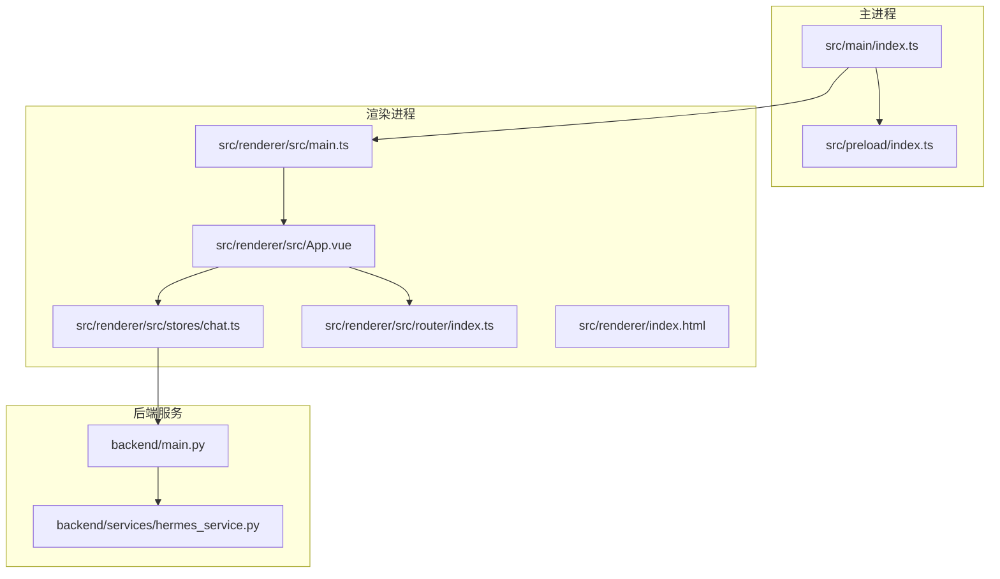
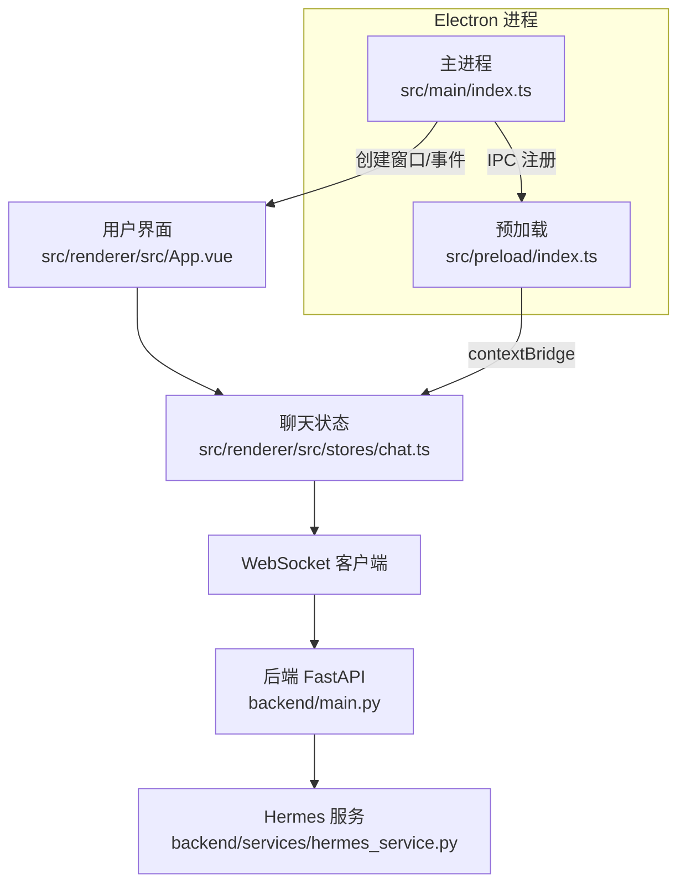
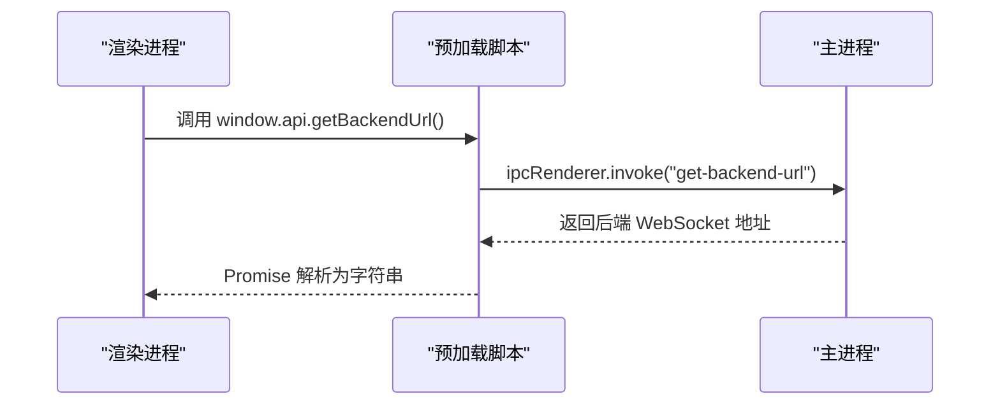
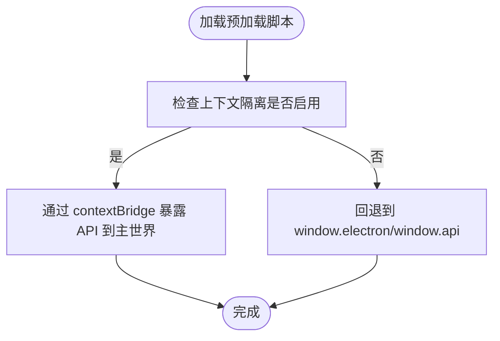
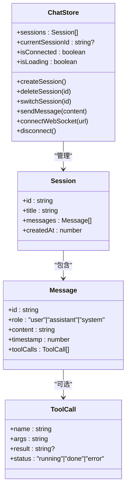
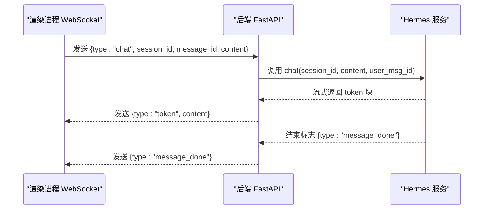
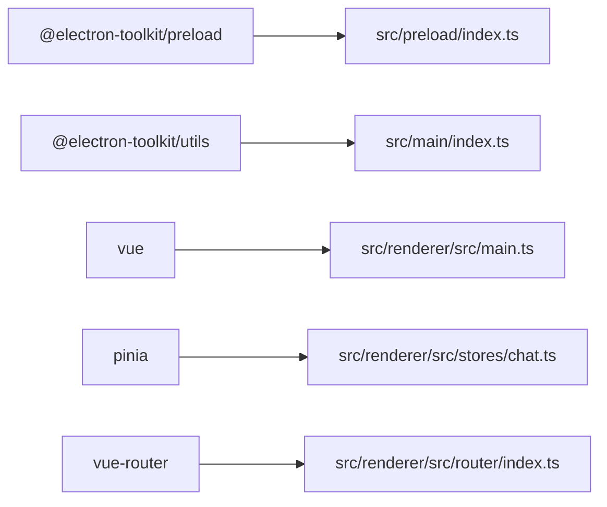

# 桌面应用集成

<cite>
**本文引用的文件**
- [package.json](file://package.json)
- [electron.vite.config.ts](file://electron.vite.config.ts)
- [src/main/index.ts](file://src/main/index.ts)
- [src/preload/index.ts](file://src/preload/index.ts)
- [src/preload/index.d.ts](file://src/preload/index.d.ts)
- [src/renderer/index.html](file://src/renderer/index.html)
- [src/renderer/src/main.ts](file://src/renderer/src/main.ts)
- [src/renderer/src/App.vue](file://src/renderer/src/App.vue)
- [src/renderer/src/router/index.ts](file://src/renderer/src/router/index.ts)
- [src/renderer/src/stores/chat.ts](file://src/renderer/src/stores/chat.ts)
- [backend/main.py](file://backend/main.py)
- [backend/services/hermes_service.py](file://backend/services/hermes_service.py)
- [tsconfig.json](file://tsconfig.json)
- [tsconfig.node.json](file://tsconfig.node.json)
</cite>

## 目录
1. [简介](#简介)
2. [项目结构](#项目结构)
3. [核心组件](#核心组件)
4. [架构总览](#架构总览)
5. [组件详细分析](#组件详细分析)
6. [依赖关系分析](#依赖关系分析)
7. [性能考虑](#性能考虑)
8. [故障排查指南](#故障排查指南)
9. [结论](#结论)
10. [附录](#附录)

## 简介
本设计文档面向 Hermes Desktop 桌面应用的集成与实现，聚焦 Electron 主进程配置与管理、预加载脚本的安全设计与 IPC 通信机制、窗口与菜单栏策略、系统集成功能；阐述主进程与渲染进程的职责分离、安全沙箱与权限控制现状、应用生命周期管理、自动更新机制现状与建议、跨平台兼容性要点，并提供桌面集成架构图与 IPC 通信流程图。同时覆盖用户体验优化、系统资源管理与性能监控建议。

## 项目结构
项目采用 Electron-Vite 多包（main、preload、renderer）分层组织，主进程负责窗口创建、系统级事件与 IPC 注册；预加载脚本通过 contextBridge 暴露受控 API；渲染进程基于 Vue 3 + Pinia + Vue Router 构建前端界面与状态管理；后端使用 Python FastAPI 提供 WebSocket 服务并与 Hermes Agent 二进制交互。

**图表来源**
- [src/main/index.ts:1-62](file://src/main/index.ts#L1-L62)
- [src/preload/index.ts:1-24](file://src/preload/index.ts#L1-L24)
- [src/renderer/src/main.ts:1-11](file://src/renderer/src/main.ts#L1-L11)
- [src/renderer/src/App.vue:1-178](file://src/renderer/src/App.vue#L1-L178)
- [src/renderer/src/stores/chat.ts:1-314](file://src/renderer/src/stores/chat.ts#L1-L314)
- [src/renderer/src/router/index.ts:1-16](file://src/renderer/src/router/index.ts#L1-L16)
- [src/renderer/index.html:1-13](file://src/renderer/index.html#L1-L13)
- [backend/main.py:1-114](file://backend/main.py#L1-L114)
- [backend/services/hermes_service.py:1-86](file://backend/services/hermes_service.py#L1-L86)

**章节来源**
- [package.json:1-35](file://package.json#L1-L35)
- [electron.vite.config.ts:1-21](file://electron.vite.config.ts#L1-L21)
- [tsconfig.json:1-8](file://tsconfig.json#L1-L8)
- [tsconfig.node.json:1-13](file://tsconfig.node.json#L1-L13)

## 核心组件
- 主进程：负责应用生命周期、窗口创建与事件监听、系统菜单与快捷键绑定、IPC 通道注册与后端地址暴露。
- 预加载脚本：通过 contextBridge 将受限 API 暴露给渲染进程，确保上下文隔离下的安全访问。
- 渲染进程：Vue 应用入口、路由与状态管理、WebSocket 客户端、UI 组件与会话管理。
- 后端服务：FastAPI + WebSocket，提供会话与消息持久化、与 Hermes Agent 的子进程交互与流式响应。

**章节来源**
- [src/main/index.ts:1-62](file://src/main/index.ts#L1-L62)
- [src/preload/index.ts:1-24](file://src/preload/index.ts#L1-L24)
- [src/renderer/src/main.ts:1-11](file://src/renderer/src/main.ts#L1-L11)
- [src/renderer/src/stores/chat.ts:1-314](file://src/renderer/src/stores/chat.ts#L1-L314)
- [backend/main.py:1-114](file://backend/main.py#L1-L114)

## 架构总览
下图展示从用户交互到后端处理的端到端流程，包括主进程窗口与 IPC、预加载桥接、渲染进程状态与 WebSocket、后端 FastAPI 与 Hermes Agent 子进程。

**图表来源**
- [src/main/index.ts:1-62](file://src/main/index.ts#L1-L62)
- [src/preload/index.ts:1-24](file://src/preload/index.ts#L1-L24)
- [src/renderer/src/App.vue:1-178](file://src/renderer/src/App.vue#L1-L178)
- [src/renderer/src/stores/chat.ts:1-314](file://src/renderer/src/stores/chat.ts#L1-L314)
- [backend/main.py:1-114](file://backend/main.py#L1-L114)
- [backend/services/hermes_service.py:1-86](file://backend/services/hermes_service.py#L1-L86)

## 组件详细分析

### 主进程：窗口管理、系统集成与 IPC
- 窗口创建与行为
  - 固定初始尺寸与最小尺寸，首次显示时解蔽，启用自动隐藏菜单栏。
  - 外部链接打开由系统默认浏览器处理，阻止在应用内弹窗。
- 生命周期与系统集成
  - 设置 AppUserModelID，开发模式下监听窗口快捷键；退出策略遵循 macOS 规范。
- IPC 通道
  - 注册“获取后端地址”的 IPC 句柄，返回固定 WebSocket 地址。

**图表来源**
- [src/preload/index.ts:1-24](file://src/preload/index.ts#L1-L24)
- [src/main/index.ts:45-48](file://src/main/index.ts#L45-L48)

**章节来源**
- [src/main/index.ts:5-35](file://src/main/index.ts#L5-L35)
- [src/main/index.ts:37-61](file://src/main/index.ts#L37-L61)

### 预加载脚本：安全桥接与类型声明
- 使用 contextBridge 在隔离上下文中向渲染进程暴露受控 API。
- 类型声明文件定义 window.electron 与 window.api 的接口，便于 TypeScript 校验。
- 当上下文隔离不可用时，回退到直接挂载到 window 对象（不推荐）。

**图表来源**
- [src/preload/index.ts:1-24](file://src/preload/index.ts#L1-L24)
- [src/preload/index.d.ts:1-11](file://src/preload/index.d.ts#L1-L11)

**章节来源**
- [src/preload/index.ts:1-24](file://src/preload/index.ts#L1-L24)
- [src/preload/index.d.ts:1-11](file://src/preload/index.d.ts#L1-L11)

### 渲染进程：应用入口、路由与状态管理
- 入口与框架
  - Vue 应用初始化、Pinia、Vue Router 注入，挂载根组件。
- 聊天状态与 WebSocket
  - 基于 Pinia 的会话模型与消息模型，维护连接状态、重连指数退避、心跳保活。
  - 通过 WebSocket 与后端通信，支持会话 CRUD、消息流式接收、工具调用标记等。
- UI 组件
  - 侧边栏会话列表、新建会话按钮、连接状态指示器，样式采用深色主题。

**图表来源**
- [src/renderer/src/stores/chat.ts:1-314](file://src/renderer/src/stores/chat.ts#L1-L314)
- [src/renderer/src/App.vue:1-178](file://src/renderer/src/App.vue#L1-L178)

**章节来源**
- [src/renderer/src/main.ts:1-11](file://src/renderer/src/main.ts#L1-L11)
- [src/renderer/src/router/index.ts:1-16](file://src/renderer/src/router/index.ts#L1-L16)
- [src/renderer/src/App.vue:1-178](file://src/renderer/src/App.vue#L1-L178)
- [src/renderer/src/stores/chat.ts:1-314](file://src/renderer/src/stores/chat.ts#L1-L314)

### 后端服务：WebSocket 协议与 Hermes 集成
- FastAPI 应用
  - CORS 放通，健康检查端点，WebSocket /ws 接收消息并分发处理。
- 消息协议
  - 支持 ping/pong 心跳、加载会话、加载消息、创建/删除会话、聊天流式输出。
- Hermes 集成
  - 通过子进程调用 Hermes Agent 二进制，读取标准输出流并按块发送给客户端。
  - 首条用户消息用于推断会话标题，持久化用户与助手消息。

**图表来源**
- [backend/main.py:89-98](file://backend/main.py#L89-L98)
- [backend/services/hermes_service.py:24-86](file://backend/services/hermes_service.py#L24-L86)
- [src/renderer/src/stores/chat.ts:258-283](file://src/renderer/src/stores/chat.ts#L258-L283)

**章节来源**
- [backend/main.py:1-114](file://backend/main.py#L1-L114)
- [backend/services/hermes_service.py:1-86](file://backend/services/hermes_service.py#L1-L86)

### 安全与权限控制
- 上下文隔离
  - 预加载脚本通过 contextBridge 暴露 API，仅在上下文隔离启用时生效；若禁用则直接挂载 window，存在安全风险。
- 沙箱配置
  - 主进程窗口 webPreferences.sandbox 设为关闭，降低隔离强度，需谨慎处理来自渲染进程的信任边界。
- 外链与窗口打开
  - setWindowOpenHandler 拒绝在应用内打开外部链接，统一交由系统默认浏览器处理。

**章节来源**
- [src/preload/index.ts:11-23](file://src/preload/index.ts#L11-L23)
- [src/main/index.ts:14-17](file://src/main/index.ts#L14-L17)
- [src/main/index.ts:24-27](file://src/main/index.ts#L24-L27)

### 应用生命周期与系统集成
- 生命周期
  - ready 创建窗口；activate 无窗口时重建；window-all-closed 非 macOS 退出。
- 系统集成
  - 设置 AppUserModelID；开发模式下启用窗口快捷键观察；默认隐藏菜单栏提升空间利用率。

**章节来源**
- [src/main/index.ts:37-61](file://src/main/index.ts#L37-L61)

### 自动更新机制现状与建议
- 现状
  - 仓库未发现自动更新相关实现或配置。
- 建议
  - 引入基于 GitHub Releases 或 S3 的更新通道，结合 Electron 自带 autoUpdater 或 electron-updater。
  - 在主进程中注册 update 事件回调，提示用户并执行重启安装。

[本节为通用建议，无需特定文件引用]

### 跨平台兼容性
- 平台差异
  - 退出策略区分 darwin；窗口最小尺寸与菜单栏行为在不同系统表现一致。
- 建议
  - 在 Windows/Linux 上验证窗口图标、托盘与通知；确保路径分隔符与子进程环境变量在各平台正确拼接。

**章节来源**
- [src/main/index.ts:57-61](file://src/main/index.ts#L57-L61)

## 依赖关系分析
- 构建与运行时
  - Electron-Vite 配置分别针对 main、preload、renderer 三类源码进行插件化构建。
  - TypeScript 复合工程拆分 Node 与 Web 编译目标，主进程包含 main 与 preload。
- 依赖生态
  - Electron、Vue、Pinia、Vue Router、@electron-toolkit 工具集。

**图表来源**
- [package.json:17-32](file://package.json#L17-L32)
- [electron.vite.config.ts:1-21](file://electron.vite.config.ts#L1-L21)
- [tsconfig.node.json:1-13](file://tsconfig.node.json#L1-L13)

**章节来源**
- [package.json:1-35](file://package.json#L1-L35)
- [electron.vite.config.ts:1-21](file://electron.vite.config.ts#L1-L21)
- [tsconfig.json:1-8](file://tsconfig.json#L1-L8)
- [tsconfig.node.json:1-13](file://tsconfig.node.json#L1-L13)

## 性能考虑
- 渲染性能
  - 使用虚拟滚动与懒加载减少大列表渲染压力；避免在消息流中频繁触发重排。
- 网络与连接
  - 指数退避与心跳保活降低无效重连成本；对高频消息进行去抖合并。
- 资源占用
  - 关闭非必要后台任务，限制日志级别；在 macOS 上利用系统内存回收策略。
- 监控建议
  - 在渲染进程记录 WebSocket 事件耗时与消息大小；在主进程统计窗口数量与内存峰值。

[本节为通用指导，无需特定文件引用]

## 故障排查指南
- 无法连接后端
  - 检查主进程 IPC 句柄是否注册、预加载 API 是否暴露、渲染进程是否成功解析后端地址。
- WebSocket 断开重连
  - 查看渲染进程重连计时器与最大延迟；确认后端心跳与连接状态切换逻辑。
- Hermes 二进制错误
  - 检查 venv 路径与 PATH 注入；确认二进制是否存在与可执行权限；关注 stderr 输出。
- 外链无法打开
  - 确认 setWindowOpenHandler 的拒绝策略与系统默认浏览器设置。

**章节来源**
- [src/main/index.ts:45-48](file://src/main/index.ts#L45-L48)
- [src/preload/index.ts:5-7](file://src/preload/index.ts#L5-L7)
- [src/renderer/src/stores/chat.ts:108-118](file://src/renderer/src/stores/chat.ts#L108-L118)
- [backend/services/hermes_service.py:78-85](file://backend/services/hermes_service.py#L78-L85)

## 结论
本设计文档梳理了 Hermes Desktop 的桌面集成方案：主进程负责窗口与系统集成、IPC 注册；预加载脚本在上下文隔离下提供受控 API；渲染进程以 Vue/Pinia 实现会话与消息管理并通过 WebSocket 与后端交互；后端以 FastAPI 提供 WebSocket 服务并与 Hermes Agent 子进程协作。当前实现具备清晰的职责分离与基础的生命周期管理，建议后续完善自动更新、增强沙箱与权限控制、扩展跨平台适配与性能监控。

## 附录
- 开发与构建
  - 开发：npm run dev；构建：npm run build；预览：npm run preview。
- 类型检查
  - 分别对 Node 与 Web 目标执行类型检查，确保主进程与渲染进程类型安全。

**章节来源**
- [package.json:8-15](file://package.json#L8-L15)
- [tsconfig.json:1-8](file://tsconfig.json#L1-L8)
- [tsconfig.node.json:1-13](file://tsconfig.node.json#L1-L13)