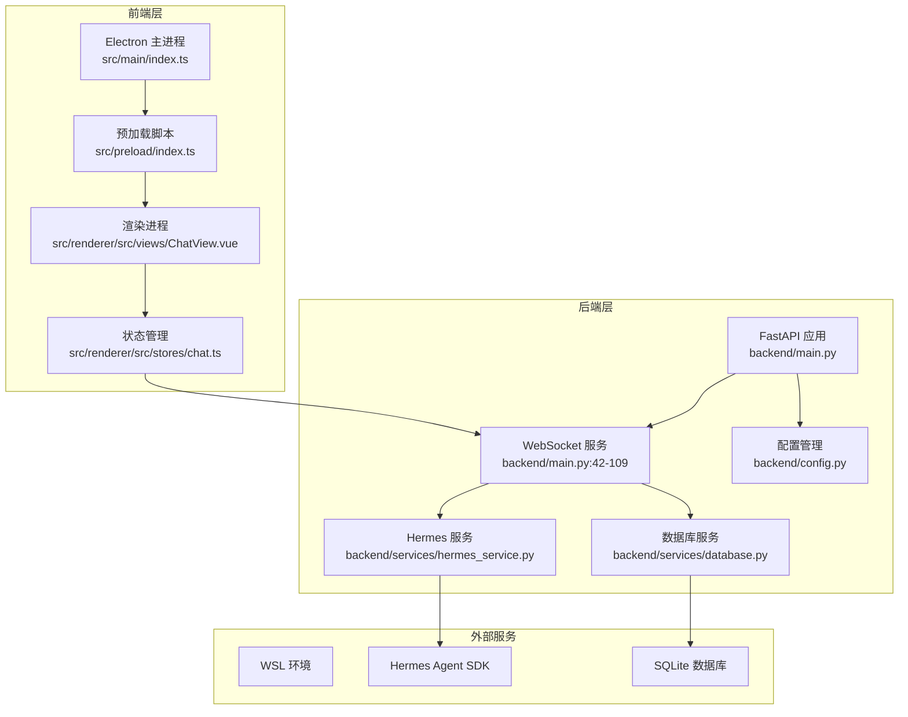
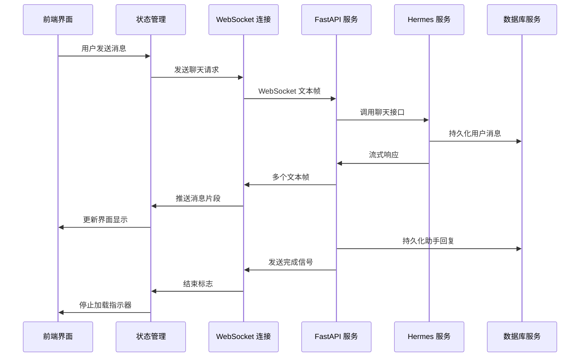
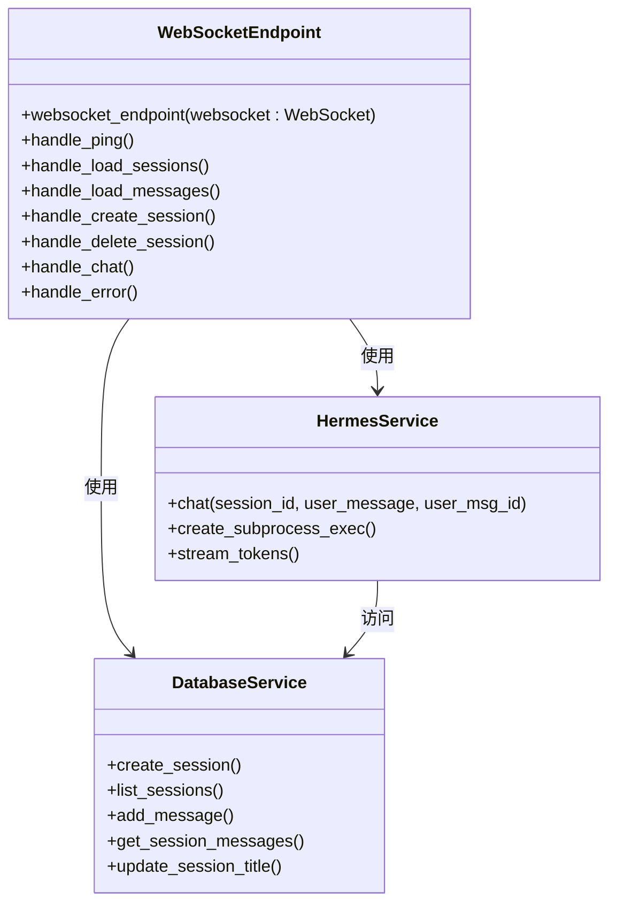
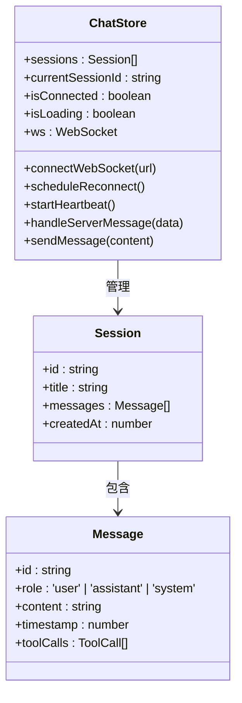
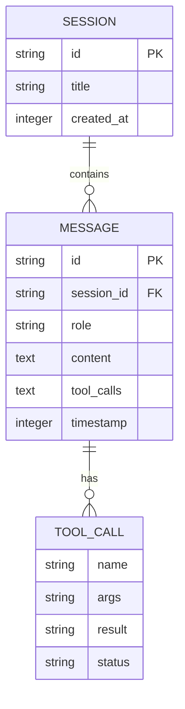
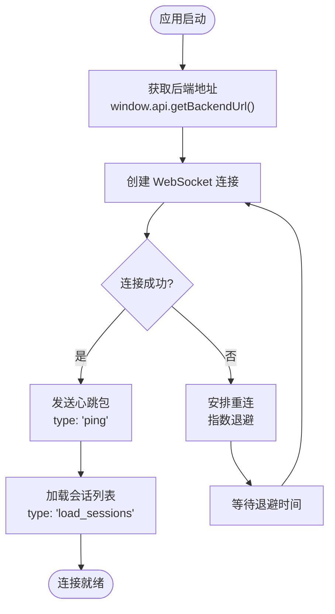
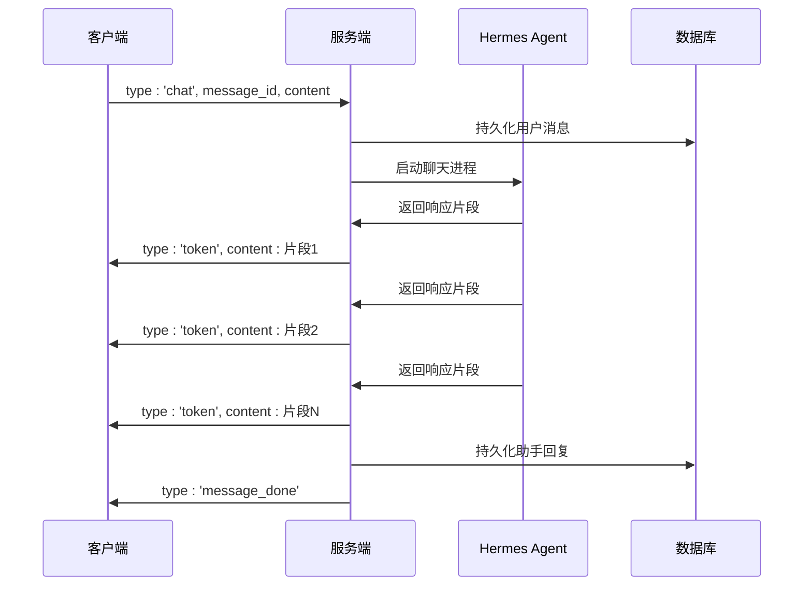
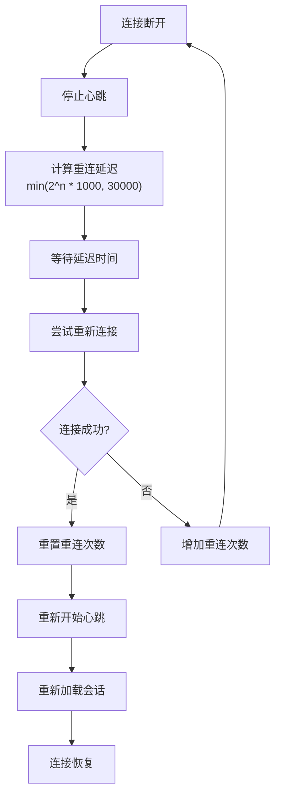

# 通信架构设计

<cite>
**本文档引用的文件**
- [backend/main.py](file://backend/main.py)
- [backend/services/hermes_service.py](file://backend/services/hermes_service.py)
- [backend/services/database.py](file://backend/services/database.py)
- [backend/config.py](file://backend/config.py)
- [src/main/index.ts](file://src/main/index.ts)
- [src/preload/index.ts](file://src/preload/index.ts)
- [src/renderer/src/stores/chat.ts](file://src/renderer/src/stores/chat.ts)
- [src/renderer/src/views/ChatView.vue](file://src/renderer/src/views/ChatView.vue)
</cite>

## 目录
1. [简介](#简介)
2. [项目结构](#项目结构)
3. [核心组件](#核心组件)
4. [架构概览](#架构概览)
5. [详细组件分析](#详细组件分析)
6. [消息协议规范](#消息协议规范)
7. [连接管理策略](#连接管理策略)
8. [流式响应处理](#流式响应处理)
9. [错误处理与重连机制](#错误处理与重连机制)
10. [性能优化方案](#性能优化方案)
11. [安全考虑](#安全考虑)
12. [故障排除指南](#故障排除指南)
13. [结论](#结论)

## 简介

Hermes Desktop 是一个基于 Electron 的桌面应用程序，通过 WebSocket 实现实时通信架构。该系统采用前后端分离的设计模式，前端使用 Vue.js 和 TypeScript 构建用户界面，后端使用 Python FastAPI 提供 WebSocket 服务和数据持久化功能。

系统的核心通信架构围绕以下关键特性构建：
- 实时双向通信
- 流式响应处理
- 自动重连机制
- 本地状态同步
- 数据持久化

## 项目结构

项目的整体架构采用模块化设计，分为前端 Electron 主进程、预加载脚本和渲染进程，以及后端 Python 服务层。

**图表来源**
- [src/main/index.ts:1-62](file://src/main/index.ts#L1-L62)
- [backend/main.py:1-114](file://backend/main.py#L1-L114)

**章节来源**
- [src/main/index.ts:1-62](file://src/main/index.ts#L1-L62)
- [backend/main.py:1-114](file://backend/main.py#L1-L114)

## 核心组件

### 前端组件

前端采用 Electron + Vue.js 架构，主要组件包括：

1. **Electron 主进程**：负责窗口管理和 IPC 通信
2. **预加载脚本**：提供安全的 API 暴露机制
3. **聊天视图**：用户界面组件，处理消息显示和输入
4. **聊天存储**：Pinia 状态管理，维护会话状态和 WebSocket 连接

### 后端组件

后端采用 FastAPI + Python 异步架构：

1. **WebSocket 服务**：处理实时通信和消息路由
2. **Hermes 服务**：与外部 Hermes Agent SDK 交互
3. **数据库服务**：SQLite 数据持久化
4. **配置管理**：环境变量和运行参数

**章节来源**
- [src/renderer/src/stores/chat.ts:1-314](file://src/renderer/src/stores/chat.ts#L1-L314)
- [backend/services/hermes_service.py:1-86](file://backend/services/hermes_service.py#L1-L86)
- [backend/services/database.py:1-137](file://backend/services/database.py#L1-L137)

## 架构概览

系统的整体通信流程采用客户端-服务器模型，通过 WebSocket 实现全双工通信。

**图表来源**
- [backend/main.py:89-98](file://backend/main.py#L89-L98)
- [backend/services/hermes_service.py:24-86](file://backend/services/hermes_service.py#L24-L86)
- [src/renderer/src/stores/chat.ts:258-283](file://src/renderer/src/stores/chat.ts#L258-L283)

## 详细组件分析

### WebSocket 服务端实现

WebSocket 服务端在 FastAPI 中实现了完整的消息处理逻辑，支持多种消息类型和异步处理。

**图表来源**
- [backend/main.py:42-109](file://backend/main.py#L42-L109)
- [backend/services/hermes_service.py:13-86](file://backend/services/hermes_service.py#L13-L86)
- [backend/services/database.py:49-137](file://backend/services/database.py#L49-L137)

### 前端 WebSocket 客户端

前端实现了完整的 WebSocket 客户端，包含连接管理、心跳检测和自动重连功能。

**图表来源**
- [src/renderer/src/stores/chat.ts:26-314](file://src/renderer/src/stores/chat.ts#L26-L314)
- [src/renderer/src/stores/chat.ts:4-24](file://src/renderer/src/stores/chat.ts#L4-L24)

**章节来源**
- [backend/main.py:42-109](file://backend/main.py#L42-L109)
- [src/renderer/src/stores/chat.ts:121-162](file://src/renderer/src/stores/chat.ts#L121-L162)

## 消息协议规范

### 消息类型定义

系统定义了以下标准消息类型：

| 消息类型 | 发送方 | 描述 | 请求参数 | 响应参数 |
|---------|--------|------|----------|----------|
| ping | 客户端 | 心跳检测 | 无 | pong |
| pong | 服务端 | 心跳响应 | 无 | 无 |
| load_sessions | 客户端 | 加载会话列表 | 无 | sessions_loaded |
| sessions_loaded | 服务端 | 会话列表数据 | sessions: Session[] | 无 |
| load_messages | 客户端 | 加载指定会话消息 | session_id: string | messages_loaded |
| messages_loaded | 服务端 | 消息列表数据 | session_id: string, messages: Message[] | 无 |
| create_session | 客户端 | 创建新会话 | session_id: string, title: string | session_created |
| session_created | 服务端 | 新会话创建结果 | session: Session | 无 |
| delete_session | 客户端 | 删除会话 | session_id: string | session_deleted |
| session_deleted | 服务端 | 会话删除结果 | session_id: string | 无 |
| chat | 客户端 | 发送聊天消息 | session_id: string, message_id: string, content: string | token, message_done |
| token | 服务端 | 流式响应片段 | content: string | 无 |
| message_done | 服务端 | 消息发送完成 | 无 | 无 |
| session_title | 服务端 | 会话标题更新 | session_id: string, title: string | 无 |
| error | 任意 | 错误通知 | message: string | 无 |

### 数据结构定义

**图表来源**
- [backend/services/database.py:24-42](file://backend/services/database.py#L24-L42)
- [backend/services/database.py:117-137](file://backend/services/database.py#L117-L137)

**章节来源**
- [src/renderer/src/stores/chat.ts:4-24](file://src/renderer/src/stores/chat.ts#L4-L24)
- [backend/services/database.py:24-42](file://backend/services/database.py#L24-L42)

## 连接管理策略

### 连接建立流程

前端连接建立采用渐进式初始化策略：

**图表来源**
- [src/renderer/src/stores/chat.ts:121-162](file://src/renderer/src/stores/chat.ts#L121-L162)
- [src/main/index.ts:46-48](file://src/main/index.ts#L46-L48)

### 心跳检测机制

系统实现了双向心跳检测机制：

- **客户端心跳**：每15秒发送一次 ping 消息
- **服务端响应**：立即返回对应的 pong 消息
- **超时判断**：未收到 pong 超过30秒视为连接异常

**章节来源**
- [src/renderer/src/stores/chat.ts:94-106](file://src/renderer/src/stores/chat.ts#L94-L106)
- [backend/main.py:53-54](file://backend/main.py#L53-L54)

## 流式响应处理

### 流式传输机制

系统采用分块传输的方式实现实时流式响应：

**图表来源**
- [backend/main.py:89-98](file://backend/main.py#L89-L98)
- [backend/services/hermes_service.py:24-86](file://backend/services/hermes_service.py#L24-L86)

### 状态同步策略

系统采用多层状态同步机制确保数据一致性：

1. **本地状态优先**：前端维护会话和消息的本地状态
2. **后端同步**：启动时从后端加载持久化的会话数据
3. **增量更新**：流式响应过程中实时更新界面显示
4. **最终一致性**：所有操作完成后进行数据持久化

**章节来源**
- [src/renderer/src/stores/chat.ts:165-255](file://src/renderer/src/stores/chat.ts#L165-L255)
- [backend/services/hermes_service.py:31-76](file://backend/services/hermes_service.py#L31-L76)

## 错误处理与重连机制

### 自动重连算法

系统实现了指数退避的自动重连机制：

**图表来源**
- [src/renderer/src/stores/chat.ts:109-118](file://src/renderer/src/stores/chat.ts#L109-L118)
- [src/renderer/src/stores/chat.ts:140-145](file://src/renderer/src/stores/chat.ts#L140-L145)

### 错误传播机制

系统建立了完整的错误传播链路：

1. **Hermes 服务错误**：捕获进程执行异常并转换为标准错误消息
2. **数据库错误**：捕获 SQL 执行异常并返回友好错误信息
3. **网络错误**：WebSocket 断开时触发自动重连机制
4. **前端错误**：解析失败时记录日志并继续处理其他消息

**章节来源**
- [backend/services/hermes_service.py:78-85](file://backend/services/hermes_service.py#L78-L85)
- [backend/main.py:99-108](file://backend/main.py#L99-L108)

## 性能优化方案

### 连接池优化

- **单连接复用**：每个会话使用单一 WebSocket 连接
- **连接复用策略**：避免频繁创建和销毁连接
- **资源清理**：断开连接时及时释放相关资源

### 数据传输优化

- **增量更新**：只传输必要的数据变更
- **压缩策略**：对长文本内容进行适当的压缩处理
- **批量操作**：支持批量消息的合并传输

### 内存管理优化

- **消息去重**：避免重复接收相同的消息片段
- **内存回收**：及时清理不再使用的会话数据
- **流式处理**：采用异步流式处理减少内存占用

### 延迟控制

- **心跳间隔**：15秒的心跳间隔平衡连接健康检查和网络负载
- **重连退避**：最大30秒的重连延迟避免网络拥塞
- **流式响应**：实时传输减少用户等待时间

## 安全考虑

### 网络安全

- **CORS 配置**：允许跨域访问但限制方法和头信息
- **本地连接**：默认绑定到 localhost 避免外部访问
- **端口配置**：使用非标准端口 8765 减少被扫描风险

### 数据安全

- **SQL 注入防护**：使用参数化查询防止注入攻击
- **输入验证**：对所有用户输入进行验证和清理
- **路径遍历防护**：严格限制文件系统访问路径

### 进程隔离

- **子进程隔离**：Hermes Agent 在独立进程中运行
- **环境隔离**：使用虚拟环境确保依赖隔离
- **权限控制**：限制进程的文件系统和网络访问权限

## 故障排除指南

### 常见问题诊断

1. **连接失败**
   - 检查后端服务是否正常运行
   - 验证 WebSocket 地址配置正确性
   - 确认防火墙设置允许连接

2. **消息丢失**
   - 检查网络连接稳定性
   - 验证消息序列号完整性
   - 确认数据库连接正常

3. **响应延迟**
   - 检查 Hermes Agent 性能
   - 监控数据库查询性能
   - 分析网络带宽使用情况

### 日志分析

系统提供了详细的日志输出用于问题诊断：

- **连接日志**：记录连接建立和断开事件
- **消息日志**：跟踪消息的发送和接收过程
- **错误日志**：记录异常情况和错误详情

**章节来源**
- [backend/main.py:45](file://backend/main.py#L45)
- [backend/main.py:100](file://backend/main.py#L100)

## 结论

Hermes Desktop 的通信架构设计充分体现了现代桌面应用的实时通信需求。通过 WebSocket 实现实时双向通信，结合流式响应处理和自动重连机制，为用户提供了流畅的聊天体验。

系统的主要优势包括：

1. **可靠性**：完善的错误处理和自动重连机制确保服务连续性
2. **性能**：流式响应和增量更新优化了用户体验
3. **可扩展性**：模块化设计便于功能扩展和维护
4. **安全性**：多层次的安全防护保护系统安全

未来可以考虑的改进方向：
- 实现消息加密传输
- 添加消息队列支持离线消息
- 优化数据库查询性能
- 增加更多的监控和告警机制