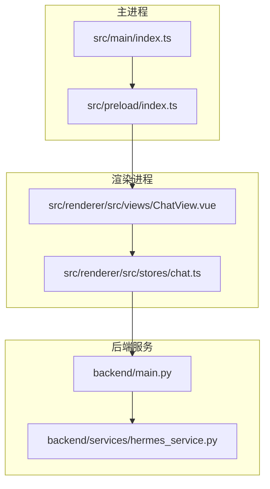
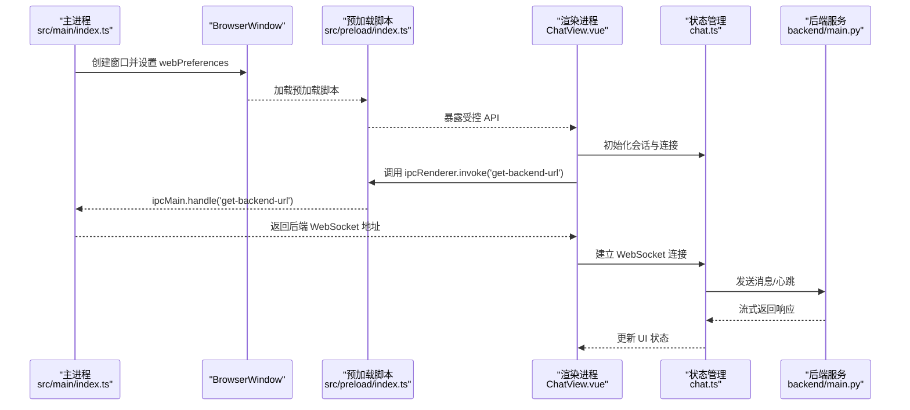
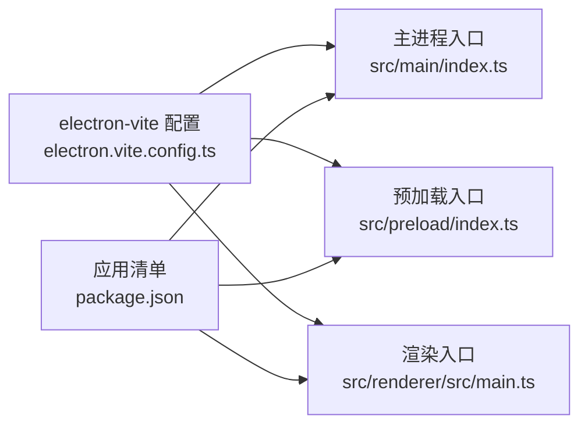

# 主进程配置

<cite>
**本文引用的文件**
- [src/main/index.ts](file://src/main/index.ts)
- [package.json](file://package.json)
- [electron.vite.config.ts](file://electron.vite.config.ts)
- [src/preload/index.ts](file://src/preload/index.ts)
- [src/preload/index.d.ts](file://src/preload/index.d.ts)
- [src/renderer/src/stores/chat.ts](file://src/renderer/src/stores/chat.ts)
- [src/renderer/src/views/ChatView.vue](file://src/renderer/src/views/ChatView.vue)
- [backend/main.py](file://backend/main.py)
- [backend/services/hermes_service.py](file://backend/services/hermes_service.py)
</cite>

## 目录
1. [简介](#简介)
2. [项目结构](#项目结构)
3. [核心组件](#核心组件)
4. [架构总览](#架构总览)
5. [详细组件分析](#详细组件分析)
6. [依赖分析](#依赖分析)
7. [性能考虑](#性能考虑)
8. [故障排查指南](#故障排查指南)
9. [结论](#结论)
10. [附录](#附录)

## 简介
本文件系统化梳理了该 Electron 桌面应用的主进程配置与初始化流程，重点覆盖：
- 应用启动与窗口创建、生命周期管理
- BrowserWindow 配置项（尺寸、最小尺寸、菜单栏隐藏等）
- 应用标识符设置、开发工具快捷键监听
- IPC 通信接口注册与处理（后端连接地址查询）
- 应用激活与窗口关闭事件处理
- 跨平台兼容性（macOS 特殊处理）
- 性能优化与内存管理最佳实践

## 项目结构
该项目采用 Electron + Vue 的前后端分离架构，主进程负责应用生命周期与窗口管理，渲染进程负责 UI 交互与 WebSocket 通信，后端服务通过 FastAPI 提供 WebSocket 接口。

图表来源
- [src/main/index.ts:1-62](file://src/main/index.ts#L1-L62)
- [src/preload/index.ts:1-24](file://src/preload/index.ts#L1-L24)
- [src/renderer/src/views/ChatView.vue:118-126](file://src/renderer/src/views/ChatView.vue#L118-L126)
- [backend/main.py:31-66](file://backend/main.py#L31-L66)

章节来源
- [package.json:1-35](file://package.json#L1-L35)
- [electron.vite.config.ts:1-21](file://electron.vite.config.ts#L1-L21)

## 核心组件
- 主进程入口与窗口管理：负责创建 BrowserWindow、设置窗口偏好、处理应用生命周期事件、注册 IPC 处理函数。
- 预加载脚本：通过 contextBridge 暴露受控 API 至渲染进程，确保安全隔离。
- 渲染侧状态与通信：使用 Pinia 管理会话与连接状态，通过 WebSocket 与后端交互，并实现心跳与指数退避重连。
- 后端服务：提供健康检查与 WebSocket 接口，支持流式响应与错误处理。

章节来源
- [src/main/index.ts:5-35](file://src/main/index.ts#L5-L35)
- [src/preload/index.ts:4-23](file://src/preload/index.ts#L4-L23)
- [src/renderer/src/stores/chat.ts:26-262](file://src/renderer/src/stores/chat.ts#L26-L262)
- [backend/main.py:26-66](file://backend/main.py#L26-L66)

## 架构总览
下图展示了主进程、预加载脚本、渲染进程与后端服务之间的交互关系与数据流向。

图表来源
- [src/main/index.ts:37-48](file://src/main/index.ts#L37-L48)
- [src/preload/index.ts:5-7](file://src/preload/index.ts#L5-L7)
- [src/renderer/src/views/ChatView.vue:118-126](file://src/renderer/src/views/ChatView.vue#L118-L126)
- [src/renderer/src/stores/chat.ts:110-150](file://src/renderer/src/stores/chat.ts#L110-L150)
- [backend/main.py:31-66](file://backend/main.py#L31-L66)

## 详细组件分析

### 主进程初始化与窗口创建
- 窗口尺寸与最小尺寸：窗口默认宽高与最小宽高在 BrowserWindow 构造时设定，避免过小导致内容不可见。
- 菜单栏隐藏：autoHideMenuBar 设置为启用，减少占用空间。
- 预加载脚本：通过 webPreferences.preload 指定预加载入口，禁用沙盒（sandbox: false）以便直接访问 Node.js API。
- 开发工具快捷键：在 browser-window-created 事件中调用工具库提供的快捷键监听，按 F12 在开发模式下快速开关 DevTools。
- 应用标识符：setAppUserModelId 设置应用 ID，有助于任务栏与通知分组。
- 窗口打开策略：setWindowOpenHandler 将外部链接交由系统浏览器打开，拒绝在应用内弹窗。
- 开发/生产加载策略：开发模式下优先加载环境变量指定的开发服务器地址，否则加载打包后的 HTML 文件。

章节来源
- [src/main/index.ts:5-35](file://src/main/index.ts#L5-L35)
- [src/main/index.ts:37-43](file://src/main/index.ts#L37-L43)
- [src/main/index.ts:38](file://src/main/index.ts#L38)
- [src/main/index.ts:24-27](file://src/main/index.ts#L24-L27)
- [src/main/index.ts:29-34](file://src/main/index.ts#L29-L34)

### 生命周期管理
- 应用激活：当所有窗口关闭后再次激活应用时，若无窗口则重新创建。
- 全部窗口关闭：非 macOS 平台直接退出；macOS 平台允许保持后台运行，遵循平台行为。

章节来源
- [src/main/index.ts:52-61](file://src/main/index.ts#L52-L61)

### IPC 通信接口
- 注册接口：主进程通过 ipcMain.handle('get-backend-url') 提供后端 WebSocket 地址查询能力。
- 渲染调用：预加载脚本暴露 window.api.getBackendUrl，渲染侧通过 ipcRenderer.invoke 调用。
- 数据流：渲染侧拿到地址后建立 WebSocket 连接，后端通过流式消息推送响应。

章节来源
- [src/main/index.ts:45-48](file://src/main/index.ts#L45-L48)
- [src/preload/index.ts:5-7](file://src/preload/index.ts#L5-L7)
- [src/renderer/src/views/ChatView.vue:118-126](file://src/renderer/src/views/ChatView.vue#L118-L126)

### 后端连接状态与 WebSocket 交互
- 连接建立：渲染侧在挂载时调用 window.api.getBackendUrl 获取地址并建立 WebSocket。
- 心跳机制：每间隔固定时间发送 ping，收到 pong 即视为连接正常。
- 指数退避重连：断线后按 2^N 计算延迟（上限至最大值），避免频繁重试造成资源浪费。
- 消息类型处理：根据后端推送的消息类型更新 UI 状态（如增量 token、完成标记、工具调用等）。

章节来源
- [src/renderer/src/stores/chat.ts:83-97](file://src/renderer/src/stores/chat.ts#L83-L97)
- [src/renderer/src/stores/chat.ts:99-108](file://src/renderer/src/stores/chat.ts#L99-L108)
- [src/renderer/src/stores/chat.ts:110-150](file://src/renderer/src/stores/chat.ts#L110-L150)
- [src/renderer/src/stores/chat.ts:152-207](file://src/renderer/src/stores/chat.ts#L152-L207)

### 跨平台兼容性（macOS）
- 关闭策略：window-all-closed 事件中仅在非 macOS 平台调用 app.quit()，macOS 平台遵循“点击 Dock 图标最小化”的习惯，允许应用常驻后台。

章节来源
- [src/main/index.ts:57-61](file://src/main/index.ts#L57-L61)

### 预加载脚本与安全上下文
- 安全暴露：通过 contextBridge 将自定义 API 暴露到渲染进程，确保上下文隔离开启时的安全性。
- 类型声明：index.d.ts 明确 window.electron 与 window.api 的类型签名，便于 TypeScript 类型检查。

章节来源
- [src/preload/index.ts:11-23](file://src/preload/index.ts#L11-L23)
- [src/preload/index.d.ts:3-10](file://src/preload/index.d.ts#L3-L10)

### 后端服务与消息流
- WebSocket 终端：/ws 接收前端消息，根据 type 分发处理（如 chat、ping）。
- 流式响应：后端服务通过异步生成器向前端推送增量 token，最后发送完成标记。
- 错误处理：捕获异常并向前端发送错误消息，保证前端可感知后端状态。

章节来源
- [backend/main.py:31-66](file://backend/main.py#L31-L66)
- [backend/services/hermes_service.py:16-72](file://backend/services/hermes_service.py#L16-L72)

## 依赖分析
- 构建与打包：electron-vite 配置分别针对 main、preload、renderer 三类入口进行插件化处理，渲染侧启用 Vue 插件与路径别名。
- 运行时依赖：主进程依赖 Electron 与 @electron-toolkit 工具库，预加载脚本依赖 @electron-toolkit/preload 与 @electron-toolkit/utils。
- 应用入口：package.json 的 main 字段指向编译输出的主进程入口。

图表来源
- [electron.vite.config.ts:5-20](file://electron.vite.config.ts#L5-L20)
- [package.json:5](file://package.json#L5)

章节来源
- [electron.vite.config.ts:1-21](file://electron.vite.config.ts#L1-L21)
- [package.json:1-35](file://package.json#L1-L35)

## 性能考虑
- 窗口显示策略：窗口初始创建时设置 show: false，在 ready-to-show 事件后再显示，避免首屏闪烁。
- 开发工具快捷键：仅在开发模式启用，减少生产环境不必要的开销。
- WebSocket 心跳与重连：合理的心跳周期与指数退避可降低无效连接尝试，提升稳定性。
- 后端子进程：后端服务通过子进程调用 CLI，注意资源占用与错误处理，避免阻塞主线程。
- 内存管理最佳实践
  - 及时清理定时器与计时器（心跳、重连定时器）。
  - 断开 WebSocket 时移除事件监听并释放引用。
  - Pinia 状态在组件卸载时及时清理，避免内存泄漏。
  - 预加载脚本中避免在 window 对象上累积大量全局引用。

章节来源
- [src/main/index.ts:20-22](file://src/main/index.ts#L20-L22)
- [src/main/index.ts:41-43](file://src/main/index.ts#L41-L43)
- [src/renderer/src/stores/chat.ts:83-97](file://src/renderer/src/stores/chat.ts#L83-L97)
- [src/renderer/src/stores/chat.ts:99-108](file://src/renderer/src/stores/chat.ts#L99-L108)
- [src/renderer/src/stores/chat.ts:234-246](file://src/renderer/src/stores/chat.ts#L234-L246)

## 故障排查指南
- 无法获取后端地址
  - 检查主进程是否正确注册 ipcMain.handle('get-backend-url')。
  - 确认预加载脚本已通过 contextBridge 暴露 window.api。
  - 查看渲染侧调用是否在 onMounted 中执行。
- WebSocket 连接失败
  - 确认后端服务已启动且端口开放。
  - 检查前端心跳与重连逻辑是否触发。
  - 观察后端日志与异常消息推送。
- 开发工具快捷键无效
  - 确认 is.dev 条件满足且 optimizer.watchWindowShortcuts 已绑定到新窗口。
- macOS 窗口关闭即退出
  - 检查 window-all-closed 事件中的平台判断逻辑。

章节来源
- [src/main/index.ts:45-48](file://src/main/index.ts#L45-L48)
- [src/preload/index.ts:5-7](file://src/preload/index.ts#L5-L7)
- [src/renderer/src/views/ChatView.vue:118-126](file://src/renderer/src/views/ChatView.vue#L118-L126)
- [backend/main.py:56-65](file://backend/main.py#L56-L65)
- [src/main/index.ts:57-61](file://src/main/index.ts#L57-L61)

## 结论
该主进程配置清晰地实现了 Electron 应用的启动、窗口管理与 IPC 通信，结合渲染侧的状态管理与 WebSocket 交互，形成了完整的前后端协作链路。通过合理的生命周期处理、跨平台兼容性与性能优化策略，能够为用户提供稳定、流畅的桌面体验。

## 附录
- 开发与构建
  - 使用 electron-vite 进行开发与打包，主进程、预加载与渲染进程分别配置插件。
  - 应用入口 main 指向编译输出目录。
- 后端服务
  - 提供健康检查与 WebSocket 终端，支持增量消息流式推送与错误处理。

章节来源
- [electron.vite.config.ts:5-20](file://electron.vite.config.ts#L5-L20)
- [package.json:5](file://package.json#L5)
- [backend/main.py:26-28](file://backend/main.py#L26-L28)
- [backend/main.py:31-66](file://backend/main.py#L31-L66)