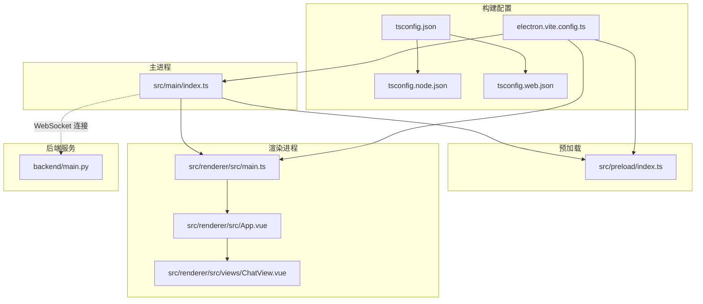
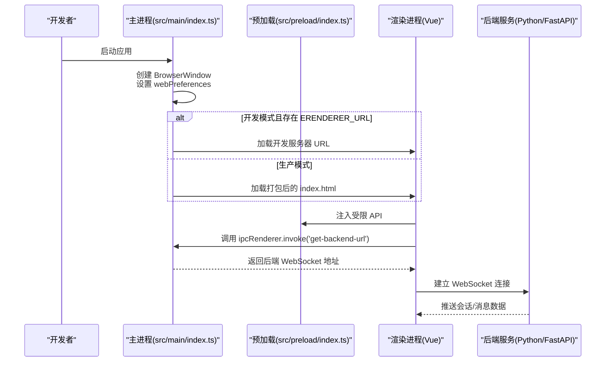
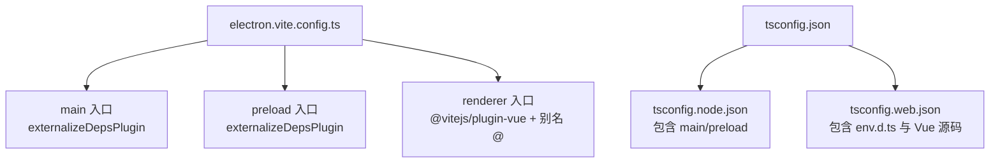
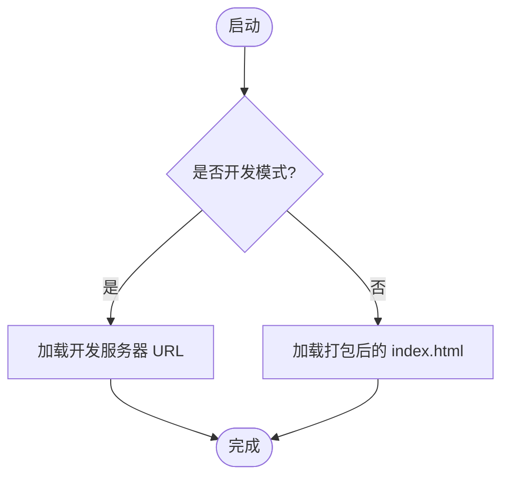
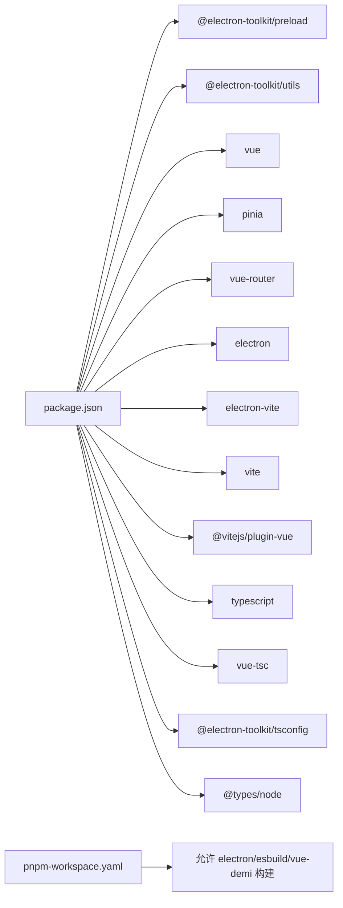

# 构建与打包

<cite>
**本文引用的文件**
- [electron.vite.config.ts](file://electron.vite.config.ts)
- [package.json](file://package.json)
- [src/main/index.ts](file://src/main/index.ts)
- [src/preload/index.ts](file://src/preload/index.ts)
- [backend/main.py](file://backend/main.py)
- [tsconfig.json](file://tsconfig.json)
- [tsconfig.node.json](file://tsconfig.node.json)
- [tsconfig.web.json](file://tsconfig.web.json)
- [pnpm-workspace.yaml](file://pnpm-workspace.yaml)
</cite>

## 目录
1. [简介](#简介)
2. [项目结构](#项目结构)
3. [核心组件](#核心组件)
4. [架构总览](#架构总览)
5. [详细组件分析](#详细组件分析)
6. [依赖分析](#依赖分析)
7. [性能考虑](#性能考虑)
8. [故障排查指南](#故障排查指南)
9. [结论](#结论)
10. [附录](#附录)

## 简介
本文件系统性梳理本项目的构建与打包体系，围绕 Electron-Vite 的配置与优化展开，覆盖开发与生产环境差异、热重载与代码分割、资源优化、打包目标平台与分发策略、应用图标与安装器、自动更新机制、依赖管理与安全加固、跨平台打包要点、CI/CD 集成与自动化测试、以及性能优化与体积控制等主题。文档以仓库现有配置为依据，结合实际代码行为进行说明。

## 项目结构
项目采用 Electron-Vite 多入口架构，分为 main（主进程）、preload（预加载脚本）与 renderer（渲染进程，基于 Vue）。TypeScript 通过多 tsconfig 分别约束 Node 与 Web 环境。后端服务使用 Python/FastAPI 在 WSL 中运行并通过 WebSocket 与前端通信。

**图示来源**
- [electron.vite.config.ts:1-21](file://electron.vite.config.ts#L1-L21)
- [src/main/index.ts:1-62](file://src/main/index.ts#L1-L62)
- [src/preload/index.ts:1-24](file://src/preload/index.ts#L1-L24)
- [backend/main.py:1-114](file://backend/main.py#L1-L114)

**章节来源**
- [electron.vite.config.ts:1-21](file://electron.vite.config.ts#L1-L21)
- [package.json:1-35](file://package.json#L1-L35)
- [tsconfig.json:1-8](file://tsconfig.json#L1-L8)
- [tsconfig.node.json:1-13](file://tsconfig.node.json#L1-L13)
- [tsconfig.web.json:1-16](file://tsconfig.web.json#L1-L16)

## 核心组件
- 主进程入口：负责窗口创建、IPC 注册、开发服务器地址加载与平台兼容处理。
- 预加载脚本：通过 contextBridge 暴露受控 API 至渲染进程，实现安全的 IPC 调用。
- 渲染进程：Vue 应用，使用路由、状态管理与组件化视图。
- 构建配置：统一由 electron-vite 管理，分别对 main、preload、renderer 进行插件与路径别名配置；TypeScript 通过多 tsconfig 实现严格分层。
- 后端服务：Python FastAPI 提供健康检查与 WebSocket 接口，供前端连接。

**章节来源**
- [src/main/index.ts:1-62](file://src/main/index.ts#L1-L62)
- [src/preload/index.ts:1-24](file://src/preload/index.ts#L1-L24)
- [electron.vite.config.ts:5-20](file://electron.vite.config.ts#L5-L20)
- [tsconfig.node.json:1-13](file://tsconfig.node.json#L1-L13)
- [tsconfig.web.json:1-16](file://tsconfig.web.json#L1-L16)
- [backend/main.py:1-114](file://backend/main.py#L1-L114)

## 架构总览
下图展示从开发到生产的典型流程：开发模式下主进程加载渲染进程的本地开发服务器；生产模式下主进程加载打包后的 HTML；渲染进程通过预加载脚本访问受限的 Electron API 并与后端建立 WebSocket 连接。

**图示来源**
- [src/main/index.ts:29-34](file://src/main/index.ts#L29-L34)
- [src/preload/index.ts:5-7](file://src/preload/index.ts#L5-L7)
- [backend/main.py:42-98](file://backend/main.py#L42-L98)

## 详细组件分析

### 构建配置与多入口
- main 入口：启用 externalizeDepsPlugin，避免将依赖打入主进程包，减少体积并提升启动速度。
- preload 入口：同样启用 externalizeDepsPlugin，确保预加载脚本轻量化。
- renderer 入口：启用 @vitejs/plugin-vue，配置路径别名 @ 指向 src/renderer/src，便于模块导入。
- TypeScript 分层：tsconfig.json 引用 node/web 两套配置；node 配置包含 main 与 preload；web 配置包含 env.d.ts 与所有 Vue 组件及源码。

**图示来源**
- [electron.vite.config.ts:5-20](file://electron.vite.config.ts#L5-L20)
- [tsconfig.json:3-6](file://tsconfig.json#L3-L6)
- [tsconfig.node.json:3-7](file://tsconfig.node.json#L3-L7)
- [tsconfig.web.json:3-7](file://tsconfig.web.json#L3-L7)

**章节来源**
- [electron.vite.config.ts:1-21](file://electron.vite.config.ts#L1-L21)
- [tsconfig.json:1-8](file://tsconfig.json#L1-L8)
- [tsconfig.node.json:1-13](file://tsconfig.node.json#L1-L13)
- [tsconfig.web.json:1-16](file://tsconfig.web.json#L1-L16)

### 开发与生产环境差异
- 开发模式：通过 scripts.dev 使用 electron-vite dev，主进程根据环境变量判断是否加载开发服务器 URL。
- 生产模式：scripts.build 执行 electron-vite build，主进程加载打包后的 index.html。
- 类型检查：分别对 Node 与 Web 环境执行类型检查，确保两端类型安全。

**图示来源**
- [package.json:8-15](file://package.json#L8-L15)
- [src/main/index.ts:29-34](file://src/main/index.ts#L29-L34)

**章节来源**
- [package.json:8-15](file://package.json#L8-L15)
- [src/main/index.ts:29-34](file://src/main/index.ts#L29-L34)

### 热重载与开发体验
- 主进程：使用 @electron-toolkit/utils 的 optimizer.watchWindowShortcuts 监听窗口快捷键，便于调试。
- 渲染进程：Vite 插件提供热重载能力，结合开发服务器 URL 动态刷新页面。
- 预加载脚本：在隔离上下文中通过 contextBridge 暴露 API，保证安全的同时支持热替换。

**章节来源**
- [src/main/index.ts:41-43](file://src/main/index.ts#L41-L43)
- [electron.vite.config.ts:18](file://electron.vite.config.ts#L18)
- [src/preload/index.ts:11-23](file://src/preload/index.ts#L11-L23)

### 代码分割与资源优化
- 代码分割：建议在渲染进程按路由拆分页面组件，利用 Vite 的动态导入实现懒加载。
- 资源优化：生产构建默认压缩 JS/CSS/HTML；可结合图片与字体的按需加载策略进一步减小首屏体积。
- 第三方依赖：main 与 preload 已启用 externalizeDepsPlugin，避免将依赖内联，降低包体并加速启动。

**章节来源**
- [electron.vite.config.ts:7](file://electron.vite.config.ts#L7)
- [electron.vite.config.ts:10](file://electron.vite.config.ts#L10)

### 打包流程与目标平台
- 打包命令：使用 scripts.build 触发 electron-vite build，生成可执行产物。
- 目标平台：当前未配置多平台打包脚本，可在 CI 中通过矩阵任务分别构建 Windows/macOS/Linux。
- 安装器与分发：建议配合 electron-builder 或 electron-forge 在 CI 中生成安装包并上传至发布渠道。

**章节来源**
- [package.json:10](file://package.json#L10)

### 应用图标、安装程序与更新机制
- 应用图标：可在构建配置中指定图标路径，用于生成各平台安装器。
- 安装程序：推荐 electron-builder，在 CI 中生成 DMG/MSI/DEB 并签名。
- 自动更新：可在主进程中集成 autoUpdater 或使用 squirrel/windows updater，结合发布页或 GitHub Releases 实现在线更新。

[本节为通用实践说明，不直接对应具体源码文件]

### 依赖管理、混淆与安全加固
- 依赖管理：使用 pnpm workspace 控制构建工具链与依赖版本，确保一致性。
- 代码混淆：生产构建可结合 Terser 或 esbuild 的 minify 选项；注意保留必要的运行时反射与错误堆栈信息。
- 安全加固：启用 CSP、禁用 NodeIntegration、开启 ContextIsolation；预加载脚本仅暴露必要 API。

**章节来源**
- [pnpm-workspace.yaml:1-5](file://pnpm-workspace.yaml#L1-L5)
- [src/main/index.ts:14](file://src/main/index.ts#L14)
- [src/preload/index.ts:11-23](file://src/preload/index.ts#L11-L23)

### 跨平台打包指南
- Windows：使用 electron-builder 生成 MSI，配置签名与自动更新。
- macOS：生成 DMG/APP，配置 Notarization 与权限声明。
- Linux：生成 DEB/RPM，注意桌面集成与图标注册。
- 通用：在 CI 中使用矩阵任务并缓存依赖，缩短构建时间。

[本节为通用实践说明，不直接对应具体源码文件]

### CI/CD 集成、自动化测试与发布
- CI：在流水线中执行类型检查、单元/集成测试、构建与打包。
- 自动化测试：可在渲染进程侧使用 Vitest/Jest 测试组件与工具函数；主进程可用 Spectron 进行端到端验证。
- 发布：构建完成后上传制品至发布平台，触发自动更新推送。

[本节为通用实践说明，不直接对应具体源码文件]

## 依赖分析
- 项目依赖：Vue、Pinia、Vue Router、@electron-toolkit/preload、@electron-toolkit/utils。
- 开发依赖：electron、electron-vite、vite、@vitejs/plugin-vue、TypeScript、vue-tsc、@electron-toolkit/tsconfig、@types/node。
- 工作空间：允许 electron/esbuild/vue-demi 构建，确保多包场景下的编译一致性。

**图示来源**
- [package.json:17-33](file://package.json#L17-L33)
- [pnpm-workspace.yaml:1-5](file://pnpm-workspace.yaml#L1-L5)

**章节来源**
- [package.json:17-33](file://package.json#L17-L33)
- [pnpm-workspace.yaml:1-5](file://pnpm-workspace.yaml#L1-L5)

## 性能考虑
- 启动速度：externalizeDepsPlugin 减少主进程与预加载脚本包体；延迟初始化非关键功能。
- 首屏渲染：按路由拆分页面组件，使用动态导入；预加载关键资源。
- 资源体积：生产构建启用压缩；移除未使用依赖与注释；合并重复模块。
- 网络交互：WebSocket 连接复用，避免频繁握手；后端接口幂等与错误快速返回。

[本节提供通用优化建议，不直接对应具体源码文件]

## 故障排查指南
- 开发服务器无法加载：确认主进程已设置 ERENDERER_URL 环境变量，或切换到生产模式加载本地 HTML。
- 预加载 API 不可用：检查 contextIsolation 是否启用，确认通过 contextBridge 正确暴露 API。
- 后端连接失败：核对后端服务地址与端口，确保 CORS 配置允许前端来源。
- 类型检查报错：分别执行 Node 与 Web 的类型检查脚本，修复类型定义问题。

**章节来源**
- [src/main/index.ts:29-34](file://src/main/index.ts#L29-L34)
- [src/preload/index.ts:11-23](file://src/preload/index.ts#L11-L23)
- [backend/main.py:26-32](file://backend/main.py#L26-L32)
- [package.json:12-13](file://package.json#L12-L13)

## 结论
本项目基于 Electron-Vite 实现了清晰的多入口构建体系，主进程与预加载脚本通过 externalizeDepsPlugin 保持精简，渲染进程采用 Vue 技术栈并具备良好的热重载与类型检查能力。后续可在 CI/CD、安装器生成、自动更新与更细粒度的代码分割与资源优化方面进一步完善，以满足跨平台分发与高性能启动的需求。

## 附录
- 快速命令
  - 开发：npm run dev
  - 构建：npm run build
  - 预览：npm run preview
  - 类型检查：npm run typecheck
  - 代码规范：npm run lint

**章节来源**
- [package.json:8-15](file://package.json#L8-L15)