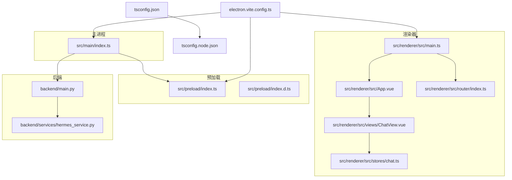
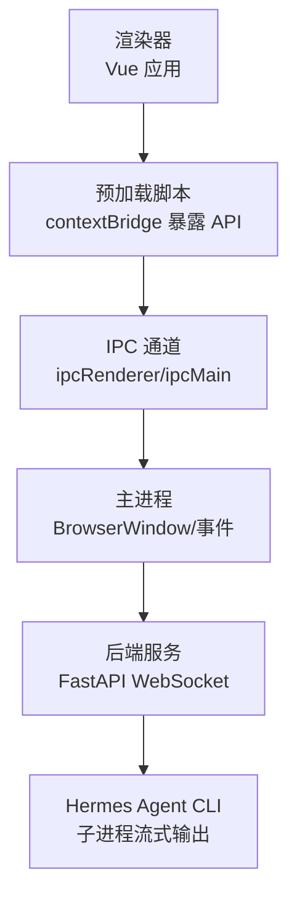
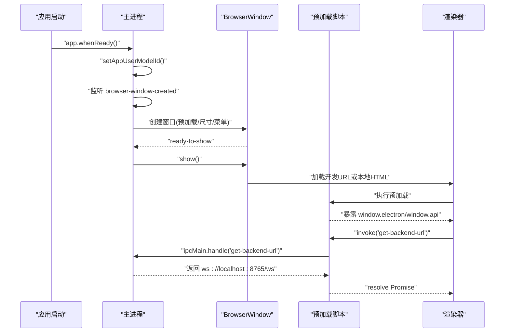
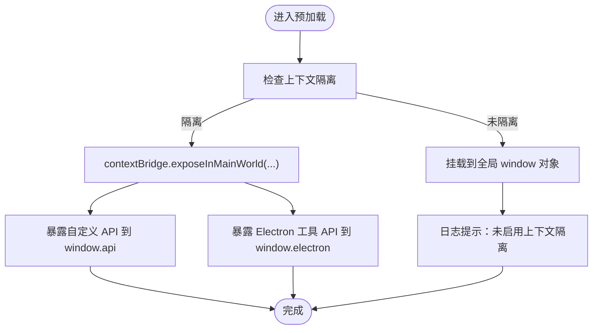
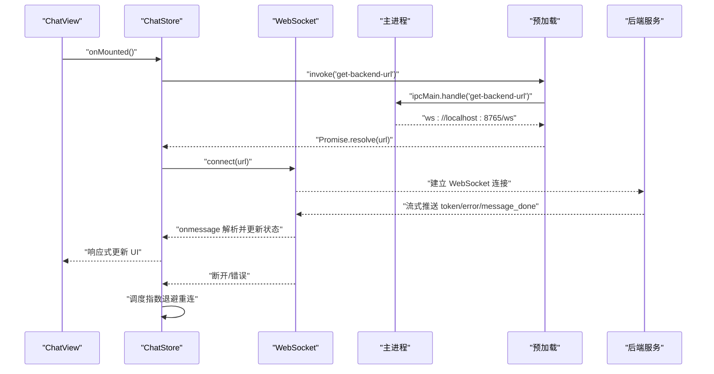
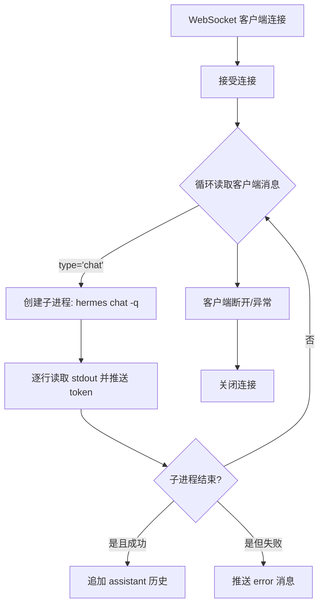
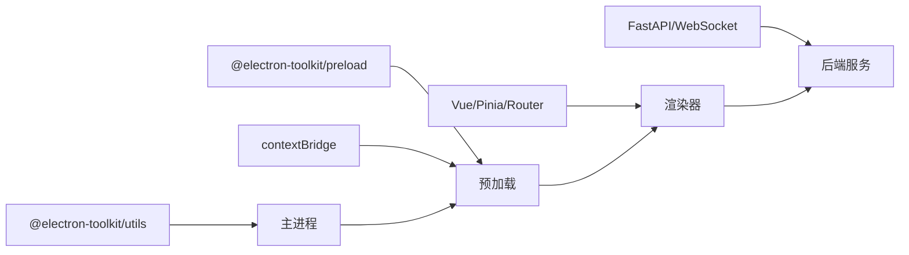

# 桌面应用集成

<cite>
**本文引用的文件**
- [package.json](file://package.json)
- [electron.vite.config.ts](file://electron.vite.config.ts)
- [tsconfig.json](file://tsconfig.json)
- [tsconfig.node.json](file://tsconfig.node.json)
- [src/main/index.ts](file://src/main/index.ts)
- [src/preload/index.ts](file://src/preload/index.ts)
- [src/preload/index.d.ts](file://src/preload/index.d.ts)
- [src/renderer/src/main.ts](file://src/renderer/src/main.ts)
- [src/renderer/src/App.vue](file://src/renderer/src/App.vue)
- [src/renderer/src/router/index.ts](file://src/renderer/src/router/index.ts)
- [src/renderer/src/stores/chat.ts](file://src/renderer/src/stores/chat.ts)
- [src/renderer/src/views/ChatView.vue](file://src/renderer/src/views/ChatView.vue)
- [backend/main.py](file://backend/main.py)
- [backend/services/hermes_service.py](file://backend/services/hermes_service.py)
</cite>

## 目录
1. [简介](#简介)
2. [项目结构](#项目结构)
3. [核心组件](#核心组件)
4. [架构总览](#架构总览)
5. [详细组件分析](#详细组件分析)
6. [依赖分析](#依赖分析)
7. [性能考虑](#性能考虑)
8. [故障排查指南](#故障排查指南)
9. [结论](#结论)
10. [附录](#附录)

## 简介
本文件面向桌面应用集成工程师与运维人员，系统化梳理该 Electron 应用在主进程配置、窗口管理、应用生命周期控制、预加载脚本设计、安全 IPC 通信与权限控制、构建与打包、跨平台兼容性、性能优化与调试方法等方面的实现与最佳实践。同时覆盖与操作系统的集成（菜单栏、托盘、快捷键）、文件关联与协议处理的建议方案，以及安全与签名要求。

## 项目结构
该项目采用 Electron-Vite 的多包结构，主进程、预加载脚本与渲染器分别位于独立目录，并通过 TypeScript 配置进行类型隔离与编译组织。后端服务以 Python FastAPI 提供 WebSocket 接口，前端使用 Vue 3 + Pinia + Vue Router 构建聊天界面。

**图表来源**
- [src/main/index.ts:1-62](file://src/main/index.ts#L1-L62)
- [src/preload/index.ts:1-24](file://src/preload/index.ts#L1-L24)
- [src/preload/index.d.ts:1-11](file://src/preload/index.d.ts#L1-L11)
- [src/renderer/src/main.ts:1-11](file://src/renderer/src/main.ts#L1-L11)
- [src/renderer/src/App.vue:1-144](file://src/renderer/src/App.vue#L1-L144)
- [src/renderer/src/views/ChatView.vue:1-327](file://src/renderer/src/views/ChatView.vue#L1-L327)
- [src/renderer/src/stores/chat.ts:1-263](file://src/renderer/src/stores/chat.ts#L1-L263)
- [src/renderer/src/router/index.ts:1-16](file://src/renderer/src/router/index.ts#L1-L16)
- [backend/main.py:1-69](file://backend/main.py#L1-L69)
- [backend/services/hermes_service.py:1-82](file://backend/services/hermes_service.py#L1-L82)
- [electron.vite.config.ts:1-21](file://electron.vite.config.ts#L1-L21)
- [tsconfig.json:1-8](file://tsconfig.json#L1-L8)
- [tsconfig.node.json:1-13](file://tsconfig.node.json#L1-L13)

**章节来源**
- [package.json:1-35](file://package.json#L1-L35)
- [electron.vite.config.ts:1-21](file://electron.vite.config.ts#L1-L21)
- [tsconfig.json:1-8](file://tsconfig.json#L1-L8)
- [tsconfig.node.json:1-13](file://tsconfig.node.json#L1-L13)

## 核心组件
- 主进程：负责创建 BrowserWindow、注册 IPC 处理函数、应用生命周期事件监听与窗口行为控制。
- 预加载脚本：通过 contextBridge 安全地向渲染器暴露有限 API，并复用 @electron-toolkit/preload 能力。
- 渲染器：Vue 应用入口、路由与状态管理，负责 WebSocket 连接、消息流式接收与 UI 更新。
- 后端服务：Python FastAPI + WebSocket，对接 Hermes Agent CLI 并流式返回结果。

**章节来源**
- [src/main/index.ts:1-62](file://src/main/index.ts#L1-L62)
- [src/preload/index.ts:1-24](file://src/preload/index.ts#L1-L24)
- [src/preload/index.d.ts:1-11](file://src/preload/index.d.ts#L1-L11)
- [src/renderer/src/main.ts:1-11](file://src/renderer/src/main.ts#L1-L11)
- [src/renderer/src/stores/chat.ts:1-263](file://src/renderer/src/stores/chat.ts#L1-L263)
- [backend/main.py:1-69](file://backend/main.py#L1-L69)

## 架构总览
应用采用“主进程 + 预加载桥接 + 渲染器 + 后端服务”的分层架构。主进程负责窗口与系统级能力；预加载脚本提供受限的 Electron 能力给渲染器；渲染器通过 IPC 获取后端地址并建立 WebSocket 连接；后端服务通过子进程调用 Hermes Agent CLI 并以流式 WebSocket 返回内容。

**图表来源**
- [src/main/index.ts:1-62](file://src/main/index.ts#L1-L62)
- [src/preload/index.ts:1-24](file://src/preload/index.ts#L1-L24)
- [src/renderer/src/stores/chat.ts:1-263](file://src/renderer/src/stores/chat.ts#L1-L263)
- [backend/main.py:1-69](file://backend/main.py#L1-L69)
- [backend/services/hermes_service.py:1-82](file://backend/services/hermes_service.py#L1-L82)

## 详细组件分析

### 主进程配置与窗口管理
- 窗口尺寸与最小尺寸约束、自动隐藏菜单栏、标题设置。
- 预加载脚本路径绑定、沙箱关闭（需配合上下文隔离与最小权限暴露）。
- ready-to-show 显示策略、外部链接打开策略（setWindowOpenHandler + shell.openExternal）。
- 开发模式下加载 Vite 预览地址，生产模式加载本地 HTML。
- 应用激活与窗口关闭策略（macOS 特例保留）。
- 注册 IPC 处理函数用于提供后端 WebSocket 地址。

**图表来源**
- [src/main/index.ts:1-62](file://src/main/index.ts#L1-L62)
- [src/preload/index.ts:1-24](file://src/preload/index.ts#L1-L24)

**章节来源**
- [src/main/index.ts:5-35](file://src/main/index.ts#L5-L35)
- [src/main/index.ts:37-61](file://src/main/index.ts#L37-L61)

### 预加载脚本设计与安全 IPC
- 使用 contextBridge 在隔离上下文中暴露受控 API（示例：获取后端地址）。
- 复用 @electron-toolkit/preload 提供的 ElectronAPI 能力。
- 类型声明文件确保渲染器侧类型安全访问 window.electron 与 window.api。
- 建议：仅暴露必要 API，避免直接暴露 BrowserWindow/webFrame 等高危对象；对所有来自主进程的数据进行严格校验与白名单过滤。

**图表来源**
- [src/preload/index.ts:1-24](file://src/preload/index.ts#L1-L24)
- [src/preload/index.d.ts:1-11](file://src/preload/index.d.ts#L1-L11)

**章节来源**
- [src/preload/index.ts:1-24](file://src/preload/index.ts#L1-L24)
- [src/preload/index.d.ts:1-11](file://src/preload/index.d.ts#L1-L11)

### 渲染器与 WebSocket 通信
- 应用入口初始化 Vue、Pinia、Router。
- ChatStore 统一管理会话、消息、连接状态与重连逻辑。
- 心跳与指数退避重连策略，错误消息透传至 UI。
- ChatView 负责输入、发送、滚动与 Markdown 渲染占位。
- 生命周期内从 window.api 获取后端地址并建立连接。

**图表来源**
- [src/renderer/src/views/ChatView.vue:118-126](file://src/renderer/src/views/ChatView.vue#L118-L126)
- [src/renderer/src/stores/chat.ts:110-150](file://src/renderer/src/stores/chat.ts#L110-L150)
- [src/main/index.ts:45-48](file://src/main/index.ts#L45-L48)
- [src/preload/index.ts:5-7](file://src/preload/index.ts#L5-L7)
- [backend/main.py:31-64](file://backend/main.py#L31-L64)

**章节来源**
- [src/renderer/src/main.ts:1-11](file://src/renderer/src/main.ts#L1-L11)
- [src/renderer/src/stores/chat.ts:1-263](file://src/renderer/src/stores/chat.ts#L1-L263)
- [src/renderer/src/views/ChatView.vue:1-327](file://src/renderer/src/views/ChatView.vue#L1-L327)

### 后端服务与 Hermes 集成
- FastAPI 提供健康检查与 WebSocket 端点。
- 通过子进程调用 hermes CLI，逐行读取标准输出并以流式消息返回。
- 支持错误捕获与返回统一格式的消息类型。
- 会话历史维护与清理。

**图表来源**
- [backend/main.py:31-64](file://backend/main.py#L31-L64)
- [backend/services/hermes_service.py:16-72](file://backend/services/hermes_service.py#L16-L72)

**章节来源**
- [backend/main.py:1-69](file://backend/main.py#L1-L69)
- [backend/services/hermes_service.py:1-82](file://backend/services/hermes_service.py#L1-L82)

### 应用生命周期控制
- 应用启动时设置 AppUserModelID，便于任务栏/开始菜单集成。
- 监听窗口创建事件，为每个窗口绑定快捷键观察器（开发体验优化）。
- macOS 下激活事件中若无窗口则重建；窗口全部关闭时退出应用（Darwin 例外）。

**章节来源**
- [src/main/index.ts:37-61](file://src/main/index.ts#L37-L61)

### 系统集成功能（菜单栏、托盘、快捷键）
- 菜单栏：通过窗口属性自动隐藏菜单栏，满足精简界面需求。
- 托盘：当前实现未包含托盘逻辑，可基于 Tray API 扩展（建议在主进程创建并绑定点击/右键菜单）。
- 快捷键：开发模式下通过窗口快捷键观察器提升调试效率；生产环境可按需注册全局快捷键（需在主进程添加）。

**章节来源**
- [src/main/index.ts:6-17](file://src/main/index.ts#L6-L17)
- [src/main/index.ts:40-43](file://src/main/index.ts#L40-L43)

### 文件关联与协议处理
- 当前仓库未包含文件关联与自定义协议注册逻辑。建议在主进程 app.whenReady 中注册 protocol.registerSchemesAsPrivileged 与 custom protocols，并在 createWindow 前完成注册，以支持 deep link 或文件双击打开。

[本节为概念性建议，不直接分析具体文件，故无“章节来源”]

### 安全最佳实践与权限控制
- 上下文隔离：预加载脚本中使用 contextBridge 暴露最小 API 面，避免直接暴露高危 Electron 对象。
- IPC 限制：仅暴露必要 IPC 名称与参数结构，对输入进行严格校验与白名单过滤。
- 网络安全：WebSocket 仅在本地回环地址提供，避免公网暴露；生产部署建议启用 TLS 与鉴权。
- 权限最小化：预加载与渲染器仅获得完成业务所需的 API，避免过度授权。

**章节来源**
- [src/preload/index.ts:1-24](file://src/preload/index.ts#L1-L24)
- [src/main/index.ts:45-48](file://src/main/index.ts#L45-L48)
- [backend/main.py:15-21](file://backend/main.py#L15-L21)

### 构建配置、打包与分发
- 构建工具链：使用 electron-vite，主进程与预加载脚本通过 externalizeDepsPlugin 外部化依赖，渲染器使用 Vue 插件。
- 编译配置：tsconfig.json 引用 node/web 两套 TS 配置，node 配置包含主进程与预加载源码。
- 打包与预览：通过 scripts 提供 dev/build/preview 命令；实际打包产物路径由 electron-vite 输出目录决定。
- 分发建议：使用 electron-builder/electron-forge 等工具生成各平台安装包；Windows 建议启用代码签名与应用商店发布流程。

**章节来源**
- [electron.vite.config.ts:1-21](file://electron.vite.config.ts#L1-L21)
- [tsconfig.json:1-8](file://tsconfig.json#L1-L8)
- [tsconfig.node.json:1-13](file://tsconfig.node.json#L1-L13)
- [package.json:8-16](file://package.json#L8-L16)

## 依赖分析
- 主进程依赖 Electron 核心模块（app、BrowserWindow、ipcMain、shell），并使用 @electron-toolkit/utils 提供的工具函数。
- 预加载脚本依赖 @electron-toolkit/preload 与 contextBridge，向渲染器暴露受控 API。
- 渲染器依赖 Vue、Pinia、Vue Router，状态管理与路由驱动聊天视图。
- 后端依赖 FastAPI、uvicorn、异步子进程与 WebSocket 协议。

**图表来源**
- [src/main/index.ts:1-3](file://src/main/index.ts#L1-L3)
- [src/preload/index.ts:1-2](file://src/preload/index.ts#L1-L2)
- [src/renderer/src/main.ts:1-11](file://src/renderer/src/main.ts#L1-L11)
- [backend/main.py:8-21](file://backend/main.py#L8-L21)

**章节来源**
- [src/main/index.ts:1-3](file://src/main/index.ts#L1-L3)
- [src/preload/index.ts:1-2](file://src/preload/index.ts#L1-L2)
- [src/renderer/src/main.ts:1-11](file://src/renderer/src/main.ts#L1-L11)
- [backend/main.py:8-21](file://backend/main.py#L8-L21)

## 性能考虑
- 渲染器性能
  - 避免不必要的响应式数据膨胀；对长列表使用虚拟滚动（可选）。
  - 图片与富文本渲染尽量延迟或懒加载。
- WebSocket 与后端
  - 控制消息粒度，合并小消息；对高频心跳与重连退避进行合理阈值设置。
  - 后端子进程 I/O 流式输出应保持低延迟，避免阻塞主线程。
- 主进程与预加载
  - 减少 IPC 调用频率，批量传递数据；避免在主进程执行耗时同步操作。
- 打包与冷启动
  - 使用 externalizeDepsPlugin 降低打包体积；拆分渲染器代码，启用浏览器缓存策略。

[本节提供通用指导，不直接分析具体文件，故无“章节来源”]

## 故障排查指南
- 无法连接后端
  - 检查主进程 IPC 是否正确返回后端地址；确认渲染器是否成功调用 window.api.getBackendUrl。
  - 核对后端服务是否在本地回环地址启动并监听指定端口。
- WebSocket 断连与重连
  - 查看 ChatStore 的心跳与指数退避逻辑是否触发；关注 onerror/onclose 回调。
  - 检查后端服务是否抛出异常并返回错误消息。
- 预加载脚本报错
  - 确认上下文隔离状态；检查 contextBridge.exposeInMainWorld 是否成功执行。
- 应用无法显示或窗口空白
  - 检查 ready-to-show 与 loadURL/loadFile 的分支逻辑；确认开发/生产环境变量。

**章节来源**
- [src/main/index.ts:45-48](file://src/main/index.ts#L45-L48)
- [src/preload/index.ts:11-23](file://src/preload/index.ts#L11-L23)
- [src/renderer/src/stores/chat.ts:83-132](file://src/renderer/src/stores/chat.ts#L83-L132)
- [backend/main.py:54-63](file://backend/main.py#L54-L63)

## 结论
该应用以清晰的分层架构实现了桌面端与后端服务的稳定交互：主进程负责系统级能力与窗口控制，预加载脚本提供安全的 IPC 桥接，渲染器通过 WebSocket 实现流式对话体验，后端服务以子进程方式集成 Hermes Agent。建议后续增强托盘、全局快捷键与协议注册能力，并完善打包签名与跨平台分发流程，以进一步提升用户体验与安全性。

## 附录
- 跨平台兼容性
  - Windows：注意路径分隔符、协议注册与开始菜单集成；建议启用应用清单与图标资源。
  - macOS：遵循 Apple Human Interface Guidelines，处理 Dock 行为与窗口层级。
  - Linux：关注桌面环境集成（.desktop 文件、MIME 关联）与打包格式（deb/rpm）。
- 安全与签名
  - Windows：启用代码签名与时间戳；配置应用清单以提升可信度。
  - macOS：使用 Developer ID 对应用签名；启用 Gatekeeper 兼容性。
  - Linux：根据发行版要求准备签名与仓库元数据。

[本节为通用建议，不直接分析具体文件，故无“章节来源”]