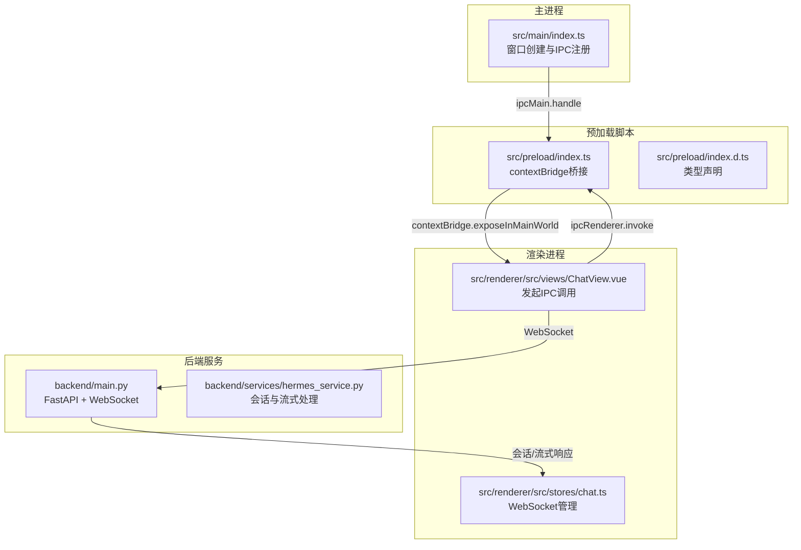
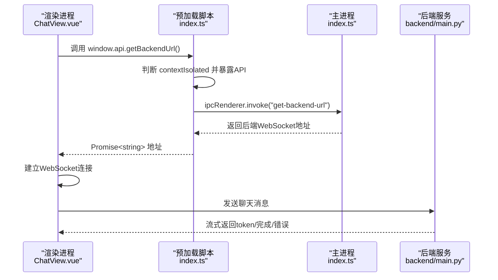
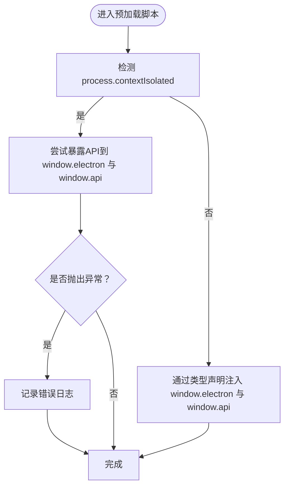
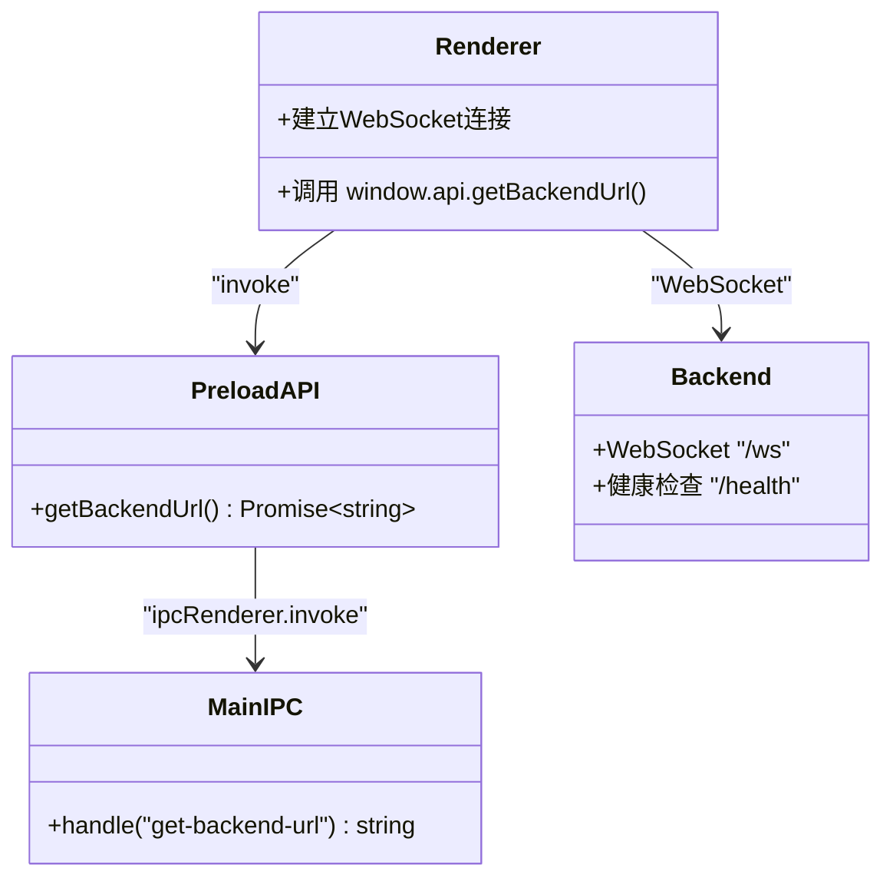
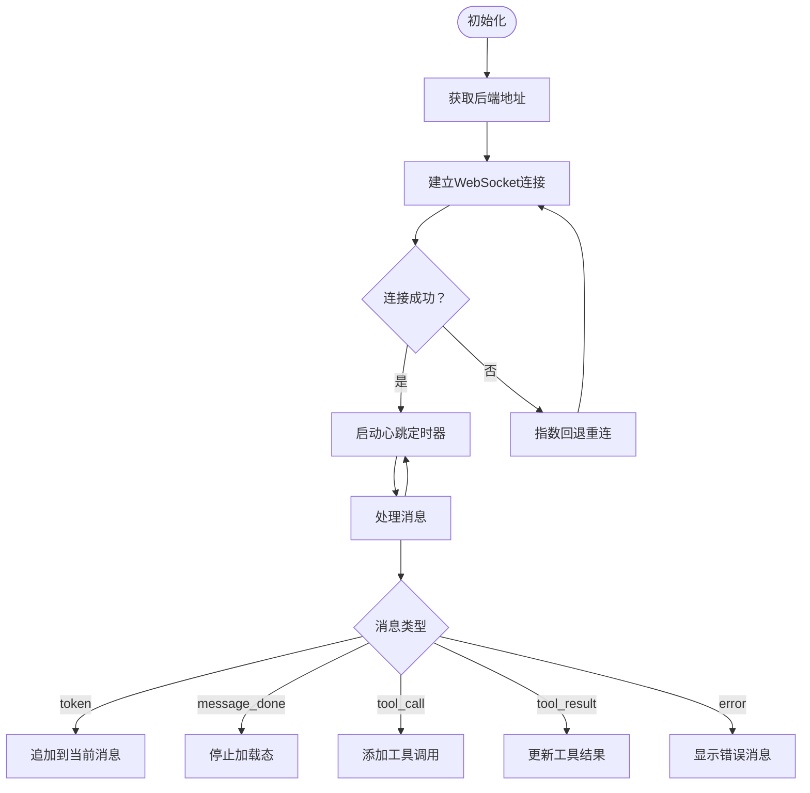
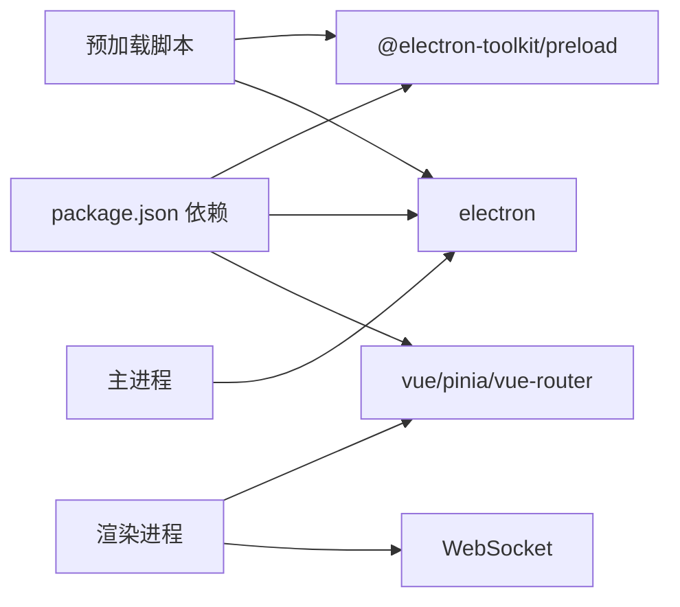

# 预加载脚本

<cite>
**本文引用的文件**
- [src/preload/index.ts](file://src/preload/index.ts)
- [src/preload/index.d.ts](file://src/preload/index.d.ts)
- [src/main/index.ts](file://src/main/index.ts)
- [src/renderer/src/stores/chat.ts](file://src/renderer/src/stores/chat.ts)
- [src/renderer/src/views/ChatView.vue](file://src/renderer/src/views/ChatView.vue)
- [backend/main.py](file://backend/main.py)
- [backend/services/hermes_service.py](file://backend/services/hermes_service.py)
- [package.json](file://package.json)
- [electron.vite.config.ts](file://electron.vite.config.ts)
- [tsconfig.node.json](file://tsconfig.node.json)
- [tsconfig.web.json](file://tsconfig.web.json)
</cite>

## 目录
1. [简介](#简介)
2. [项目结构](#项目结构)
3. [核心组件](#核心组件)
4. [架构总览](#架构总览)
5. [详细组件分析](#详细组件分析)
6. [依赖分析](#依赖分析)
7. [性能考虑](#性能考虑)
8. [故障排查指南](#故障排查指南)
9. [结论](#结论)
10. [附录](#附录)

## 简介
本文件聚焦于预加载脚本在本项目中的安全职责与隔离机制，系统性阐述如何通过预加载脚本在渲染进程与主进程之间建立安全的通信桥梁；详细记录IPC接口的暴露方式、类型定义与安全验证机制；涵盖后端连接状态查询、WebSocket连接管理与错误处理；解释当前沙箱配置与安全策略（contextIsolation与nodeIntegration的取舍）；并给出预加载脚本的最佳实践（错误捕获、超时处理、资源清理），以及跨版本兼容性与调试技巧。

## 项目结构
本项目采用Electron + Vue 3 + TypeScript的典型分层结构：
- 主进程：负责窗口创建、IPC注册与后端地址查询
- 预加载脚本：通过contextBridge向渲染进程暴露受控API，并在上下文隔离下进行安全桥接
- 渲染进程：Vue应用，使用Pinia状态管理与WebSocket与后端交互
- 后端服务：Python FastAPI + WebSocket，提供健康检查与聊天流式响应

图表来源
- [src/main/index.ts:1-62](file://src/main/index.ts#L1-L62)
- [src/preload/index.ts:1-24](file://src/preload/index.ts#L1-L24)
- [src/preload/index.d.ts:1-11](file://src/preload/index.d.ts#L1-L11)
- [src/renderer/src/views/ChatView.vue:118-126](file://src/renderer/src/views/ChatView.vue#L118-L126)
- [src/renderer/src/stores/chat.ts:109-150](file://src/renderer/src/stores/chat.ts#L109-L150)
- [backend/main.py:1-71](file://backend/main.py#L1-L71)
- [backend/services/hermes_service.py:1-82](file://backend/services/hermes_service.py#L1-L82)

章节来源
- [src/main/index.ts:1-62](file://src/main/index.ts#L1-L62)
- [src/preload/index.ts:1-24](file://src/preload/index.ts#L1-L24)
- [src/preload/index.d.ts:1-11](file://src/preload/index.d.ts#L1-L11)
- [src/renderer/src/views/ChatView.vue:118-126](file://src/renderer/src/views/ChatView.vue#L118-L126)
- [src/renderer/src/stores/chat.ts:109-150](file://src/renderer/src/stores/chat.ts#L109-L150)
- [backend/main.py:1-71](file://backend/main.py#L1-L71)
- [backend/services/hermes_service.py:1-82](file://backend/services/hermes_service.py#L1-L82)

## 核心组件
- 预加载脚本（src/preload/index.ts）
  - 使用contextBridge.exposeInMainWorld在隔离上下文中向渲染进程暴露受控API对象
  - 在非隔离上下文（sandbox关闭）下，通过类型声明文件为window对象注入类型信息
  - 暴露的API仅包含后端地址查询接口，降低攻击面
- 类型声明（src/preload/index.d.ts）
  - 为window.electron与window.api提供类型约束，确保IDE与编译期安全
- 主进程（src/main/index.ts）
  - 注册ipcMain.handle以响应渲染进程的invoke请求
  - 返回后端WebSocket地址，供渲染进程建立连接
- 渲染进程（ChatView.vue + chat.ts）
  - 在挂载时通过window.api.getBackendUrl()获取后端地址
  - 基于Pinia状态管理WebSocket连接、心跳、重连与消息解析
- 后端服务（backend/main.py + hermes_service.py）
  - 提供健康检查与WebSocket端点，支持流式聊天响应
  - 对异常进行统一处理并向客户端发送错误消息

章节来源
- [src/preload/index.ts:1-24](file://src/preload/index.ts#L1-L24)
- [src/preload/index.d.ts:1-11](file://src/preload/index.d.ts#L1-L11)
- [src/main/index.ts:45-48](file://src/main/index.ts#L45-L48)
- [src/renderer/src/views/ChatView.vue:118-126](file://src/renderer/src/views/ChatView.vue#L118-L126)
- [src/renderer/src/stores/chat.ts:109-150](file://src/renderer/src/stores/chat.ts#L109-L150)
- [backend/main.py:26-66](file://backend/main.py#L26-L66)
- [backend/services/hermes_service.py:16-72](file://backend/services/hermes_service.py#L16-L72)

## 架构总览
预加载脚本作为“安全桥”，在渲染进程与主进程之间建立最小化、受控的通信通道。其核心流程如下：

图表来源
- [src/preload/index.ts:5-7](file://src/preload/index.ts#L5-L7)
- [src/preload/index.ts:11-23](file://src/preload/index.ts#L11-L23)
- [src/main/index.ts:45-48](file://src/main/index.ts#L45-L48)
- [src/renderer/src/views/ChatView.vue:118-126](file://src/renderer/src/views/ChatView.vue#L118-L126)
- [backend/main.py:31-66](file://backend/main.py#L31-L66)

## 详细组件分析

### 预加载脚本与安全隔离
- 安全作用
  - 通过contextBridge.exposeInMainWorld仅暴露必要API，避免直接暴露完整Electron API
  - 在contextIsolated启用时，确保渲染进程无法访问主进程上下文变量
  - 通过类型声明文件限制window对象的可用属性，降低运行时误用风险
- 隔离机制
  - 当process.contextIsolated为true时，使用exposeInMainWorld进行桥接
  - 当未启用隔离时，通过类型声明文件为window对象注入类型，但不暴露敏感API
- 错误处理
  - 暴露API时使用try/catch包裹，防止桥接失败导致全局异常
  - 渲染进程侧对API调用结果进行Promise链式处理与错误捕获

图表来源
- [src/preload/index.ts:11-23](file://src/preload/index.ts#L11-L23)
- [src/preload/index.d.ts:3-10](file://src/preload/index.d.ts#L3-L10)

章节来源
- [src/preload/index.ts:1-24](file://src/preload/index.ts#L1-L24)
- [src/preload/index.d.ts:1-11](file://src/preload/index.d.ts#L1-L11)

### IPC接口定义与安全验证
- 接口暴露
  - 预加载脚本定义API对象，其中包含getBackendUrl方法
  - 主进程通过ipcMain.handle注册同名处理函数，返回后端WebSocket地址
- 类型定义
  - 通过index.d.ts为window.api提供类型约束，确保调用签名正确
- 安全验证
  - 仅暴露单一查询接口，避免泄露主进程能力
  - 渲染进程侧通过Promise接收结果，避免同步阻塞
  - 主进程侧返回固定格式字符串，减少解析歧义

图表来源
- [src/preload/index.ts:5-7](file://src/preload/index.ts#L5-L7)
- [src/main/index.ts:45-48](file://src/main/index.ts#L45-L48)
- [src/renderer/src/views/ChatView.vue:118-126](file://src/renderer/src/views/ChatView.vue#L118-L126)
- [backend/main.py:26-31](file://backend/main.py#L26-L31)

章节来源
- [src/preload/index.ts:5-7](file://src/preload/index.ts#L5-L7)
- [src/preload/index.d.ts:6-8](file://src/preload/index.d.ts#L6-L8)
- [src/main/index.ts:45-48](file://src/main/index.ts#L45-L48)
- [src/renderer/src/views/ChatView.vue:118-126](file://src/renderer/src/views/ChatView.vue#L118-L126)

### 渲染进程中的WebSocket连接管理
- 连接建立
  - 渲染进程在挂载时调用window.api.getBackendUrl()获取地址
  - 使用Pinia状态管理WebSocket实例、连接状态与会话消息
- 心跳与重连
  - 周期性发送ping消息维持连接活性
  - 断开后按指数回退策略定时重连，最大延迟受限
- 消息处理
  - 解析服务端消息类型，分别处理token增量、工具调用、错误等
  - 将消息追加到当前会话，支持流式显示与工具调用结果展示
- 资源清理
  - 显式关闭WebSocket、停止心跳定时器、清理重连定时器

图表来源
- [src/renderer/src/views/ChatView.vue:118-126](file://src/renderer/src/views/ChatView.vue#L118-L126)
- [src/renderer/src/stores/chat.ts:83-150](file://src/renderer/src/stores/chat.ts#L83-L150)
- [src/renderer/src/stores/chat.ts:152-207](file://src/renderer/src/stores/chat.ts#L152-L207)
- [backend/main.py:31-66](file://backend/main.py#L31-L66)

章节来源
- [src/renderer/src/views/ChatView.vue:118-126](file://src/renderer/src/views/ChatView.vue#L118-L126)
- [src/renderer/src/stores/chat.ts:83-150](file://src/renderer/src/stores/chat.ts#L83-L150)
- [src/renderer/src/stores/chat.ts:152-207](file://src/renderer/src/stores/chat.ts#L152-L207)

### 后端连接状态查询与WebSocket管理
- 连接状态查询
  - 主进程通过ipcMain.handle("get-backend-url")返回后端WebSocket地址
  - 渲染进程基于该地址建立连接并维护连接状态
- WebSocket管理
  - 后端提供/ws端点，支持ping/pong心跳、聊天消息流式传输
  - 异常时向客户端发送错误消息，保证前端可观测性
- 会话与流式处理
  - 后端服务封装会话历史与流式输出，向前端逐块推送token
  - 支持工具调用与结果标记，便于前端渲染

章节来源
- [src/main/index.ts:45-48](file://src/main/index.ts#L45-L48)
- [backend/main.py:26-66](file://backend/main.py#L26-L66)
- [backend/services/hermes_service.py:16-72](file://backend/services/hermes_service.py#L16-L72)

### 沙箱配置与安全策略
- 当前配置
  - 主进程BrowserWindow的webPreferences中，sandbox为false
  - 未显式开启nodeIntegration（默认禁用）
  - 通过contextIsolation在预加载脚本中进行桥接
- 权衡与建议
  - 关闭sandbox可简化开发体验，但会降低隔离强度
  - 若启用sandbox，需配合contextIsolation与严格的preload桥接策略
  - 建议在生产环境评估启用sandbox与contextIsolation的可行性

章节来源
- [src/main/index.ts:14-17](file://src/main/index.ts#L14-L17)
- [src/preload/index.ts:11-23](file://src/preload/index.ts#L11-L23)

## 依赖分析
- 预加载脚本依赖
  - @electron-toolkit/preload提供的ElectronAPI类型与桥接能力
  - Electron内置的ipcRenderer与contextBridge
- 渲染进程依赖
  - Vue 3、Pinia、vue-router用于UI与状态管理
  - WebSocket标准API用于与后端通信
- 主进程依赖
  - Electron核心API用于窗口与IPC
  - 后端服务由Python生态提供（uvicorn + FastAPI）

图表来源
- [package.json:17-33](file://package.json#L17-L33)
- [src/preload/index.ts:1-2](file://src/preload/index.ts#L1-L2)

章节来源
- [package.json:17-33](file://package.json#L17-L33)
- [src/preload/index.ts:1-2](file://src/preload/index.ts#L1-L2)

## 性能考虑
- 预加载脚本
  - 保持API数量最小化，避免频繁跨上下文调用
  - 对外暴露的API应尽量无副作用且轻量
- 渲染进程
  - WebSocket消息解析与DOM更新分离，避免主线程阻塞
  - 使用虚拟滚动与消息分页，控制消息列表内存占用
- 主进程
  - IPC处理逻辑应快速返回，避免阻塞事件循环
- 后端服务
  - 流式输出应尽量小块、高频，提升前端感知速度
  - 控制并发会话数量，避免资源耗尽

## 故障排查指南
- 预加载脚本桥接失败
  - 检查contextIsolated状态与exposeInMainWorld调用时机
  - 查看控制台错误日志，确认API暴露是否被catch捕获
- 渲染进程无法获取后端地址
  - 确认window.api是否存在且getBackendUrl可调用
  - 检查主进程ipcMain.handle是否注册成功
- WebSocket连接问题
  - 观察心跳定时器是否启动与停止
  - 检查断线重连计时器是否按预期指数回退
  - 核对后端/ws端点是否可达与健康检查是否正常
- 后端异常
  - 查看后端日志与错误消息是否正确下发至前端
  - 确保异常处理分支不会抛出未捕获异常

章节来源
- [src/preload/index.ts:15-17](file://src/preload/index.ts#L15-L17)
- [src/main/index.ts:45-48](file://src/main/index.ts#L45-L48)
- [src/renderer/src/stores/chat.ts:83-150](file://src/renderer/src/stores/chat.ts#L83-L150)
- [backend/main.py:56-66](file://backend/main.py#L56-L66)

## 结论
本项目通过预加载脚本实现了最小化的安全桥接，将渲染进程与主进程解耦，同时以类型声明与严格API暴露降低了运行时风险。结合渲染进程的WebSocket连接管理与后端服务的流式响应，形成了清晰、可控的前后端通信链路。建议在生产环境中进一步强化隔离（启用sandbox与contextIsolation），并在预加载脚本中引入更完善的参数校验与超时控制，以提升整体安全性与稳定性。

## 附录

### 最佳实践清单
- 预加载脚本
  - 仅暴露必要API，避免一次性导出完整Electron API
  - 在暴露API时使用try/catch并记录错误日志
  - 为window对象的新增属性提供类型声明
- 渲染进程
  - 对所有外部调用（IPC、WebSocket）进行Promise链式错误处理
  - 实现指数回退重连与最大重连延迟，避免风暴效应
  - 对消息解析增加容错与边界检查
- 主进程
  - IPC处理函数应快速返回，复杂逻辑异步执行
  - 对外部输入进行白名单校验与长度限制
- 后端服务
  - 统一错误格式与状态码，便于前端识别
  - 对异常进行结构化日志记录，避免敏感信息泄露

### 跨版本兼容性与调试技巧
- 跨版本兼容
  - Electron版本升级时关注contextBridge与webPreferences变更
  - 预加载脚本与类型声明需与Electron版本匹配
  - Vite/Electron-Vite配置需同步升级，避免打包差异
- 调试技巧
  - 开发模式下使用DevTools定位预加载脚本与渲染进程上下文
  - 通过console输出与断点定位IPC调用路径与WebSocket生命周期
  - 使用网络面板观察WebSocket握手与消息往返，核对心跳与重连行为

章节来源
- [electron.vite.config.ts:1-21](file://electron.vite.config.ts#L1-L21)
- [tsconfig.node.json:1-13](file://tsconfig.node.json#L1-L13)
- [tsconfig.web.json:1-16](file://tsconfig.web.json#L1-L16)