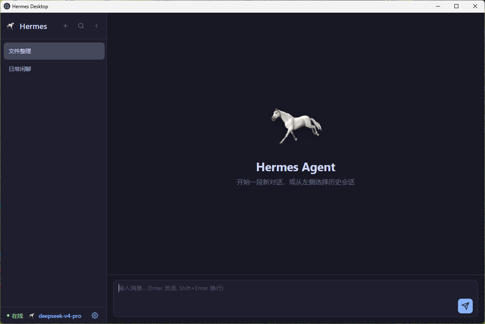

# Hermes Desktop

Desktop GUI client for Hermes Agent - 一个基于 Electron + Vue 3 的桌面 AI 助手应用。

## ✨ 功能特性

- 🎨 **微信式聊天界面** - 用户消息右侧显示，AI 回复左侧显示，符合现代聊天习惯
- 💬 **会话管理** - 支持创建、切换、重命名和删除多个对话会话
- 📝 **AI 回复摘要** - 会话列表自动显示最后一条 AI 回复的摘要内容
- 💾 **持久化存储** - 所有会话和消息自动保存到 SQLite 数据库
- 🔄 **历史会话恢复** - 支持 `hermes --resume` 命令恢复会话上下文
- ⚡ **实时流式响应** - 基于 WebSocket 的实时通信，支持流式输出
- 🛠️ **工具调用支持** - 可视化展示 AI 的工具调用过程和结果
- 🚀 **静默启动** - 一键启动，无命令窗口干扰，只显示客户端
- 🔁 **重启所有服务** - 设置面板内一键重启所有服务
- 🧠 **记忆管理** - 支持项目记忆、用户记忆、Agent 人格和记忆数据库管理
- 💾 **数据库管理** - 可视化管理应用主数据库（会话、消息、配置表）
- 🔀 **多会话并发** - 支持 10 个会话同时生成回复，互不阻塞
- 📋 **消息队列** - 单会话消息队列管理，支持查看和删除队列项
- ⏱️ **超时优化** - API 模式 5 分钟超时，WebSocket 心跳 60 秒，避免频繁断开
- 🔒 **安全增强** - SQL 白名单验证，防止注入攻击
- 📱 **微信集成** - 支持 Hermes Gateway 微信个人版集成，扫码登录，消息同步
- 🗃️ **Gateway 数据库浏览** - 可视化查看 Gateway 微信数据库（sessions、messages 表）
- 🧹 **数据库优化** - 自动增量 VACUUM，定期回收空闲页，防止数据库膨胀
- 🛑 **优雅停止** - 使用 SIGTERM 优雅停止服务，避免 SQLite WAL 损坏

## 📸 应用截图



## 🏗️ 技术架构

### 前端
- **框架**: Electron 33.2.1
- **UI**: Vue 3.5.13 + TypeScript
- **状态管理**: Pinia 2.2.6
- **路由**: Vue Router 4.4.5
- **构建工具**: electron-vite 2.3.0

### 后端
- **框架**: FastAPI (Python)
- **通信**: WebSocket 实时流式通信
- **数据库**: SQLite
- **AI 集成**: Hermes Agent Python SDK

## 🚀 快速开始

### 环境要求

- Node.js >= 18
- Python >= 3.8
- pnpm
- WSL (Windows Subsystem for Linux)

### 一键启动（推荐）

直接双击 `start.bat`，脚本会自动：
1. 清理所有旧进程（node、electron、python）
2. 隐藏启动后端服务（无窗口）
3. 隐藏启动前端应用（无窗口）
4. 启动窗口自动关闭

**最终效果**：只显示 Electron 客户端窗口，无任何命令窗口干扰！🎉

**工作原理**：
- 使用 VBScript 隐藏启动所有服务
- 自动等待服务启动完成（7秒）
- 完全静默，用户体验极佳

### 重启所有服务

在客户端内重启：
1. 点击左上角 ⚙️ 设置图标
2. 滚动到底部找到“重启所有服务”按钮
3. 点击确认重启

**重启流程**：
- 客户端先清理所有进程
- 等待 3 秒释放资源
- 自动调用 `start.bat` 重新启动
- 新客户端窗口打开，旧窗口关闭

### 手动启动

**后端服务** (WSL):
```bash
wsl -e bash -c "cd /mnt/d/soso/projects/hermes-desktop/backend && .venv/bin/python main.py"
```

**前端应用** (Windows):
```powershell
cd D:\soso\projects\hermes-desktop
pnpm dev
```

### 安装依赖（首次运行）

```bash
# 前端依赖
pnpm install

# 后端依赖 (WSL)
wsl -e bash -c "cd /mnt/d/soso/projects/hermes-desktop/backend && .venv/bin/python -m pip install -r requirements.txt"
```

## 📁 项目结构

```
hermes-desktop/
├── backend/                 # Python 后端服务
│   ├── main.py             # FastAPI 主程序
│   ├── config.py           # 配置文件
│   ├── services/           # 业务逻辑
│   │   ├── database.py     # SQLite 数据库操作
│   │   └── hermes_service.py  # Hermes Agent 集成
│   └── requirements.txt    # Python 依赖
├── src/
│   ├── main/               # Electron 主进程
│   │   └── index.ts        # 主进程逻辑、IPC 通信、重启功能
│   ├── preload/            # 预加载脚本
│   │   └── index.ts        # API 暴露
│   └── renderer/           # Vue 渲染进程
│       └── src/
│           ├── components/ # 组件
│           │   └── SettingsModal.vue  # 设置面板
│           ├── views/      # 页面组件
│           ├── stores/     # Pinia 状态管理
│           │   ├── chat.ts # 聊天状态
│           │   └── settings.ts  # 设置状态
│           └── router/     # 路由配置
├── start.bat               # 一键启动脚本
├── package.json            # Node.js 依赖
└── electron.vite.config.ts # 构建配置
```

## 🔧 开发指南

### 可用脚本

```bash
pnpm dev          # 开发模式
pnpm build        # 构建生产版本
pnpm preview      # 预览构建结果
pnpm typecheck    # 类型检查
pnpm lint         # 代码规范检查
```

## ❓ 常见问题

### 后端无法启动

检查端口 8765 是否被占用：
```bash
wsl -e bash -c "ss -tlnp | grep 8765"
```

清理旧进程：
```bash
wsl -e bash -c "pkill -9 -f 'python main.py'"
```

或者直接运行 `start.bat`，它会自动清理。

### 前端无法连接

1. 确保后端已启动
2. 点击连接状态手动重连
3. 或刷新页面 (F5)

### 多个实例问题

应用强制单例运行：
- 后端：启动前自动 `pkill -9`
- 前端：Electron 单例锁
- 清理：`start.bat` 自动清理所有旧进程

只需再次运行 `start.bat`，它会自动清理并重启。

### start.bat 窗口不关闭

如果 start.bat 窗口一直打开：
- 检查是否有杀毒软件阻止 VBScript
- 尝试以管理员身份运行
- 查看临时文件 `%TEMP%\hermes-start.vbs` 内容是否正确

### 客户端无法启动

检查 PowerShell 执行策略：
```powershell
Get-ExecutionPolicy
```

如果显示 `Restricted`，需要改为 `RemoteSigned`：
```powershell
Set-ExecutionPolicy -ExecutionPolicy RemoteSigned -Scope CurrentUser
```

或者直接双击 `start.bat`（使用 cmd.exe，不受此限制）。

### 数据库位置

会话和消息数据保存在：`~/.hermes/hermes-desktop.db` (SQLite)

### 模型配置

点击 ⚙️ 设置图标可以配置：
- 模型选择
- API Key
- API Base URL
- Temperature & Max Tokens

配置会保存到 SQLite，也会读取 Hermes 默认配置 `~/.hermes/config.yaml`。

## 📝 开源协议

本项目采用 [MIT License](LICENSE) 开源协议。

## 🤝 贡献

欢迎提交 Issue 和 Pull Request！

## 📮 联系方式

- Gitee: https://gitee.com/octave-12/hermes-desktop
- 作者: octave-12

---

Made with ❤️ by octave-12
