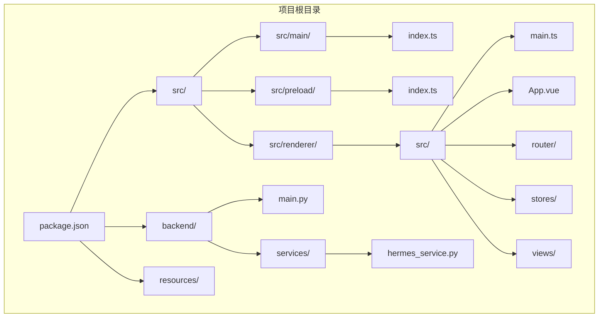
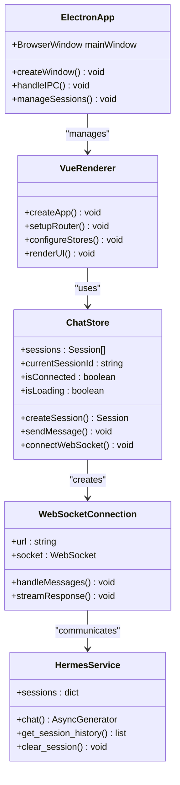
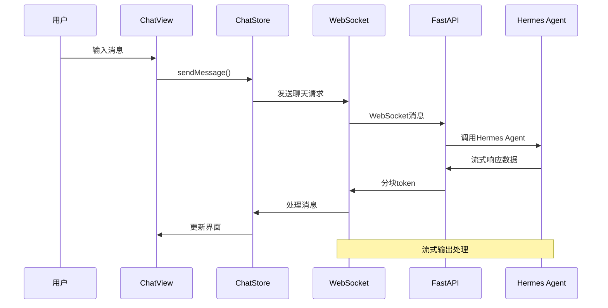
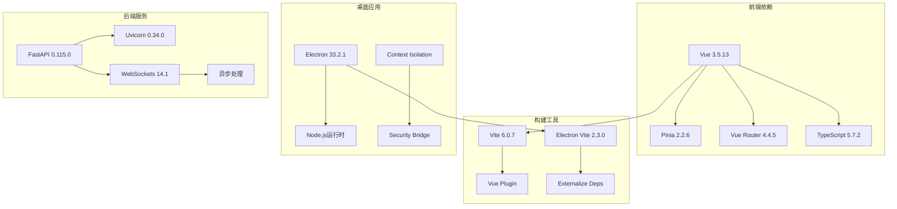

# 项目概述

<cite>
**本文档引用的文件**
- [package.json](file://package.json)
- [electron.vite.config.ts](file://electron.vite.config.ts)
- [src/main/index.ts](file://src/main/index.ts)
- [src/preload/index.ts](file://src/preload/index.ts)
- [src/renderer/src/main.ts](file://src/renderer/src/main.ts)
- [src/renderer/src/App.vue](file://src/renderer/src/App.vue)
- [src/renderer/src/router/index.ts](file://src/renderer/src/router/index.ts)
- [src/renderer/src/views/ChatView.vue](file://src/renderer/src/views/ChatView.vue)
- [src/renderer/src/stores/chat.ts](file://src/renderer/src/stores/chat.ts)
- [backend/main.py](file://backend/main.py)
- [backend/services/hermes_service.py](file://backend/services/hermes_service.py)
- [backend/requirements.txt](file://backend/requirements.txt)
- [tsconfig.json](file://tsconfig.json)
</cite>

## 目录
1. [简介](#简介)
2. [项目结构](#项目结构)
3. [核心组件](#核心组件)
4. [架构概览](#架构概览)
5. [详细组件分析](#详细组件分析)
6. [依赖分析](#依赖分析)
7. [性能考虑](#性能考虑)
8. [故障排除指南](#故障排除指南)
9. [结论](#结论)

## 简介

Hermes Desktop是一个基于Electron + Vue 3 + TypeScript构建的桌面GUI客户端，专门设计用于与Hermes Agent进行交互。该项目采用现代桌面应用开发技术栈，提供了流畅的用户体验和强大的功能特性。

### 应用截图

**截图展示**：
- 微信式聊天界面，用户消息右侧显示，AI回复左侧显示
- 会话列表显示AI回复摘要
- 实时连接状态和当前模型指示
- 工具调用可视化展示

### 项目目标

- **桌面化体验**：将Hermes Agent的功能封装在本地桌面应用中，提供更便捷的访问方式
- **实时交互**：通过WebSocket实现实时流式响应，确保用户获得即时反馈
- **多会话管理**：支持创建和管理多个独立的对话会话
- **工具调用支持**：集成Hermes Agent的工具调用能力，扩展AI助手的功能范围
- **跨平台兼容**：利用Electron技术实现Windows、macOS和Linux的统一部署
- **微信集成**：通过Hermes Gateway集成微信个人号，实现微信消息的AI处理

### 技术选型理由

- **Electron**：提供原生桌面应用体验，支持跨平台部署
- **Vue 3 + TypeScript**：现代化前端框架，提供类型安全和良好的开发体验
- **Pinia**：轻量级状态管理，替代Vuex，提供更好的TypeScript支持
- **FastAPI + Uvicorn**：高性能Python后端，支持异步处理和WebSocket
- **Vite**：快速构建工具，提供热重载和优化的开发体验

## 项目结构

项目采用清晰的分层架构，将主进程、预加载脚本和渲染进程分离，确保安全性和可维护性。

**图表来源**
- [package.json:1-35](file://package.json#L1-L35)
- [src/main/index.ts:1-62](file://src/main/index.ts#L1-L62)
- [backend/main.py:1-69](file://backend/main.py#L1-L69)

### 核心模块职责

- **主进程 (src/main/index.ts)**：负责应用生命周期管理、窗口创建和IPC通信
- **预加载脚本 (src/preload/index.ts)**：提供安全的Electron API桥接
- **渲染进程 (src/renderer/)**：包含Vue应用的完整前端实现
- **后端服务 (backend/)**：提供WebSocket接口和Hermes Agent集成

**章节来源**
- [package.json:1-35](file://package.json#L1-L35)
- [electron.vite.config.ts:1-21](file://electron.vite.config.ts#L1-L21)

## 核心组件

### 应用架构组件

项目的核心组件围绕三个主要层次构建：桌面应用层、通信层和AI服务层。

**图表来源**
- [src/main/index.ts:1-62](file://src/main/index.ts#L1-L62)
- [src/renderer/src/stores/chat.ts:1-197](file://src/renderer/src/stores/chat.ts#L1-L197)
- [backend/services/hermes_service.py:1-82](file://backend/services/hermes_service.py#L1-L82)

### 主要特性

#### 多会话管理
- 支持创建、切换和管理多个独立对话会话
- 自动保存会话历史和状态
- 会话标题自动从第一条用户消息生成

#### 实时流式响应
- 基于WebSocket的双向通信
- 流式token输出，提供即时响应体验
- 支持错误处理和连接状态监控

#### 工具调用支持
- 完整的工具调用链路支持
- 可视化的工具执行状态显示
- 工具结果的格式化展示

**章节来源**
- [src/renderer/src/stores/chat.ts:33-43](file://src/renderer/src/stores/chat.ts#L33-L43)
- [src/renderer/src/stores/chat.ts:102-151](file://src/renderer/src/stores/chat.ts#L102-L151)
- [src/renderer/src/views/ChatView.vue:24-33](file://src/renderer/src/views/ChatView.vue#L24-L33)

## 架构概览

### 整体系统架构

Hermes Desktop采用客户端-服务器架构，通过Electron桌面应用作为客户端，Python后端服务作为服务器端。

```mermaid
graph TB
subgraph "桌面客户端"
A[Electron主进程] --> B[预加载脚本]
B --> C[Vue渲染进程]
C --> D[ChatView组件]
C --> E[ChatStore状态管理]
end
subgraph "通信层"
F[WebSocket客户端] --> G[WebSocket服务器]
G --> H[FastAPI后端]
end
subgraph "AI服务层"
H --> I[Hermes Agent CLI]
I --> J[外部工具/API]
end
A --> F
E --> F
style A fill:#181825
style C fill:#181825
style H fill:#1e1e2e
style I fill:#313244
```

**图表来源**
- [src/main/index.ts:45-48](file://src/main/index.ts#L45-L48)
- [src/renderer/src/stores/chat.ts:64-96](file://src/renderer/src/stores/chat.ts#L64-L96)
- [backend/main.py:31-63](file://backend/main.py#L31-L63)

### 数据流架构

**图表来源**
- [src/renderer/src/views/ChatView.vue:90-102](file://src/renderer/src/views/ChatView.vue#L90-L102)
- [src/renderer/src/stores/chat.ts:153-176](file://src/renderer/src/stores/chat.ts#L153-L176)
- [backend/main.py:41-52](file://backend/main.py#L41-L52)

## 详细组件分析

### Electron主进程

主进程负责应用的核心生命周期管理和窗口管理。

#### 窗口管理
- 创建主窗口，设置窗口属性和行为
- 处理窗口事件和生命周期
- 配置开发环境和生产环境的不同加载策略

#### IPC通信
- 提供后端连接信息查询接口
- 管理主进程与渲染进程之间的通信
- 处理应用级别的系统事件

**章节来源**
- [src/main/index.ts:5-35](file://src/main/index.ts#L5-L35)
- [src/main/index.ts:45-48](file://src/main/index.ts#L45-L48)

### 预加载脚本

预加载脚本为渲染进程提供安全的Electron API访问。

#### API暴露机制
- 使用contextBridge安全地暴露自定义API
- 提供后端URL查询功能
- 确保上下文隔离的安全性

#### 错误处理
- 实现健壮的错误处理机制
- 提供降级方案以确保应用稳定性

**章节来源**
- [src/preload/index.ts:1-24](file://src/preload/index.ts#L1-L24)

### Vue渲染进程

渲染进程包含完整的Vue 3应用实现。

#### 应用初始化
- 创建Vue应用实例
- 配置Pinia状态管理和路由系统
- 设置全局样式和应用挂载

#### 组件架构
- App.vue作为根组件，管理侧边栏和主内容区域
- ChatView提供聊天界面和消息展示
- 响应式设计确保良好的用户体验

**章节来源**
- [src/renderer/src/main.ts:1-11](file://src/renderer/src/main.ts#L1-L11)
- [src/renderer/src/App.vue:1-144](file://src/renderer/src/App.vue#L1-L144)

### ChatStore状态管理

Pinia状态管理提供集中式的应用状态控制。

#### 会话管理
- 管理多个会话的创建、切换和存储
- 维护会话历史和消息列表
- 自动更新会话标题和元数据

#### WebSocket集成
- 管理WebSocket连接生命周期
- 处理流式消息接收和解析
- 实现错误处理和重连机制

#### 消息处理
- 支持不同类型的消息处理（token、工具调用、错误）
- 实现消息的增量更新和状态管理
- 提供消息发送和接收的完整流程

**章节来源**
- [src/renderer/src/stores/chat.ts:26-197](file://src/renderer/src/stores/chat.ts#L26-L197)

### 后端服务架构

Python后端服务提供WebSocket接口和Hermes Agent集成。

#### FastAPI应用
- 使用FastAPI框架提供高性能的HTTP和WebSocket服务
- 配置CORS中间件支持跨域通信
- 实现健康检查端点

#### WebSocket通信
- 处理客户端连接和消息路由
- 实现流式响应机制
- 管理会话状态和消息历史

#### Hermes Agent集成
- 通过子进程调用Hermes CLI
- 实现流式输出处理
- 提供错误处理和状态报告

**章节来源**
- [backend/main.py:13-69](file://backend/main.py#L13-L69)
- [backend/services/hermes_service.py:10-82](file://backend/services/hermes_service.py#L10-L82)

### ChatView组件

聊天界面组件提供完整的用户交互体验。

#### 界面布局
- 侧边栏显示会话列表和连接状态
- 主区域展示消息历史和输入框
- 响应式设计适配不同屏幕尺寸

#### 功能实现
- Markdown内容渲染支持
- 工具调用可视化展示
- 自动滚动和输入处理

#### 用户体验
- 加载指示器提供反馈
- 键盘快捷键支持（Enter发送，Shift+Enter换行）
- 实时连接状态显示

**章节来源**
- [src/renderer/src/views/ChatView.vue:1-327](file://src/renderer/src/views/ChatView.vue#L1-L327)

## 依赖分析

### 技术栈依赖

项目采用现代化的技术栈，各层之间保持松耦合的设计。

**图表来源**
- [package.json:17-33](file://package.json#L17-L33)
- [backend/requirements.txt:1-4](file://backend/requirements.txt#L1-L4)

### 开发环境配置

项目使用TypeScript配置文件管理不同环境的编译选项。

#### 配置文件结构
- tsconfig.json：主配置文件，引用其他配置
- tsconfig.node.json：Node.js环境配置
- tsconfig.web.json：Web环境配置

#### 类型检查
- 分离的TypeScript检查任务
- Vue组件的类型支持
- Electron API的类型定义

**章节来源**
- [tsconfig.json:1-8](file://tsconfig.json#L1-L8)
- [package.json:12-13](file://package.json#L12-L13)

## 性能考虑

### 前端性能优化

- **虚拟滚动**：对于大量消息的历史记录，可以考虑实现虚拟滚动以提高渲染性能
- **懒加载组件**：将非关键组件实现为动态导入，减少初始包大小
- **缓存策略**：实现消息内容的缓存机制，避免重复计算

### 后端性能优化

- **连接池管理**：优化WebSocket连接的生命周期管理
- **内存使用**：限制会话历史的最大长度，防止内存泄漏
- **并发处理**：合理配置Uvicorn的工作进程数量

### 网络通信优化

- **消息压缩**：对传输的数据进行压缩，减少带宽占用
- **心跳检测**：实现WebSocket的心跳机制，及时发现断线
- **重连策略**：实现智能的重连机制，提升用户体验

## 故障排除指南

### 常见问题诊断

#### 连接问题
- 检查后端服务是否正常启动
- 验证WebSocket连接状态
- 确认防火墙设置允许连接

#### 消息处理问题
- 检查消息格式是否符合预期
- 验证会话ID的有效性
- 查看错误日志获取更多信息

#### 性能问题
- 监控内存使用情况
- 检查CPU使用率
- 优化大数据量的渲染

### 调试工具

#### 开发工具
- 使用浏览器开发者工具调试前端
- 利用Electron DevTools进行应用调试
- Python后端的日志输出分析

#### 错误处理
- 实现完善的错误边界组件
- 提供用户友好的错误提示
- 记录详细的错误日志

**章节来源**
- [src/renderer/src/stores/chat.ts:81-93](file://src/renderer/src/stores/chat.ts#L81-L93)
- [backend/main.py:54-63](file://backend/main.py#L54-L63)

## 结论

Hermes Desktop项目成功地将现代桌面应用开发技术与AI助手功能相结合，提供了一个功能完整、用户体验优秀的桌面客户端。项目采用清晰的架构设计，各组件职责明确，为未来的功能扩展和性能优化奠定了良好的基础。

### 项目优势

- **技术先进性**：采用最新的前端和后端技术栈
- **架构清晰**：分层设计确保了代码的可维护性
- **用户体验**：提供流畅的实时交互体验
- **扩展性强**：模块化设计便于功能扩展

### 发展方向

- 集成更多Hermes Agent的高级功能
- 实现离线模式和数据同步
- 添加主题定制和个性化设置
- 扩展到更多的平台和设备

这个项目为桌面应用开发提供了一个优秀的参考案例，展示了如何将复杂的AI功能封装在用户友好的桌面应用中。